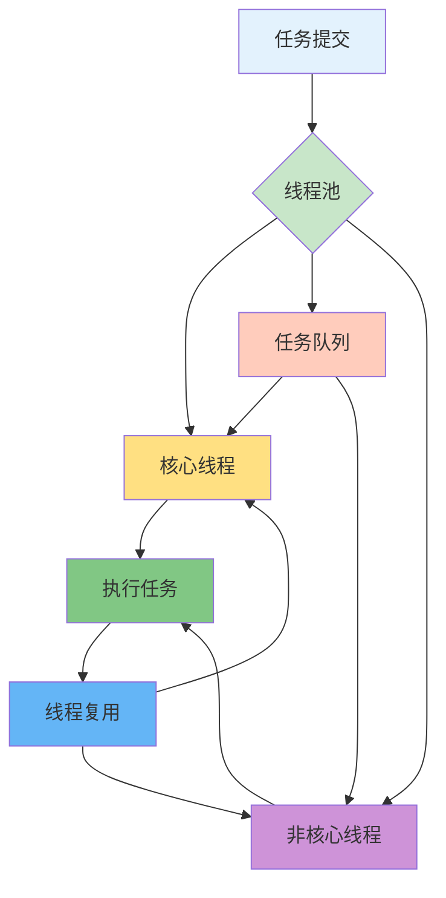
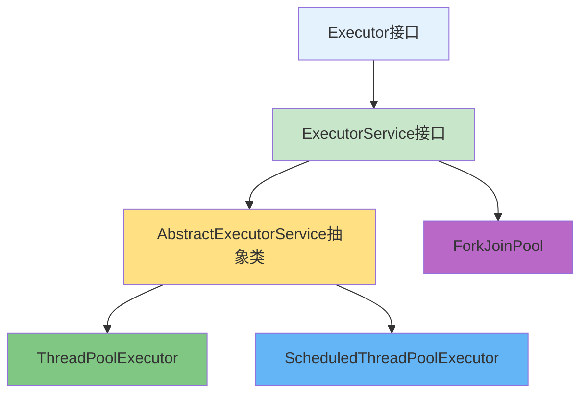
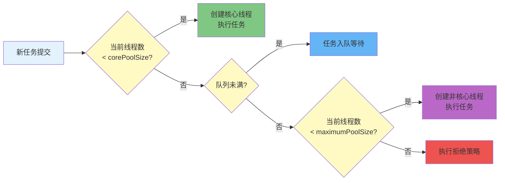

# 线程池核心原理与最佳实践

## 线程池基础概念

### 什么是池化技术

池化技术是一种资源复用的设计思想,通过预先创建并维护一定数量的资源对象,避免频繁创建和销毁带来的性能开销。在资源有限的情况下,池化技术能够显著提高资源利用率和系统性能。

在软件开发中,典型的池化技术应用包括线程池、数据库连接池、对象池、内存池等。

### 线程池的核心价值

线程池通过预先创建一定数量的线程并保持在池中待命,当有任务需要执行时,从线程池中分配线程执行任务,带来三个核心价值:

**降低资源消耗** - 线程的创建和销毁涉及系统调用和内核态切换,开销较大。线程池中的线程可以反复使用,执行完任务后回到池中等待,避免了频繁创建销毁的开销。

**提高响应速度** - 线程池维护一定数量的核心线程处于就绪状态。任务到来时可以直接分配给空闲线程执行,省去创建线程的时间,任务能够更快得到响应。

**提高线程可管理性** - 线程池提供统一的管理接口,可以配置线程池大小、任务队列类型和容量、拒绝策略等,同时提供监控接口,便于系统调优和问题排查。



## 线程池架构体系

### Executor框架结构

Java在JDK 5中引入了Executor框架,提供了更优雅的线程管理方式。框架主要由三部分组成:

**任务(Runnable/Callable)** - 通过实现Runnable或Callable接口来定义任务。Runnable无返回值,Callable有返回值且可以抛出异常。

**任务执行器(Executor)** - 核心实现类包括ThreadPoolExecutor(通用线程池)、ScheduledThreadPoolExecutor(定时任务线程池)、ForkJoinPool(并行计算框架)。

**异步计算结果(Future)** - Future接口代表异步计算的结果,可以查询任务是否完成、等待任务完成并获取结果、取消任务执行。



### ThreadPoolExecutor核心组成

ThreadPoolExecutor内部结构包含三个关键组件:

- **任务队列(workQueue)** - BlockingQueue类型,负责缓存待执行的任务
- **工作线程集合(workers)** - HashSet类型,管理所有工作线程的生命周期  
- **拒绝策略(handler)** - RejectedExecutionHandler类型,定义线程池和队列都满时的处理策略

### Worker工作线程详解

Worker是ThreadPoolExecutor的内部类,实现了Runnable接口,是连接任务和线程的桥梁。每个Worker包含一个初始任务和一个工作线程:

```java
Worker(Runnable firstTask) {
    setState(-1);
    this.firstTask = firstTask;
    this.thread = getThreadFactory().newThread(this);
}
```

Worker不是执行完初始任务就结束,而是会持续从任务队列获取新任务执行,直到队列为空且线程池关闭,实现了线程的高效复用。

## 线程池核心参数

### 构造函数参数详解

ThreadPoolExecutor的完整构造函数:

```java
public ThreadPoolExecutor(
    int corePoolSize,              // 核心线程数
    int maximumPoolSize,           // 最大线程数
    long keepAliveTime,            // 空闲线程存活时间
    TimeUnit unit,                 // 时间单位
    BlockingQueue<Runnable> workQueue,  // 任务队列
    ThreadFactory threadFactory,   // 线程工厂
    RejectedExecutionHandler handler    // 拒绝策略
)
```

| 参数 | 作用说明 |
|------|----------|
| corePoolSize | 核心线程数量,线程池保持的最小线程数,即使空闲也不会被回收 |
| maximumPoolSize | 线程池允许的最大线程数,当队列满时会创建非核心线程 |
| keepAliveTime | 非核心线程的最大空闲时间,超过这个时间会被回收 |
| workQueue | 任务等待队列,核心线程忙碌时新任务进入队列排队 |
| threadFactory | 创建线程的工厂,可统一设置线程名称、优先级等属性 |
| handler | 拒绝策略,当线程池和队列都满时如何处理新任务 |

### 任务执行流程



### 常用任务队列类型

| 队列类型 | 容量特性 | 适用场景 |
|---------|---------|---------|
| ArrayBlockingQueue | 有界数组队列,必须指定容量 | 需严格控制任务数量,防止OOM |
| LinkedBlockingQueue | 可选容量链表队列,默认Integer.MAX_VALUE | 任务量波动大的场景 |
| SynchronousQueue | 容量为0的直接移交队列 | 任务需要立即执行 |
| PriorityBlockingQueue | 无界优先级队列 | 任务有优先级要求 |

推荐生产环境使用ArrayBlockingQueue有界队列,明确指定队列容量,避免内存溢出。

### 四种拒绝策略

**AbortPolicy(中止策略)** - 默认策略,抛出RejectedExecutionException异常。失败快速暴露,便于及时发现问题,适用大多数业务场景。

**CallerRunsPolicy(调用者运行策略)** - 让提交任务的线程自己执行任务。任务不会丢失,提供降级机制,但会降低任务提交速度。

**DiscardPolicy(丢弃策略)** - 默默丢弃任务,不抛异常也不执行。适用允许任务丢失的非关键业务。

**DiscardOldestPolicy(丢弃最旧策略)** - 丢弃队列中最早的未处理任务,然后重新提交当前任务。适用实时性要求高的场景。

推荐大多数场景使用默认的AbortPolicy,配合监控告警及时发现问题。

## 为什么禁用Executors创建线程池

### Executors的OOM风险

《阿里巴巴Java开发手册》明确规定:线程池不允许使用Executors创建,而应通过ThreadPoolExecutor构造函数创建,以规避资源耗尽风险。

**FixedThreadPool和SingleThreadExecutor的风险** - 使用默认容量为Integer.MAX_VALUE的LinkedBlockingQueue,相当于无界队列。高并发场景下任务堆积导致内存占用持续增长,最终OOM。

**CachedThreadPool的风险** - 核心线程数为0,最大线程数为Integer.MAX_VALUE。任务提交速度远大于执行速度时,会不断创建新线程,可能创建数万甚至数十万线程,耗尽内存。

**ScheduledThreadPool的风险** - 使用无界的DelayedWorkQueue,容量为Integer.MAX_VALUE。大量定时任务堆积导致内存溢出。

### 正确创建线程池

**手动配置ThreadPoolExecutor(推荐)**

```java
public static ThreadPoolExecutor createThreadPool() {
    int corePoolSize = Runtime.getRuntime().availableProcessors();
    int maximumPoolSize = corePoolSize * 2;
    
    ThreadFactory threadFactory = new ThreadFactoryBuilder()
        .setNameFormat("biz-pool-%d")
        .setDaemon(false)
        .build();
    
    return new ThreadPoolExecutor(
        corePoolSize,
        maximumPoolSize,
        60L,
        TimeUnit.SECONDS,
        new ArrayBlockingQueue<>(200),  // 有界队列
        threadFactory,
        new ThreadPoolExecutor.CallerRunsPolicy()
    );
}
```

## 线程池最佳实践

### 实践一:不同业务使用独立线程池

**反面案例:共享线程池导致的死锁**

假设线程池核心线程数为5,所有线程都被父任务占用,每个父任务提交2个子任务到队列。父任务等待子任务完成,但子任务无法获得线程执行,导致死锁。

**正确做法:业务隔离**

```java
// 订单处理线程池
private static final ThreadPoolExecutor ORDER_POOL = new ThreadPoolExecutor(
    10, 20, 60L, TimeUnit.SECONDS,
    new ArrayBlockingQueue<>(200),
    new ThreadFactoryBuilder().setNameFormat("order-pool-%d").build(),
    new ThreadPoolExecutor.CallerRunsPolicy()
);

// 库存操作线程池  
private static final ThreadPoolExecutor INVENTORY_POOL = new ThreadPoolExecutor(
    5, 10, 60L, TimeUnit.SECONDS,
    new ArrayBlockingQueue<>(100),
    new ThreadFactoryBuilder().setNameFormat("inventory-pool-%d").build(),
    new ThreadPoolExecutor.CallerRunsPolicy()
);
```

### 实践二:给线程池命名

默认线程名pool-1-thread-1无业务含义,排查问题困难。使用Guava的ThreadFactoryBuilder设置有意义的线程名:

```java
ThreadFactory threadFactory = new ThreadFactoryBuilder()
    .setNameFormat("payment-processor-%d")
    .setDaemon(false)
    .setPriority(Thread.NORM_PRIORITY)
    .setUncaughtExceptionHandler((t, e) -> {
        logger.error("Thread {} threw exception", t.getName(), e);
    })
    .build();
```

### 实践三:监控线程池运行状态

```java
public static void printThreadPoolStatus(ThreadPoolExecutor pool, String poolName) {
    System.out.println("=== " + poolName + " 线程池状态 ===");
    System.out.println("当前线程数: " + pool.getPoolSize());
    System.out.println("活跃线程数: " + pool.getActiveCount());
    System.out.println("已完成任务数: " + pool.getCompletedTaskCount());
    System.out.println("队列中任务数: " + pool.getQueue().size());
}
```

关键指标:
- 当前线程数接近maximumPoolSize时告警
- 活跃线程数长期高位(>80%)需扩容
- 队列任务数超过容量50%告警
- 任何拒绝任务都应告警

### 实践四:正确关闭线程池

```java
public static void gracefulShutdown(ThreadPoolExecutor executor) {
    executor.shutdown();  // 停止接受新任务
    
    try {
        if (!executor.awaitTermination(5, TimeUnit.MINUTES)) {
            // 超时后强制关闭
            List<Runnable> droppedTasks = executor.shutdownNow();
            System.err.println("被丢弃的任务数: " + droppedTasks.size());
            
            if (!executor.awaitTermination(1, TimeUnit.MINUTES)) {
                System.err.println("线程池无法终止");
            }
        }
    } catch (InterruptedException e) {
        executor.shutdownNow();
        Thread.currentThread().interrupt();
    }
}
```

shutdown()平滑关闭,会执行完队列中和正在执行的任务。shutdownNow()立即关闭,尝试中断正在执行的任务并返回未执行的任务列表。

### 实践五:ThreadLocal与线程池共用的陷阱

线程池复用线程,ThreadLocal变量绑定在线程对象上,可能导致上一个任务设置的值被下一个任务读取到。

解决方案:使用阿里开源的TransmittableThreadLocal,配合TtlExecutors包装线程池,解决异步执行时上下文传递问题。

## execute与submit的区别

| 特性 | execute() | submit() |
|-----|-----------|----------|
| 返回值 | void | Future |
| 参数类型 | Runnable | Runnable或Callable |
| 异常处理 | 抛出到UncaughtExceptionHandler | 异常被包装在Future中 |
| 适用场景 | 无需结果的任务 | 需要获取任务结果或捕获异常 |

submit示例:

```java
Future<Integer> future = executor.submit(() -> {
    Thread.sleep(1000);
    return 42;
});

try {
    Integer result = future.get();  // 阻塞等待结果
    Integer result2 = future.get(500, TimeUnit.MILLISECONDS);  // 带超时
} catch (ExecutionException e) {
    System.err.println("任务异常: " + e.getCause());
} catch (TimeoutException e) {
    System.err.println("获取结果超时");
}
```

## 线程池顺序执行任务

### 方案一:使用单线程线程池

```java
ThreadPoolExecutor executor = new ThreadPoolExecutor(
    1, 1, 0L, TimeUnit.MILLISECONDS,
    new LinkedBlockingQueue<>(),
    new ThreadFactoryBuilder().setNameFormat("sequential-%d").build()
);

executor.submit(() -> System.out.println("任务1"));
executor.submit(() -> System.out.println("任务2"));
executor.submit(() -> System.out.println("任务3"));
```

### 方案二:使用Future链式等待

```java
Future<String> future1 = executor.submit(() -> {
    System.out.println("执行任务1");
    return "结果1";
});

Future<String> future2 = executor.submit(() -> {
    String result1 = future1.get();  // 等待任务1完成
    System.out.println("执行任务2");
    return "结果2";
});

Future<String> future3 = executor.submit(() -> {
    String result2 = future2.get();  // 等待任务2完成
    System.out.println("执行任务3");
    return "结果3";
});
```

### 方案三:使用CompletableFuture编排

```java
CompletableFuture
    .supplyAsync(() -> {
        System.out.println("执行任务1");
        return "结果1";
    }, executor)
    .thenApplyAsync(result1 -> {
        System.out.println("执行任务2");
        return "结果2";
    }, executor)
    .thenApplyAsync(result2 -> {
        System.out.println("执行任务3");
        return "结果3";
    }, executor)
    .join();
```

## 总结

线程池是Java并发编程的核心组件,通过池化技术实现线程复用,降低资源消耗,提高响应速度和线程可管理性。

**核心要点:**
- 必须通过ThreadPoolExecutor构造函数手动创建,禁用Executors
- 合理设置核心参数:核心线程数、最大线程数、任务队列、拒绝策略
- 不同业务使用独立线程池,避免相互影响
- 给线程池命名,便于问题排查
- 使用有界队列,防止OOM
- 做好监控,关注线程数、队列大小、拒绝数等指标
- 优雅关闭线程池,避免任务丢失

理解线程池的实现原理和最佳实践,才能在实际开发中构建高性能、稳定可靠的并发应用。
