# ThreadLocal线程局部变量详解

## ThreadLocal概念与核心作用

### 什么是ThreadLocal

ThreadLocal是Java并发编程中用于实现线程隔离的工具类,它为每个使用该变量的线程提供独立的变量副本。每个线程可以独立地修改自己的副本,而不会影响其他线程的副本,从而实现线程间的数据隔离。

ThreadLocal主要解决两大问题:

**线程安全问题**: 通过为每个线程创建独立的变量副本,避免了多线程环境下的数据竞争。

**数据传递问题**: 在同一线程的不同方法间传递数据时,无需通过方法参数层层传递,可以直接从ThreadLocal中获取。

### ThreadLocal的基本使用

ThreadLocal提供了四个核心方法:

- **initialValue()**: 返回线程局部变量的初始值,该方法是延迟调用的,只有在首次调用get()且之前未调用set()时才会执行
- **get()**: 获取当前线程的变量副本,如果是首次调用且未设置过值,则会先调用initialValue()初始化
- **set(T value)**: 设置当前线程的变量副本为指定值
- **remove()**: 移除当前线程的变量副本,释放内存,避免内存泄漏

下面通过一个电商订单处理的场景演示ThreadLocal的使用:

```java
public class OrderContext {
    private String orderId;
    private String userId;
    private Long createTime;

    public static final ThreadLocal&lt;OrderContext&gt; CONTEXT_HOLDER = 
        ThreadLocal.withInitial(OrderContext::new);

    public static void setContext(String orderId, String userId) {
        OrderContext context = CONTEXT_HOLDER.get();
        context.orderId = orderId;
        context.userId = userId;
        context.createTime = System.currentTimeMillis();
    }

    public static OrderContext getContext() {
        return CONTEXT_HOLDER.get();
    }

    public static void clearContext() {
        CONTEXT_HOLDER.remove();
    }

    public static void main(String[] args) throws Exception {
        // 模拟订单处理线程
        Thread orderThread1 = new Thread(() -> {
            OrderContext.setContext("ORDER001", "USER123");
            System.out.println("线程1处理订单: " + CONTEXT_HOLDER.get().orderId);
            OrderContext.clearContext();
        });

        Thread orderThread2 = new Thread(() -> {
            OrderContext.setContext("ORDER002", "USER456");
            System.out.println("线程2处理订单: " + CONTEXT_HOLDER.get().orderId);
            OrderContext.clearContext();
        });

        orderThread1.start();
        orderThread2.start();
        orderThread1.join();
        orderThread2.join();
    }
}
```

## ThreadLocal底层实现原理

### 数据结构关系

ThreadLocal的实现依赖于Thread、ThreadLocal和ThreadLocalMap三者的协作关系:

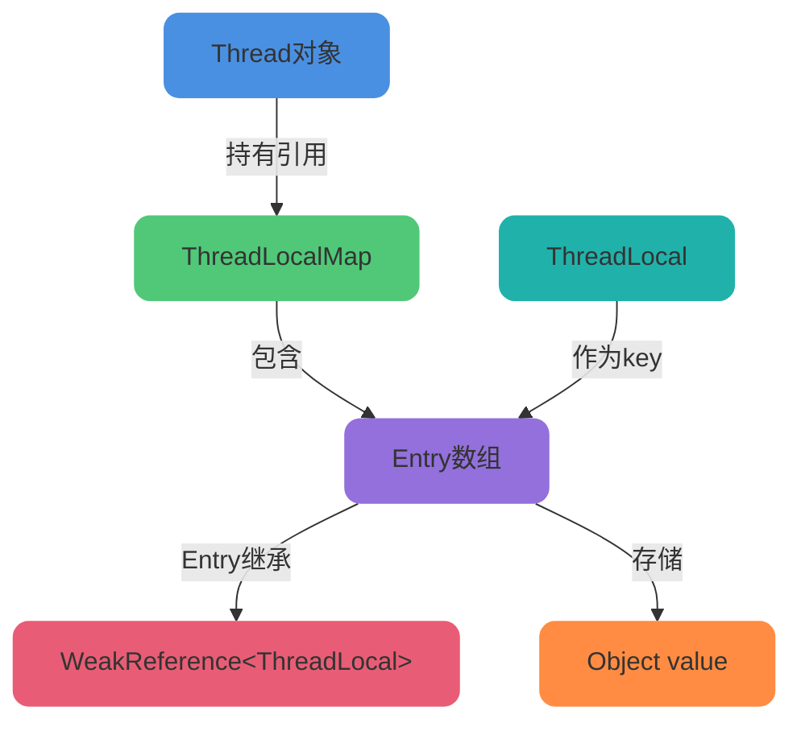

每个Thread对象内部维护着一个ThreadLocalMap类型的成员变量threadLocals。ThreadLocalMap是ThreadLocal的静态内部类,它维护了一个Entry数组,Entry的key是ThreadLocal对象(实际是弱引用),value是存储的值。

### ThreadLocalMap内部结构

ThreadLocalMap采用类似HashMap的结构,但有显著区别:

```java
// ThreadLocalMap的核心成员变量
static class ThreadLocalMap {
    // Entry数组的初始容量,必须是2的幂
    private static final int INITIAL_CAPACITY = 16;
    
    // 存储数据的Entry数组,大小必须是2的幂
    private Entry[] table;
    
    // 数组中实际存储的元素个数
    private int size = 0;
    
    // 扩容阈值,达到此值时触发rehash
    private int threshold;
    
    // Entry节点,继承WeakReference
    static class Entry extends WeakReference&lt;ThreadLocal&lt;?&gt;&gt; {
        Object value;
        
        Entry(ThreadLocal&lt;?&gt; k, Object v) {
            super(k);
            value = v;
        }
    }
}
```

ThreadLocalMap与HashMap的主要区别:

**冲突解决方式**: HashMap采用链表+红黑树解决冲突,而ThreadLocalMap采用开放地址法的线性探测法

**Entry设计**: ThreadLocalMap的Entry继承WeakReference,key是弱引用,有利于垃圾回收

**扩容时机**: ThreadLocalMap的扩容阈值为容量的2/3,且扩容前会先进行一次全量清理

### Hash算法与冲突解决

ThreadLocalMap使用特殊的Hash算法来计算索引位置:

```java
// ThreadLocal中的哈希码生成
private final int threadLocalHashCode = nextHashCode();

private static AtomicInteger nextHashCode = new AtomicInteger();

// 魔数:斐波那契散列乘数
private static final int HASH_INCREMENT = 0x61c88647;

private static int nextHashCode() {
    return nextHashCode.getAndAdd(HASH_INCREMENT);
}

// 计算在Entry数组中的索引位置
int i = key.threadLocalHashCode & (table.length - 1);
```

使用0x61c88647这个魔数的原因是它是斐波那契数(黄金分割数),能够使哈希值在2的幂次方大小的数组中分布非常均匀,大大减少哈希冲突。

下图展示了使用该魔数后的哈希分布效果:

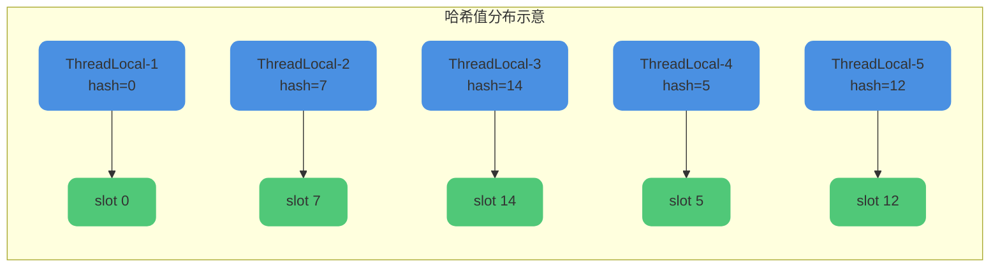

当发生哈希冲突时,ThreadLocalMap采用线性探测法解决:

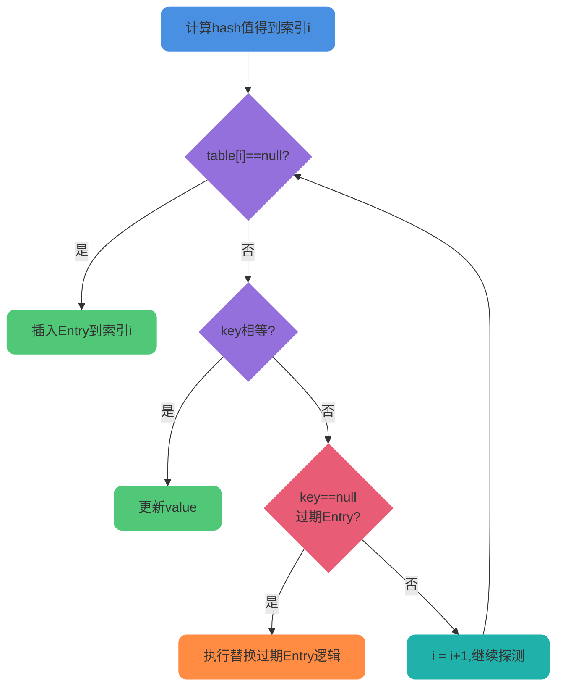

## ThreadLocal的set方法详解

### set方法执行流程

ThreadLocal的set方法用于设置当前线程的变量副本,整体流程如下:

```java
public void set(T value) {
    Thread t = Thread.currentThread();
    ThreadLocalMap map = getMap(t);
    if (map != null) {
        map.set(this, value);
    } else {
        createMap(t, value);
    }
}

void createMap(Thread t, T firstValue) {
    t.threadLocals = new ThreadLocalMap(this, firstValue);
}
```

流程说明:

1. 获取当前线程对象
2. 通过线程对象获取其ThreadLocalMap
3. 如果map存在,直接调用map.set()设置值
4. 如果map不存在,创建新的ThreadLocalMap并设置初始值

### ThreadLocalMap的set实现

ThreadLocalMap.set()方法的实现较为复杂,需要处理多种情况:

```java
private void set(ThreadLocal&lt;?&gt; key, Object value) {
    Entry[] tab = table;
    int len = tab.length;
    int i = key.threadLocalHashCode & (len-1);

    // 线性探测
    for (Entry e = tab[i]; e != null; e = tab[i = nextIndex(i, len)]) {
        ThreadLocal&lt;?&gt; k = e.get();

        // 情况1:找到key相同的Entry,直接更新
        if (k == key) {
            e.value = value;
            return;
        }

        // 情况2:遇到过期的Entry(key为null),替换
        if (k == null) {
            replaceStaleEntry(key, value, i);
            return;
        }
    }

    // 情况3:找到空槽位,创建新Entry
    tab[i] = new Entry(key, value);
    int sz = ++size;
    
    // 启发式清理,如果没有清理任何Entry且size达到阈值,则rehash
    if (!cleanSomeSlots(i, sz) && sz >= threshold) {
        rehash();
    }
}
```

set方法的四种情况处理:

**情况1 - 槽位为空**: 直接在该槽位创建新Entry

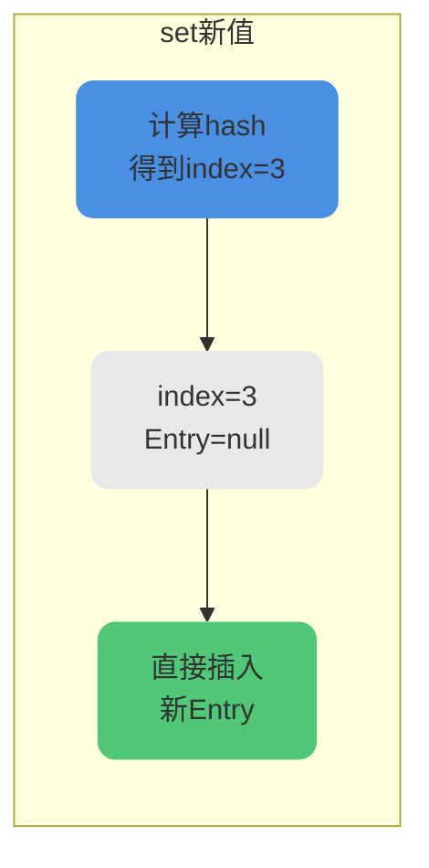

**情况2 - key相同**: 直接更新该Entry的value

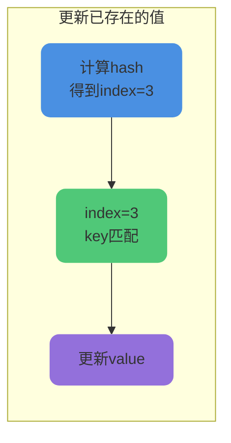

**情况3 - 线性探测找空位**: 槽位被占用且key不同,向后探测直到找到空槽位

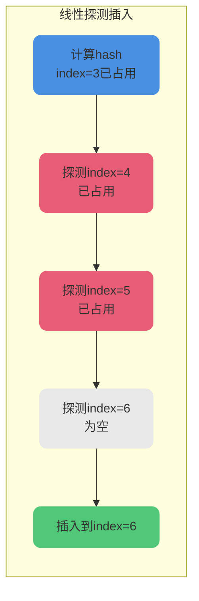

**情况4 - 遇到过期Entry**: 探测过程中遇到key为null的过期Entry,执行替换逻辑

## ThreadLocal的get方法详解

### get方法执行流程

```java
public T get() {
    Thread t = Thread.currentThread();
    ThreadLocalMap map = getMap(t);
    if (map != null) {
        ThreadLocalMap.Entry e = map.getEntry(this);
        if (e != null) {
            @SuppressWarnings("unchecked")
            T result = (T)e.value;
            return result;
        }
    }
    return setInitialValue();
}
```

### ThreadLocalMap的getEntry实现

```java
private Entry getEntry(ThreadLocal&lt;?&gt; key) {
    int i = key.threadLocalHashCode & (table.length - 1);
    Entry e = table[i];
    if (e != null && e.get() == key) {
        // 直接命中,返回
        return e;
    } else {
        // 未命中,向后线性探测
        return getEntryAfterMiss(key, i, e);
    }
}

private Entry getEntryAfterMiss(ThreadLocal&lt;?&gt; key, int i, Entry e) {
    Entry[] tab = table;
    int len = tab.length;

    while (e != null) {
        ThreadLocal&lt;?&gt; k = e.get();
        if (k == key) {
            return e;
        }
        if (k == null) {
            // 遇到过期Entry,执行探测式清理
            expungeStaleEntry(i);
        } else {
            i = nextIndex(i, len);
        }
        e = tab[i];
    }
    return null;
}
```

get方法的两种情况:

**情况1 - 直接命中**:

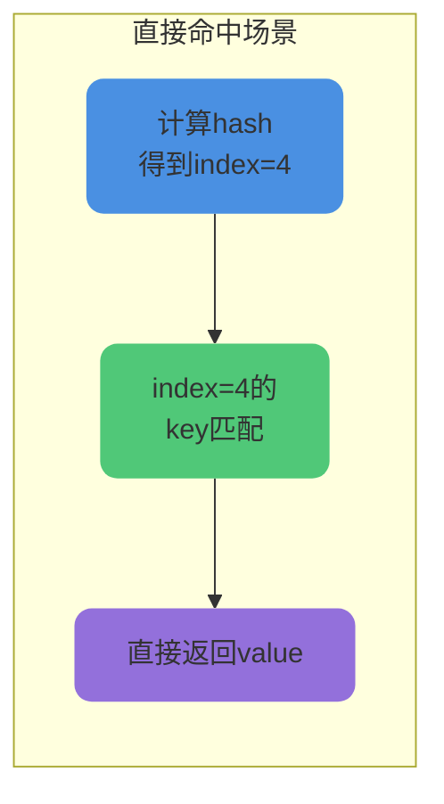

**情况2 - 线性探测**: 计算出的索引位置的Entry不匹配,需要向后探测

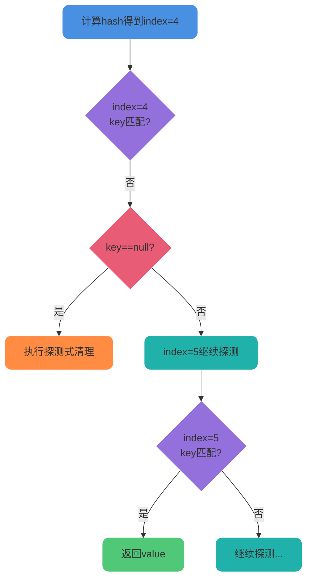

## 过期Entry清理机制

ThreadLocalMap提供了两种清理过期Entry的策略:探测式清理和启发式清理。

### 探测式清理

探测式清理(Expunge Stale Entry)是一种主动的、彻底的清理方式,从指定位置开始向后遍历,直到遇到null为止:

```java
private int expungeStaleEntry(int staleSlot) {
    Entry[] tab = table;
    int len = tab.length;

    // 清空当前过期Entry
    tab[staleSlot].value = null;
    tab[staleSlot] = null;
    size--;

    Entry e;
    int i;
    // 向后遍历,直到遇到null
    for (i = nextIndex(staleSlot, len); (e = tab[i]) != null; i = nextIndex(i, len)) {
        ThreadLocal&lt;?&gt; k = e.get();
        if (k == null) {
            // 清理过期Entry
            e.value = null;
            tab[i] = null;
            size--;
        } else {
            // 重新计算hash位置,优化Entry位置
            int h = k.threadLocalHashCode & (len - 1);
            if (h != i) {
                tab[i] = null;
                while (tab[h] != null) {
                    h = nextIndex(h, len);
                }
                tab[h] = e;
            }
        }
    }
    return i;
}
```

探测式清理的工作流程:

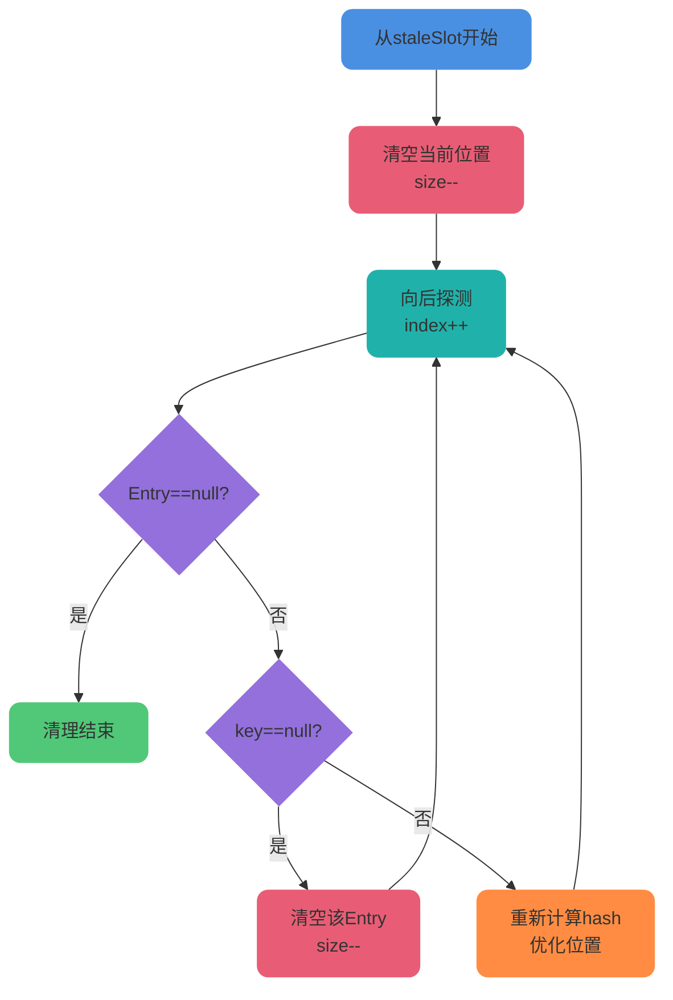

探测式清理不仅会清理过期Entry,还会对未过期的Entry进行位置优化,使其更接近理想的hash位置,提升后续查询效率。

### 启发式清理

启发式清理(Heuristically Scan)是一种"懒惰"的清理策略,采用对数级别的扫描次数:

```java
private boolean cleanSomeSlots(int i, int n) {
    boolean removed = false;
    Entry[] tab = table;
    int len = tab.length;
    do {
        i = nextIndex(i, len);
        Entry e = tab[i];
        if (e != null && e.get() == null) {
            n = len;
            removed = true;
            i = expungeStaleEntry(i);
        }
    } while ((n >>>= 1) != 0);  // n每次右移1位,相当于除以2
    return removed;
}
```

启发式清理的特点:

- 扫描次数为log₂(n),不会遍历整个数组
- 如果发现过期Entry,会调用探测式清理,并重置扫描次数
- 平衡了清理效果和性能开销

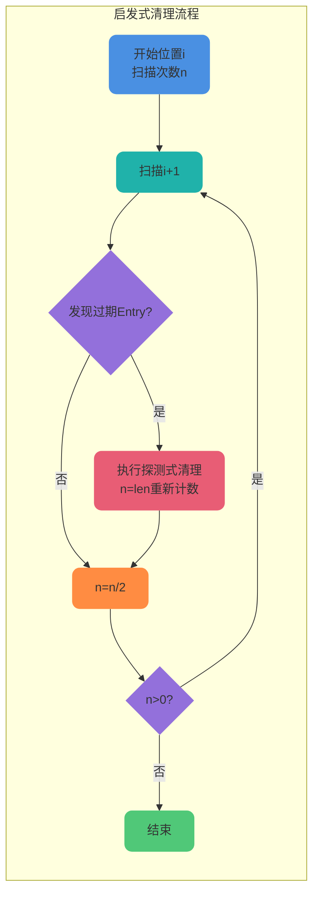

## ThreadLocalMap扩容机制

### 扩容触发条件

ThreadLocalMap的扩容分为两个阶段:

```java
// 在set方法最后
if (!cleanSomeSlots(i, sz) && sz >= threshold) {
    rehash();
}

private void rehash() {
    // 先进行一次全量的探测式清理
    expungeStaleEntries();

    // 清理后如果size仍然>=threshold的3/4,则真正扩容
    if (size >= threshold - threshold / 4) {
        resize();
    }
}

private void expungeStaleEntries() {
    Entry[] tab = table;
    int len = tab.length;
    for (int j = 0; j < len; j++) {
        Entry e = tab[j];
        if (e != null && e.get() == null) {
            expungeStaleEntry(j);
        }
    }
}
```

扩容流程:

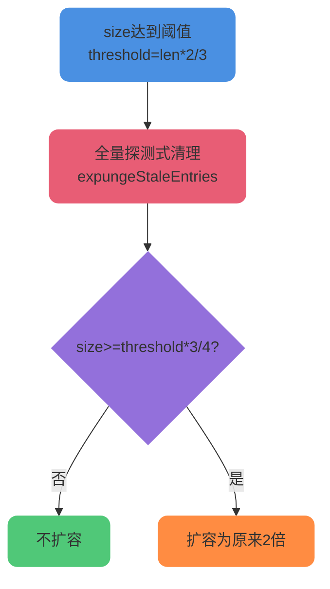

### 扩容实现

```java
private void resize() {
    Entry[] oldTab = table;
    int oldLen = oldTab.length;
    int newLen = oldLen * 2;
    Entry[] newTab = new Entry[newLen];
    int count = 0;

    for (int j = 0; j < oldLen; ++j) {
        Entry e = oldTab[j];
        if (e != null) {
            ThreadLocal&lt;?&gt; k = e.get();
            if (k == null) {
                e.value = null;  // 帮助GC
            } else {
                int h = k.threadLocalHashCode & (newLen - 1);
                while (newTab[h] != null) {
                    h = nextIndex(h, newLen);
                }
                newTab[h] = e;
                count++;
            }
        }
    }

    setThreshold(newLen);
    size = count;
    table = newTab;
}
```

## ThreadLocal内存泄漏问题

### 内存泄漏的根源

ThreadLocal的内存泄漏问题源于其特殊的引用关系:

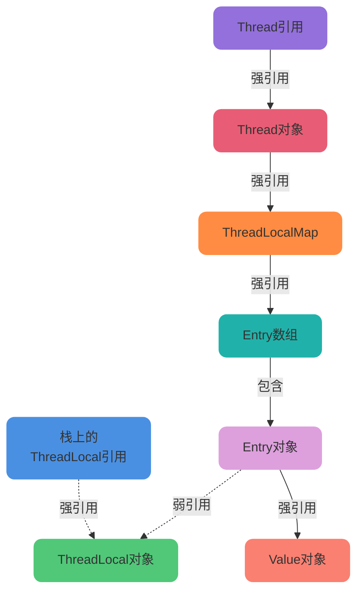

内存泄漏的两种场景:

**场景1 - ThreadLocal对象泄漏**: 当栈上的ThreadLocal引用被回收后,如果Entry的key是强引用,ThreadLocal对象无法被GC回收。

**场景2 - Value对象泄漏**: 即使key是弱引用,当Thread对象长期存活(如线程池场景),从Thread到Value的强引用链一直存在,导致Value无法被GC回收。

### 弱引用解决Key泄漏

ThreadLocal通过将Entry的key设计为弱引用来解决场景1:

```java
static class Entry extends WeakReference&lt;ThreadLocal&lt;?&gt;&gt; {
    Object value;
    
    Entry(ThreadLocal&lt;?&gt; k, Object v) {
        super(k);  // key作为弱引用
        value = v;
    }
}
```

Java的四种引用类型:

- **强引用**: 普通的对象引用,只要强引用存在,对象永远不会被GC回收
- **软引用**: 内存不足时会被GC回收,适合实现内存敏感的缓存
- **弱引用**: 下次GC时一定会被回收,无论内存是否充足
- **虚引用**: 最弱的引用,用于对象被GC时的通知机制

使用弱引用后,当栈上的ThreadLocal引用被回收,ThreadLocal对象可以在下次GC时被回收:

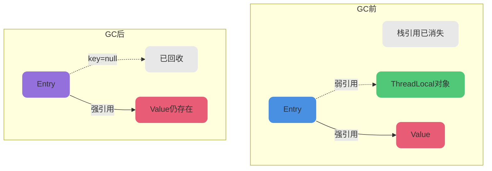

### 手动remove解决Value泄漏

虽然弱引用解决了key的泄漏问题,但Value的强引用链仍然存在,尤其在线程池场景下:

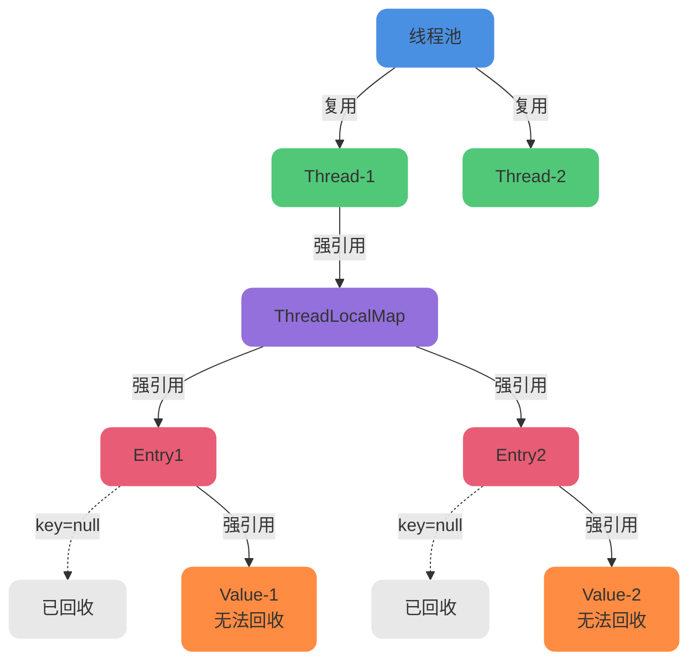

解决方案:

ThreadLocalMap的get、set、remove方法都会触发清理逻辑,清理key为null但value还存在的Entry。

因此,**使用完ThreadLocal后必须手动调用remove()方法**:

```java
public class ThreadPoolWithThreadLocal {
    private static ThreadLocal&lt;OrderContext&gt; contextHolder = new ThreadLocal&lt;&gt;();
    
    public static void processOrder(String orderId) {
        try {
            // 设置上下文
            OrderContext context = new OrderContext();
            context.setOrderId(orderId);
            contextHolder.set(context);
            
            // 业务处理
            doBusinessLogic();
        } finally {
            // 必须手动清理,防止内存泄漏
            contextHolder.remove();
        }
    }
}
```

## ThreadLocal典型应用场景

### 用户身份上下文传递

在Web应用中,用户登录后的身份信息需要在整个请求处理链路中传递:

```java
public class UserContextHolder {
    private static final ThreadLocal&lt;UserInfo&gt; USER_CONTEXT = new ThreadLocal&lt;&gt;();
    
    public static void setUser(UserInfo user) {
        USER_CONTEXT.set(user);
    }
    
    public static UserInfo getCurrentUser() {
        return USER_CONTEXT.get();
    }
    
    public static void clear() {
        USER_CONTEXT.remove();
    }
}

// 拦截器中设置用户信息
public class AuthInterceptor implements HandlerInterceptor {
    @Override
    public boolean preHandle(HttpServletRequest request, 
                            HttpServletResponse response, 
                            Object handler) {
        String token = request.getHeader("Authorization");
        UserInfo user = authService.validateToken(token);
        UserContextHolder.setUser(user);
        return true;
    }
    
    @Override
    public void afterCompletion(HttpServletRequest request,
                               HttpServletResponse response,
                               Object handler,
                               Exception ex) {
        UserContextHolder.clear();
    }
}

// 业务代码中直接获取用户信息
public class OrderService {
    public void createOrder(OrderDTO orderDTO) {
        UserInfo currentUser = UserContextHolder.getCurrentUser();
        Order order = new Order();
        order.setUserId(currentUser.getUserId());
        order.setUserName(currentUser.getUserName());
        // 保存订单...
    }
}
```

### 数据库连接管理

在MyBatis等ORM框架中,使用ThreadLocal管理数据库会话:

```java
public class ConnectionManager {
    private static final ThreadLocal&lt;Connection&gt; CONNECTION_HOLDER = new ThreadLocal&lt;&gt;();
    
    public static Connection getConnection() throws SQLException {
        Connection conn = CONNECTION_HOLDER.get();
        if (conn == null || conn.isClosed()) {
            conn = DriverManager.getConnection(DB_URL, USER, PASSWORD);
            CONNECTION_HOLDER.set(conn);
        }
        return conn;
    }
    
    public static void closeConnection() {
        Connection conn = CONNECTION_HOLDER.get();
        if (conn != null) {
            try {
                conn.close();
            } catch (SQLException e) {
                e.printStackTrace();
            } finally {
                CONNECTION_HOLDER.remove();
            }
        }
    }
}
```

### 分布式追踪traceId传递

在微服务架构中,使用ThreadLocal存储链路追踪ID:

```java
public class TraceContext {
    private static final ThreadLocal&lt;String&gt; TRACE_ID = new ThreadLocal&lt;&gt;();
    
    public static void setTraceId(String traceId) {
        TRACE_ID.set(traceId);
    }
    
    public static String getTraceId() {
        return TRACE_ID.get();
    }
    
    public static void clear() {
        TRACE_ID.remove();
    }
}

// Feign拦截器传递traceId
@Component
public class FeignTraceInterceptor implements RequestInterceptor {
    @Override
    public void apply(RequestTemplate template) {
        String traceId = TraceContext.getTraceId();
        if (traceId != null) {
            template.header("X-Trace-Id", traceId);
        }
    }
}

// Web拦截器接收traceId
@Component
public class TraceInterceptor implements HandlerInterceptor {
    @Override
    public boolean preHandle(HttpServletRequest request, 
                            HttpServletResponse response, 
                            Object handler) {
        String traceId = request.getHeader("X-Trace-Id");
        if (traceId == null) {
            traceId = UUID.randomUUID().toString().replace("-", "");
        }
        TraceContext.setTraceId(traceId);
        MDC.put("traceId", traceId);
        return true;
    }
    
    @Override
    public void afterCompletion(HttpServletRequest request,
                               HttpServletResponse response,
                               Object handler,
                               Exception ex) {
        TraceContext.clear();
        MDC.clear();
    }
}
```

### SimpleDateFormat线程安全

SimpleDateFormat不是线程安全的,可以使用ThreadLocal为每个线程创建独立实例:

```java
public class DateUtils {
    private static final ThreadLocal&lt;SimpleDateFormat&gt; DATE_FORMAT = 
        ThreadLocal.withInitial(() -&gt; new SimpleDateFormat("yyyy-MM-dd HH:mm:ss"));
    
    public static String format(Date date) {
        return DATE_FORMAT.get().format(date);
    }
    
    public static Date parse(String dateStr) throws ParseException {
        return DATE_FORMAT.get().parse(dateStr);
    }
}
```

:::tip 应用场景总结
ThreadLocal主要用于两大场景:

1. **解决并发安全问题**: 为每个线程创建独立的对象实例,避免共享带来的线程安全问题
2. **线程内数据传递**: 在同一线程的多个方法间传递数据,无需通过参数层层传递
:::

## InheritableThreadLocal父子线程传递

### 父子线程数据共享问题

普通的ThreadLocal无法在父子线程间共享数据:

```java
public class ThreadLocalInheritTest {
    private static ThreadLocal&lt;String&gt; normalThreadLocal = new ThreadLocal&lt;&gt;();
    private static InheritableThreadLocal&lt;String&gt; inheritableThreadLocal = 
        new InheritableThreadLocal&lt;&gt;();
    
    public static void main(String[] args) {
        normalThreadLocal.set("父线程的普通数据");
        inheritableThreadLocal.set("父线程的可继承数据");
        
        new Thread(() -&gt; {
            System.out.println("子线程获取普通ThreadLocal: " + normalThreadLocal.get());
            System.out.println("子线程获取InheritableThreadLocal: " + inheritableThreadLocal.get());
        }).start();
    }
}

// 输出:
// 子线程获取普通ThreadLocal: null
// 子线程获取InheritableThreadLocal: 父线程的可继承数据
```

### InheritableThreadLocal实现原理

子线程创建时,会在Thread的init方法中复制父线程的inheritableThreadLocals:

```java
// Thread类的init方法片段
private void init(ThreadGroup g, Runnable target, String name,
                  long stackSize, AccessControlContext acc,
                  boolean inheritThreadLocals) {
    // ...
    if (inheritThreadLocals && parent.inheritableThreadLocals != null) {
        this.inheritableThreadLocals =
            ThreadLocal.createInheritedMap(parent.inheritableThreadLocals);
    }
    // ...
}
```

### InheritableThreadLocal的局限性

InheritableThreadLocal在线程池场景下失效,因为线程池复用线程,不会重新执行init方法:

```java
public class InheritableThreadLocalProblem {
    private static InheritableThreadLocal&lt;String&gt; context = new InheritableThreadLocal&lt;&gt;();
    
    public static void main(String[] args) throws Exception {
        ExecutorService executor = Executors.newFixedThreadPool(1);
        
        // 第一次提交任务
        context.set("任务1的上下文");
        executor.submit(() -&gt; {
            System.out.println("任务1获取: " + context.get());
        }).get();
        
        // 第二次提交任务,未设置新值
        context.set("任务2的上下文");
        executor.submit(() -&gt; {
            // 期望获取"任务2的上下文",实际可能是"任务1的上下文"
            System.out.println("任务2获取: " + context.get());
        }).get();
        
        executor.shutdown();
    }
}
```

解决方案: 使用阿里巴巴开源的TransmittableThreadLocal(TTL)库。

## JDK 25的ScopedValue新特性

### ScopedValue简介

ScopedValue是Java 25引入的新API(JEP 429),它是一种在特定作用域内共享不可变数据的机制,用于替代ThreadLocal。

### ScopedValue基本使用

```java
// 声明ScopedValue
public class OrderProcessContext {
    public static final ScopedValue&lt;String&gt; ORDER_ID = ScopedValue.newInstance();
    public static final ScopedValue&lt;String&gt; USER_ID = ScopedValue.newInstance();
    
    public static void processOrder() {
        // 绑定值并在作用域内执行
        ScopedValue.runWhere(ORDER_ID, "ORD20250001", () -&gt; {
            ScopedValue.runWhere(USER_ID, "USER123", () -&gt; {
                doProcess();
            });
        });
    }
    
    private static void doProcess() {
        String orderId = ORDER_ID.get();  // 获取: ORD20250001
        String userId = USER_ID.get();    // 获取: USER123
        System.out.println("处理订单: " + orderId + ", 用户: " + userId);
    }
    // 退出runWhere后,绑定自动失效
}
```

### ScopedValue相比ThreadLocal的优势

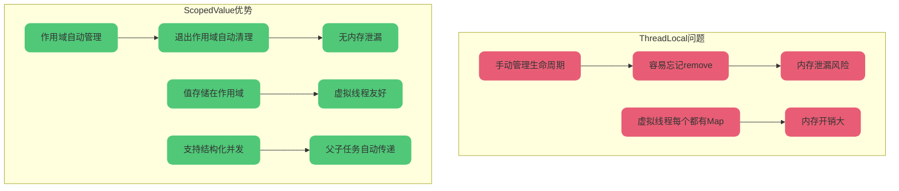

**解决内存泄漏**: ScopedValue的生命周期严格限定在作用域内,退出作用域后绑定自动清除,无需手动remove。

**虚拟线程友好**: ThreadLocal在每个Thread内部维护ThreadLocalMap,对于成千上万的虚拟线程来说内存开销大。ScopedValue的值存储在作用域中,不与线程绑定。

**父子线程传递更友好**: 在ScopedValue.runWhere作用域内创建的所有子任务(虚拟线程)自动能够读取到父作用域中绑定的值,配合结构化并发(Structured Concurrency)使用。

**性能更好**: JVM可以将ScopedValue的读取优化为类似局部变量访问的速度,而ThreadLocal涉及哈希表查找。

### 结构化并发示例

```java
// 使用ScopedValue配合结构化并发
public class StructuredConcurrencyExample {
    private static final ScopedValue&lt;String&gt; TRACE_ID = ScopedValue.newInstance();
    
    public void processRequest(String traceId) throws Exception {
        ScopedValue.runWhere(TRACE_ID, traceId, () -&gt; {
            try (var scope = new StructuredTaskScope.ShutdownOnFailure()) {
                // 所有fork的子任务都能访问TRACE_ID
                Future&lt;String&gt; task1 = scope.fork(() -&gt; {
                    System.out.println("Task1 TraceID: " + TRACE_ID.get());
                    return "结果1";
                });
                
                Future&lt;String&gt; task2 = scope.fork(() -&gt; {
                    System.out.println("Task2 TraceID: " + TRACE_ID.get());
                    return "结果2";
                });
                
                scope.join();
                scope.throwIfFailed();
                
                System.out.println(task1.resultNow() + ", " + task2.resultNow());
            } catch (InterruptedException | ExecutionException e) {
                throw new RuntimeException(e);
            }
        });
    }
}
```

:::tip 迁移建议
对于新项目,建议直接使用ScopedValue替代ThreadLocal。对于老项目,可以逐步迁移,尤其是在使用虚拟线程的场景下,ScopedValue的优势更加明显。
:::

## ThreadLocal使用最佳实践

### 必须手动remove

```java
// ❌ 错误示例:忘记清理
public void processRequest() {
    threadLocal.set(value);
    doSomething();
    // 缺少清理,可能导致内存泄漏
}

// ✅ 正确示例:使用try-finally
public void processRequest() {
    try {
        threadLocal.set(value);
        doSomething();
    } finally {
        threadLocal.remove();  // 必须清理
    }
}
```

### 声明为static final

ThreadLocal应该声明为static final,避免每个实例都创建ThreadLocal:

```java
// ❌ 错误示例
public class UserService {
    private ThreadLocal&lt;User&gt; userHolder = new ThreadLocal&lt;&gt;();  // 每个实例一个
}

// ✅ 正确示例
public class UserService {
    private static final ThreadLocal&lt;User&gt; userHolder = new ThreadLocal&lt;&gt;();
}
```

### 线程池场景务必清理

```java
@Component
public class ThreadPoolConfig {
    @Bean
    public ThreadPoolTaskExecutor taskExecutor() {
        ThreadPoolTaskExecutor executor = new ThreadPoolTaskExecutor();
        executor.setCorePoolSize(10);
        executor.setMaxPoolSize(20);
        
        // 自定义TaskDecorator确保清理
        executor.setTaskDecorator(runnable -&gt; () -&gt; {
            try {
                runnable.run();
            } finally {
                // 任务执行完后清理所有ThreadLocal
                cleanAllThreadLocals();
            }
        });
        
        return executor;
    }
}
```

### 注意引用类型的可变性

```java
// ❌ 危险:共享可变对象
private static final ThreadLocal&lt;List&lt;String&gt;&gt; listHolder = new ThreadLocal&lt;&gt;();

public void dangerousCode() {
    List&lt;String&gt; list = new ArrayList&lt;&gt;();
    listHolder.set(list);
    
    // 其他代码可能修改这个list
    someMethod();  
    
    // 这里获取的list可能已经被修改
    List&lt;String&gt; result = listHolder.get();
}

// ✅ 安全:使用不可变对象或防御性复制
public void safeCode() {
    List&lt;String&gt; list = Collections.unmodifiableList(Arrays.asList("a", "b"));
    listHolder.set(list);
}
```

## 总结

ThreadLocal是Java并发编程中重要的线程隔离工具,通过为每个线程维护独立的变量副本,解决了多线程环境下的数据共享问题。其核心实现基于Thread、ThreadLocal和ThreadLocalMap三者的协作,采用弱引用key和探测式清理、启发式清理两种机制来管理内存。

使用ThreadLocal时必须注意:

- 使用完毕后务必调用remove()方法,尤其在线程池场景下
- 将ThreadLocal声明为static final
- 理解内存泄漏的根源和预防措施
- 在虚拟线程场景下考虑使用ScopedValue替代

随着JDK 25引入ScopedValue,对于新项目建议优先考虑使用ScopedValue,它在作用域管理、虚拟线程支持和性能方面都有显著优势。
