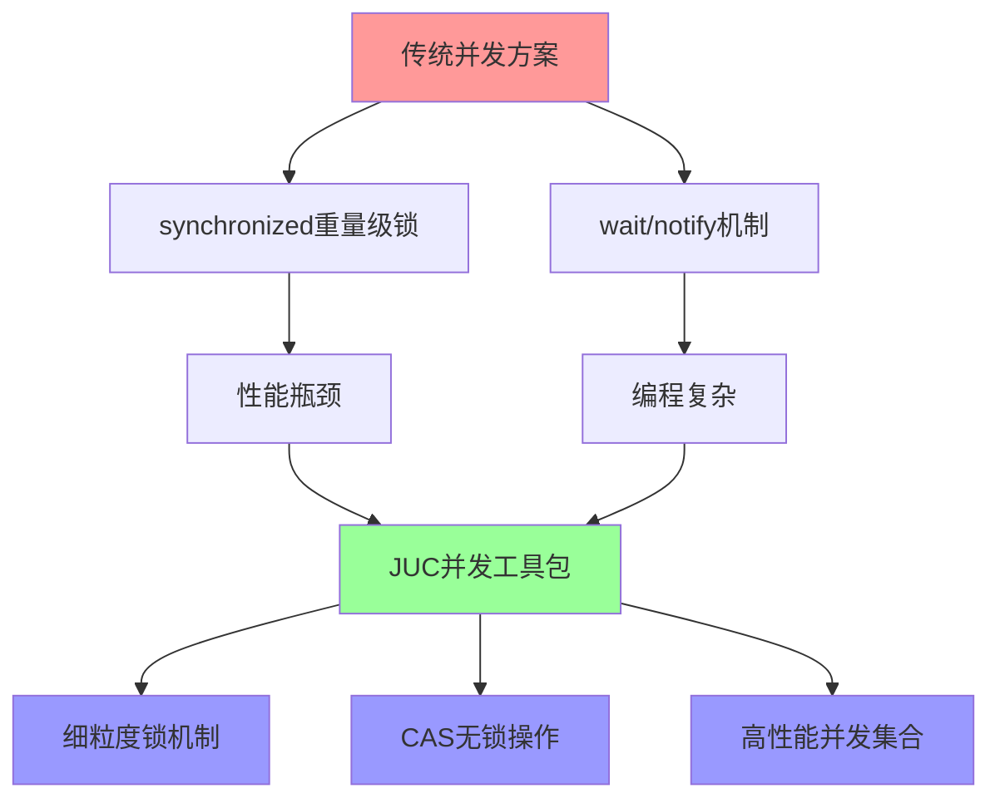
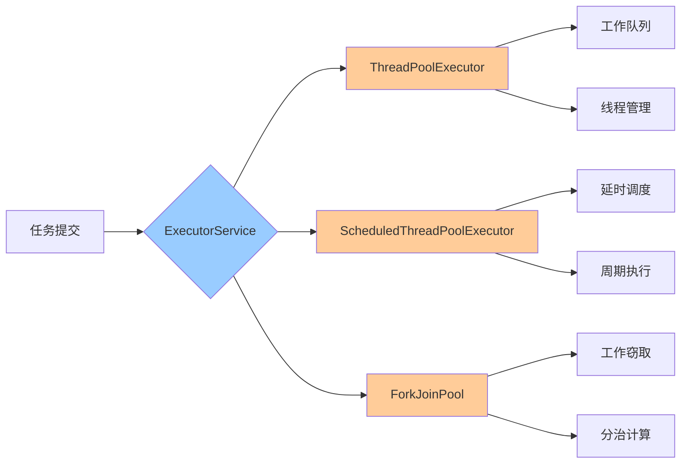
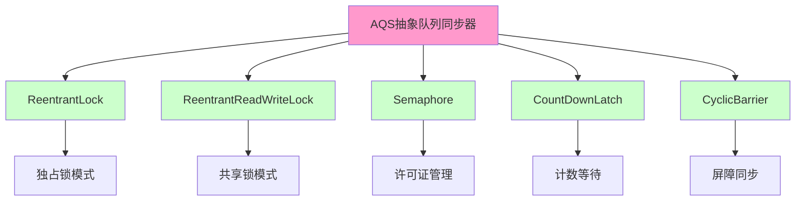
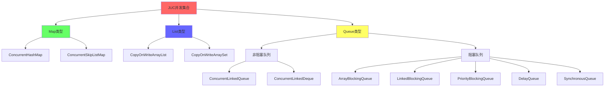
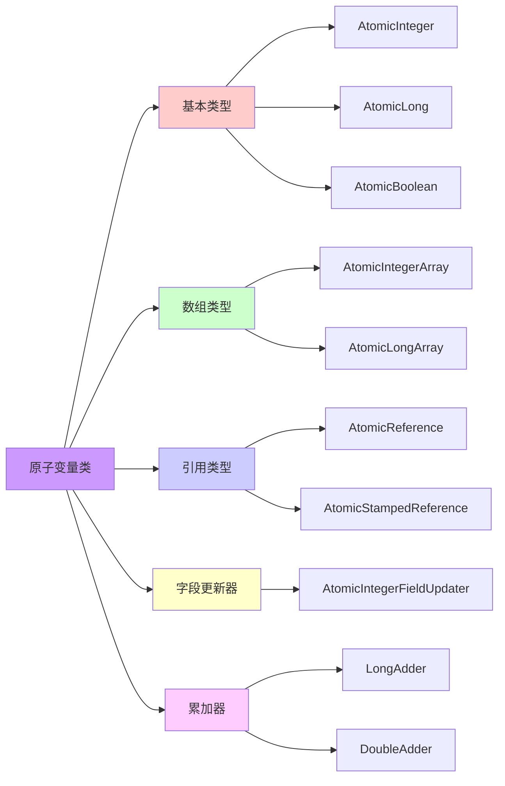

# JUC并发工具包详解

## JUC的诞生背景

Java并发工具包（`java.util.concurrent`，简称JUC）是Java并发编程的核心基础设施，自JDK 1.5版本引入，由并发编程大师Doug Lea主导设计开发。在JUC出现之前，Java开发者在处理多线程并发问题时，主要依赖于`synchronized`关键字以及`Object`类提供的`wait()`、`notify()`、`notifyAll()`等基础方法。

然而这种传统并发控制方式存在诸多不足：

**锁粒度控制困难**：`synchronized`采用对象级或类级锁定机制，锁定范围较大，容易造成不必要的线程等待，在高并发场景下严重影响系统吞吐量。

**功能扩展受限**：难以实现读写锁分离、信号量控制、循环屏障等复杂的同步需求，无法满足多样化的并发场景。

**编程复杂易错**：手动管理`wait()`和`notify()`机制容易引发死锁、活锁等问题，代码维护成本高，可读性差。

**性能瓶颈明显**：早期`synchronized`属于重量级锁，涉及操作系统层面的线程调度，性能开销较大，成为系统性能瓶颈。

为了解决这些问题，JUC应运而生。它通过提供丰富的并发安全工具类，采用细粒度锁、CAS无锁算法、高性能并发数据结构等先进技术，大幅提升了高并发场景下的系统性能和开发效率。

## 线程池与任务执行框架

线程池是JUC中使用频率最高的组件之一，它统一管理线程的创建、调度和销毁过程，避免频繁创建销毁线程带来的系统开销。

### 核心接口体系

**Executor**：任务执行的最顶层抽象接口，定义了执行`Runnable`任务的基本规范。

**ExecutorService**：扩展了`Executor`接口，增加了生命周期管理功能（如`shutdown()`方法）、任务提交功能（如`submit()`方法）、批量任务处理等高级特性。

**ScheduledExecutorService**：在`ExecutorService`基础上增加了延时执行和周期性任务调度能力，可以实现定时任务功能。

### 主要实现类

**ThreadPoolExecutor**：这是最核心的线程池实现类，提供了高度可配置的线程池机制。可以灵活设置核心线程数、最大线程数、工作队列、拒绝策略等参数，满足不同业务场景的需求。

**ScheduledThreadPoolExecutor**：专门用于定时任务调度的线程池实现，支持延时执行和固定周期执行任务。

**Executors工具类**：提供了多个静态工厂方法，用于快速创建常见类型的线程池。但在生产环境中，建议直接使用`ThreadPoolExecutor`构造器创建线程池，以避免默认配置可能带来的资源问题。

**ForkJoinPool**：采用工作窃取算法的并行计算框架，特别适合分而治之的计算任务。Java 8的并行流`parallelStream()`底层就是基于`ForkJoinPool`实现的。

### 新特性支持

JDK 8引入了`CompletableFuture`，提供了强大的链式异步编程能力，极大简化了异步任务编排的复杂度。

JDK 21引入了虚拟线程支持，可以通过`Executors.newVirtualThreadPerTaskExecutor()`创建虚拟线程池，实现更轻量级的并发处理。

## 同步器组件

JUC提供了一系列比`synchronized`更灵活、性能更优的线程协作工具，它们大多基于AQS（AbstractQueuedSynchronizer）框架实现。

### 锁机制

**ReentrantLock**：可重入的互斥锁，支持公平锁和非公平锁两种模式，并提供了`Condition`条件变量机制，实现更细粒度的线程等待和唤醒控制。

**ReentrantReadWriteLock**：读写分离锁，允许多个线程同时进行读操作（共享锁），但写操作是独占的。在读多写少的场景下能显著提升性能。

**StampedLock**：JDK 8引入的改进型读写锁，支持乐观读操作，在某些场景下性能优于`ReentrantReadWriteLock`，但API相对复杂。

### 并发控制工具

**Semaphore**：信号量机制，通过计数器控制同时访问特定资源的线程数量，常用于限流场景。

**CountDownLatch**：倒计时门闩，允许一个或多个线程等待其他线程完成一组操作后再继续执行，适用于主线程等待多个子线程完成的场景。

**CyclicBarrier**：循环屏障，让一组线程相互等待，直到所有线程都到达屏障点后再一起继续执行。与`CountDownLatch`不同，`CyclicBarrier`可以重复使用。

**Phaser**：JDK 7引入的更灵活的阶段同步器，可以看作是`CountDownLatch`和`CyclicBarrier`功能的超集，支持动态调整参与线程数量。

### AQS底层支持

`AbstractQueuedSynchronizer`（AQS）是JUC中几乎所有锁和同步器的基础框架。它基于FIFO等待队列和CAS操作实现，为上层同步组件提供了统一的状态管理和线程排队机制。

## 并发集合

JUC提供的并发集合在多线程环境下是线程安全的，性能远超传统的`Collections.synchronizedXXX`包装类。

### 常用并发容器

**ConcurrentHashMap**：高性能并发哈希表，JDK 8之后采用CAS+分段锁（桶级锁）+红黑树的优化实现，极大提升了并发读写性能。

**ConcurrentLinkedQueue**：基于无锁算法的非阻塞队列，适用于高并发的生产者-消费者场景。

**ConcurrentLinkedDeque**：双端队列的并发版本，支持在队列两端进行操作。

**CopyOnWriteArrayList**：写时复制列表，适合读多写少的场景。每次写操作都会复制底层数组，保证读操作完全无锁。

**CopyOnWriteArraySet**：基于`CopyOnWriteArrayList`实现的线程安全Set集合。

### 阻塞队列家族

**ArrayBlockingQueue**：基于数组实现的有界阻塞队列，使用单一锁控制并发访问。

**LinkedBlockingQueue**：基于链表实现的阻塞队列，可以指定容量也可以作为无界队列使用，读写使用两把锁，吞吐量高于`ArrayBlockingQueue`。

**PriorityBlockingQueue**：支持优先级排序的无界阻塞队列，元素按照自然顺序或自定义比较器排序。

**DelayQueue**：延时队列，元素只有到期后才能被消费，适用于缓存过期、定时任务等场景。

**SynchronousQueue**：零容量的同步队列，每个插入操作必须等待对应的移除操作，常用于线程池的直接交接模式。

**LinkedTransferQueue**：JDK 7引入的高性能传输队列，结合了`LinkedBlockingQueue`和`SynchronousQueue`的特性。

## 原子变量

原子变量类提供了无锁的线程安全操作，基于CPU的CAS（Compare-And-Swap）指令实现，避免了锁的开销。

### 原子类分类

**基本类型原子类**：`AtomicInteger`、`AtomicLong`、`AtomicBoolean`，用于对基本数据类型进行原子操作。

**数组类型原子类**：`AtomicIntegerArray`、`AtomicLongArray`、`AtomicReferenceArray`，对数组元素进行原子操作。

**引用类型原子类**：`AtomicReference`用于对象引用的原子更新，`AtomicStampedReference`通过版本号解决ABA问题，`AtomicMarkableReference`通过布尔标记解决ABA问题。

**字段更新器**：`AtomicIntegerFieldUpdater`、`AtomicLongFieldUpdater`、`AtomicReferenceFieldUpdater`，基于反射机制直接对对象字段进行原子更新。

**累加器类**：`LongAdder`、`DoubleAdder`在高并发累加场景下性能优于`AtomicLong`，采用分段累加思想减少CAS竞争。

## 总结

JUC并发工具包为Java并发编程提供了完整的解决方案，涵盖了线程池、同步器、并发集合、原子变量等各个方面。合理使用这些工具类，可以显著提升应用程序在高并发场景下的性能和稳定性。

在实际开发中，需要根据具体业务场景选择合适的并发工具：
- 线程池用于任务调度和资源管理
- 锁和同步器用于线程协作和资源访问控制
- 并发集合用于线程安全的数据共享
- 原子变量用于无锁的状态更新

深入理解JUC的设计思想和实现原理，是成为Java并发编程高手的必经之路。
