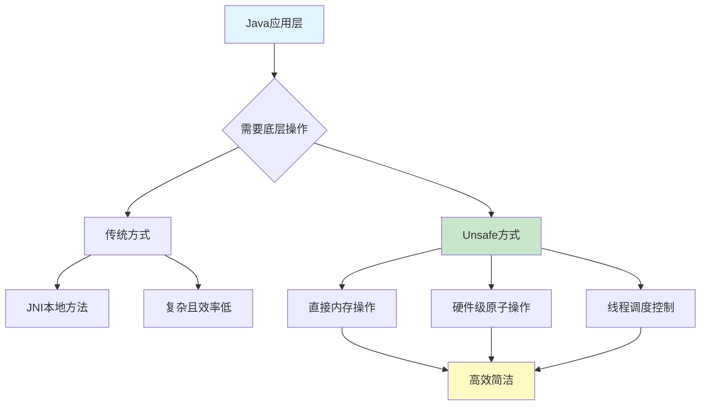
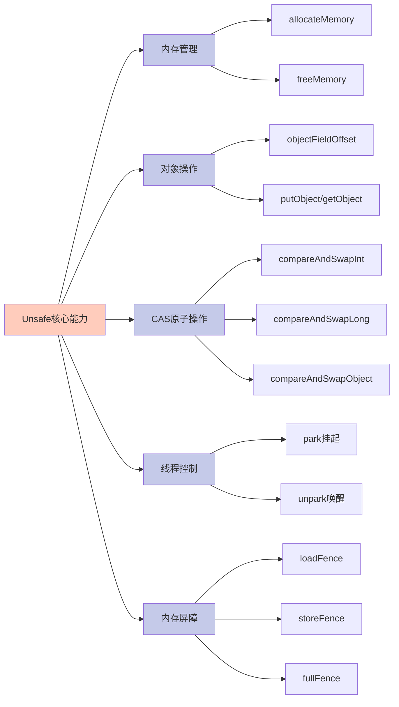
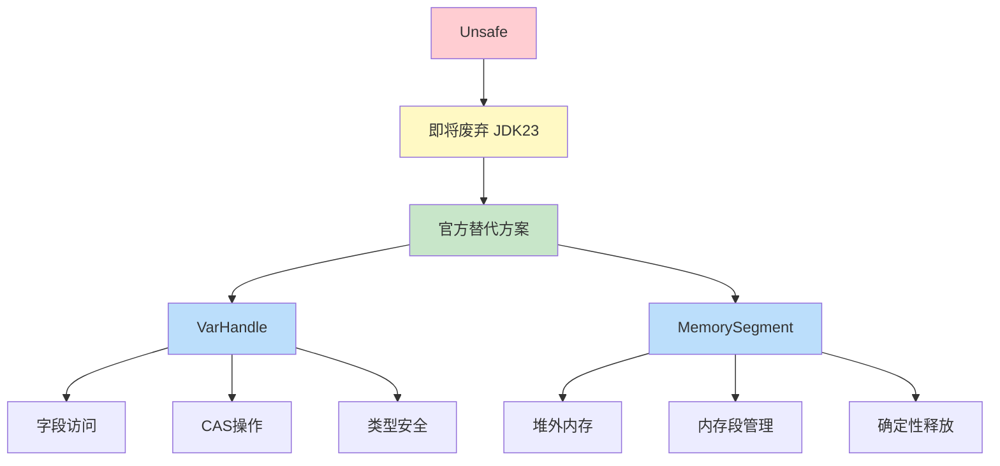

# Unsafe底层操作详解

## Unsafe类概述

Unsafe是Java中一个特殊的底层工具类，它提供了直接访问系统内存、执行硬件级别原子操作的能力。尽管名字中带有"Unsafe"（不安全），但它在Java并发编程和高性能框架中扮演着至关重要的角色。

由于Java本身无法直接访问操作系统底层，需要通过本地（native）方法来实现。Unsafe类正是JVM开的一个"后门"，允许开发者绕过Java虚拟机的安全检查，直接进行底层操作。JUC包中的大量并发工具类、许多第三方高性能框架都依赖Unsafe类来保证并发安全和性能优化。



## Unsafe核心功能

Unsafe类提供了多个维度的底层操作能力，主要包括以下几个方面：

### 内存管理操作

Unsafe允许直接在堆外分配内存和释放内存，这些内存不受JVM垃圾回收器管理，需要手动释放。这种特性在处理大块缓存、与本地代码交互时非常有用。

### 对象字段操作

可以精确定位对象中某个字段的内存位置，并直接修改该字段的值，即使该字段被声明为private私有字段也可以访问和修改。

### 线程调度控制

提供了`park()`和`unpark()`方法用于线程的挂起和恢复，这是实现Lock和各种同步器的基础机制。

### CAS原子操作

提供了硬件级别的比较并交换（Compare-And-Swap）原子操作，这是实现无锁并发算法的核心，性能远超传统的synchronized锁机制。



## Unsafe的获取方式

Unsafe类的构造函数是私有的，无法通过new关键字或普通工厂方法实例化。虽然Unsafe提供了静态的`getUnsafe()`方法，但该方法仅允许Bootstrap类加载器加载的类调用，否则会抛出SecurityException异常。

在实际开发中，通常通过反射机制获取Unsafe实例：

```java
Field unsafeField = Unsafe.class.getDeclaredField("theUnsafe");
unsafeField.setAccessible(true);
Unsafe unsafe = (Unsafe) unsafeField.get(null);
```

## 堆外内存操作实战

Unsafe最常用的功能之一就是直接分配和管理堆外内存。堆外内存不受JVM堆大小限制，也不会被GC回收，适合处理大容量数据缓存和高性能场景。

下面通过一个数据缓存的例子来演示堆外内存的使用：

```java
import sun.misc.Unsafe;
import java.lang.reflect.Field;
import java.nio.charset.StandardCharsets;

public class DirectMemoryCache {
    private static Unsafe unsafe;
    
    static {
        try {
            Field field = Unsafe.class.getDeclaredField("theUnsafe");
            field.setAccessible(true);
            unsafe = (Unsafe) field.get(null);
        } catch (Exception e) {
            throw new RuntimeException("无法获取Unsafe实例", e);
        }
    }
    
    public static void main(String[] args) {
        // 准备要缓存的数据
        String cacheData = "这是存储在堆外内存的缓存数据，不会被GC管理！";
        byte[] dataBytes = cacheData.getBytes(StandardCharsets.UTF_8);
        
        // 分配堆外内存空间
        long memorySize = dataBytes.length;
        long memoryAddress = unsafe.allocateMemory(memorySize);
        
        try {
            // 将数据写入堆外内存
            for (int i = 0; i < dataBytes.length; i++) {
                unsafe.putByte(memoryAddress + i, dataBytes[i]);
            }
            System.out.println("数据已写入堆外内存，起始地址：" + memoryAddress);
            
            // 从堆外内存读取数据
            byte[] readBytes = new byte[dataBytes.length];
            for (int i = 0; i < readBytes.length; i++) {
                readBytes[i] = unsafe.getByte(memoryAddress + i);
            }
            
            String readData = new String(readBytes, StandardCharsets.UTF_8);
            System.out.println("从堆外内存读取的数据：" + readData);
            
        } finally {
            // 手动释放堆外内存，避免内存泄漏
            unsafe.freeMemory(memoryAddress);
            System.out.println("堆外内存已释放");
        }
    }
}
```

这个示例展示了如何使用Unsafe在堆外分配内存、写入数据、读取数据以及释放内存的完整流程。需要特别注意的是，堆外内存必须手动调用`freeMemory()`释放，否则会造成内存泄漏。

## CAS无锁并发实现

CAS（Compare-And-Swap）是现代并发编程中实现无锁算法的核心技术。Unsafe提供的CAS操作可以直接利用CPU指令实现原子性的"比较并交换"，避免了传统锁的性能开销。

下面通过一个商品库存扣减的例子来演示CAS的应用：

```java
import sun.misc.Unsafe;
import java.lang.reflect.Field;

public class InventoryManager {
    private static Unsafe unsafe;
    private static long stockOffset;
    
    static {
        try {
            Field field = Unsafe.class.getDeclaredField("theUnsafe");
            field.setAccessible(true);
            unsafe = (Unsafe) field.get(null);
            
            // 获取stock字段在对象中的内存偏移量
            stockOffset = unsafe.objectFieldOffset(
                Product.class.getDeclaredField("stock")
            );
        } catch (Exception e) {
            throw new RuntimeException(e);
        }
    }
    
    static class Product {
        private volatile int stock;  // 商品库存
        
        public Product(int initialStock) {
            this.stock = initialStock;
        }
        
        // 使用CAS实现库存扣减
        public boolean decreaseStock(int quantity) {
            int currentStock;
            int newStock;
            
            do {
                currentStock = stock;
                
                // 检查库存是否充足
                if (currentStock < quantity) {
                    System.out.println("库存不足，扣减失败！当前库存：" + currentStock);
                    return false;
                }
                
                newStock = currentStock - quantity;
                
                // CAS操作：只有当前值等于期望值时才更新
            } while (!unsafe.compareAndSwapInt(
                this, stockOffset, currentStock, newStock));
            
            System.out.println(Thread.currentThread().getName() + 
                " 成功扣减库存 " + quantity + "，剩余库存：" + newStock);
            return true;
        }
        
        public int getStock() {
            return stock;
        }
    }
    
    public static void main(String[] args) throws InterruptedException {
        Product product = new Product(1000);
        
        // 创建多个线程并发扣减库存
        Thread[] threads = new Thread[20];
        for (int i = 0; i < threads.length; i++) {
            threads[i] = new Thread(() -> {
                for (int j = 0; j < 100; j++) {
                    product.decreaseStock(1);
                }
            }, "线程-" + i);
            threads[i].start();
        }
        
        // 等待所有线程完成
        for (Thread thread : threads) {
            thread.join();
        }
        
        // 输出最终库存（应该为0）
        System.out.println("最终库存数量：" + product.getStock());
    }
}
```

这个示例通过CAS操作实现了线程安全的库存扣减，避免了超卖问题。CAS在循环中不断尝试更新，直到成功为止，这种方式在并发冲突不激烈的场景下性能优于传统锁。

## Unsafe的未来演进

从JDK 9开始，Java官方开始逐步限制Unsafe的使用，并在JDK 23中正式将其标记为即将移除。这主要是因为Unsafe本来就不是为应用开发者设计的公开API，而是JDK内部使用的工具类。

不加限制地使用Unsafe可能导致：
- 破坏Java的安全机制
- 直接操作内存容易引发JVM崩溃
- 代码可移植性差，依赖底层实现细节

Java官方提供了替代方案：

**VarHandle（JDK 9引入）**：提供了类型安全的变量访问和CAS操作，性能与Unsafe相当，是Unsafe字段操作和CAS操作的官方替代品。

**MemorySegment（JDK 22引入）**：提供了安全的堆外内存访问API，是Unsafe内存操作的官方替代方案，支持确定性的内存释放。



## 总结

Unsafe类虽然功能强大，但使用时必须非常谨慎。它主要用于以下场景：

- JDK内部实现并发工具类（如AQS、原子类）
- 高性能框架底层实现（如Netty的堆外内存管理）
- 需要精细控制内存和性能的特殊场景

对于普通应用开发，建议优先使用：
- JUC提供的高级并发工具类
- Java 9+的VarHandle进行变量操作
- Java 22+的MemorySegment进行堆外内存管理

了解Unsafe的原理有助于深入理解Java并发机制的底层实现，但在实际开发中应该优先选择更安全、更标准的API。
