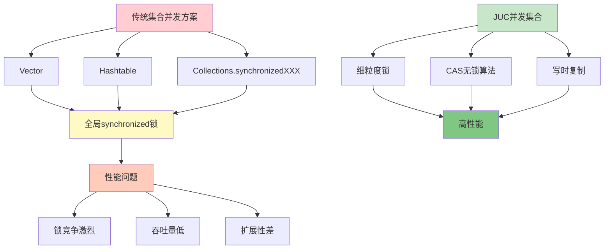
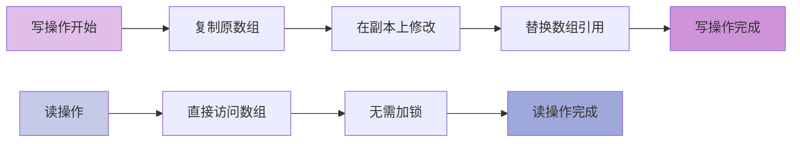
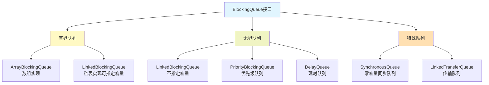
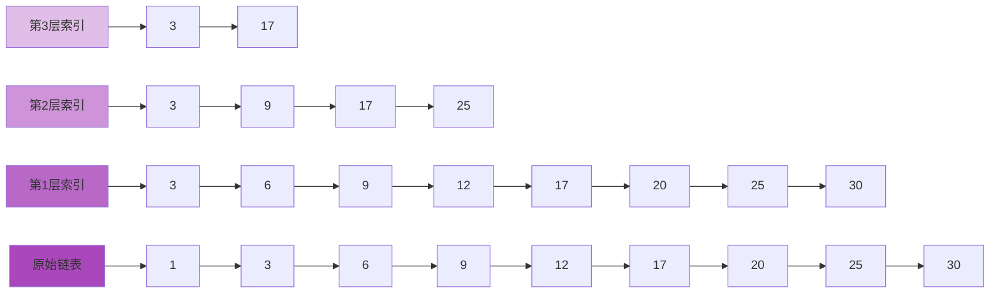

# 并发集合深入剖析

## 传统集合的并发问题

在JDK 1.5之前，如果需要在多线程环境中使用线程安全的集合，开发者只能选择`Vector`、`Hashtable`这类古老的同步集合，或者使用`Collections.synchronizedXXX()`方法包装普通集合。

这些传统方案都存在严重的性能问题：它们对增删改查等所有方法都加上了`synchronized`同步锁，相当于给整个集合加了一把大锁。这种粗粒度的锁机制导致每个操作都要竞争同一把锁，在高并发场景下会形成严重的性能瓶颈。



## CopyOnWriteArrayList写时复制机制

### 设计思想

在绝大多数业务场景中，对集合的读取操作远多于写入操作。由于读取操作不会修改原有数据，每次读取都加锁实际上是一种资源浪费。`CopyOnWriteArrayList`实现了一种读写分离的极致优化：读操作完全无锁，写操作采用写时复制策略。

`CopyOnWriteArrayList`的核心思想是：**读读不互斥、读写不互斥、写写互斥**。相比`ReentrantReadWriteLock`的读写锁，它更进一步实现了读操作的零开销。

### 写时复制原理

当需要修改（`add`、`set`、`remove`等）`CopyOnWriteArrayList`的内容时，不会直接修改原数组，而是：
1. 复制底层数组创建一个新副本
2. 在新副本上执行修改操作
3. 将对象的引用指向新数组

这样可以保证正在进行的读操作不受写操作影响，因为读操作始终访问的是修改前的旧数组。



### 适用场景

**适合使用的场景**：
- 读操作占绝大多数，写操作很少
- 集合数据量不大（避免频繁复制大数组）
- 对数据实时一致性要求不高（允许短暂的最终一致性）

**不适合使用的场景**：
- 写操作频繁，会导致频繁复制数组，性能很差
- 集合数据量非常大，复制开销不可接受
- 需要强一致性，不能容忍读到旧数据

典型应用场景包括：监听器列表、配置信息缓存、黑白名单等。

## ConcurrentLinkedQueue无锁队列

### 阻塞队列vs非阻塞队列

Java提供的线程安全队列分为两大类：

**阻塞队列（BlockingQueue）**：当队列满时插入操作会阻塞，当队列空时获取操作会阻塞。通过锁机制实现线程安全，适合生产者-消费者模式。

**非阻塞队列**：不会阻塞调用线程，通过CAS（Compare-And-Swap）无锁算法实现线程安全。`ConcurrentLinkedQueue`就是典型的非阻塞队列实现。

### 高性能设计

`ConcurrentLinkedQueue`是一个基于链表结构的无界非阻塞队列，它使用CAS原子操作来保证线程安全，性能极高。主要特点包括：

- 采用无锁算法，避免了线程阻塞和上下文切换
- 基于链表结构，理论上容量无限（受内存限制）
- 遵循FIFO（先进先出）原则
- 不允许null元素

### 应用场景选择

**选择ConcurrentLinkedQueue的场景**：
- 对性能要求较高的并发环境
- 多个线程同时进行读写操作
- 不需要阻塞等待的业务逻辑
- 如果加锁成本较高，优先使用无锁方案

**选择BlockingQueue的场景**：
- 需要实现生产者-消费者模式
- 需要线程等待/通知机制
- 需要控制队列容量上限

## BlockingQueue阻塞队列家族

### BlockingQueue核心概念

阻塞队列（`BlockingQueue`）在生产者-消费者模式中应用广泛。它提供了可阻塞的插入和移除方法：
- 当队列已满时，生产者线程的插入操作会被阻塞
- 当队列为空时，消费者线程的获取操作会被阻塞

这种自动阻塞机制简化了生产者-消费者模式的实现，不需要手动编写wait/notify代码。



### ArrayBlockingQueue数组阻塞队列

`ArrayBlockingQueue`是基于数组实现的有界阻塞队列，主要特点：

- 底层采用数组结构，创建时必须指定容量且不可变
- 使用`ReentrantLock`控制并发，插入和删除共用一把锁
- 支持公平锁和非公平锁模式

创建公平性队列示例：
```java
// 创建容量为100的公平队列
BlockingQueue<Order> orderQueue = new ArrayBlockingQueue<>(100, true);

// 生产者线程
new Thread(() -> {
    try {
        Order order = new Order("ORD2024001");
        orderQueue.put(order);  // 队列满时会阻塞
        System.out.println("订单已加入队列：" + order.getOrderId());
    } catch (InterruptedException e) {
        Thread.currentThread().interrupt();
    }
}).start();

// 消费者线程
new Thread(() -> {
    try {
        Order order = orderQueue.take();  // 队列空时会阻塞
        System.out.println("订单开始处理：" + order.getOrderId());
    } catch (InterruptedException e) {
        Thread.currentThread().interrupt();
    }
}).start();
```

### LinkedBlockingQueue链表阻塞队列

`LinkedBlockingQueue`基于单向链表实现，相比`ArrayBlockingQueue`具有更高的吞吐量：

- 可以指定容量（有界）也可以不指定容量（理论无界，最大`Integer.MAX_VALUE`）
- 插入和删除使用两把锁（takeLock和putLock），减少锁竞争
- 满足FIFO特性

```java
// 创建有界队列，容量1000
LinkedBlockingQueue<Task> taskQueue = new LinkedBlockingQueue<>(1000);

// 创建无界队列（不推荐，可能导致内存溢出）
LinkedBlockingQueue<Task> unboundedQueue = new LinkedBlockingQueue<>();

// 批量任务处理
for (int i = 0; i < 100; i++) {
    Task task = new Task("任务-" + i);
    boolean success = taskQueue.offer(task, 3, TimeUnit.SECONDS);
    if (!success) {
        System.out.println("队列已满，任务入队失败：" + task.getName());
    }
}
```

### PriorityBlockingQueue优先级队列

`PriorityBlockingQueue`是支持优先级排序的无界阻塞队列：

- 元素按照自然顺序或自定义比较器排序
- 不允许插入null值
- 插入操作不会阻塞（无界队列），但取出操作在队列空时会阻塞
- 内部使用`ReentrantLock`保证线程安全
- 空间不足时会自动扩容

```java
// 定义任务优先级
class PriorityTask implements Comparable<PriorityTask> {
    private String name;
    private int priority;  // 数字越小优先级越高
    
    public PriorityTask(String name, int priority) {
        this.name = name;
        this.priority = priority;
    }
    
    @Override
    public int compareTo(PriorityTask other) {
        return Integer.compare(this.priority, other.priority);
    }
}

// 创建优先级队列
PriorityBlockingQueue<PriorityTask> queue = new PriorityBlockingQueue<>();

// 添加不同优先级的任务
queue.put(new PriorityTask("普通任务", 5));
queue.put(new PriorityTask("紧急任务", 1));
queue.put(new PriorityTask("低优先级任务", 10));

// 按优先级顺序处理（输出：紧急任务 -> 普通任务 -> 低优先级任务）
while (!queue.isEmpty()) {
    PriorityTask task = queue.take();
    System.out.println("处理任务：" + task.name);
}
```

### DelayQueue延时队列

`DelayQueue`是一个支持延时获取元素的无界阻塞队列，元素必须实现`Delayed`接口：

- 只有到期的元素才能被取出
- 内部使用`PriorityQueue`存储元素
- 适用于缓存过期、定时任务调度等场景

```java
// 延时任务
class DelayedTask implements Delayed {
    private String taskName;
    private long executeTime;  // 执行时间戳
    
    public DelayedTask(String taskName, long delayMillis) {
        this.taskName = taskName;
        this.executeTime = System.currentTimeMillis() + delayMillis;
    }
    
    @Override
    public long getDelay(TimeUnit unit) {
        long diff = executeTime - System.currentTimeMillis();
        return unit.convert(diff, TimeUnit.MILLISECONDS);
    }
    
    @Override
    public int compareTo(Delayed other) {
        return Long.compare(this.executeTime, 
                           ((DelayedTask) other).executeTime);
    }
}

// 使用延时队列
DelayQueue<DelayedTask> delayQueue = new DelayQueue<>();

// 添加延时任务
delayQueue.put(new DelayedTask("5秒后执行", 5000));
delayQueue.put(new DelayedTask("3秒后执行", 3000));
delayQueue.put(new DelayedTask("10秒后执行", 10000));

// 按到期时间顺序获取任务
while (!delayQueue.isEmpty()) {
    DelayedTask task = delayQueue.take();  // 阻塞直到有任务到期
    System.out.println("执行任务：" + task.taskName);
}
```

### SynchronousQueue同步队列

`SynchronousQueue`是一个特殊的阻塞队列，它没有容量（或者说容量为0）：

- 每个插入操作必须等待对应的删除操作
- 每个删除操作必须等待对应的插入操作
- 不存储元素，只负责线程间的直接交接
- 常用于线程池的直接提交策略

```java
SynchronousQueue<String> queue = new SynchronousQueue<>();

// 生产者线程
new Thread(() -> {
    try {
        System.out.println("生产者准备发送消息");
        queue.put("重要数据包");  // 阻塞直到有消费者接收
        System.out.println("消息已被接收");
    } catch (InterruptedException e) {
        Thread.currentThread().interrupt();
    }
}).start();

// 消费者线程
new Thread(() -> {
    try {
        Thread.sleep(2000);  // 模拟延迟
        String data = queue.take();  // 阻塞直到有生产者发送
        System.out.println("消费者接收到：" + data);
    } catch (InterruptedException e) {
        Thread.currentThread().interrupt();
    }
}).start();
```

## ConcurrentSkipListMap跳表实现

### 跳表数据结构

跳表是一种可以快速查找的数据结构，通过建立多级索引来加速查询。它的查找时间复杂度是O(log n)，与平衡树相当，但实现更简单。

跳表的关键优势在于：
- 插入和删除只需局部调整，不需要全局重新平衡
- 在高并发环境下，只需要部分锁即可，而平衡树需要全局锁
- 所有元素保持有序



### ConcurrentSkipListMap特性

`ConcurrentSkipListMap`是基于跳表实现的并发Map，主要特点：

- 键值对按照键的自然顺序或自定义比较器排序
- 提供了预期O(log n)时间复杂度的查找、插入、删除操作
- 使用CAS操作保证线程安全，支持高并发访问
- 不允许null键，但允许null值

**选择ConcurrentSkipListMap的场景**：
- 需要有序的并发Map
- 需要范围查询功能
- 不需要强一致性的遍历

**选择ConcurrentHashMap的场景**：
- 不需要有序性
- 纯粹追求读写性能

## 总结

JUC并发集合为不同场景提供了高性能的线程安全解决方案：

| 集合类型 | 适用场景 | 核心机制 |
|---------|---------|---------|
| CopyOnWriteArrayList | 读多写少 | 写时复制 |
| ConcurrentLinkedQueue | 高性能非阻塞 | CAS无锁 |
| ArrayBlockingQueue | 有界生产消费 | 单锁阻塞 |
| LinkedBlockingQueue | 高吞吐生产消费 | 双锁阻塞 |
| PriorityBlockingQueue | 优先级处理 | 堆排序 |
| DelayQueue | 延时调度 | 延时获取 |
| SynchronousQueue | 直接交接 | 零容量 |
| ConcurrentSkipListMap | 有序并发Map | 跳表 |

合理选择并发集合可以在保证线程安全的同时最大化系统性能。
