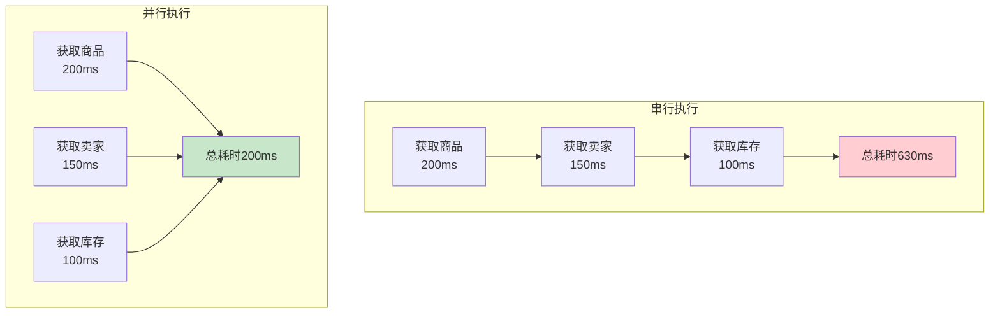

# 异步编程与CompletableFuture实战

## 异步编程的必要性

在现代应用开发中，一个接口往往需要聚合多个数据源的信息。例如，电商商品详情页需要同时获取：商品基本信息、卖家资料、库存数据、物流信息、用户评价、推荐商品等。

如果采用串行方式逐个调用，总响应时间将是所有接口耗时的总和，用户体验很差。通过异步并行执行这些互不依赖的任务，可以将响应时间缩短到最慢任务的耗时，大幅提升性能。



Java 8引入的`CompletableFuture`为异步编程和任务编排提供了强大而优雅的解决方案。

## CompletableFuture核心特性

`CompletableFuture`同时实现了`Future`和`CompletionStage`接口，相比传统`Future`有以下优势：

- **函数式编程**：支持Lambda表达式，代码简洁
- **链式调用**：可以将多个异步操作串联
- **组合操作**：支持多任务并行、串行等编排
- **异常处理**：提供统一的异常处理机制  
- **非阻塞获取**：支持回调获取结果

## CompletableFuture底层实现

### Completion链式结构

`CompletableFuture`内部采用链式结构处理异步计算。每个`CompletableFuture`都有一个`Completion`链，每个节点代表一个异步操作阶段，包含前置依赖、计算逻辑、后续操作等信息。

### 事件驱动机制

采用事件驱动模型处理任务完成事件。当某个`CompletableFuture`完成时，会触发完成事件，然后自动执行后续依赖的阶段。

### ForkJoinPool线程池

默认使用`ForkJoinPool.commonPool()`执行异步任务。但在生产环境强烈建议自定义线程池，避免与其他组件共享全局线程池导致资源竞争。

## 创建CompletableFuture

### 静态工厂方法

**runAsync()**：执行无返回值的异步任务

```java
CompletableFuture<Void> future = CompletableFuture.runAsync(() -> {
    System.out.println("执行异步任务");
});
```

**supplyAsync()**：执行有返回值的异步任务

```java
CompletableFuture<String> future = CompletableFuture.supplyAsync(() -> {
    return "查询结果数据";
});
```

**使用自定义线程池**（推荐）：

```java
ExecutorService executor = Executors.newFixedThreadPool(10);

CompletableFuture<OrderInfo> orderFuture = 
    CompletableFuture.supplyAsync(() -> {
        return queryOrderInfo("ORDER_001");
    }, executor);
```

## 处理异步结果

### thenApply - 结果转换

```java
CompletableFuture<Integer> future = CompletableFuture.supplyAsync(() -> {
    return 100;  // 商品库存
}).thenApply(stock -> {
    return stock * 2;  // 计算积分
}).thenApply(points -> {
    return points + 50;  // 额外奖励
});
```

### thenAccept - 消费结果

```java
CompletableFuture.supplyAsync(() -> {
    return queryUserInfo("USER_001");
}).thenAccept(user -> {
    System.out.println("用户：" + user.getName());
});
```

### whenComplete - 完成回调

```java
CompletableFuture.supplyAsync(() -> {
    return calculateDiscount("VIP");
}).whenComplete((discount, exception) -> {
    if (exception != null) {
        System.out.println("计算失败：" + exception);
    } else {
        System.out.println("折扣：" + discount);
    }
});
```

## 异常处理

### exceptionally

```java
CompletableFuture<Double> priceFuture = CompletableFuture.supplyAsync(() -> {
    if (Math.random() > 0.5) {
        throw new RuntimeException("服务异常");
    }
    return 99.99;
}).exceptionally(ex -> {
    return 0.0;  // 返回默认价格
});
```

### handle统一处理

```java
CompletableFuture<String> future = CompletableFuture.supplyAsync(() -> {
    if (Math.random() < 0.5) {
        throw new RuntimeException("失败");
    }
    return "成功数据";
}).handle((result, exception) -> {
    return exception != null ? "降级数据" : result;
});
```

## 任务编排

### thenCompose串行依赖

前一个任务的结果作为后一个任务的输入：

```java
CompletableFuture<RecommendList> future = 
    CompletableFuture.supplyAsync(() -> {
        return getUserById("USER_001");
    }).thenCompose(user -> 
        CompletableFuture.supplyAsync(() -> {
            return recommendProducts(user);
        })
    );
```

### thenCombine并行合并

组合两个并行任务的结果：

```java
CompletableFuture<ProductDetail> productFuture = 
    CompletableFuture.supplyAsync(() -> getProduct("P001"));

CompletableFuture<InventoryInfo> inventoryFuture = 
    CompletableFuture.supplyAsync(() -> getInventory("P001"));

CompletableFuture<ProductPage> pageFuture = 
    productFuture.thenCombine(inventoryFuture, (product, inventory) -> {
        ProductPage page = new ProductPage();
        page.setProduct(product);
        page.setStock(inventory.getStock());
        return page;
    });
```

### allOf等待所有任务

```java
List<String> ids = Arrays.asList("P001", "P002", "P003");

CompletableFuture<?>[] futures = ids.stream()
    .map(id -> CompletableFuture.supplyAsync(() -> getProduct(id)))
    .toArray(CompletableFuture[]::new);

CompletableFuture<Void> allFuture = CompletableFuture.allOf(futures);

allFuture.thenRun(() -> {
    System.out.println("所有查询完成");
});
```

### anyOf任一完成

```java
CompletableFuture<String> cache1 = 
    CompletableFuture.supplyAsync(() -> getFromCache1("KEY"));
CompletableFuture<String> cache2 = 
    CompletableFuture.supplyAsync(() -> getFromCache2("KEY"));
CompletableFuture<String> db = 
    CompletableFuture.supplyAsync(() -> getFromDB("KEY"));

// 最快的数据源返回结果
CompletableFuture<Object> fastest = 
    CompletableFuture.anyOf(cache1, cache2, db);
```

## 实战案例：数据聚合

```java
public class DataAggregationService {
    
    private ExecutorService executor = new ThreadPoolExecutor(
        20, 50, 60L, TimeUnit.SECONDS,
        new LinkedBlockingQueue<>(1000)
    );
    
    public AggregatedData aggregateData(String userId) {
        // 并行查询
        CompletableFuture<UserProfile> profileFuture = 
            CompletableFuture.supplyAsync(
                () -> userService.getProfile(userId), executor);
        
        CompletableFuture<List<Order>> orderFuture = 
            CompletableFuture.supplyAsync(
                () -> orderService.getOrders(userId), executor);
        
        CompletableFuture<List<Address>> addressFuture = 
            CompletableFuture.supplyAsync(
                () -> addressService.getAddresses(userId), executor);
        
        // 等待所有任务完成
        CompletableFuture<Void> allTasks = CompletableFuture.allOf(
            profileFuture, orderFuture, addressFuture
        );
        
        // 组装结果
        return allTasks.thenApply(v -> {
            AggregatedData data = new AggregatedData();
            data.setProfile(profileFuture.join());
            data.setOrders(orderFuture.join());
            data.setAddresses(addressFuture.join());
            return data;
        }).exceptionally(ex -> {
            log.error("聚合失败", ex);
            return AggregatedData.defaultData();
        }).join();
    }
}
```

## 最佳实践

### 使用自定义线程池

```java
ThreadPoolExecutor asyncExecutor = new ThreadPoolExecutor(
    10, 20, 60L, TimeUnit.SECONDS,
    new LinkedBlockingQueue<>(500),
    new ThreadFactory() {
        private AtomicInteger count = new AtomicInteger(0);
        public Thread newThread(Runnable r) {
            return new Thread(r, "async-" + count.incrementAndGet());
        }
    }
);

CompletableFuture.supplyAsync(() -> doSomething(), asyncExecutor);
```

### 避免阻塞式get()

```java
// 不推荐
String result = future.get();

// 推荐：使用回调
future.thenAccept(result -> {
    // 处理结果
});

// 必须使用get()时设置超时
try {
    String result = future.get(3, TimeUnit.SECONDS);
} catch (TimeoutException e) {
    // 超时处理
}
```

### 正确处理异常

```java
CompletableFuture.supplyAsync(() -> riskyOperation())
    .exceptionally(ex -> {
        log.error("操作失败", ex);
        return fallbackValue();
    })
    .whenComplete((result, ex) -> {
        if (ex != null) {
            metrics.recordFailure();
        } else {
            metrics.recordSuccess();
        }
    });
```

## 总结

`CompletableFuture`是Java异步编程的强大工具，适合：
- 多数据源聚合场景
- 并行调用多个服务
- 复杂的异步任务编排
- 高并发IO密集型应用

关键要点：
- 务必使用自定义线程池
- 优先使用回调而非阻塞get()
- 正确处理异常，避免异常被吞噬
- 合理组合多个异步任务
