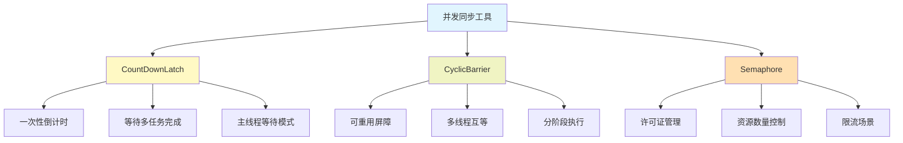
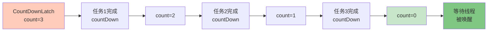
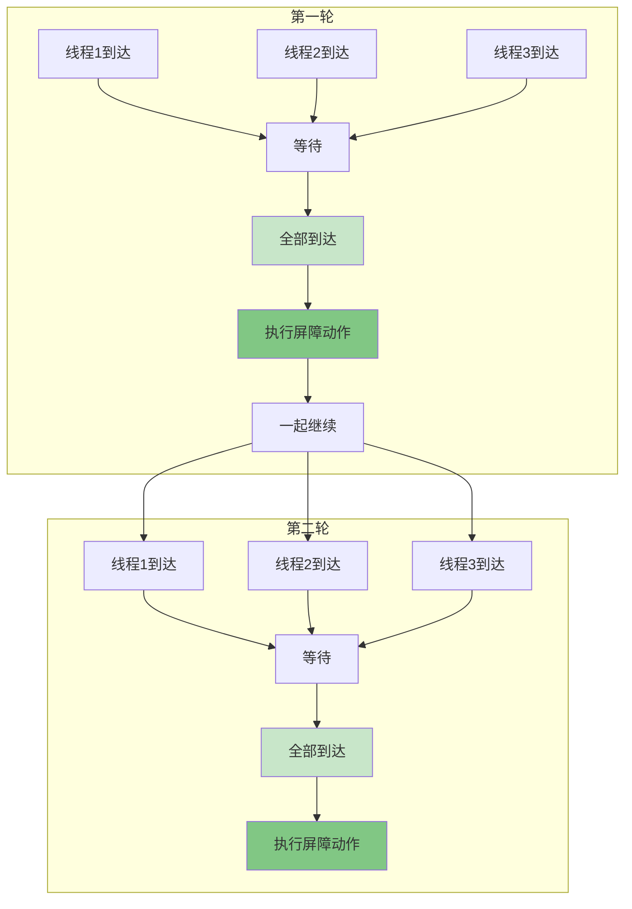
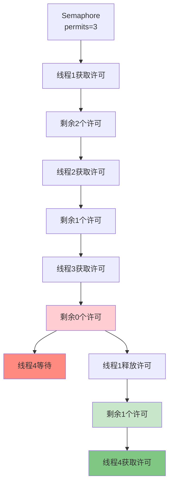
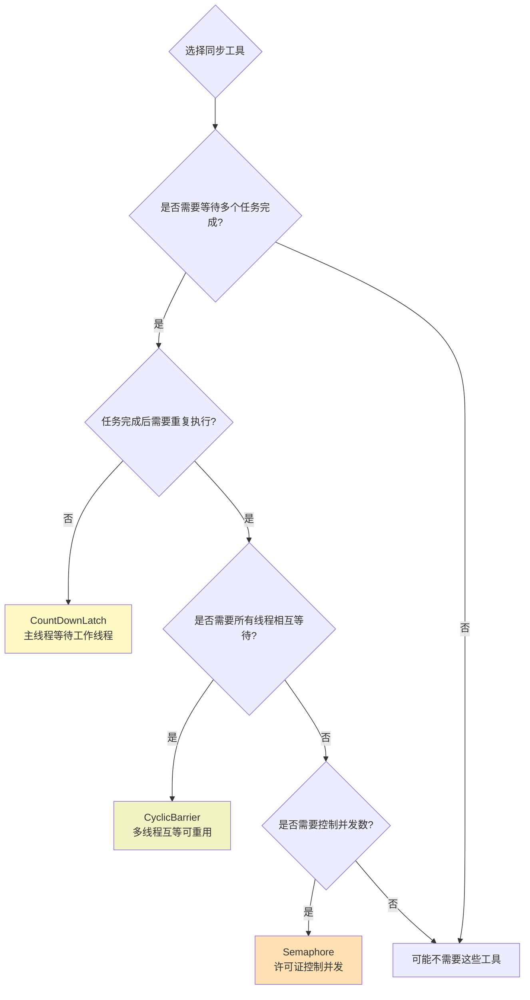

# 并发同步工具实战指南

## 并发同步工具概述

在多线程编程中，经常需要协调多个线程之间的执行顺序和资源访问。JUC包提供了三个强大的同步辅助工具：`CountDownLatch`、`CyclicBarrier`和`Semaphore`，它们各有特点，适用于不同的并发场景。



## CountDownLatch倒计时门闩

### 核心机制

`CountDownLatch`（倒计时门闩）是一个同步计数器，它允许一个或多个线程等待其他线程完成一组操作后再继续执行。其工作原理类似于倒计时：

1. 创建时指定一个计数值
2. 每当一个任务完成，计数器减1（调用`countDown()`）
3. 等待的线程会阻塞直到计数器归零（调用`await()`）

关键特点：
- **一次性使用**：计数器降为0后不能重置，对象就废弃了
- **主从模式**：通常用于主线程等待多个工作线程完成
- **非阻塞释放**：调用`countDown()`的线程不会阻塞



### 实战案例：应用启动检查

在应用启动时，通常需要初始化多个组件，所有组件都准备就绪后才能对外提供服务：

```java
public class ApplicationBootstrap {
    
    public static void main(String[] args) throws InterruptedException {
        int componentCount = 5;
        CountDownLatch startupLatch = new CountDownLatch(componentCount);
        
        // 初始化数据库连接池
        new Thread(() -> {
            System.out.println("正在初始化数据库连接池...");
            try {
                Thread.sleep(2000);
                System.out.println("数据库连接池初始化完成");
            } catch (InterruptedException e) {
                e.printStackTrace();
            } finally {
                startupLatch.countDown();
            }
        }, "DB-Init").start();
        
        // 初始化缓存系统
        new Thread(() -> {
            System.out.println("正在初始化缓存系统...");
            try {
                Thread.sleep(1500);
                System.out.println("缓存系统初始化完成");
            } catch (InterruptedException e) {
                e.printStackTrace();
            } finally {
                startupLatch.countDown();
            }
        }, "Cache-Init").start();
        
        // 加载配置文件
        new Thread(() -> {
            System.out.println("正在加载配置文件...");
            try {
                Thread.sleep(1000);
                System.out.println("配置文件加载完成");
            } catch (InterruptedException e) {
                e.printStackTrace();
            } finally {
                startupLatch.countDown();
            }
        }, "Config-Init").start();
        
        // 初始化消息队列
        new Thread(() -> {
            System.out.println("正在初始化消息队列...");
            try {
                Thread.sleep(1800);
                System.out.println("消息队列初始化完成");
            } catch (InterruptedException e) {
                e.printStackTrace();
            } finally {
                startupLatch.countDown();
            }
        }, "MQ-Init").start();
        
        // 初始化线程池
        new Thread(() -> {
            System.out.println("正在初始化线程池...");
            try {
                Thread.sleep(800);
                System.out.println("线程池初始化完成");
            } catch (InterruptedException e) {
                e.printStackTrace();
            } finally {
                startupLatch.countDown();
            }
        }, "ThreadPool-Init").start();
        
        // 主线程等待所有组件初始化完成
        System.out.println("等待所有组件初始化完成...");
        startupLatch.await();
        
        System.out.println("=================================");
        System.out.println("所有组件初始化完成，应用启动成功！");
        System.out.println("=================================");
    }
}
```

## CyclicBarrier循环屏障

### 核心机制

`CyclicBarrier`（循环屏障）让一组线程相互等待，直到所有线程都到达屏障点后再一起继续执行。它的特点是：

1. 所有线程相互等待，而不是一个等多个
2. 到达屏障点的线程会阻塞，直到最后一个线程到达
3. 可以重复使用（Cyclic的含义）
4. 可以指定屏障动作，在所有线程到达后优先执行

关键区别：
- `CountDownLatch`：主从模式，一个等多个，一次性使用
- `CyclicBarrier`：平等模式，多个相互等，可重复使用



### 实战案例：并行计算任务

模拟MapReduce场景，多个线程并行计算，在屏障点汇总结果：

```java
public class ParallelComputeDemo {
    
    public static void main(String[] args) {
        int workerCount = 4;
        ConcurrentHashMap<String, Integer> resultMap = new ConcurrentHashMap<>();
        
        // 创建循环屏障，指定屏障动作
        CyclicBarrier barrier = new CyclicBarrier(workerCount, () -> {
            // 所有线程到达后，汇总结果
            int totalSum = resultMap.values().stream()
                                    .mapToInt(Integer::intValue)
                                    .sum();
            System.out.println("========== 第" + resultMap.size() + "轮计算完成 ==========");
            System.out.println("本轮总和：" + totalSum);
            System.out.println("====================================\n");
        });
        
        // 创建多个计算线程
        for (int i = 0; i < workerCount; i++) {
            final int workerId = i;
            new Thread(() -> {
                try {
                    // 模拟两轮计算
                    for (int round = 1; round <= 2; round++) {
                        // 执行计算任务
                        int result = compute(workerId, round);
                        resultMap.put("Worker-" + workerId + "-Round-" + round, result);
                        
                        System.out.println(Thread.currentThread().getName() + 
                                         " 完成第" + round + "轮计算，结果：" + result);
                        
                        // 到达屏障点，等待其他线程
                        barrier.await();
                        
                        // 短暂休息后进行下一轮
                        Thread.sleep(500);
                    }
                } catch (Exception e) {
                    e.printStackTrace();
                }
            }, "计算线程-" + i).start();
        }
    }
    
    private static int compute(int workerId, int round) {
        try {
            // 模拟计算耗时
            Thread.sleep((long) (Math.random() * 1000) + 500);
        } catch (InterruptedException e) {
            e.printStackTrace();
        }
        return workerId * 10 + round;
    }
}
```

## Semaphore信号量

### 核心机制

`Semaphore`（信号量）用于控制同时访问特定资源的线程数量，通过许可证（permit）机制实现：

1. 创建时指定许可证数量
2. 线程通过`acquire()`获取许可证，如果没有可用许可证则阻塞
3. 线程通过`release()`释放许可证，供其他线程使用

应用场景：
- 限流控制：限制同时访问某个资源的线程数
- 连接池管理：控制数据库连接、HTTP连接等资源
- 并发度控制：限制并发执行的任务数量



### 实战案例：接口限流

模拟限制同时访问某个接口的请求数量：

```java
public class ApiRateLimiter {
    
    // 限制同时只能有5个请求访问
    private static final Semaphore semaphore = new Semaphore(5);
    
    public static void main(String[] args) {
        // 模拟20个并发请求
        for (int i = 1; i <= 20; i++) {
            final int requestId = i;
            new Thread(() -> {
                try {
                    // 尝试获取许可证
                    System.out.println("请求-" + requestId + " 尝试获取访问许可");
                    semaphore.acquire();
                    
                    System.out.println(">>> 请求-" + requestId + " 获得许可，开始处理");
                    
                    // 模拟接口处理
                    handleRequest(requestId);
                    
                    System.out.println("<<< 请求-" + requestId + " 处理完成，释放许可");
                    
                } catch (InterruptedException e) {
                    e.printStackTrace();
                } finally {
                    // 释放许可证
                    semaphore.release();
                }
            }, "请求线程-" + i).start();
            
            // 控制请求速度
            try {
                Thread.sleep(100);
            } catch (InterruptedException e) {
                e.printStackTrace();
            }
        }
    }
    
    private static void handleRequest(int requestId) {
        try {
            // 模拟接口处理耗时
            long processTime = (long) (Math.random() * 2000) + 1000;
            System.out.println("    请求-" + requestId + " 处理中，预计耗时 " + 
                             processTime + "ms");
            Thread.sleep(processTime);
        } catch (InterruptedException e) {
            e.printStackTrace();
        }
    }
}
```

## 三者对比总结

| 特性 | CountDownLatch | CyclicBarrier | Semaphore |
|-----|---------------|---------------|-----------|
| **核心用途** | 一个或多个线程等待其他线程完成 | 多个线程相互等待到达屏障点 | 控制同时访问资源的线程数 |
| **计数方向** | 减法计数（count down） | 加法计数（count up） | 加减计数（acquire/release） |
| **是否可重用** | 不可重用 | 可重用 | 可重用 |
| **阻塞特点** | await()阻塞，countDown()不阻塞 | await()阻塞所有线程 | acquire()可能阻塞 |
| **典型场景** | 应用启动、批量任务等待 | 并行计算、分阶段任务 | 限流、资源池管理 |
| **线程关系** | 主从关系（1对N） | 平等关系（N对N） | 竞争关系 |



## 线程调度技巧：Thread.sleep(0)

### sleep(0)的作用

`Thread.sleep(0)`是一个特殊的用法，它并不是让线程休眠0毫秒，而是**主动触发一次线程调度**。

调用`Thread.sleep(0)`后：
1. 当前线程主动释放CPU时间片
2. 线程状态从RUNNING变为TIMED_WAITING（极短暂）
3. 立即重新参与CPU时间片的竞争
4. 给其他线程一个获得CPU的机会

### 应用场景

虽然这种用法比较少见，但在某些底层框架中会用到：

**避免线程饥饿**：当某个线程长时间占用CPU时，通过`sleep(0)`主动让出时间片，让其他线程有机会执行。

**降低CPU占用**：在循环等待某个条件时，避免空转消耗CPU。

```java
// 不推荐：CPU空转
while (!condition) {
    // 持续检查条件，CPU使用率100%
}

// 改进：主动让出CPU
while (!condition) {
    Thread.sleep(0);  // 给其他线程执行机会
}

// 最佳实践：使用wait/notify或并发工具
```

**线程调度优化**：在一些对响应时间敏感但又需要公平性的场景，可以用来平衡线程调度。

需要注意的是，在现代JVM中，这种优化技巧的必要性已经大大降低，应该优先使用JUC提供的高级并发工具。

## 总结

并发同步工具为多线程协作提供了优雅的解决方案：

- **CountDownLatch**：适合"等待所有任务完成"的一次性场景
- **CyclicBarrier**：适合"分阶段并行执行"的可重复场景  
- **Semaphore**：适合"资源数量控制"的限流场景

正确选择和使用这些工具，可以大大简化多线程编程的复杂度，提高代码的可读性和可维护性。在实际开发中，应该根据具体的业务需求选择合适的同步工具，而不是一味使用低级的wait/notify机制。
