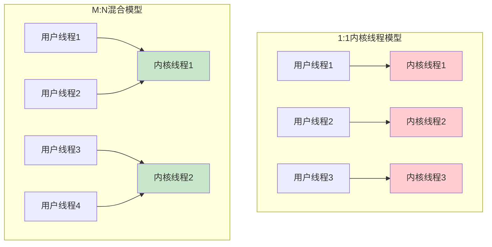
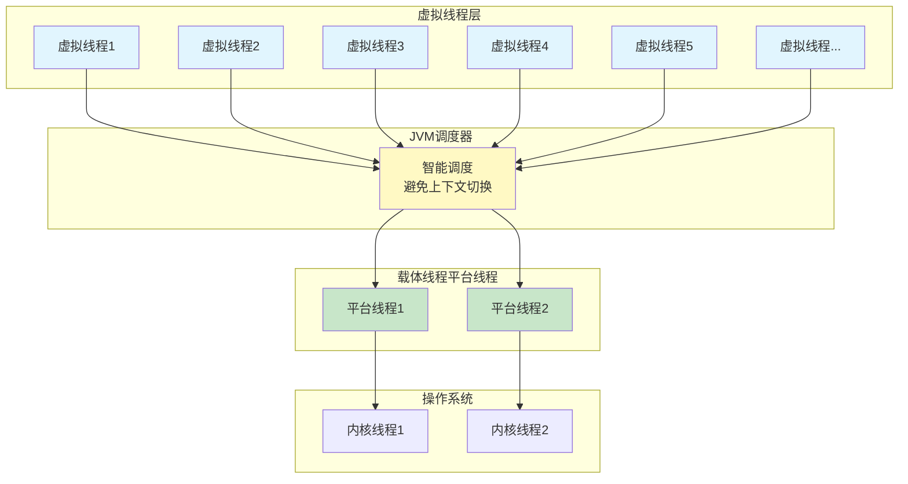

import PaidCTA from '@site/src/components/PaidCTA';

# 虚拟线程与现代并发编程

## 传统线程模型的困境

在探讨虚拟线程之前,我们先来理解传统Java线程模型面临的挑战。

### 操作系统线程的三种实现方式

操作系统级别的线程实现主要有三种方式：

**内核线程实现（1:1模型）**：每个用户线程直接映射到一个内核线程，由操作系统内核负责调度。优点是充分利用多核处理器，缺点是创建、销毁和上下文切换的成本高。

**用户线程实现（N:1模型）**：多个用户线程映射到一个内核线程，线程调度完全在用户空间完成。优点是轻量高效，缺点是无法利用多核优势，一个线程阻塞会导致所有线程阻塞。

**混合实现（M:N模型）**：多个用户线程映射到少量内核线程，兼具前两种方式的优点，但实现复杂度高。

### Java平台线程的局限性

在JDK 21之前，Java主要采用1:1的线程模型，每个Java线程都对应一个操作系统的内核线程（在Windows和Linux等主流平台上）。这种设计虽然简单直接，但存在明显的限制：

**创建成本高**：创建线程需要分配内核资源，调用系统API，开销较大。

**上下文切换开销**：线程切换需要在用户态和内核态之间切换，保存和恢复寄存器状态，消耗CPU资源。

**内存占用大**：每个线程都需要分配独立的栈空间（通常1MB左右），大量线程会占用大量内存。

**数量受限**：受操作系统和硬件资源限制，单个JVM能创建的线程数量有上限（通常几千到几万）。

这些限制在高并发场景下尤为突出。例如，一个需要处理百万级并发连接的服务器，无法为每个连接分配一个平台线程。

## 虚拟线程的革命性创新

### 协程思想的引入

虚拟线程（Virtual Thread）的概念对于熟悉Go、Python、Ruby等语言的开发者来说并不陌生——这就是**协程（Coroutine）**。

JDK 21正式引入虚拟线程，从根本上改变了Java的并发编程模式。虚拟线程是JVM实现的轻量级线程，它将多个虚拟线程映射到少量操作系统线程上，通过智能调度避免了传统线程的高昂开销。

### M:N调度模型

虚拟线程采用M:N调度模型：

- **M个虚拟线程**（数量可以非常大，百万级别）
- **N个载体线程**（Carrier Thread，即平台线程，数量较少）
- **JVM调度器**：负责将虚拟线程调度到载体线程上执行

### 核心优势

**极低的创建成本**：创建虚拟线程只需在堆上分配一个Java对象，无需系统调用，成本极低。

**高效的内存使用**：虚拟线程的栈是动态伸缩的，初始只有几KB，按需增长，内存占用远小于平台线程。

**无上下文切换开销**：虚拟线程的切换在用户空间完成，不涉及内核态切换，效率极高。

**数量几乎无限**：可以轻松创建百万级别的虚拟线程，只受JVM堆内存限制。

**简化异步编程**：可以用同步代码风格编写异步逻辑，无需复杂的回调和异步框架。

## 虚拟线程的使用方式

<PaidCTA />