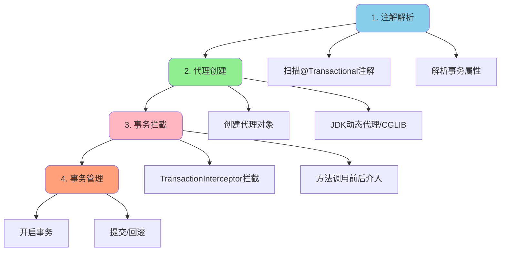
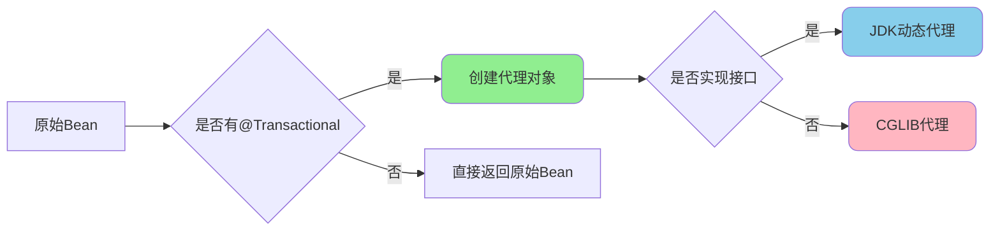
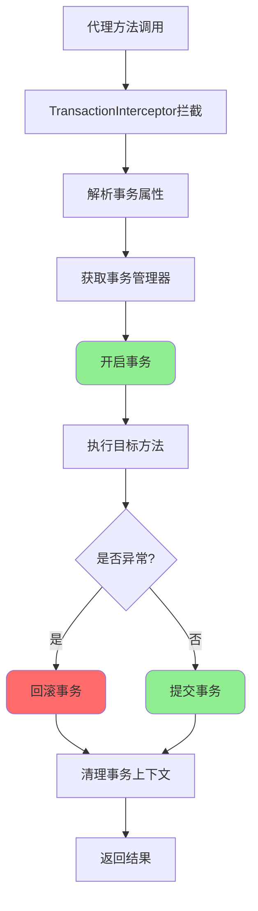
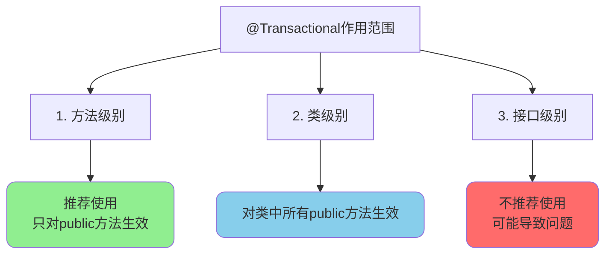
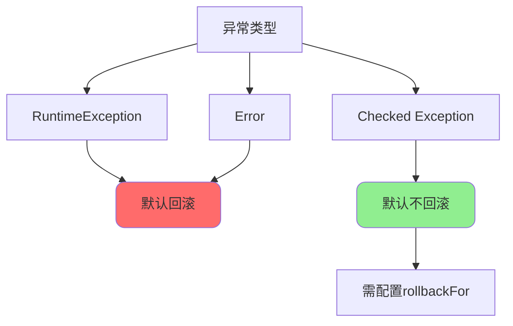
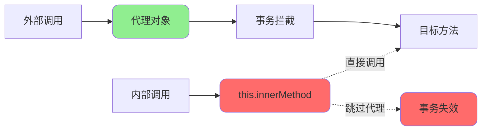
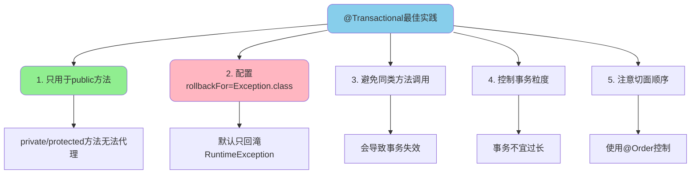

# Spring事务实现原理与注解详解

## @Transactional实现原理

### 核心原理概述

Spring的@Transactional事务管理基于 **AOP(面向切面编程)** 实现,通过动态代理在方法调用前后介入事务管理逻辑。

整个实现过程分为四个核心步骤:



### 注解解析阶段

Spring容器启动时,通过`SpringTransactionAnnotationParser`扫描所有标注了@Transactional的类和方法,解析注解中的属性配置。

```java
// Spring源码中的注解解析逻辑(简化版)
protected TransactionAttribute parseTransactionAnnotation(AnnotationAttributes attributes) {
    RuleBasedTransactionAttribute txAttr = new RuleBasedTransactionAttribute();
    
    // 解析传播行为
    Propagation propagation = attributes.getEnum("propagation");
    txAttr.setPropagationBehavior(propagation.value());
    
    // 解析隔离级别
    Isolation isolation = attributes.getEnum("isolation");
    txAttr.setIsolationLevel(isolation.value());
    
    // 解析超时时间
    txAttr.setTimeout(attributes.getNumber("timeout").intValue());
    
    // 解析是否只读
    txAttr.setReadOnly(attributes.getBoolean("readOnly"));
    
    // 解析回滚规则
    List<RollbackRuleAttribute> rollbackRules = new ArrayList<>();
    for (Class<?> rbRule : attributes.getClassArray("rollbackFor")) {
        rollbackRules.add(new RollbackRuleAttribute(rbRule));
    }
    txAttr.setRollbackRules(rollbackRules);
    
    return txAttr;
}
```

解析后的事务属性会传递给`TransactionInterceptor`,用于后续的事务管理。

### 代理创建阶段

Spring容器会为标注了@Transactional的类创建代理对象,所有的事务方法调用都会经过代理。



**代理对象创建逻辑:**

```java
// DefaultAopProxyFactory中的代理创建逻辑
public AopProxy createAopProxy(AdvisedSupport config) throws AopConfigException {
    // 判断是否需要优化、是否代理目标类、是否有用户提供的代理接口
    if (config.isOptimize() || config.isProxyTargetClass() 
        || hasNoUserSuppliedProxyInterfaces(config)) {
        Class<?> targetClass = config.getTargetClass();
        
        if (targetClass == null) {
            throw new AopConfigException("TargetSource cannot determine target class");
        }
        
        // 如果目标类是接口或已经是代理类,使用JDK动态代理
        if (targetClass.isInterface() || Proxy.isProxyClass(targetClass)) {
            return new JdkDynamicAopProxy(config);
        }
        
        // 否则使用CGLIB代理
        return new ObjenesisCglibAopProxy(config);
    } else {
        // 默认使用JDK动态代理
        return new JdkDynamicAopProxy(config);
    }
}
```

**两种代理方式对比:**

| 特性 | JDK动态代理 | CGLIB代理 |
|------|------------|-----------|
| 实现方式 | 基于接口 | 基于继承 |
| 性能 | 较快 | 较慢(首次创建) |
| 限制 | 必须实现接口 | 不能代理final类/方法 |
| 适用场景 | 有接口的类 | 没有接口的类 |

### 事务拦截阶段

代理对象通过`TransactionInterceptor`拦截目标方法的调用,在方法执行前后进行事务管理。

```java
// TransactionInterceptor的invoke方法(简化版)
@Override
public Object invoke(MethodInvocation invocation) throws Throwable {
    // 获取目标类
    Class<?> targetClass = (invocation.getThis() != null 
        ? AopUtils.getTargetClass(invocation.getThis()) : null);
    
    // 在事务中执行目标方法
    return invokeWithinTransaction(
        invocation.getMethod(), 
        targetClass, 
        invocation::proceed
    );
}
```

### 事务管理阶段

`TransactionAspectSupport`中的`invokeWithinTransaction`方法是事务管理的核心:

```java
protected Object invokeWithinTransaction(Method method, Class<?> targetClass,
        final InvocationCallback invocation) throws Throwable {
    
    // 1. 获取事务属性(@Transactional配置)
    TransactionAttributeSource tas = getTransactionAttributeSource();
    final TransactionAttribute txAttr = (tas != null 
        ? tas.getTransactionAttribute(method, targetClass) : null);
    
    // 2. 确定事务管理器
    final PlatformTransactionManager ptm = determineTransactionManager(txAttr);
    
    // 3. 构建方法标识
    final String joinpointIdentification = methodIdentification(method, targetClass, txAttr);
    
    // 4. 处理声明式事务
    if (txAttr == null || !(ptm instanceof CallbackPreferringPlatformTransactionManager)) {
        // 4.1 创建事务(核心!)
        TransactionInfo txInfo = createTransactionIfNecessary(ptm, txAttr, joinpointIdentification);
        
        Object retVal;
        try {
            // 4.2 执行目标业务方法
            retVal = invocation.proceedWithInvocation();
        } catch (Throwable ex) {
            // 4.3 异常回滚处理
            completeTransactionAfterThrowing(txInfo, ex);
            throw ex;
        } finally {
            // 清理事务信息
            cleanupTransactionInfo(txInfo);
        }
        
        // 4.4 提交事务
        commitTransactionAfterReturning(txInfo);
        return retVal;
    }
}
```

**完整执行流程:**



## @Transactional注解详解

### 注解作用范围

@Transactional可以作用在三个级别:



**方法级别(推荐):**

```java
@Service
public class UserService {
    
    /**
     * 方法级别的事务注解
     * 只对当前方法生效
     */
    @Transactional(rollbackFor = Exception.class)
    public void registerUser(UserDTO userDTO) {
        userRepository.save(userDTO);
        pointService.initPoints(userDTO.getId());
    }
    
    // 该方法没有事务
    public User getUserInfo(Long userId) {
        return userRepository.findById(userId);
    }
}
```

**类级别:**

```java
/**
 * 类级别的事务注解
 * 对类中所有public方法生效
 */
@Service
@Transactional(rollbackFor = Exception.class)
public class OrderService {
    
    public void createOrder(OrderDTO orderDTO) {
        // 自动使用类级别的事务配置
    }
    
    /**
     * 方法级别的配置会覆盖类级别
     */
    @Transactional(propagation = Propagation.REQUIRES_NEW)
    public void cancelOrder(Long orderId) {
        // 使用REQUIRES_NEW传播行为
    }
}
```

:::warning 重要限制
@Transactional只能应用于public方法,否则不生效!这是因为Spring AOP基于代理实现,private/protected/package方法无法被代理。
:::

### 常用配置参数

@Transactional注解提供了丰富的配置参数:

```java
@Target({ElementType.TYPE, ElementType.METHOD})
@Retention(RetentionPolicy.RUNTIME)
@Documented
public @interface Transactional {
    
    // 事务管理器
    @AliasFor("transactionManager")
    String value() default "";
    
    String transactionManager() default "";
    
    // 传播行为
    Propagation propagation() default Propagation.REQUIRED;
    
    // 隔离级别
    Isolation isolation() default Isolation.DEFAULT;
    
    // 超时时间(秒)
    int timeout() default TransactionDefinition.TIMEOUT_DEFAULT;
    
    // 是否只读
    boolean readOnly() default false;
    
    // 回滚异常类型
    Class<? extends Throwable>[] rollbackFor() default {};
    
    String[] rollbackForClassName() default {};
    
    // 不回滚异常类型
    Class<? extends Throwable>[] noRollbackFor() default {};
    
    String[] noRollbackForClassName() default {};
}
```

**参数配置示例:**

```java
@Service
public class PaymentService {
    
    /**
     * 完整的事务配置示例
     */
    @Transactional(
        // 使用指定的事务管理器
        transactionManager = "primaryTransactionManager",
        // 传播行为: 必须在事务中执行
        propagation = Propagation.REQUIRED,
        // 隔离级别: 可重复读
        isolation = Isolation.REPEATABLE_READ,
        // 超时时间: 30秒
        timeout = 30,
        // 非只读事务
        readOnly = false,
        // 所有异常都回滚
        rollbackFor = Exception.class,
        // 业务异常不回滚
        noRollbackFor = BusinessException.class
    )
    public PaymentResult processPayment(PaymentRequest request) {
        // 支付处理逻辑
        return null;
    }
}
```

### 配置参数详解

#### propagation - 传播行为

控制事务方法之间的调用关系,详见"Spring事务传播机制与隔离级别"章节。

#### isolation - 隔离级别

控制并发事务的隔离程度:

```java
@Service
public class AccountService {
    
    /**
     * 转账使用REPEATABLE_READ隔离级别
     * 防止转账过程中数据被修改
     */
    @Transactional(isolation = Isolation.REPEATABLE_READ)
    public void transfer(Long fromId, Long toId, BigDecimal amount) {
        accountRepository.deduct(fromId, amount);
        accountRepository.deposit(toId, amount);
    }
    
    /**
     * 查询使用READ_COMMITTED隔离级别
     * 性能较好,适合查询场景
     */
    @Transactional(
        isolation = Isolation.READ_COMMITTED,
        readOnly = true
    )
    public List<Account> queryAccounts() {
        return accountRepository.findAll();
    }
}
```

#### timeout - 超时时间

设置事务的最大执行时间(秒),超时后自动回滚:

```java
@Service
public class BatchJobService {
    
    /**
     * 批处理任务设置超时时间
     * 防止长时间占用数据库连接
     */
    @Transactional(timeout = 300) // 5分钟超时
    public void processBatchData(List<DataDTO> dataList) {
        for (DataDTO data : dataList) {
            dataRepository.process(data);
        }
    }
}
```

#### readOnly - 只读标识

标记为只读事务,数据库可以进行优化:

```java
@Service
public class ReportQueryService {
    
    /**
     * 报表查询 - 只读事务
     * 1. 不加锁,提高并发性能
     * 2. 使用快照读,保证一致性
     */
    @Transactional(readOnly = true)
    public Report queryReport(ReportQuery query) {
        // 多次查询保证在同一个快照
        List<Order> orders = orderRepository.findByConditions(query);
        List<Payment> payments = paymentRepository.findByConditions(query);
        
        return reportGenerator.generate(orders, payments);
    }
}
```

#### rollbackFor - 回滚规则

指定哪些异常会触发事务回滚:

```java
@Service
public class FileProcessService {
    
    /**
     * 文件处理
     * 所有异常(包括检查型异常)都回滚
     */
    @Transactional(rollbackFor = Exception.class)
    public void processFile(MultipartFile file) throws IOException {
        // 保存文件记录
        FileRecord record = new FileRecord();
        record.setFileName(file.getOriginalFilename());
        fileRepository.save(record);
        
        // 上传文件(可能抛出IOException)
        String url = storageService.upload(file);
        record.setUrl(url);
        
        // 如果IOException,数据库操作也要回滚
    }
}
```

**默认回滚规则:**



## Spring AOP自调用问题

### 问题描述

当一个方法被标记了@Transactional,Spring事务管理器只会在被其他类方法调用时生效,而不会在同一个类中方法调用时生效。

```java
@Service
public class UserService {
    
    public void outerMethod() {
        // 同一个类中的方法调用
        innerMethod(); // 事务不生效!
    }
    
    @Transactional
    public void innerMethod() {
        // 事务操作
        userRepository.save(user);
    }
}
```

**失效原因:**



Spring AOP使用动态代理实现事务管理,只有通过代理对象调用方法时才会拦截。同一个类中的方法调用使用的是`this`,不会经过代理对象,因此事务失效。

### 解决方案

**方案一: 拆分到不同的类**

```java
@Service
public class UserService {
    
    @Autowired
    private UserTransactionService userTransactionService;
    
    public void outerMethod() {
        // 调用其他类的方法,通过代理对象
        userTransactionService.innerMethod(); // 事务生效
    }
}

@Service
public class UserTransactionService {
    
    @Transactional
    public void innerMethod() {
        userRepository.save(user);
    }
}
```

**方案二: 注入自己,调用代理对象**

```java
@Service
public class UserService {
    
    @Autowired
    private UserService self; // 注入自己(代理对象)
    
    public void outerMethod() {
        // 通过注入的代理对象调用
        self.innerMethod(); // 事务生效
    }
    
    @Transactional
    public void innerMethod() {
        userRepository.save(user);
    }
}
```

**方案三: 使用AopContext获取代理对象**

```java
@Service
public class UserService {
    
    public void outerMethod() {
        // 获取当前代理对象
        UserService proxy = (UserService) AopContext.currentProxy();
        proxy.innerMethod(); // 事务生效
    }
    
    @Transactional
    public void innerMethod() {
        userRepository.save(user);
    }
}
```

:::tip 最佳实践
推荐使用方案一,将事务方法拆分到不同的服务类中。这样代码结构更清晰,职责更明确。
:::

## @Transactional使用注意事项

### 常见错误

#### 1. 作用在非public方法上

```java
@Service
public class BadService {
    
    // 错误: private方法事务不生效
    @Transactional
    private void privateMethod() {
        // 事务失效
    }
    
    // 错误: protected方法事务不生效
    @Transactional
    protected void protectedMethod() {
        // 事务失效
    }
}
```

#### 2. 异常被捕获未抛出

```java
@Service
public class BadService {
    
    @Transactional
    public void processData() {
        try {
            dataRepository.save(data);
            // 可能抛出异常的操作
            externalService.call();
        } catch (Exception e) {
            // 异常被捕获,事务不会回滚
            logger.error("处理失败", e);
        }
    }
}
```

**正确做法:**

```java
@Service
public class GoodService {
    
    @Transactional(rollbackFor = Exception.class)
    public void processData() {
        try {
            dataRepository.save(data);
            externalService.call();
        } catch (BusinessException e) {
            // 业务异常处理后抛出
            logger.error("业务处理失败", e);
            throw e; // 确保事务回滚
        } catch (Exception e) {
            // 系统异常包装后抛出
            throw new SystemException("系统错误", e);
        }
    }
}
```

#### 3. 错误的propagation配置

```java
@Service
public class BadService {
    
    // 错误: NOT_SUPPORTED会挂起事务
    @Transactional(propagation = Propagation.NOT_SUPPORTED)
    public void saveData() {
        // 以非事务方式执行,无法回滚
        dataRepository.save(data);
    }
}
```

#### 4. Bean未被Spring管理

```java
// 错误: 没有@Service等注解,不被Spring管理
public class BadService {
    
    @Transactional
    public void saveData() {
        // 事务失效
    }
}

// 错误: 自己new的对象
@Service
public class AnotherService {
    
    public void doSomething() {
        BadService service = new BadService(); // 不是Spring管理的Bean
        service.saveData(); // 事务失效
    }
}
```

### 最佳实践



**完整的最佳实践示例:**

```java
@Service
public class BestPracticeService {
    
    @Autowired
    private DataRepository dataRepository;
    
    /**
     * 事务方法最佳实践
     * 1. public方法
     * 2. 配置rollbackFor
     * 3. 控制事务范围
     * 4. 正确处理异常
     */
    @Transactional(rollbackFor = Exception.class)
    public void processBusinessData(BusinessDTO data) {
        // 事务中只包含数据库操作
        dataRepository.save(data);
        dataRepository.updateStatus(data.getId(), "PROCESSED");
        
        // RPC调用、消息发送等操作应该在事务外
    }
    
    /**
     * 事务外执行其他操作
     */
    public void processWithExternal(BusinessDTO data) {
        // 1. 先执行事务操作
        processBusinessData(data);
        
        // 2. 事务提交后再执行外部调用
        try {
            notificationService.sendNotification(data);
            messageQueue.send(data);
        } catch (Exception e) {
            // 外部调用失败不影响事务
            logger.error("外部调用失败", e);
        }
    }
}
```

## 总结

Spring事务的实现原理和@Transactional的正确使用是开发中的重点:

1. **实现原理**基于AOP动态代理
   - 注解解析、代理创建、事务拦截、事务管理四个阶段
   - JDK动态代理和CGLIB代理两种方式

2. **@Transactional配置**要注意
   - 只能用于public方法
   - 配置rollbackFor避免遗漏检查型异常
   - 根据场景选择合适的传播行为和隔离级别

3. **自调用问题**要规避
   - 拆分到不同的服务类(推荐)
   - 注入自己获取代理对象
   - 使用AopContext获取代理

4. **最佳实践**要遵守
   - 控制事务粒度,不宜过长
   - 事务中避免远程调用
   - 正确处理异常,确保回滚

掌握这些知识点,才能在实际项目中正确使用Spring事务,保证数据的一致性和完整性。
