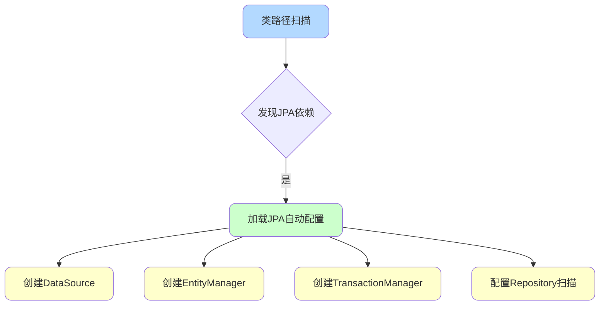
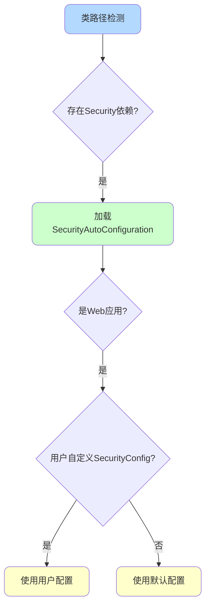
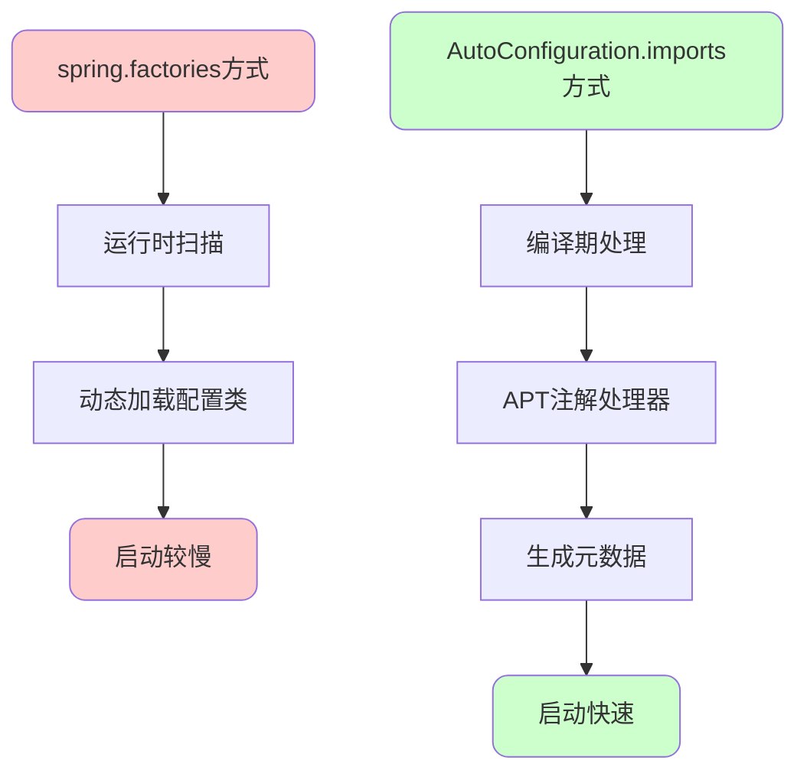
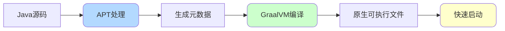
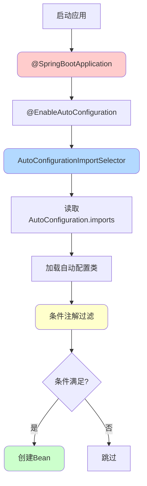

# SpringBoot自动配置原理深度剖析

## 自动配置的核心价值

### 传统Spring的配置困境

在SpringBoot出现之前,开发者需要面对大量繁琐的配置工作:

```java
// 需要手动配置数据源
@Bean
public DataSource dataSource() {
    DruidDataSource dataSource = new DruidDataSource();
    dataSource.setDriverClassName("com.mysql.cj.jdbc.Driver");
    dataSource.setUrl("jdbc:mysql://localhost:3306/shop");
    dataSource.setUsername("root");
    dataSource.setPassword("password");
    dataSource.setInitialSize(5);
    dataSource.setMaxActive(20);
    return dataSource;
}

// 需要手动配置事务管理器
@Bean
public PlatformTransactionManager transactionManager(DataSource dataSource) {
    return new DataSourceTransactionManager(dataSource);
}

// 需要手动配置JPA
@Bean
public LocalContainerEntityManagerFactoryBean entityManagerFactory(DataSource dataSource) {
    LocalContainerEntityManagerFactoryBean em = new LocalContainerEntityManagerFactoryBean();
    em.setDataSource(dataSource);
    em.setPackagesToScan("com.shop.entity");
    // 更多配置...
    return em;
}
```

### SpringBoot的自动配置

SpringBoot能够根据类路径中的依赖自动完成配置:

```java
// 只需添加依赖和简单配置
// pom.xml
<dependency>
    <groupId>org.springframework.boot</groupId>
    <artifactId>spring-boot-starter-data-jpa</artifactId>
</dependency>

// application.yml
spring:
  datasource:
    url: jdbc:mysql://localhost:3306/shop
    username: root
    password: password
```

SpringBoot会自动配置:
- 数据源(HikariCP)
- JPA实体管理器
- 事务管理器
- Repository扫描



## 自动配置实现原理

### @SpringBootApplication注解剖析

SpringBoot应用的入口类使用`@SpringBootApplication`注解:

```java
@SpringBootApplication
public class ShopApplication {
    public static void main(String[] args) {
        SpringApplication.run(ShopApplication.class, args);
    }
}
```

`@SpringBootApplication`是一个组合注解:

```java
@Target(ElementType.TYPE)
@Retention(RetentionPolicy.RUNTIME)
@Documented
@Inherited
@SpringBootConfiguration  // 标识配置类
@EnableAutoConfiguration  // 启用自动配置(核心)
@ComponentScan           // 组件扫描
public @interface SpringBootApplication {
    // ...
}
```

三个核心注解的作用:

- **@SpringBootConfiguration**:本质是`@Configuration`,标识这是一个配置类
- **@EnableAutoConfiguration**:启用自动配置机制(核心)
- **@ComponentScan**:扫描当前包及子包下的组件

### @EnableAutoConfiguration深度解析

这是自动配置的关键注解:

```java
@Target(ElementType.TYPE)
@Retention(RetentionPolicy.RUNTIME)
@Documented
@Inherited
@AutoConfigurationPackage
@Import(AutoConfigurationImportSelector.class)  // 核心
public @interface EnableAutoConfiguration {
    String ENABLED_OVERRIDE_PROPERTY = "spring.boot.enableautoconfiguration";
    
    Class<?>[] exclude() default {};
    String[] excludeName() default {};
}
```

通过`@Import`导入了`AutoConfigurationImportSelector`类,这是自动配置的核心实现。

### AutoConfigurationImportSelector工作机制

该类负责加载所有自动配置类:

```java
public class AutoConfigurationImportSelector implements DeferredImportSelector {
    
    protected List<String> getCandidateConfigurations(AnnotationMetadata metadata, 
                                                      AnnotationAttributes attributes) {
        // 使用SpringFactoriesLoader加载配置
        List<String> configurations = ImportCandidates
            .load(AutoConfiguration.class, getBeanClassLoader())
            .getCandidates();
            
        Assert.notEmpty(configurations, 
            "No auto configuration classes found in META-INF/spring/...");
        return configurations;
    }
}
```

```mermaid
graph TB
    A[@EnableAutoConfiguration] --> B[AutoConfigurationImportSelector]
    B --> C[读取配置文件]
    C --> D[META-INF/spring/org.springframework.boot.autoconfigure.AutoConfiguration.imports]
    D --> E[加载所有自动配置类]
    E --> F[应用条件注解过滤]
    F --> G[创建符合条件的Bean]
    
    style A fill:#ffcccc,rx:10,ry:10
    style B fill:#b3d9ff,rx:10,ry:10
    style D fill:#ffffcc,rx:10,ry:10
    style G fill:#ccffcc,rx:10,ry:10
```

### 配置文件格式演变

**SpringBoot 2.7之前**:使用`spring.factories`

```properties
# META-INF/spring.factories
org.springframework.boot.autoconfigure.EnableAutoConfiguration=\
org.springframework.boot.autoconfigure.jdbc.DataSourceAutoConfiguration,\
org.springframework.boot.autoconfigure.orm.jpa.HibernateJpaAutoConfiguration,\
org.springframework.boot.autoconfigure.transaction.TransactionAutoConfiguration
```

**SpringBoot 2.7及之后**:使用`AutoConfiguration.imports`

```
# META-INF/spring/org.springframework.boot.autoconfigure.AutoConfiguration.imports
org.springframework.boot.autoconfigure.jdbc.DataSourceAutoConfiguration
org.springframework.boot.autoconfigure.orm.jpa.HibernateJpaAutoConfiguration
org.springframework.boot.autoconfigure.transaction.TransactionAutoConfiguration
```

## 条件化配置机制

### @Conditional注解体系

自动配置的核心是条件化配置,只有满足特定条件才会创建Bean:

```java
@Configuration
@ConditionalOnClass(DataSource.class)  // 类路径存在DataSource
@ConditionalOnMissingBean(DataSource.class)  // 容器中没有DataSource
@EnableConfigurationProperties(DataSourceProperties.class)
public class DataSourceAutoConfiguration {
    
    @Bean
    @ConditionalOnProperty(name = "spring.datasource.type", havingValue = "com.zaxxer.hikari.HikariDataSource")
    public DataSource hikariDataSource(DataSourceProperties properties) {
        return properties.initializeDataSourceBuilder()
                .type(HikariDataSource.class)
                .build();
    }
}
```

### 常用条件注解

**类相关**:

```java
@ConditionalOnClass(RedisOperations.class)  // 类路径存在指定类
@ConditionalOnMissingClass("com.mongodb.MongoClient")  // 类路径不存在指定类
```

**Bean相关**:

```java
@ConditionalOnBean(DataSource.class)  // 容器中存在指定Bean
@ConditionalOnMissingBean(DataSource.class)  // 容器中不存在指定Bean
```

**属性相关**:

```java
@ConditionalOnProperty(
    prefix = "spring.redis",
    name = "enabled",
    havingValue = "true",
    matchIfMissing = true  // 属性不存在时也匹配
)
```

**Web环境相关**:

```java
@ConditionalOnWebApplication(type = Type.SERVLET)  // Servlet Web应用
@ConditionalOnNotWebApplication  // 非Web应用
```

### 自定义条件注解

实现自定义条件:

```java
public class OnCloudEnvironmentCondition implements Condition {
    
    @Override
    public boolean matches(ConditionContext context, AnnotatedTypeMetadata metadata) {
        Environment env = context.getEnvironment();
        return "cloud".equals(env.getProperty("deployment.env"));
    }
}

// 使用自定义条件
@Configuration
@Conditional(OnCloudEnvironmentCondition.class)
public class CloudConfiguration {
    
    @Bean
    public CloudService cloudService() {
        return new CloudServiceImpl();
    }
}
```

## 自动配置实战案例

### Spring Security自动配置

以Spring Security为例,看自动配置的完整流程:

```java
@Configuration
@ConditionalOnClass(WebSecurityConfigurerAdapter.class)
@ConditionalOnWebApplication(type = Type.SERVLET)
@EnableConfigurationProperties(SecurityProperties.class)
public class SecurityAutoConfiguration {
    
    @Configuration
    @ConditionalOnMissingBean(name = "springSecurityFilterChain")
    @ConditionalOnBean(WebSecurityConfigurerAdapter.class)
    @EnableWebSecurity
    static class WebSecurityEnablerConfiguration {
        // 自动启用Web Security
    }
}
```

工作流程:



**开发者需要做的**:

```java
@Configuration
public class CustomSecurityConfig extends WebSecurityConfigurerAdapter {
    
    @Override
    protected void configure(HttpSecurity http) throws Exception {
        http.authorizeRequests()
            .antMatchers("/public/**").permitAll()
            .anyRequest().authenticated();
    }
}
```

只需继承`WebSecurityConfigurerAdapter`,SpringBoot就会识别并应用这个配置。

### Redis自动配置

```java
@Configuration
@ConditionalOnClass(RedisOperations.class)
@EnableConfigurationProperties(RedisProperties.class)
public class RedisAutoConfiguration {
    
    @Bean
    @ConditionalOnMissingBean(name = "redisTemplate")
    public RedisTemplate<Object, Object> redisTemplate(
            RedisConnectionFactory connectionFactory) {
        RedisTemplate<Object, Object> template = new RedisTemplate<>();
        template.setConnectionFactory(connectionFactory);
        return template;
    }
    
    @Bean
    @ConditionalOnMissingBean
    public StringRedisTemplate stringRedisTemplate(
            RedisConnectionFactory connectionFactory) {
        return new StringRedisTemplate(connectionFactory);
    }
}
```

**开发者使用**:

```yaml
spring:
  redis:
    host: localhost
    port: 6379
    password: secret
```

```java
@Service
public class CacheService {
    @Autowired
    private StringRedisTemplate redisTemplate;
    
    public void cache(String key, String value) {
        redisTemplate.opsForValue().set(key, value);
    }
}
```

## 为什么移除spring.factories

### 云原生时代的需求

SpringBoot 3.0将自动配置从`spring.factories`迁移到`AutoConfiguration.imports`,根本原因是**云原生**的需求。

官方说明:

> Using spring.factories to find auto-configuration classes is causing problems with our native work. We want to offer an alternative in 2.7 and stop using spring.factories for auto-configuration in 3.0

### 编译期 vs 运行期

**spring.factories的问题**:

- 依赖**运行时**扫描和加载
- 对GraalVM原生镜像编译不友好
- 启动性能受影响

**AutoConfiguration.imports的优势**:

- 支持**编译期**确定配置类
- 减少运行时开销
- 更快的启动时间
- 更低的内存消耗



### APT注解处理器

新方式利用Java的**编译期注解处理器**(APT):

```java
@AutoConfiguration  // SpringBoot 2.7新增注解
@ConditionalOnClass(DataSource.class)
public class DataSourceAutoConfiguration {
    // ...
}
```

**Java注解处理方式对比**:

| 方式 | 时机 | 用途 | 典型应用 |
|------|------|------|----------|
| 运行时反射 | 运行期 | 动态查询注解信息 | Spring IoC、Hibernate ORM |
| APT | 编译期 | 生成代码或元数据 | Lombok、SpringBoot自动配置 |

### 云原生镜像编译

GraalVM原生镜像要求在编译期确定所有依赖:



**性能对比**:

| 指标 | 传统JVM应用 | 原生镜像应用 |
|------|------------|-------------|
| 启动时间 | 3-5秒 | 0.1-0.5秒 |
| 内存占用 | 200-500MB | 50-100MB |
| 打包大小 | 150MB+ | 50MB左右 |

## 自动配置排查与调试

### 查看生效的自动配置

**方式一:启用调试模式**

```yaml
debug: true
```

启动时会打印自动配置报告:

```
Positive matches:  # 生效的配置
-----------------
DataSourceAutoConfiguration matched:
  - @ConditionalOnClass found required classes 'javax.sql.DataSource'
  
Negative matches:  # 未生效的配置
-----------------
MongoAutoConfiguration:
  Did not match:
    - @ConditionalOnClass did not find required class 'com.mongodb.MongoClient'
```

**方式二:Actuator端点**

```xml
<dependency>
    <groupId>org.springframework.boot</groupId>
    <artifactId>spring-boot-starter-actuator</artifactId>
</dependency>
```

访问`/actuator/conditions`查看配置条件评估结果。

### 排除自动配置

**方式一:注解排除**

```java
@SpringBootApplication(exclude = {
    DataSourceAutoConfiguration.class,
    RedisAutoConfiguration.class
})
public class Application {
    // ...
}
```

**方式二:配置文件排除**

```yaml
spring:
  autoconfigure:
    exclude:
      - org.springframework.boot.autoconfigure.jdbc.DataSourceAutoConfiguration
      - org.springframework.boot.autoconfigure.data.redis.RedisAutoConfiguration
```

### 覆盖自动配置

自定义Bean会优先使用:

```java
@Configuration
public class CustomDataSourceConfig {
    
    @Bean
    public DataSource dataSource() {
        // 自定义数据源配置
        DruidDataSource dataSource = new DruidDataSource();
        // 详细配置...
        return dataSource;
    }
}
```

由于自动配置使用了`@ConditionalOnMissingBean`,检测到用户自定义Bean后,自动配置就不会生效。

## 总结

SpringBoot自动配置的核心机制:

1. **@EnableAutoConfiguration**:启动自动配置
2. **AutoConfigurationImportSelector**:加载配置类
3. **条件注解**:根据条件决定是否生效
4. **配置文件**:从`AutoConfiguration.imports`读取配置类
5. **APT处理**:编译期确定配置,支持云原生



这套机制让SpringBoot能够做到"开箱即用",同时保持高度的灵活性和可定制性。
