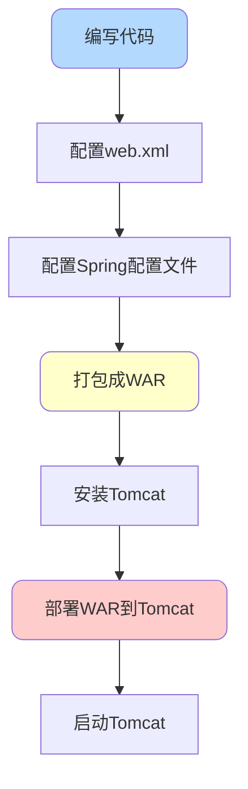
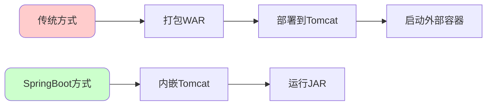
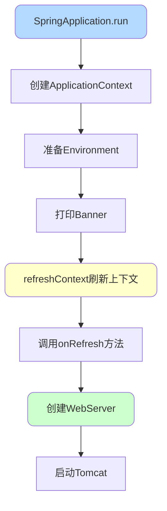
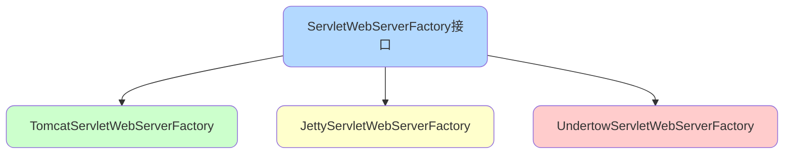
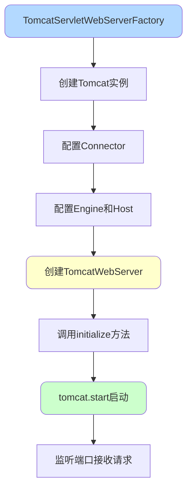
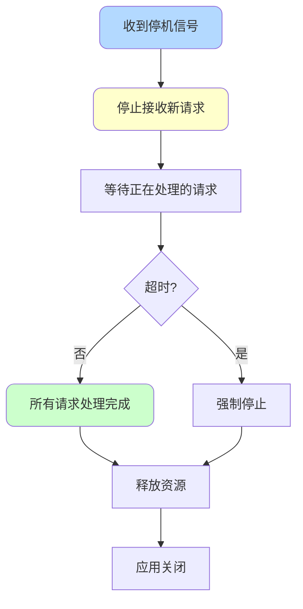
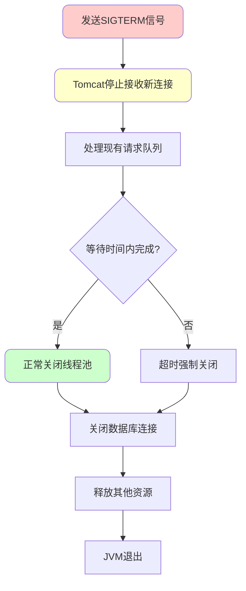
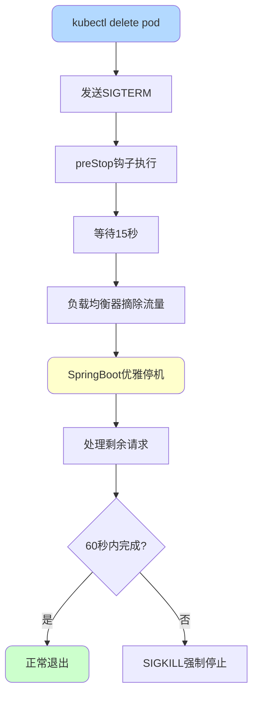

# SpringBoot启动与Web容器

## SpringBoot的main方法启动原理

### 传统Web项目的部署方式

在SpringBoot出现之前,Web项目的部署流程繁琐:



**web.xml配置示例**:

```xml
<web-app>
    <!-- 配置Spring DispatcherServlet -->
    <servlet>
        <servlet-name>dispatcher</servlet-name>
        <servlet-class>org.springframework.web.servlet.DispatcherServlet</servlet-class>
        <init-param>
            <param-name>contextConfigLocation</param-name>
            <param-value>/WEB-INF/spring-mvc.xml</param-value>
        </init-param>
        <load-on-startup>1</load-on-startup>
    </servlet>
    
    <servlet-mapping>
        <servlet-name>dispatcher</servlet-name>
        <url-pattern>/</url-pattern>
    </servlet-mapping>
</web-app>
```

### SpringBoot的启动方式

SpringBoot通过main方法直接启动Web应用:

```java
@SpringBootApplication
public class OrderServiceApplication {
    public static void main(String[] args) {
        SpringApplication.run(OrderServiceApplication.class, args);
    }
}
```

**启动流程对比**:



### SpringApplication.run()核心流程

**完整启动流程**:



### Web服务器创建过程

**关键调用链**:

```
SpringApplication.run()
  └── refreshContext()
      └── refresh()
          └── onRefresh()
              └── createWebServer()
```

**ServletWebServerApplicationContext.onRefresh()源码**:

```java
@Override
protected void onRefresh() {
    super.onRefresh();
    try {
        createWebServer();  // 创建Web服务器
    } catch (Throwable ex) {
        throw new ApplicationContextException("Unable to start web server", ex);
    }
}

private void createWebServer() {
    WebServer webServer = this.webServer;
    ServletContext servletContext = getServletContext();
    
    if (webServer == null && servletContext == null) {
        // 获取Web服务器工厂
        ServletWebServerFactory factory = getWebServerFactory();
        
        // 创建Web服务器
        this.webServer = factory.getWebServer(getSelfInitializer());
        
        // 注册优雅停机Bean
        getBeanFactory().registerSingleton("webServerGracefulShutdown",
                new WebServerGracefulShutdownLifecycle(this.webServer));
        getBeanFactory().registerSingleton("webServerStartStop",
                new WebServerStartStopLifecycle(this, this.webServer));
    }
    
    initPropertySources();
}
```

### ServletWebServerFactory实现

SpringBoot支持三种Web服务器工厂:



**TomcatServletWebServerFactory.getWebServer()源码**:

```java
@Override
public WebServer getWebServer(ServletContextInitializer... initializers) {
    // 禁用MBean注册(如果配置)
    if (this.disableMBeanRegistry) {
        Registry.disableRegistry();
    }
    
    // 创建Tomcat实例
    Tomcat tomcat = new Tomcat();
    
    // 设置基础目录
    File baseDir = (this.baseDirectory != null) 
        ? this.baseDirectory 
        : createTempDir("tomcat");
    tomcat.setBaseDir(baseDir.getAbsolutePath());
    
    // 添加生命周期监听器
    for (LifecycleListener listener : this.serverLifecycleListeners) {
        tomcat.getServer().addLifecycleListener(listener);
    }
    
    // 创建连接器
    Connector connector = new Connector(this.protocol);
    connector.setThrowOnFailure(true);
    tomcat.getService().addConnector(connector);
    customizeConnector(connector);
    tomcat.setConnector(connector);
    
    // 配置Host
    tomcat.getHost().setAutoDeploy(false);
    configureEngine(tomcat.getEngine());
    
    // 准备上下文
    prepareContext(tomcat.getHost(), initializers);
    
    // 返回TomcatWebServer
    return getTomcatWebServer(tomcat);
}
```

### Tomcat启动过程

**TomcatWebServer构造器**:

```java
public TomcatWebServer(Tomcat tomcat, boolean autoStart, Shutdown shutdown) {
    Assert.notNull(tomcat, "Tomcat Server must not be null");
    this.tomcat = tomcat;
    this.autoStart = autoStart;
    this.gracefulShutdown = (shutdown == Shutdown.GRACEFUL) 
        ? new GracefulShutdown(tomcat) 
        : null;
    initialize();  // 初始化并启动Tomcat
}

private void initialize() throws WebServerException {
    logger.info("Tomcat initialized with port(s): " + getPortsDescription(false));
    synchronized (this.monitor) {
        try {
            // 启动Tomcat服务器
            this.tomcat.start();
            
            // 设置连接器
            Context context = findContext();
            context.addLifecycleListener((event) -> {
                if (context.equals(event.getSource()) 
                    && Lifecycle.START_EVENT.equals(event.getType())) {
                    removeServiceConnectors();
                }
            });
            
            // 启动异步线程保持服务器运行
            this.tomcat.getServer().await();
        } catch (Exception ex) {
            throw new WebServerException("Unable to start embedded Tomcat", ex);
        }
    }
}
```

**启动流程图**:



### 访问应用

启动后即可通过浏览器访问:

```
http://localhost:8080
```

**完整流程总结**:

```java
// 1. 启动入口
SpringApplication.run(OrderServiceApplication.class, args);

// 2. 刷新上下文
refreshContext(context);

// 3. 调用onRefresh
context.onRefresh();

// 4. 创建WebServer
createWebServer();

// 5. 获取工厂并创建服务器
ServletWebServerFactory factory = getWebServerFactory();
this.webServer = factory.getWebServer(getSelfInitializer());

// 6. TomcatServletWebServerFactory创建Tomcat
Tomcat tomcat = new Tomcat();
// 配置Tomcat...
return new TomcatWebServer(tomcat, autoStart, shutdown);

// 7. 初始化并启动Tomcat
initialize();
tomcat.start();
```

## 切换内嵌Web服务器

### 默认Tomcat配置

```xml
<dependency>
    <groupId>org.springframework.boot</groupId>
    <artifactId>spring-boot-starter-web</artifactId>
    <!-- 默认包含spring-boot-starter-tomcat -->
</dependency>
```

### 切换到Undertow

```xml
<dependency>
    <groupId>org.springframework.boot</groupId>
    <artifactId>spring-boot-starter-web</artifactId>
    <exclusions>
        <!-- 排除默认的Tomcat -->
        <exclusion>
            <groupId>org.springframework.boot</groupId>
            <artifactId>spring-boot-starter-tomcat</artifactId>
        </exclusion>
    </exclusions>
</dependency>

<!-- 引入Undertow -->
<dependency>
    <groupId>org.springframework.boot</groupId>
    <artifactId>spring-boot-starter-undertow</artifactId>
</dependency>
```

### 切换到Jetty

```xml
<dependency>
    <groupId>org.springframework.boot</groupId>
    <artifactId>spring-boot-starter-web</artifactId>
    <exclusions>
        <exclusion>
            <groupId>org.springframework.boot</groupId>
            <artifactId>spring-boot-starter-tomcat</artifactId>
        </exclusion>
    </exclusions>
</dependency>

<dependency>
    <groupId>org.springframework.boot</groupId>
    <artifactId>spring-boot-starter-jetty</artifactId>
</dependency>
```

### 服务器配置

**通用配置**:

```yaml
server:
  port: 9090  # 修改端口
  servlet:
    context-path: /api  # 上下文路径
  compression:
    enabled: true  # 启用压缩
```

**Tomcat特定配置**:

```yaml
server:
  tomcat:
    max-threads: 200  # 最大线程数
    max-connections: 10000  # 最大连接数
    accept-count: 100  # 等待队列长度
```

**Undertow特定配置**:

```yaml
server:
  undertow:
    io-threads: 16  # IO线程数
    worker-threads: 256  # 工作线程数
    buffer-size: 1024  # 缓冲区大小
```

## SpringBoot优雅停机

### 什么是优雅停机

优雅停机是指以受控方式终止应用,允许完成正在进行的任务,释放资源,确保数据完整性。



**对比**:

| 停机方式 | 正在处理的请求 | 数据完整性 | 用户体验 |
|---------|-------------|-----------|---------|
| 直接停止 | 立即中断 | 可能损坏 | 报错 |
| 优雅停机 | 等待完成 | 保证完整 | 平滑 |

### 启用优雅停机

**SpringBoot 2.3+内置支持**:

```yaml
server:
  shutdown: graceful  # 启用优雅停机
```

**配置超时时间**:

```yaml
spring:
  lifecycle:
    timeout-per-shutdown-phase: 2m  # 等待2分钟
```

默认等待时间是30秒,可根据业务需要调整。

### 工作原理

**停机流程**:



**代码示例**:

```java
@RestController
public class OrderController {
    
    @GetMapping("/orders/{id}")
    public Order getOrder(@PathVariable Long id) {
        // 假设这个请求需要5秒处理
        Thread.sleep(5000);
        return orderService.findById(id);
    }
}
```

**停机测试**:

1. 启动应用
2. 发起耗时请求
3. 立即执行停机命令
4. 观察请求是否等待完成

```bash
# Linux/Mac停机
kill -15 <pid>

# Windows停机
taskkill /PID <pid>
```

### 使用Actuator实现优雅停机

**添加依赖**:

```xml
<dependency>
    <groupId>org.springframework.boot</groupId>
    <artifactId>spring-boot-starter-actuator</artifactId>
</dependency>
```

**配置**:

```yaml
management:
  endpoints:
    web:
      exposure:
        include: "*"  # 暴露所有端点
  endpoint:
    shutdown:
      enabled: true  # 启用shutdown端点

server:
  shutdown: graceful
```

**通过HTTP触发停机**:

```bash
curl -X POST http://localhost:8080/actuator/shutdown
```

**响应**:

```json
{
    "message": "Shutting down, bye..."
}
```

### 自定义停机逻辑

实现`DisposableBean`或使用`@PreDestroy`:

```java
@Component
public class ResourceCleanup implements DisposableBean {
    
    private static final Logger logger = LoggerFactory.getLogger(ResourceCleanup.class);
    
    @Override
    public void destroy() throws Exception {
        logger.info("开始清理资源...");
        
        // 关闭线程池
        executorService.shutdown();
        executorService.awaitTermination(30, TimeUnit.SECONDS);
        
        // 清理缓存
        cacheManager.clear();
        
        // 保存未完成的任务
        taskRepository.saveAll(pendingTasks);
        
        logger.info("资源清理完成");
    }
}

// 或使用注解方式
@Component
public class CacheCleanup {
    
    @PreDestroy
    public void cleanup() {
        logger.info("清理缓存...");
        cache.invalidateAll();
    }
}
```

### 生产环境最佳实践

**配置建议**:

```yaml
server:
  shutdown: graceful
  
spring:
  lifecycle:
    timeout-per-shutdown-phase: 60s  # 根据最长请求时间设置

management:
  endpoint:
    shutdown:
      enabled: true
  endpoints:
    web:
      base-path: /actuator
      exposure:
        include: health,info,shutdown
  server:
    port: 9090  # 管理端口与应用端口分离
```

**部署脚本示例**:

```bash
#!/bin/bash

# 滚动发布脚本
APP_NAME="order-service"
PID=$(pgrep -f $APP_NAME)

if [ -n "$PID" ]; then
    echo "优雅停止应用..."
    curl -X POST http://localhost:9090/actuator/shutdown
    
    # 等待应用关闭
    sleep 60
    
    # 检查是否还在运行
    if pgrep -f $APP_NAME > /dev/null; then
        echo "强制停止应用"
        kill -9 $PID
    fi
fi

echo "启动新版本..."
nohup java -jar $APP_NAME-new.jar &
```

### Kubernetes环境配置

**配置探针**:

```yaml
apiVersion: v1
kind: Pod
metadata:
  name: order-service
spec:
  containers:
  - name: app
    image: order-service:latest
    lifecycle:
      preStop:
        exec:
          command: ["/bin/sh", "-c", "sleep 15"]  # 给负载均衡器摘流量时间
    livenessProbe:
      httpGet:
        path: /actuator/health
        port: 8080
      initialDelaySeconds: 30
      periodSeconds: 10
    readinessProbe:
      httpGet:
        path: /actuator/health
        port: 8080
      initialDelaySeconds: 10
      periodSeconds: 5
    terminationGracePeriodSeconds: 60  # 优雅停机时间
```

**停机流程**:



## 总结

SpringBoot的Web容器启动和优雅停机机制:

**启动流程**:
1. main方法调用`SpringApplication.run()`
2. 刷新上下文触发`onRefresh()`
3. 创建`ServletWebServerFactory`
4. 初始化并启动内嵌Tomcat
5. 监听端口接收请求

**优雅停机**:
1. 配置`server.shutdown=graceful`
2. 收到停机信号后停止接收新请求
3. 等待现有请求处理完成
4. 执行资源清理逻辑
5. 关闭应用

这两个机制让SpringBoot应用既能快速启动,又能平滑停止,是生产环境部署的重要保障。
