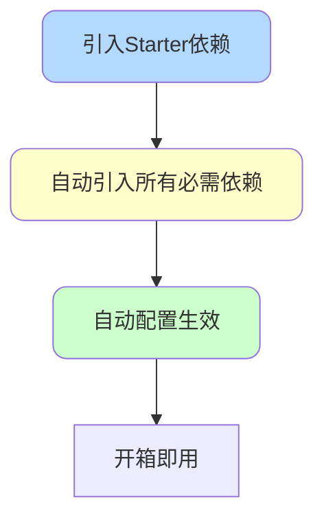
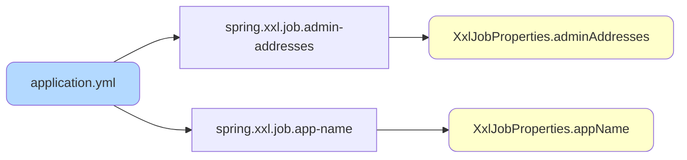
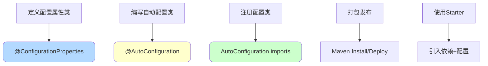

# SpringBoot自定义Starter开发

## Starter的设计理念

### 什么是Starter

Starter是SpringBoot提供的一种**依赖聚合**机制,将某个功能所需的所有依赖、配置和自动装配逻辑打包成一个独立模块,让其他项目能够通过引入一个依赖快速集成该功能。



### 官方Starter示例

**spring-boot-starter-data-redis**包含:

- Redis客户端(Lettuce/Jedis)
- Spring Data Redis
- 连接池配置
- 序列化器配置
- 自动配置类

**开发者只需**:

```xml
<dependency>
    <groupId>org.springframework.boot</groupId>
    <artifactId>spring-boot-starter-data-redis</artifactId>
</dependency>
```

```yaml
spring:
  redis:
    host: localhost
    port: 6379
```

### 自定义Starter的价值

**统一技术栈**:公司内部多个项目使用相同的技术组件时,封装成Starter可以:

- 避免重复配置
- 统一版本管理
- 简化新项目接入
- 便于技术升级

**典型应用场景**:

- 分布式任务调度(XXL-Job、ElasticJob)
- 链路追踪(SkyWalking、Zipkin)
- 消息队列(RocketMQ、Kafka)
- 对象存储(OSS、MinIO)
- 短信服务、支付网关等

## 自定义Starter开发实战

### 项目结构

创建独立Maven项目:

```
xxl-job-spring-boot-starter/
├── pom.xml
└── src/
    └── main/
        ├── java/
        │   └── com/company/starter/xxljob/
        │       ├── config/
        │       │   └── XxlJobAutoConfiguration.java
        │       └── properties/
        │           └── XxlJobProperties.java
        └── resources/
            └── META-INF/
                └── spring/
                    └── org.springframework.boot.autoconfigure.AutoConfiguration.imports
```

### 步骤一:定义配置属性类

使用`@ConfigurationProperties`绑定配置:

```java
package com.company.starter.xxljob.properties;

import org.springframework.boot.context.properties.ConfigurationProperties;

/**
 * XXL-Job配置属性
 */
@ConfigurationProperties(prefix = XxlJobProperties.PREFIX)
public class XxlJobProperties {

    public static final String PREFIX = "spring.xxl.job";

    /**
     * 是否启用XXL-Job
     */
    private boolean enabled = true;

    /**
     * 调度中心地址
     */
    private String adminAddresses;

    /**
     * 访问令牌
     */
    private String accessToken;

    /**
     * 执行器AppName
     */
    private String appName;

    /**
     * 执行器IP(可选)
     */
    private String ip;

    /**
     * 执行器端口(默认9999)
     */
    private int port = 9999;

    /**
     * 日志存储路径
     */
    private String logPath = "/data/applogs/xxl-job";

    /**
     * 日志保留天数(默认30天)
     */
    private int logRetentionDays = 30;

    // Getter和Setter方法
    public boolean isEnabled() {
        return enabled;
    }

    public void setEnabled(boolean enabled) {
        this.enabled = enabled;
    }

    public String getAdminAddresses() {
        return adminAddresses;
    }

    public void setAdminAddresses(String adminAddresses) {
        this.adminAddresses = adminAddresses;
    }

    public String getAccessToken() {
        return accessToken;
    }

    public void setAccessToken(String accessToken) {
        this.accessToken = accessToken;
    }

    public String getAppName() {
        return appName;
    }

    public void setAppName(String appName) {
        this.appName = appName;
    }

    public String getIp() {
        return ip;
    }

    public void setIp(String ip) {
        this.ip = ip;
    }

    public int getPort() {
        return port;
    }

    public void setPort(int port) {
        this.port = port;
    }

    public String getLogPath() {
        return logPath;
    }

    public void setLogPath(String logPath) {
        this.logPath = logPath;
    }

    public int getLogRetentionDays() {
        return logRetentionDays;
    }

    public void setLogRetentionDays(int logRetentionDays) {
        this.logRetentionDays = logRetentionDays;
    }
}
```

**配置映射关系**:



### 步骤二:编写自动配置类

```java
package com.company.starter.xxljob.config;

import com.company.starter.xxljob.properties.XxlJobProperties;
import com.xxl.job.core.executor.impl.XxlJobSpringExecutor;
import org.slf4j.Logger;
import org.slf4j.LoggerFactory;
import org.springframework.boot.autoconfigure.AutoConfiguration;
import org.springframework.boot.autoconfigure.condition.ConditionalOnMissingBean;
import org.springframework.boot.autoconfigure.condition.ConditionalOnProperty;
import org.springframework.boot.context.properties.EnableConfigurationProperties;
import org.springframework.context.annotation.Bean;

/**
 * XXL-Job自动配置类
 */
@AutoConfiguration  // SpringBoot 2.7+推荐使用
@EnableConfigurationProperties(XxlJobProperties.class)  // 启用配置属性
public class XxlJobAutoConfiguration {

    private static final Logger logger = LoggerFactory.getLogger(XxlJobAutoConfiguration.class);

    /**
     * 创建XXL-Job执行器Bean
     */
    @Bean
    @ConditionalOnMissingBean  // 容器中不存在时才创建
    @ConditionalOnProperty(
        prefix = XxlJobProperties.PREFIX,
        name = "enabled",
        havingValue = "true",
        matchIfMissing = true  // 未配置时默认启用
    )
    public XxlJobSpringExecutor xxlJobExecutor(XxlJobProperties properties) {
        logger.info("初始化XXL-Job执行器, AppName: {}", properties.getAppName());
        
        XxlJobSpringExecutor executor = new XxlJobSpringExecutor();
        
        // 设置调度中心地址
        executor.setAdminAddresses(properties.getAdminAddresses());
        
        // 设置执行器信息
        executor.setAppname(properties.getAppName());
        executor.setIp(properties.getIp());
        executor.setPort(properties.getPort());
        
        // 设置访问令牌
        executor.setAccessToken(properties.getAccessToken());
        
        // 设置日志配置
        executor.setLogPath(properties.getLogPath());
        executor.setLogRetentionDays(properties.getLogRetentionDays());
        
        return executor;
    }
}
```

**核心注解说明**:

| 注解 | 作用 |
|------|------|
| `@AutoConfiguration` | 标识自动配置类(SpringBoot 2.7+) |
| `@EnableConfigurationProperties` | 启用配置属性类 |
| `@ConditionalOnMissingBean` | 容器中不存在该Bean时才创建 |
| `@ConditionalOnProperty` | 指定属性满足条件时才生效 |

### 步骤三:注册自动配置类

**SpringBoot 2.7之前**:使用`spring.factories`

```properties
# META-INF/spring.factories
org.springframework.boot.autoconfigure.EnableAutoConfiguration=\
com.company.starter.xxljob.config.XxlJobAutoConfiguration
```

**SpringBoot 2.7及之后**(推荐):使用`AutoConfiguration.imports`

```
# META-INF/spring/org.springframework.boot.autoconfigure.AutoConfiguration.imports
com.company.starter.xxljob.config.XxlJobAutoConfiguration
```

**配置文件位置**:

```
src/main/resources/
└── META-INF/
    └── spring/
        └── org.springframework.boot.autoconfigure.AutoConfiguration.imports
```

### 步骤四:配置项目依赖

**pom.xml**:

```xml
<?xml version="1.0" encoding="UTF-8"?>
<project xmlns="http://maven.apache.org/POM/4.0.0"
         xmlns:xsi="http://www.w3.org/2001/XMLSchema-instance"
         xsi:schemaLocation="http://maven.apache.org/POM/4.0.0 
         http://maven.apache.org/xsd/maven-4.0.0.xsd">
    <modelVersion>4.0.0</modelVersion>

    <groupId>com.company</groupId>
    <artifactId>xxl-job-spring-boot-starter</artifactId>
    <version>1.0.0</version>

    <dependencies>
        <!-- SpringBoot核心依赖 -->
        <dependency>
            <groupId>org.springframework.boot</groupId>
            <artifactId>spring-boot-starter</artifactId>
            <version>2.7.0</version>
        </dependency>

        <!-- XXL-Job核心依赖 -->
        <dependency>
            <groupId>com.xuxueli</groupId>
            <artifactId>xxl-job-core</artifactId>
            <version>2.4.0</version>
        </dependency>

        <!-- 配置处理器(生成配置元数据) -->
        <dependency>
            <groupId>org.springframework.boot</groupId>
            <artifactId>spring-boot-configuration-processor</artifactId>
            <version>2.7.0</version>
            <optional>true</optional>
        </dependency>
    </dependencies>
</project>
```

### 步骤五:打包发布

```bash
mvn clean install
```

发布到私服:

```xml
<distributionManagement>
    <repository>
        <id>company-releases</id>
        <url>http://nexus.company.com/repository/maven-releases/</url>
    </repository>
</distributionManagement>
```

```bash
mvn clean deploy
```

## 使用自定义Starter

### 引入依赖

```xml
<dependency>
    <groupId>com.company</groupId>
    <artifactId>xxl-job-spring-boot-starter</artifactId>
    <version>1.0.0</version>
</dependency>
```

### 配置文件

```yaml
spring:
  xxl:
    job:
      enabled: true
      admin-addresses: http://localhost:8080/xxl-job-admin
      access-token: default_token
      app-name: order-service
      port: 9999
      log-path: /data/logs/xxl-job
      log-retention-days: 7
```

### 编写任务处理器

```java
package com.company.order.job;

import com.xxl.job.core.handler.annotation.XxlJob;
import org.springframework.stereotype.Component;

@Component
public class OrderJobHandler {
    
    /**
     * 订单超时取消任务
     */
    @XxlJob("orderTimeoutCancelJob")
    public void handleTimeoutOrder() {
        System.out.println("执行订单超时取消任务...");
        // 业务逻辑
    }
    
    /**
     * 订单数据统计任务
     */
    @XxlJob("orderStatisticsJob")
    public void handleStatistics() {
        System.out.println("执行订单统计任务...");
        // 业务逻辑
    }
}
```

### 启动应用

```java
@SpringBootApplication
public class OrderServiceApplication {
    public static void main(String[] args) {
        SpringApplication.run(OrderServiceApplication.class, args);
    }
}
```

启动日志:

```
初始化XXL-Job执行器, AppName: order-service
XXL-Job执行器注册成功, 调度中心: http://localhost:8080/xxl-job-admin
```

## 高级特性

### 条件化配置

**场景**:开发环境禁用XXL-Job

```java
@Bean
@ConditionalOnMissingBean
@ConditionalOnProperty(
    prefix = XxlJobProperties.PREFIX,
    name = "enabled",
    havingValue = "true"
)
@Profile("!dev")  // 非开发环境才生效
public XxlJobSpringExecutor xxlJobExecutor(XxlJobProperties properties) {
    // ...
}
```

### 配置元数据

添加`spring-boot-configuration-processor`后,IDE会提供配置提示:

```json
{
  "properties": [
    {
      "name": "spring.xxl.job.admin-addresses",
      "type": "java.lang.String",
      "description": "XXL-Job调度中心地址,多个用逗号分隔",
      "defaultValue": null
    },
    {
      "name": "spring.xxl.job.enabled",
      "type": "java.lang.Boolean",
      "description": "是否启用XXL-Job",
      "defaultValue": true
    }
  ]
}
```

### 支持多环境配置

```yaml
# application-dev.yml
spring:
  xxl:
    job:
      enabled: false  # 开发环境禁用

# application-prod.yml
spring:
  xxl:
    job:
      enabled: true
      admin-addresses: http://prod-xxl-job:8080/xxl-job-admin
```

### 提供默认值

```java
@ConfigurationProperties(prefix = "spring.xxl.job")
public class XxlJobProperties {
    
    private boolean enabled = true;  // 默认启用
    
    private int port = 9999;  // 默认端口
    
    private String logPath = System.getProperty("user.home") + "/logs/xxl-job";  // 默认路径
}
```

## Starter开发最佳实践

### 命名规范

**官方Starter**:`spring-boot-starter-{name}`

**第三方Starter**:`{name}-spring-boot-starter`

示例:
- ✅ `mybatis-spring-boot-starter`
- ✅ `druid-spring-boot-starter`
- ❌ `spring-boot-starter-myproject`(不推荐)

### 依赖管理

**使用optional依赖**:

```xml
<dependency>
    <groupId>org.springframework.boot</groupId>
    <artifactId>spring-boot-configuration-processor</artifactId>
    <optional>true</optional>  <!-- 标记为可选 -->
</dependency>
```

**避免传递依赖冲突**:

```xml
<dependency>
    <groupId>com.alibaba</groupId>
    <artifactId>druid</artifactId>
    <version>1.2.8</version>
    <exclusions>
        <exclusion>
            <groupId>com.alibaba</groupId>
            <artifactId>jconsole</artifactId>
        </exclusion>
    </exclusions>
</dependency>
```

### 提供禁用开关

```java
@ConditionalOnProperty(
    prefix = "spring.xxl.job",
    name = "enabled",
    havingValue = "true",
    matchIfMissing = true  // 默认启用,允许用户配置false禁用
)
```

### 日志规范

```java
private static final Logger logger = LoggerFactory.getLogger(XxlJobAutoConfiguration.class);

logger.info("初始化XXL-Job执行器, AppName: {}", properties.getAppName());
logger.debug("XXL-Job配置详情: {}", properties);
```

### 文档与示例

提供完整的README.md:

````markdown
# XXL-Job SpringBoot Starter

## 快速开始

### 1. 添加依赖

```xml
<dependency>
    <groupId>com.company</groupId>
    <artifactId>xxl-job-spring-boot-starter</artifactId>
    <version>1.0.0</version>
</dependency>
```

### 2. 配置

```yaml
spring:
  xxl:
    job:
      admin-addresses: http://localhost:8080/xxl-job-admin
      app-name: demo-service
```

### 3. 编写任务

```java
@Component
public class DemoJobHandler {
    @XxlJob("demoJob")
    public void execute() {
        // 业务逻辑
    }
}
```

## 配置说明

| 配置项 | 说明 | 默认值 |
|--------|------|--------|
| spring.xxl.job.enabled | 是否启用 | true |
| spring.xxl.job.admin-addresses | 调度中心地址 | 无 |
````

## 总结

自定义Starter开发的核心步骤:



通过封装Starter,可以极大简化技术组件的集成工作,提升团队开发效率。
