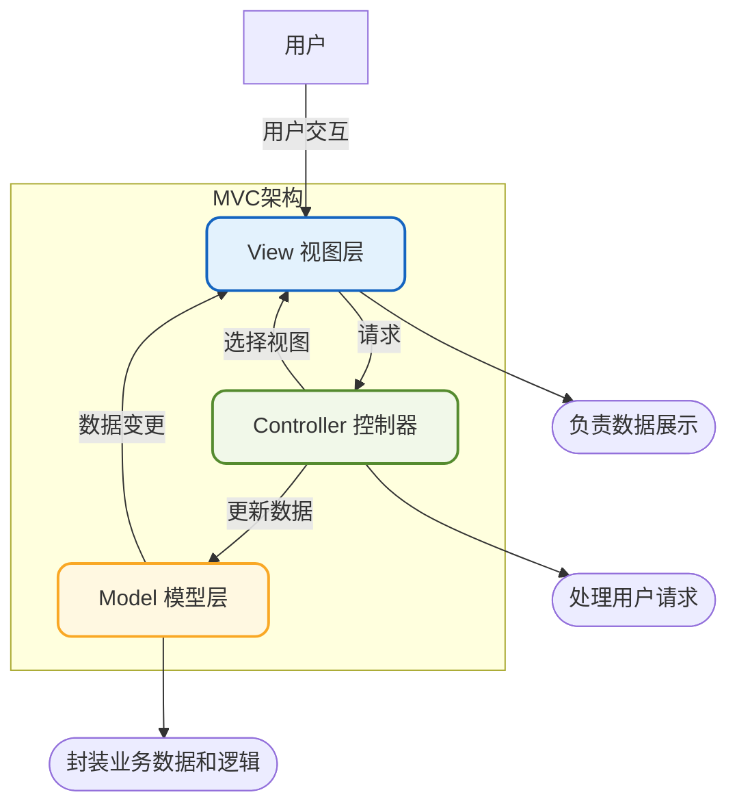
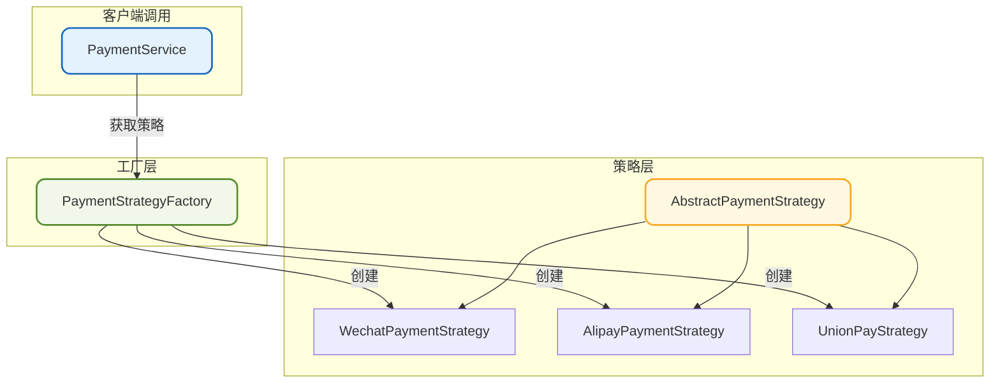

import PaidCTA from '@site/src/components/PaidCTA';

# MVC架构模式与设计模式实战

## MVC架构模式

MVC（Model-View-Controller）是一种经典的软件架构模式，它将应用程序划分为三个核心部分：模型、视图和控制器。这种分离使得应用程序的表现层与业务逻辑解耦，极大地提升了代码的可维护性和可测试性。

### MVC三层架构



### 各层职责

**模型层（Model）**

模型层代表应用程序的核心数据和业务逻辑。它包含数据结构、业务规则以及数据的存储和检索逻辑。模型层不关心数据如何展示，只专注于数据本身及其处理规则。

```java
// 模型层示例：用户领域模型
public class User {
    private Long id;
    private String username;
    private String email;
    private UserStatus status;
    
    // 业务方法
    public void activate() {
        if (this.status == UserStatus.PENDING) {
            this.status = UserStatus.ACTIVE;
        } else {
            throw new IllegalStateException("只有待激活用户才能激活");
        }
    }
    
    public void deactivate() {
        if (this.status == UserStatus.ACTIVE) {
            this.status = UserStatus.INACTIVE;
        }
    }
    
    // getters and setters
}
```

**视图层（View）**

视图层负责数据的可视化呈现。它从模型获取数据并以用户友好的方式展示，同时接收用户的输入操作。视图层不包含业务逻辑，只负责展示和交互。

```java
// 视图层示例：用户信息展示（以JSON响应为例）
public class UserVO {
    private Long id;
    private String displayName;
    private String email;
    private String statusText;
    
    public static UserVO fromUser(User user) {
        UserVO vo = new UserVO();
        vo.setId(user.getId());
        vo.setDisplayName(user.getUsername());
        vo.setEmail(maskEmail(user.getEmail()));
        vo.setStatusText(user.getStatus().getDescription());
        return vo;
    }
    
    private static String maskEmail(String email) {
        // 邮箱脱敏处理
        if (email == null || !email.contains("@")) {
            return email;
        }
        int atIndex = email.indexOf("@");
        return email.substring(0, Math.min(3, atIndex)) + "***" + email.substring(atIndex);
    }
}
```

**控制器层（Controller）**

控制器层作为模型和视图之间的协调者，接收用户输入，调用模型进行业务处理，并选择合适的视图返回结果。控制器负责请求的路由和流程控制。

```java
// 控制器层示例
@RestController
@RequestMapping("/api/users")
public class UserController {
    
    @Autowired
    private UserService userService;
    
    @GetMapping("/{id}")
    public ResponseEntity<UserVO> getUser(@PathVariable Long id) {
        User user = userService.findById(id);
        if (user == null) {
            return ResponseEntity.notFound().build();
        }
        return ResponseEntity.ok(UserVO.fromUser(user));
    }
    
    @PostMapping("/{id}/activate")
    public ResponseEntity<Void> activateUser(@PathVariable Long id) {
        userService.activateUser(id);
        return ResponseEntity.ok().build();
    }
}
```

### MVC的核心价值

1. **关注点分离**：将展示、控制和数据分离，每层只专注于自己的职责
2. **提升可维护性**：修改一层不会影响其他层，降低维护成本
3. **促进团队协作**：前端和后端可以并行开发，互不干扰
4. **增强可测试性**：各层可以独立进行单元测试
5. **支持代码复用**：模型和视图可以在多个控制器中复用

## 设计模式组合实战

在实际项目中，我们很少单独使用某一种设计模式，而是将多种模式组合使用，发挥各自的优势。下面通过一个完整的支付系统案例，展示如何综合运用策略模式、工厂模式和模板方法模式。

### 场景分析

假设我们需要开发一个支付系统，需要支持多种支付渠道（微信、支付宝、银联等），每种渠道的支付流程大致相同，但具体实现不同。

### 整体架构设计



### 代码实现

**定义支付请求和响应**

```java
// 支付请求
public class PaymentRequest {
    private String orderId;
    private BigDecimal amount;
    private String payChannel;    // wechat, alipay, unionpay
    private String userId;
    private Map<String, String> extraParams;
    
    // getters and setters
}

// 支付响应
public class PaymentResult {
    private boolean success;
    private String transactionId;
    private String message;
    private String payUrl;        // 支付跳转链接或二维码
    
    public static PaymentResult success(String transactionId, String payUrl) {
        PaymentResult result = new PaymentResult();
        result.setSuccess(true);
        result.setTransactionId(transactionId);
        result.setPayUrl(payUrl);
        return result;
    }
    
    public static PaymentResult fail(String message) {
        PaymentResult result = new PaymentResult();
        result.setSuccess(false);
        result.setMessage(message);
        return result;
    }
    
    // getters and setters
}
```

**定义策略接口和模板抽象类**

<PaidCTA />