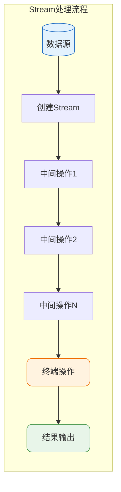
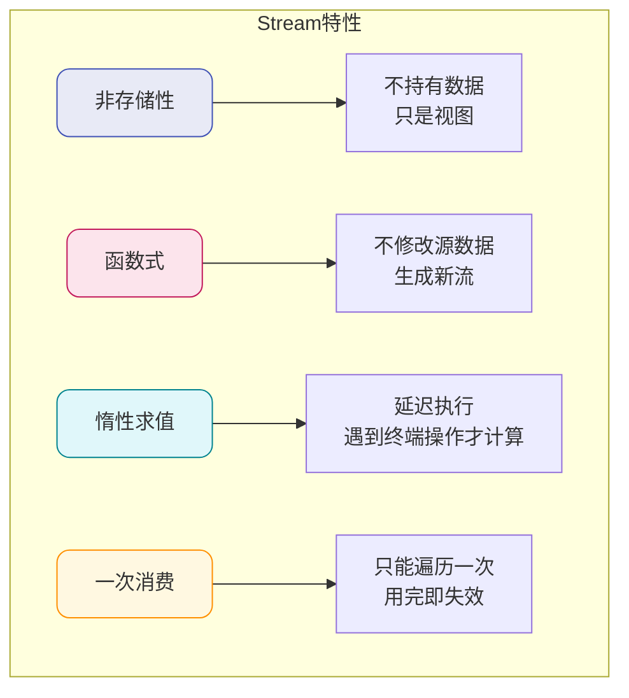
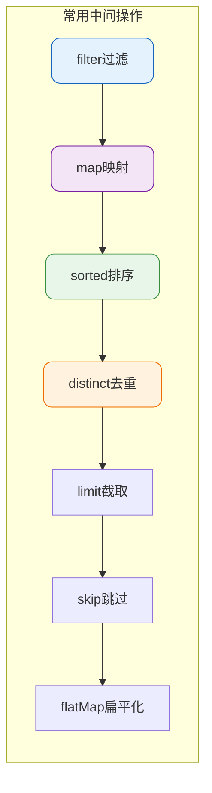
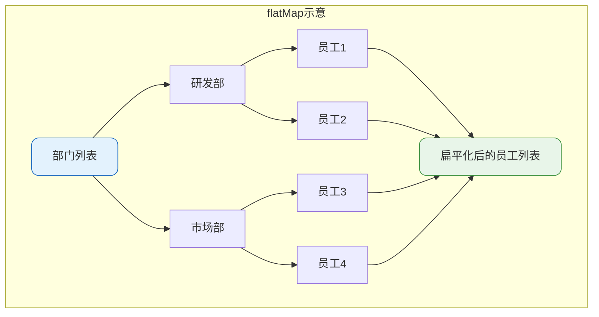
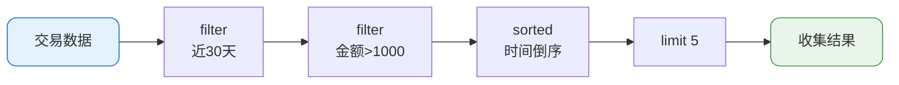
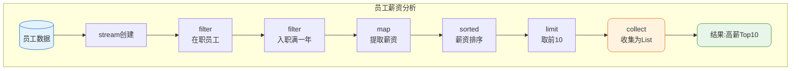

# Stream API核心操作详解

## Stream概述

Stream API是Java 8引入的用于处理集合数据的高级抽象。它提供了一种声明式的数据处理方式，类似于SQL语句对数据库的查询操作，让开发者能够专注于"做什么"而非"怎么做"。

Stream可以被理解为数据管道：数据从源头流入，经过一系列中间处理节点（过滤、转换、排序等），最终产生结果输出。



## Stream的核心特性

### 非存储性

Stream本身不存储数据，它只是数据源的一个视图。数据源可以是集合、数组、I/O通道或生成器函数。

### 函数式风格

对Stream的任何操作都不会改变原始数据源。例如，过滤操作不会删除原集合中的元素，而是生成一个不包含被过滤元素的新Stream。

### 惰性求值

Stream的中间操作是延迟执行的，只有遇到终端操作时才会真正执行所有操作。这种机制可以实现高效的短路求值。

### 一次性消费

Stream只能被遍历一次，遍历完成后Stream即失效。如需再次操作，必须从数据源重新创建Stream。



## 创建Stream的多种方式

### 从集合创建

最常用的方式是通过集合的`stream()`方法创建：

```java
// 员工数据列表
List<Employee> employees = Arrays.asList(
    new Employee("张三", 28, 15000),
    new Employee("李四", 32, 22000),
    new Employee("王五", 25, 12000)
);

// 创建串行流
Stream<Employee> stream = employees.stream();

// 创建并行流
Stream<Employee> parallelStream = employees.parallelStream();
```

### 使用Stream.of静态方法

适合快速创建少量元素的Stream：

```java
Stream<String> departmentStream = Stream.of("研发部", "市场部", "财务部", "人事部");
```

### 从数组创建

```java
Integer[] salaryLevels = {5000, 10000, 15000, 20000, 30000};
Stream<Integer> salaryStream = Arrays.stream(salaryLevels);
```

### 使用生成器创建

```java
// 生成无限流（需配合limit使用）
Stream<Double> randomStream = Stream.generate(Math::random).limit(5);

// 迭代生成
Stream<Integer> iterateStream = Stream.iterate(1, n -> n + 1).limit(10);
```

## 中间操作详解

中间操作不会立即执行，而是返回一个新的Stream，支持链式调用。



### filter - 条件过滤

根据指定条件筛选元素：

```java
List<Product> products = getProductList();

// 筛选价格大于100且库存充足的商品
List<Product> availableProducts = products.stream()
    .filter(p -> p.getPrice() > 100)
    .filter(p -> p.getStock() > 0)
    .collect(Collectors.toList());
```

### map - 元素转换

将每个元素按规则转换为新元素：

```java
List<Order> orders = getOrderList();

// 提取所有订单的金额
List<BigDecimal> amounts = orders.stream()
    .map(Order::getTotalAmount)
    .collect(Collectors.toList());

// 将金额转换为分（整数）
List<Long> amountInCents = orders.stream()
    .map(order -> order.getTotalAmount().multiply(new BigDecimal("100")).longValue())
    .collect(Collectors.toList());
```

### flatMap - 扁平化映射

将嵌套结构展开为单层Stream：

```java
List<Department> departments = getDepartmentList();

// 获取所有部门的所有员工（每个部门有多个员工）
List<Employee> allEmployees = departments.stream()
    .flatMap(dept -> dept.getEmployees().stream())
    .collect(Collectors.toList());
```



### sorted - 排序

支持自然排序和自定义排序：

```java
List<Employee> employees = getEmployeeList();

// 按薪资升序排序
List<Employee> sortedBySalary = employees.stream()
    .sorted(Comparator.comparing(Employee::getSalary))
    .collect(Collectors.toList());

// 按年龄降序，年龄相同则按姓名升序
List<Employee> complexSort = employees.stream()
    .sorted(Comparator.comparing(Employee::getAge).reversed()
        .thenComparing(Employee::getName))
    .collect(Collectors.toList());
```

### distinct - 去重

基于元素的`equals()`方法去除重复：

```java
List<String> categories = Arrays.asList("电子", "服装", "电子", "食品", "服装", "图书");

List<String> uniqueCategories = categories.stream()
    .distinct()
    .collect(Collectors.toList());
// 结果: [电子, 服装, 食品, 图书]
```

### limit与skip - 分页处理

```java
List<Article> articles = getArticleList();

// 获取第2页数据（每页10条）
int pageSize = 10;
int pageNum = 2;

List<Article> page2 = articles.stream()
    .skip((pageNum - 1) * pageSize)  // 跳过前10条
    .limit(pageSize)                  // 取10条
    .collect(Collectors.toList());
```

### 组合使用示例

实现一个复杂的数据处理流程：

```java
List<Transaction> transactions = getTransactionList();

// 查询：最近30天内，金额大于1000的交易，按时间倒序，取前5条
List<Transaction> result = transactions.stream()
    .filter(t -> t.getTransactionTime().isAfter(LocalDateTime.now().minusDays(30)))
    .filter(t -> t.getAmount().compareTo(new BigDecimal("1000")) > 0)
    .sorted(Comparator.comparing(Transaction::getTransactionTime).reversed())
    .limit(5)
    .collect(Collectors.toList());
```



## 终端操作详解

终端操作会触发Stream的实际执行，并产生最终结果。一旦执行终端操作，Stream即被消费完毕。

### forEach - 遍历消费

```java
List<Notification> notifications = getNotificationList();

// 发送所有通知
notifications.stream()
    .filter(Notification::isEnabled)
    .forEach(n -> notificationService.send(n));
```

### collect - 结果收集

最常用的终端操作，可以将Stream转换为各种集合类型：

```java
List<User> users = getUserList();

// 收集为List
List<String> nameList = users.stream()
    .map(User::getName)
    .collect(Collectors.toList());

// 收集为Set（自动去重）
Set<String> citySet = users.stream()
    .map(User::getCity)
    .collect(Collectors.toSet());

// 收集为Map（用户ID -> 用户对象）
Map<Long, User> userMap = users.stream()
    .collect(Collectors.toMap(User::getId, u -> u));

// 按城市分组
Map<String, List<User>> usersByCity = users.stream()
    .collect(Collectors.groupingBy(User::getCity));

// 按是否VIP分区
Map<Boolean, List<User>> partitioned = users.stream()
    .collect(Collectors.partitioningBy(User::isVip));
```

### reduce - 归约计算

将Stream中的元素归约为单一值：

```java
List<OrderItem> items = getOrderItems();

// 计算订单总金额
BigDecimal totalAmount = items.stream()
    .map(item -> item.getPrice().multiply(new BigDecimal(item.getQuantity())))
    .reduce(BigDecimal.ZERO, BigDecimal::add);

// 找出最大值
Optional<Integer> maxQuantity = items.stream()
    .map(OrderItem::getQuantity)
    .reduce(Integer::max);
```

### count/max/min - 统计操作

```java
List<Score> scores = getScoreList();

// 统计数量
long count = scores.stream()
    .filter(s -> s.getValue() >= 60)
    .count();

// 找最高分
Optional<Score> maxScore = scores.stream()
    .max(Comparator.comparing(Score::getValue));

// 找最低分
Optional<Score> minScore = scores.stream()
    .min(Comparator.comparing(Score::getValue));
```

### anyMatch/allMatch/noneMatch - 匹配判断

```java
List<Task> tasks = getTaskList();

// 是否存在未完成的任务
boolean hasUnfinished = tasks.stream()
    .anyMatch(t -> !t.isCompleted());

// 是否所有任务都已分配
boolean allAssigned = tasks.stream()
    .allMatch(t -> t.getAssignee() != null);

// 是否没有逾期任务
boolean noOverdue = tasks.stream()
    .noneMatch(t -> t.getDueDate().isBefore(LocalDate.now()));
```

### findFirst/findAny - 查找元素

```java
List<Coupon> coupons = getCouponList();

// 查找第一个可用优惠券
Optional<Coupon> firstAvailable = coupons.stream()
    .filter(Coupon::isValid)
    .filter(c -> c.getMinAmount().compareTo(orderAmount) <= 0)
    .findFirst();

// 并行流中任意匹配的元素（性能更好）
Optional<Coupon> anyAvailable = coupons.parallelStream()
    .filter(Coupon::isValid)
    .findAny();
```

## 完整处理流程示例



```java
public class SalaryAnalyzer {
    
    public List<Employee> getTopSalaryEmployees(List<Employee> employees, int topN) {
        LocalDate oneYearAgo = LocalDate.now().minusYears(1);
        
        return employees.stream()
            // 过滤在职员工
            .filter(e -> "ACTIVE".equals(e.getStatus()))
            // 过滤入职满一年
            .filter(e -> e.getHireDate().isBefore(oneYearAgo))
            // 按薪资降序排序
            .sorted(Comparator.comparing(Employee::getSalary).reversed())
            // 取前N名
            .limit(topN)
            // 收集结果
            .collect(Collectors.toList());
    }
    
    public Map<String, DoubleSummaryStatistics> getSalaryStatsByDept(List<Employee> employees) {
        return employees.stream()
            .filter(e -> "ACTIVE".equals(e.getStatus()))
            .collect(Collectors.groupingBy(
                Employee::getDepartment,
                Collectors.summarizingDouble(e -> e.getSalary().doubleValue())
            ));
    }
}
```

## Stream使用注意事项

### 避免重复消费

```java
Stream<String> stream = list.stream().filter(s -> s.length() > 3);
stream.forEach(System.out::println);
stream.count();  // 抛出IllegalStateException
```

### 注意操作顺序

合理安排操作顺序可以提高性能：先过滤减少数据量，再进行转换或排序。

```java
// 推荐：先过滤再排序
list.stream()
    .filter(item -> item.isActive())
    .sorted()
    .collect(Collectors.toList());

// 不推荐：先排序再过滤
list.stream()
    .sorted()
    .filter(item -> item.isActive())
    .collect(Collectors.toList());
```

### 正确处理空值

```java
// 使用Optional安全处理可能为空的结果
Optional<User> user = users.stream()
    .filter(u -> u.getId().equals(targetId))
    .findFirst();

user.ifPresent(u -> System.out.println(u.getName()));
String name = user.map(User::getName).orElse("未知用户");
```

掌握Stream API能够大幅提升集合处理代码的简洁性和可读性，但需要理解其惰性求值机制和一次消费特性，避免常见陷阱。
