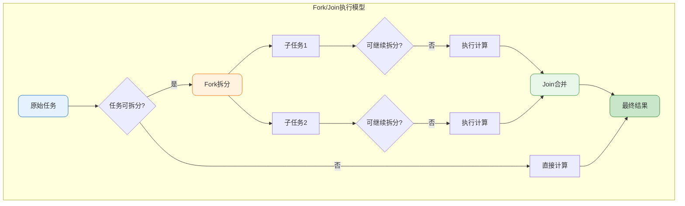
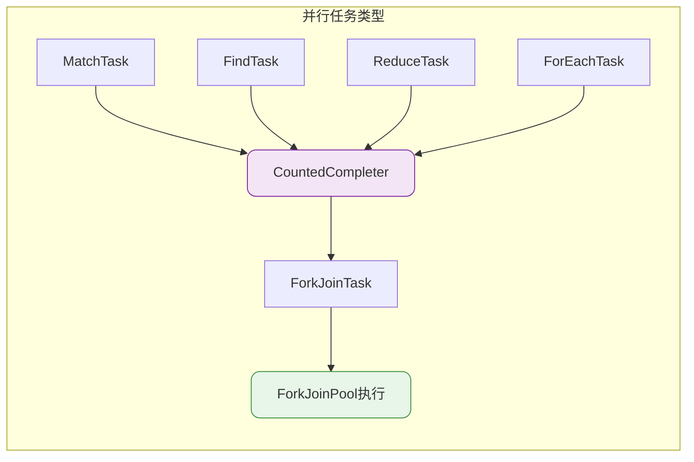
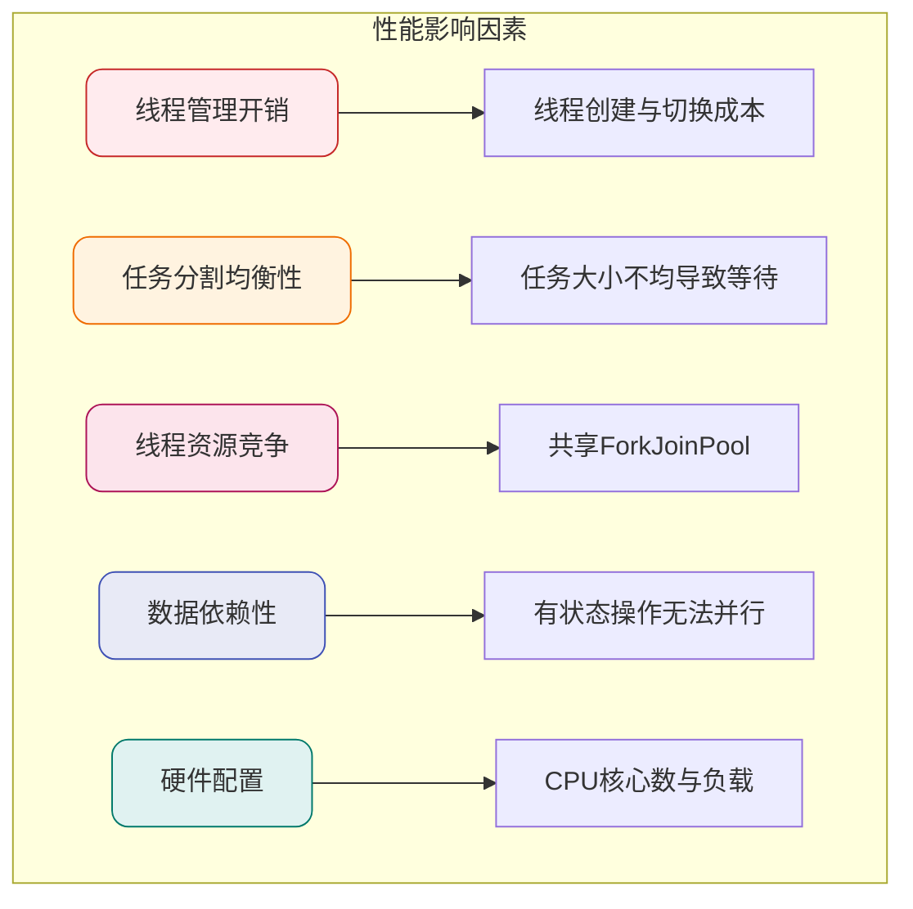

import PaidCTA from '@site/src/components/PaidCTA';

# Stream并行流原理与性能优化

## 并行流概述

Java 8的Stream API不仅提供了便捷的数据处理方式，还内置了并行处理能力。通过并行流（Parallel Stream），开发者可以轻松利用多核CPU的计算能力，无需手动管理线程。

```java
public class DataAnalyzer {
    public void analyze() {
        List<SalesRecord> records = getSalesRecords();
        
        // 串行流处理
        Stream<SalesRecord> serialStream = records.stream();
        
        // 并行流处理
        Stream<SalesRecord> parallelStream = records.parallelStream();
        
        // 串行流转并行流
        Stream<SalesRecord> converted = records.stream().parallel();
    }
}
```

## Fork/Join框架实现原理

并行流底层基于Java 7引入的**Fork/Join框架**实现。该框架采用分治策略：将大任务递归拆分为小任务，分配到多个线程并行执行，最后合并结果。



### 源码层面分析

以Stream的`reduce`操作为例，查看其内部实现（`ReferencePipeline`类）：

```java
@Override
public final Optional<P_OUT> reduce(BinaryOperator<P_OUT> accumulator) {
    return evaluate(ReduceOps.makeRef(accumulator));
}

final <R> R evaluate(TerminalOp<E_OUT, R> terminalOp) {
    if (linkedOrConsumed)
        throw new IllegalStateException("stream has already been operated upon or closed");
    linkedOrConsumed = true;
    
    // 根据是否并行流选择不同执行路径
    return isParallel()
           ? terminalOp.evaluateParallel(this, sourceSpliterator(terminalOp.getOpFlags()))
           : terminalOp.evaluateSequential(this, sourceSpliterator(terminalOp.getOpFlags()));
}
```

当`isParallel()`返回true时，执行`evaluateParallel`方法。不同的终端操作对应不同的Task实现：



这些Task都继承自`CountedCompleter`，而`CountedCompleter`是`ForkJoinTask`的子类：

```java
public abstract class CountedCompleter<T> extends ForkJoinTask<T> {
    // 实现任务的拆分与合并逻辑
}
```

## 并行流性能分析

### 影响性能的关键因素

并行流并非总是比串行流更快，其性能受多种因素制约：



### 性能对比实验结论

根据不同场景下的性能测试，得出以下结论：

#### 场景一：多核CPU + 小数据量

<PaidCTA />