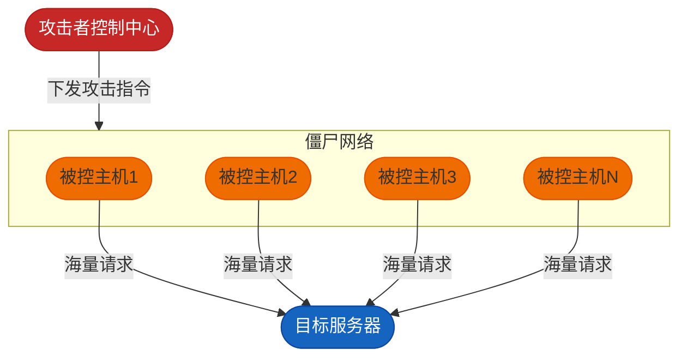
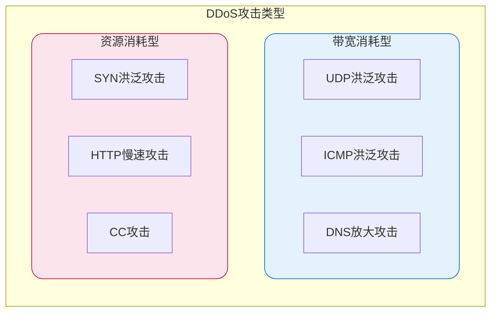
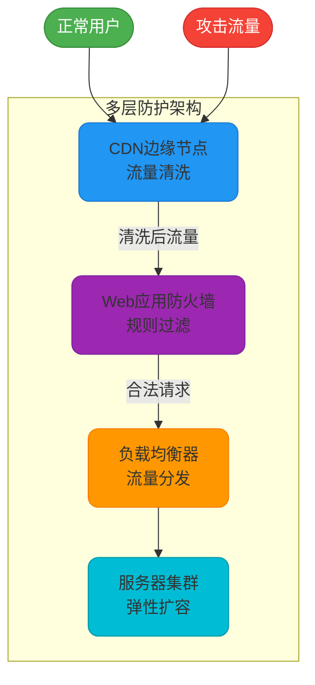
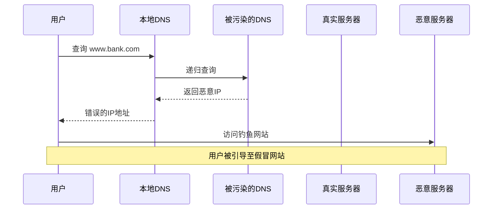
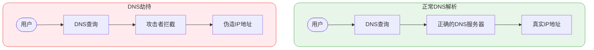
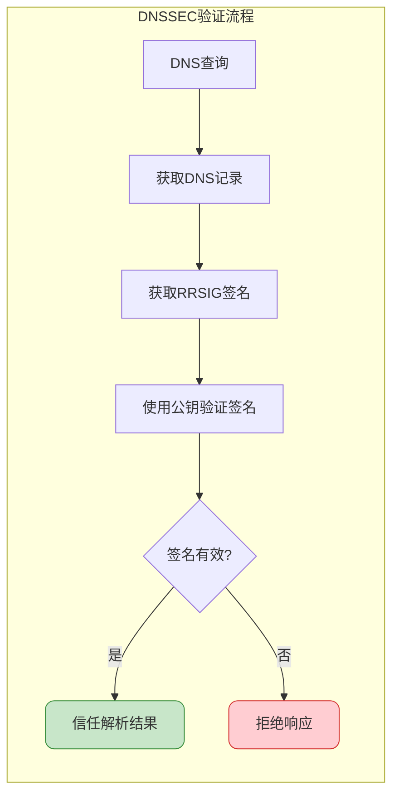

## 拒绝服务攻击概述

### 什么是DoS攻击

拒绝服务攻击（Denial of Service，简称DoS）是通过大量消耗目标系统资源，使其无法正常响应合法用户请求的攻击方式。在信息安全的三要素——**保密性**、**完整性**和**可用性**中，DoS攻击直接针对的是**可用性**。

用一个生活化的场景来理解：假设你经营一家餐厅，店内有三名服务员。某天，一个心怀恶意的人假装成顾客，不停地向服务员咨询菜品价格、询问食材来源、反复修改订单，占用了大量服务时间。虽然他的每个行为看起来都是正常顾客行为，但由于占用过多资源，真正想用餐的顾客就无法得到及时服务。

这就是DoS攻击的本质——利用看似合理的请求来耗尽服务资源。

### DDoS：分布式拒绝服务攻击

当单一攻击源被识别和阻断后，攻击者开始采用分布式策略。DDoS（Distributed Denial of Service）利用大量被控制的"肉鸡"（被入侵的计算机）同时发起攻击，形成强大的攻击流量。



### DDoS攻击分类

DDoS攻击主要分为两大类：



| 攻击类型 | 描述 | 特点 |
|---------|------|------|
| UDP洪泛 | 发送大量UDP数据包 | 消耗带宽资源 |
| SYN洪泛 | 发送大量TCP SYN请求不完成握手 | 耗尽连接资源 |
| HTTP慢速 | 建立连接后缓慢发送数据 | 长时间占用连接 |
| CC攻击 | 模拟正常用户访问动态页面 | 消耗CPU和内存 |

### 攻击危害表现

当服务器遭受DDoS攻击时，通常会出现以下症状：

- 服务器存在大量处于半连接状态的TCP连接
- 网络带宽被大量无效数据包占满
- 系统CPU和内存使用率异常飙升
- 正常用户请求超时或无法连接
- 严重时服务器完全宕机

## DDoS防护策略

### 基础防护层

#### 网络层防护

```java
/**
 * IP访问频率限制器
 * 使用令牌桶算法控制单IP访问频率
 */
@Component
public class IpRateLimiter {
    
    private final LoadingCache<String, RateLimiter> ipLimiters;
    
    public IpRateLimiter() {
        this.ipLimiters = CacheBuilder.newBuilder()
            .maximumSize(100000)
            .expireAfterAccess(30, TimeUnit.MINUTES)
            .build(new CacheLoader<String, RateLimiter>() {
                @Override
                public RateLimiter load(String ip) {
                    // 每秒最多100个请求
                    return RateLimiter.create(100.0);
                }
            });
    }
    
    public boolean tryAcquire(String clientIp) {
        try {
            RateLimiter limiter = ipLimiters.get(clientIp);
            return limiter.tryAcquire(1, TimeUnit.SECONDS);
        } catch (ExecutionException e) {
            return false;
        }
    }
}
```

#### 防火墙ACL配置

通过访问控制列表阻断已识别的攻击源：

```bash
# iptables规则示例 - 限制单IP连接数
iptables -A INPUT -p tcp --dport 80 -m connlimit --connlimit-above 50 -j DROP

# 限制SYN包速率
iptables -A INPUT -p tcp --syn -m limit --limit 100/s --limit-burst 200 -j ACCEPT
iptables -A INPUT -p tcp --syn -j DROP

# 阻断特定IP段
iptables -A INPUT -s 192.168.1.0/24 -j DROP
```

### 架构层防护



### 防护措施清单

1. **增加带宽容量**：对于带宽消耗型攻击，直接提升带宽上限
2. **部署CDN服务**：将流量分散到全球边缘节点，就近吸收攻击
3. **启用WAF防护**：识别并拦截恶意请求模式
4. **负载均衡分流**：多台服务器分担压力，避免单点故障
5. **弹性扩容机制**：云环境下自动扩展计算资源
6. **专业清洗服务**：使用CloudFlare、阿里云盾等专业DDoS防护服务
7. **流量监控告警**：实时监测异常流量，及时响应

```java
/**
 * 流量监控告警服务
 */
@Service
public class TrafficMonitorService {
    
    private static final long THRESHOLD_QPS = 10000;
    private final AtomicLong requestCount = new AtomicLong(0);
    
    @Scheduled(fixedRate = 1000)
    public void checkTrafficAnomaly() {
        long currentQps = requestCount.getAndSet(0);
        
        if (currentQps > THRESHOLD_QPS) {
            sendAlert("流量异常告警", 
                String.format("当前QPS: %d, 阈值: %d", currentQps, THRESHOLD_QPS));
            triggerDefenseMode();
        }
    }
    
    private void triggerDefenseMode() {
        // 启用更严格的访问限制
        // 启用验证码验证
        // 通知运维团队
    }
}
```

## DNS安全威胁

### DNS污染

DNS污染是指DNS服务器被恶意修改或替换，导致域名解析返回错误的IP地址，将用户引导至恶意站点。这种攻击可能发生在：

- DNS服务器被入侵
- DNS缓存被投毒
- 某些情况下，官方可能出于管控目的进行DNS污染



### DNS劫持

DNS劫持是攻击者在网络传输过程中截获DNS查询请求，返回伪造的DNS响应。常见场景包括：

- 运营商劫持用户请求重定向至广告页面
- 中间人攻击拦截DNS通信
- 路由器DNS配置被篡改



### DNS安全防护方案

#### 使用可信DNS服务

选择信誉良好的DNS服务提供商：

```bash
# 配置可信DNS服务器
# Google Public DNS
nameserver 8.8.8.8
nameserver 8.8.4.4

# Cloudflare DNS
nameserver 1.1.1.1
nameserver 1.0.0.1

# 阿里公共DNS
nameserver 223.5.5.5
nameserver 223.6.6.6
```

#### 启用DNSSEC

DNSSEC（DNS Security Extensions）通过数字签名验证DNS响应的真实性：



#### 使用DoH/DoT加密DNS

DNS over HTTPS（DoH）和DNS over TLS（DoT）通过加密通道传输DNS查询：

```java
/**
 * DoH客户端配置示例
 */
public class DnsOverHttpsClient {
    
    private static final String DOH_SERVER = "https://cloudflare-dns.com/dns-query";
    
    public String resolveHostname(String hostname) {
        // 构建DNS查询请求
        byte[] dnsQuery = buildDnsQuery(hostname);
        
        // 通过HTTPS发送查询
        HttpRequest request = HttpRequest.newBuilder()
            .uri(URI.create(DOH_SERVER))
            .header("Content-Type", "application/dns-message")
            .header("Accept", "application/dns-message")
            .POST(HttpRequest.BodyPublishers.ofByteArray(dnsQuery))
            .build();
            
        // 解析响应
        HttpResponse<byte[]> response = httpClient.send(request, 
            HttpResponse.BodyHandlers.ofByteArray());
            
        return parseDnsResponse(response.body());
    }
}
```

### 综合防护措施

| 防护措施 | 防护目标 | 实施难度 |
|---------|---------|---------|
| 使用可信DNS | DNS污染/劫持 | 低 |
| 启用DNSSEC | DNS响应伪造 | 中 |
| 配置DoH/DoT | 传输过程窃听 | 中 |
| 设置静态hosts | 关键域名保护 | 低 |
| 使用VPN隧道 | 全链路加密 | 中 |
| 定期安全检查 | 路由器/系统安全 | 低 |

**重要提示**：没有任何单一措施可以完全防御所有网络攻击，应当采用纵深防御策略，多层次组合使用各种防护手段。
