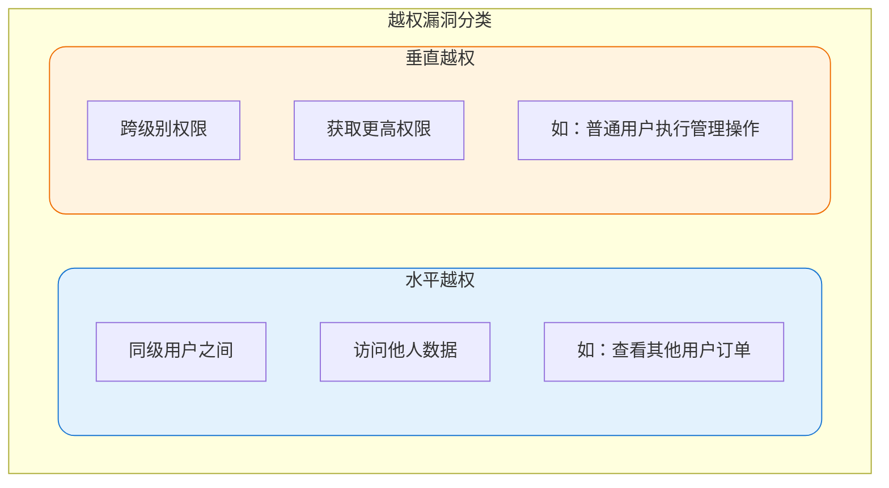
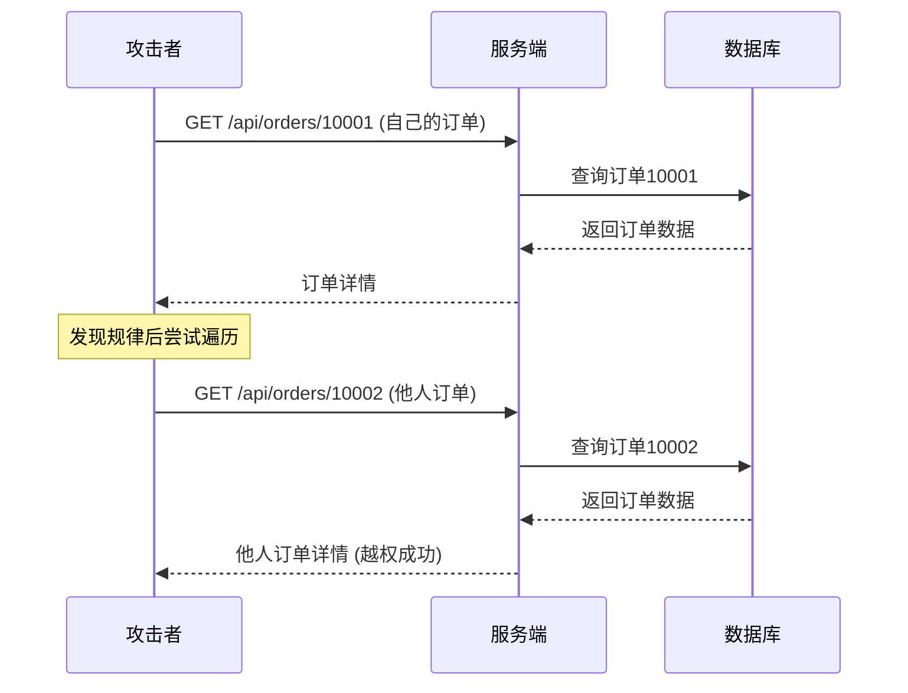

import PaidCTA from '@site/src/components/PaidCTA';

## 越权漏洞概述

越权漏洞是Web应用中最常见的安全问题之一，指用户能够访问或操作超出其权限范围的资源。根据越权方向的不同，可分为水平越权和垂直越权两种类型。



## 水平越权攻击

### 攻击原理

水平越权是指攻击者访问与自己具有相同权限等级的其他用户的资源。最典型的场景是通过修改请求参数中的资源标识（如用户ID、订单号）来获取他人数据。

### 攻击场景示例

假设有一个电商平台的订单查询接口：

```
GET /api/orders/10001
```

如果系统仅根据URL中的订单号查询数据，攻击者只需修改订单号即可尝试获取其他用户的订单信息：

```
GET /api/orders/10002
GET /api/orders/10003
...
```

若订单号使用自增ID生成，攻击者可以轻松遍历获取大量订单数据。



### 防护方案

#### 方案一：强制关联用户身份

最有效的防护方式是在查询时强制关联当前用户身份，而非信任前端传递的用户标识：

<PaidCTA />