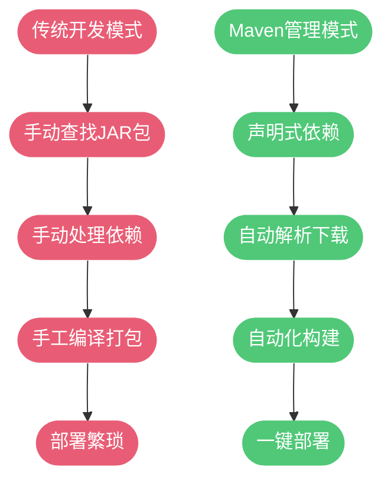
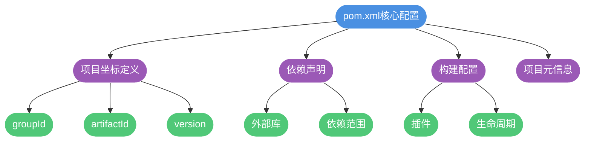
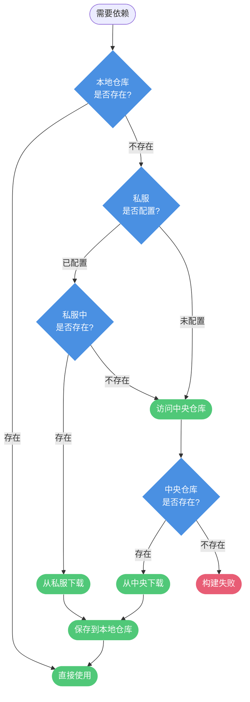

## Maven 的核心价值

在企业级Java开发中，如果缺少自动化构建工具，开发者需要面对诸多繁琐的工作：手动寻找并下载各种第三方库文件、处理复杂的依赖关系、解决版本兼容性问题、手工编译打包等。这些重复性工作不仅效率低下，而且极易出错。

Maven作为一款专业的Java项目管理与构建工具，从根本上解决了这些痛点。它通过标准化的方式管理项目的整个生命周期，让开发团队能够专注于业务逻辑的实现。

Maven的核心功能包括以下三个方面：

- **智能依赖管理**：通过坐标机制自动下载和管理第三方库，并能识别和解决依赖冲突
- **标准化构建流程**：提供统一的编译、测试、打包、部署等自动化流程
- **规范化项目结构**：定义了清晰的目录组织方式，便于团队协作



## Maven 的官方定义

根据Apache Maven官方文档的描述：

> Apache Maven is a software project management and comprehension tool. Based on the concept of a project object model (POM), Maven can manage a project's build, reporting and documentation from a central piece of information.

Maven本质上是一个软件项目管理工具，其核心理念是项目对象模型（Project Object Model, POM）。通过POM文件，开发者可以集中管理项目的构建配置、依赖关系、文档生成等全部信息。

### 项目对象模型（POM）

每个Maven工程的根目录下都包含一个`pom.xml`文件，这是项目的核心配置文件。POM文件中定义了：

- 项目的唯一标识坐标
- 项目所依赖的外部库
- 构建时使用的插件
- 项目的元信息（版本、描述、开发者信息等）



## Maven 坐标体系

Maven使用坐标（Coordinates）来唯一标识项目中的每一个构件（artifact），包括项目本身、依赖的第三方库以及Maven插件。这套坐标系统确保了全球范围内构件标识的唯一性。

### 坐标的组成元素

一个完整的Maven坐标包含以下元素：

- **groupId**（必需）：定义当前项目所属的组织或公司
  - 通常采用反向域名命名，如`com.example`、`org.apache`
  - 第一段为域类型：org表示非营利组织，com表示商业公司，cn表示中国
- **artifactId**（必需）：定义当前项目在组织中的唯一名称
  - 对应项目根目录的名称
- **version**（必需）：定义当前项目的版本号
  - 如`1.0.0`、`2.3.1-SNAPSHOT`
- **packaging**（可选）：定义项目的打包方式
  - 默认为jar，其他可选值：war、pom、maven-plugin等
- **classifier**（可选）：用于区分从同一POM构建的不同内容
  - 如javadoc、sources等

### 坐标使用示例

以阿里巴巴开源的Excel处理库为例，引入依赖时需要在pom.xml中声明完整坐标：

```xml
<dependency>
    <groupId>com.alibaba</groupId>
    <artifactId>easyexcel</artifactId>
    <version>3.2.0</version>
</dependency>
```

在这个例子中：
- `groupId`为`com.alibaba`，表示阿里巴巴公司的商业项目
- `artifactId`为`easyexcel`，是该库的项目名称
- `version`为`3.2.0`，指定使用的版本

实际开发中，可以通过Maven中央仓库搜索网站（如mvnrepository.com）快速查找所需构件的坐标信息。


## Maven 仓库机制

Maven仓库是存储和管理所有构件的中心化存储系统。无论是项目依赖的第三方库、Maven插件，还是项目构建产生的输出，都以文件形式存储在仓库中。

### 仓库分类

Maven仓库分为本地仓库和远程仓库两大类：

**本地仓库（Local Repository）**
- 位于开发者本地计算机上的目录
- 默认路径：`${user.home}/.m2/repository`
- 可在`settings.xml`中自定义路径
- 作用：缓存从远程下载的构件，避免重复下载

**远程仓库（Remote Repository）**

远程仓库又可细分为三类：

- **中央仓库（Central Repository）**
  - Maven社区维护的官方仓库
  - 包含绝大多数开源项目的构件
  - 作为Maven的默认远程仓库，无需额外配置
  - 提供在线搜索服务：search.maven.org

- **私服（Private Repository）**
  - 企业在局域网内架设的私有仓库服务器
  - 充当互联网远程仓库的代理和缓存
  - 可存储企业内部的私有构件
  - 常用私服软件：Nexus、Artifactory

- **其他公共仓库**
  - 加速访问：如阿里云Maven镜像仓库
  - 特殊构件：某些构件未发布到中央仓库

### 依赖查找顺序

当Maven需要某个构件时，会按以下顺序查找：



这种分层查找机制既保证了构建效率，又减轻了网络负担。

## Maven 生命周期

Maven将项目构建过程抽象为标准化的生命周期，每个生命周期由一系列有序的阶段（phase）组成。Maven定义了三个相互独立的生命周期：

### clean 生命周期

负责清理项目，包含3个阶段：

- **pre-clean**：执行清理前的准备工作
- **clean**：删除上次构建生成的所有文件
- **post-clean**：执行清理后的收尾工作

```bash
mvn clean
```

执行上述命令会依次执行pre-clean和clean阶段，删除target目录及其内容。

### default 生命周期

这是Maven的主要生命周期，负责项目的编译、测试、打包、部署等核心任务。它包含23个阶段，常用的有：

- **validate**：验证项目结构和配置的正确性
- **compile**：编译项目主代码
- **test**：使用单元测试框架运行测试
- **package**：将编译后的代码打包成可发布格式（JAR、WAR等）
- **verify**：运行检查以验证包的有效性
- **install**：将包安装到本地仓库，供其他本地项目使用
- **deploy**：将包发布到远程仓库，供团队共享

### site 生命周期

用于生成项目站点文档，包含4个阶段：

- **pre-site**：准备工作
- **site**：生成项目站点文档
- **post-site**：收尾工作
- **site-deploy**：将生成的站点发布到服务器

### 阶段依赖关系

同一生命周期内的阶段是有序的，执行某个阶段时，会先执行它之前的所有阶段。


例如，执行`mvn test`命令时，会依次执行validate、compile、test三个阶段。这解释了为什么运行测试时项目代码会自动编译。

### 命令示例

```bash
# 清理并编译
mvn clean compile

# 清理、编译、测试、打包
mvn clean package

# 完整构建并安装到本地仓库
mvn clean install

# 跳过测试的快速打包
mvn clean package -DskipTests
```

## Maven 项目标准目录结构

Maven强制要求项目遵循标准目录结构，这种约定优于配置的理念带来了诸多好处：

- 新成员快速熟悉项目布局
- 工具和插件可自动识别文件位置
- 降低配置复杂度

```plaintext
project-root/
├── src/
│   ├── main/
│   │   ├── java/              # 主程序Java源代码
│   │   ├── resources/          # 主程序资源文件
│   │   └── webapp/             # Web应用目录（仅WAR项目）
│   └── test/
│       ├── java/               # 测试代码
│       └── resources/          # 测试资源文件
├── target/                     # 构建输出目录（自动生成）
└── pom.xml                     # Maven配置文件
```

### 目录详解

- `src/main/java`：存放项目的主要Java源代码，包结构从此目录开始
- `src/main/resources`：存放配置文件、属性文件、XML文件等资源
- `src/test/java`：存放单元测试和集成测试的Java代码
- `src/test/resources`：存放测试用的资源文件
- `target`：Maven构建过程中生成的文件都输出到此目录，如编译的class文件、打包的jar/war文件等

### Web项目的特殊结构

对于Web应用（packaging为war），还需要额外的目录：

```plaintext
src/main/webapp/
├── WEB-INF/
│   ├── web.xml
│   └── classes/
├── css/
├── js/
└── index.html
```

这种统一的结构使得Maven可以自动定位源代码、资源文件和测试代码，无需额外配置即可完成构建任务。
