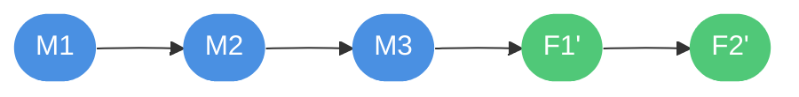
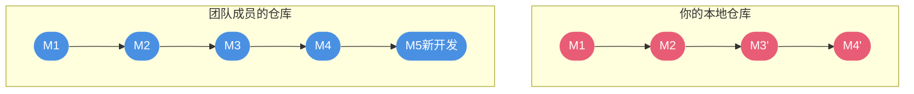

## 代码回滚的应用场景

在日常开发中,代码回滚是一项至关重要的技能。无论是发现提交了错误代码、需要撤销某次功能更新,还是要回退到之前的稳定版本,掌握正确的回滚方法都能帮助我们高效地处理这些问题。

Git提供了多种回滚机制,每种方法适用于不同的场景。理解这些方法的区别和适用场景,是成为Git高手的必经之路。


## 工作目录级别的回滚

### 撤销未暂存的修改

当文件只在工作目录中被修改,还没有执行`git add`操作时,可以使用以下方法撤销修改:

**方法一:使用checkout命令**

```bash
# 撤销单个文件的修改
git checkout -- UserService.java

# 撤销多个文件的修改
git checkout -- *.java

# 撤销当前目录所有修改
git checkout -- .
```

这个命令会用暂存区或最近一次提交的内容覆盖工作目录中的文件,**所有未暂存的修改将永久丢失**,使用时需要谨慎。

**方法二:使用restore命令(Git 2.23+)**

Git 2.23引入了更语义化的`git restore`命令,用于替代`checkout`的文件恢复功能:

```bash
# 恢复单个文件到最近一次提交的状态
git restore UserService.java

# 恢复所有修改的文件
git restore .
```

**实际应用示例:**

假设你正在开发订单管理功能,修改了`OrderController.java`,但发现改动方向不对,想要放弃这些修改:

```bash
# 查看当前修改状态
git status
# 输出: modified: OrderController.java

# 撤销对OrderController.java的所有修改
git restore OrderController.java

# 确认文件已恢复
git status
# 输出: nothing to commit, working tree clean
```

### 取消暂存的文件

当使用`git add`将文件添加到暂存区后,发现不应该暂存某些文件,可以使用以下方法取消暂存:

```bash
# 取消单个文件的暂存
git reset HEAD ProductService.java

# 使用restore命令(推荐)
git restore --staged ProductService.java

# 取消所有暂存
git reset HEAD .
```

**注意:**这些操作只是将文件从暂存区移除,工作目录中的修改会保留。

**实际应用示例:**

在开发支付功能时,不小心将配置文件也添加到了暂存区:

```bash
# 误操作:将所有文件添加到暂存区
git add .

# 查看状态,发现config.properties不应该提交
git status

# 取消config.properties的暂存
git restore --staged config.properties

# 或者使用传统方式
git reset HEAD config.properties
```

## 提交级别的回滚

### reset命令详解

`git reset`是一个功能强大但需要谨慎使用的命令,它可以移动HEAD指针和分支引用,从而实现版本回退。

#### reset的三种模式

**--soft模式(软重置)**

```bash
git reset --soft <commit-id>
```

- 只移动HEAD指针到指定提交
- 暂存区和工作目录保持不变
- 效果:之前的提交变成了待提交状态


**适用场景:**想要重新组织最近几次提交,合并多个小提交为一个大提交。

**示例:**

```bash
# 查看提交历史
git log --oneline
# c4a2e8f (HEAD -> main) 修复拼写错误
# b3d1f7e 添加日志输出
# a2c9e6d 实现核心逻辑

# 想要将最近两次提交合并
git reset --soft HEAD~2

# 此时b3d1f7e和c4a2e8f的修改都在暂存区
git status
# 输出: Changes to be committed...

# 重新提交
git commit -m "完整实现核心功能并添加日志"
```

**--mixed模式(混合重置,默认)**

```bash
git reset --mixed <commit-id>
# 等同于
git reset <commit-id>
```

- 移动HEAD指针到指定提交
- 重置暂存区为指定提交的状态
- 工作目录保持不变
- 效果:之前的提交变成了未暂存的修改

**适用场景:**想要撤销提交和暂存操作,但保留实际的代码修改。

**示例:**

```bash
# 撤销最近一次提交,但保留修改在工作目录
git reset HEAD~1

# 此时修改存在于工作目录,但未暂存
git status
# 输出: Changes not staged for commit...
```

**--hard模式(硬重置)**

```bash
git reset --hard <commit-id>
```

- 移动HEAD指针到指定提交
- 重置暂存区为指定提交的状态
- 重置工作目录为指定提交的状态
- 效果:**所有修改完全丢失**,回到指定提交的干净状态

**危险警告:**这是最危险的模式,会永久删除所有未提交的修改,使用前务必确认。


**适用场景:**确定要完全放弃某些提交和所有未提交的修改,回到干净的状态。

**示例:**

```bash
# 完全回退到上一个提交,丢弃所有修改
git reset --hard HEAD~1

# 回退到指定提交
git reset --hard a2c9e6d

# 从远程强制同步(放弃本地所有修改)
git fetch origin
git reset --hard origin/main
```

### revert命令详解

与`reset`不同,`git revert`通过创建一个新的提交来撤销之前的提交,而不是删除历史记录。这是一种更安全、更适合协作的回滚方式。

```bash
# 撤销指定的提交
git revert <commit-id>

# 撤销最近一次提交
git revert HEAD

# 撤销倒数第二次提交
git revert HEAD~1
```

**revert的工作原理:**


revert会自动创建一个新提交,这个提交的内容是目标提交的反向操作。例如,如果目标提交添加了一行代码,revert提交就会删除这一行。

**实际应用示例:**

某个已经推送到远程仓库的提交引入了bug,需要撤销:

```bash
# 查看提交历史
git log --oneline
# e5f7a9c (HEAD -> main, origin/main) 添加优惠券功能
# d4c6b8e 优化数据库查询
# c3a5b7d 修复登录问题

# 发现"优化数据库查询"引入了性能问题
git revert d4c6b8e

# Git会打开编辑器,默认提交信息为:
# Revert "优化数据库查询"
# 
# This reverts commit d4c6b8e.

# 保存后,自动创建revert提交
git log --oneline
# f6g8h0j (HEAD -> main) Revert "优化数据库查询"
# e5f7a9c (origin/main) 添加优惠券功能
# d4c6b8e 优化数据库查询
# c3a5b7d 修复登录问题

# 推送到远程
git push origin main
```

### reset vs revert 核心对比

| 对比维度 | reset | revert |
|---------|-------|--------|
| 历史记录 | 删除提交历史 | 保留所有历史,新增revert提交 |
| 可逆性 | 难以恢复(除非知道原commit-id) | 可以再次revert来恢复 |
| 协作安全性 | 不安全,会导致他人仓库混乱 | 安全,不影响他人历史 |
| 适用场景 | 本地未推送的提交 | 已推送的公共提交 |
| 操作痕迹 | 不留痕迹,仿佛从未发生 | 留下明确的撤销记录 |

**选择建议:**


## 分支合并策略

在多人协作开发中,分支合并是最常见的操作之一。Git提供了两种主要的合并策略:`merge`和`rebase`,它们的工作方式和产生的历史记录截然不同。

### merge合并策略

merge是最传统、最安全的合并方式,它会保留分支的完整历史,并通过合并提交(merge commit)将两个分支连接起来。

**基本用法:**

```bash
# 将feature分支合并到当前分支
git merge feature-payment

# 将main分支的更新合并到当前分支
git checkout feature-payment
git merge main
```

**merge的工作流程:**

假设从main分支创建了feature分支进行开发,期间main分支也有了新的提交:


执行merge后,会创建一个新的合并提交:


**merge的特点:**

- **保留完整历史**:所有分支的提交记录都会保留
- **清晰的分支结构**:可以明确看出哪些提交属于哪个分支
- **安全性高**:不会改写任何历史提交
- **合并提交**:会产生额外的合并提交节点

**实际应用示例:**

团队开发中,你在feature分支开发了新功能,现在要合并到main分支:

```bash
# 确保feature分支是最新的
git checkout feature-order
git pull origin feature-order

# 切换到main分支
git checkout main
git pull origin main

# 合并feature分支
git merge feature-order

# 如果没有冲突,Git会自动创建合并提交
# 如果有冲突,需要手动解决

# 推送合并结果
git push origin main
```

### rebase变基策略

rebase的字面意思是"重新设置基底",它会将一个分支的提交"移动"到另一个分支的末端,创造出线性的提交历史。

**基本用法:**

```bash
# 将当前分支rebase到main分支
git rebase main

# 交互式rebase(可以编辑、合并、删除提交)
git rebase -i main
```

**rebase的工作流程:**

同样的初始状态:


执行rebase后,feature分支的提交会被"移动"到main分支的末端:



**注意:**F1'和F2'虽然内容与F1、F2相同,但它们的commit ID已经改变,本质上是新的提交。

**rebase的特点:**

- **线性历史**:提交历史呈现为一条直线,非常清晰
- **无合并提交**:不会产生额外的合并提交节点
- **改写历史**:会修改提交的hash值
- **更整洁**:review代码时更容易理解提交序列

**实际应用示例:**

在个人feature分支开发时,保持分支与main同步:

```bash
# 在feature分支上开发
git checkout feature-search

# main分支有了新的更新,需要同步
git fetch origin

# 使用rebase而非merge来同步
git rebase origin/main

# 如果有冲突,逐个解决后继续
git add <冲突文件>
git rebase --continue

# 如果想放弃rebase
git rebase --abort

# rebase完成后,强制推送(因为改写了历史)
git push --force-with-lease origin feature-search
```

### merge vs rebase 全面对比

**提交历史的差异:**

使用merge:
```
* M5 Merge branch 'feature'
|\  
| * F2 实现搜索过滤
| * F1 添加搜索框
* | M4 修复样式问题
* | M3 更新文档
|/  
* M2 初始提交
```

使用rebase:
```
* F2' 实现搜索过滤
* F1' 添加搜索框  
* M4 修复样式问题
* M3 更新文档
* M2 初始提交
```

**适用场景对比:**

| 场景 | 推荐策略 | 原因 |
|-----|---------|------|
| 个人开发分支 | rebase | 保持历史整洁 |
| 公共分支(main/develop) | merge | 安全,不改写历史 |
| 功能分支合并到主干 | merge | 保留功能开发的完整脉络 |
| 同步主干更新到功能分支 | rebase | 避免无意义的合并提交 |
| 已推送的提交 | merge | 避免他人仓库混乱 |
| 未推送的本地提交 | rebase | 整理提交历史 |


### rebase黄金法则

**永远不要在公共分支上执行rebase操作!**

这是使用rebase时最重要的规则。违反这个规则会导致严重的协作问题。

**为什么会出问题?**

假设你在main分支上执行了rebase操作:



此时M3和M3'虽然内容相同,但commit ID不同。当团队成员尝试合并你的修改时,Git会认为这是完全不同的提交,导致大量冲突和重复提交。

**安全使用rebase的指导原则:**

1. **只在个人分支上rebase**:如果分支只有你一个人在使用,随意rebase
2. **与团队成员沟通**:如果确实需要在共享分支上rebase,提前通知所有相关人员
3. **使用--force-with-lease**:如果必须强制推送,使用这个选项而不是--force,它会检查远程是否有其他人的更新

```bash
# 危险操作,会覆盖远程
git push --force

# 更安全的强制推送,如果远程有新提交会失败
git push --force-with-lease
```

## 实战场景演练

### 场景1:撤销错误的本地提交

**问题:** 刚刚提交了代码,但发现提交信息写错了,或者漏掉了一个文件。

**解决方案:**

```bash
# 修改最近一次提交的信息
git commit --amend -m "正确的提交信息"

# 添加遗漏的文件到最近一次提交
git add ForgottenFile.java
git commit --amend --no-edit

# 完全撤销最近一次提交,但保留修改
git reset HEAD~1

# 完全撤销最近一次提交,丢弃所有修改
git reset --hard HEAD~1
```

### 场景2:撤销已推送的错误提交

**问题:** 发现已经推送到远程的某次提交有严重bug,需要撤销。

**解决方案:**

```bash
# 使用revert创建反向提交
git revert <commit-id>

# 推送revert提交到远程
git push origin main

# 如果要连续revert多个提交
git revert <commit-id-1> <commit-id-2> <commit-id-3>
```

### 场景3:合并功能分支时产生冲突

**问题:** 将feature分支合并到main时,Git提示有冲突。

**解决方案:**

```bash
# 执行合并
git merge feature-branch

# Git会提示冲突文件
# CONFLICT (content): Merge conflict in UserService.java

# 打开冲突文件,会看到冲突标记
<<<<<<< HEAD
// 当前分支的代码
public void processPayment() {
    // 实现A
}
=======
// feature分支的代码  
public void processPayment() {
    // 实现B
}
>>>>>>> feature-branch

# 手动编辑解决冲突,保留正确的代码
public void processPayment() {
    // 整合后的实现
}

# 标记冲突已解决
git add UserService.java

# 完成合并
git commit -m "合并feature-branch,解决支付逻辑冲突"
```

### 场景4:整理混乱的提交历史

**问题:** 本地有多个零碎的提交,希望在推送前合并为一个清晰的提交。

**解决方案:**

```bash
# 查看最近5次提交
git log --oneline -5
# a1b2c3d 修复拼写
# e4f5g6h 调整格式
# i7j8k9l 添加注释
# m0n1o2p 实现核心功能
# q3r4s5t 前一次提交

# 交互式rebase最近4次提交
git rebase -i HEAD~4

# 编辑器会打开,显示:
# pick m0n1o2p 实现核心功能
# pick i7j8k9l 添加注释
# pick e4f5g6h 调整格式
# pick a1b2c3d 修复拼写

# 修改为:
# pick m0n1o2p 实现核心功能
# squash i7j8k9l 添加注释
# squash e4f5g6h 调整格式
# squash a1b2c3d 修复拼写

# 保存后,Git会让你编辑新的提交信息
# 完成后,4个提交被合并为1个
```

## 最佳实践建议

**提交粒度原则:**
- 每次提交应该是一个逻辑完整的修改
- 避免一次提交包含多个不相关的修改
- 提交前使用`git diff`检查修改内容

**分支管理原则:**
- 主分支(main/master)始终保持可发布状态
- 新功能在独立的feature分支开发
- bug修复在独立的bugfix分支进行
- 分支命名要有意义:feature/user-login、bugfix/payment-error

**合并策略选择:**
- 团队约定优先:遵循团队既定的合并策略
- 默认使用merge:更安全,更符合直觉
- 谨慎使用rebase:仅在明确知道自己在做什么时使用
- 保护公共分支:在main分支上禁用force push

**冲突处理建议:**
- 频繁同步主分支,减少冲突概率
- 小步提交,降低单次冲突的复杂度
- 遇到复杂冲突时,与相关开发者沟通
- 解决冲突后务必测试,确保功能正常


通过掌握这些代码回滚和分支合并的技巧,你将能够更加自信地处理各种Git操作,无论是修复错误、整理历史还是协同开发,都能游刃有余。
