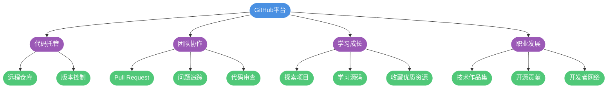
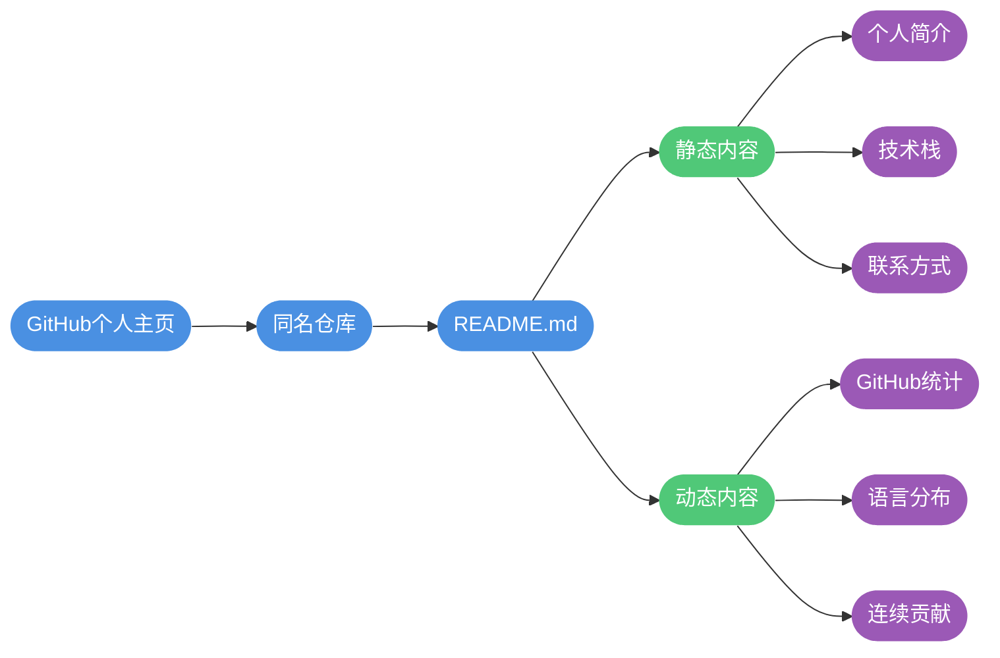
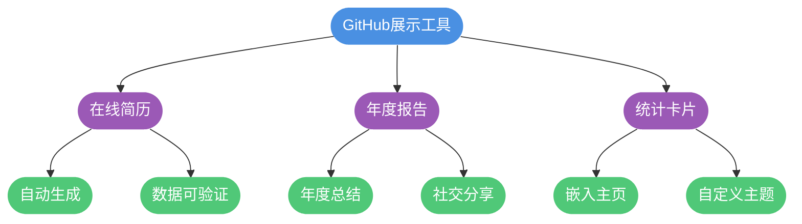
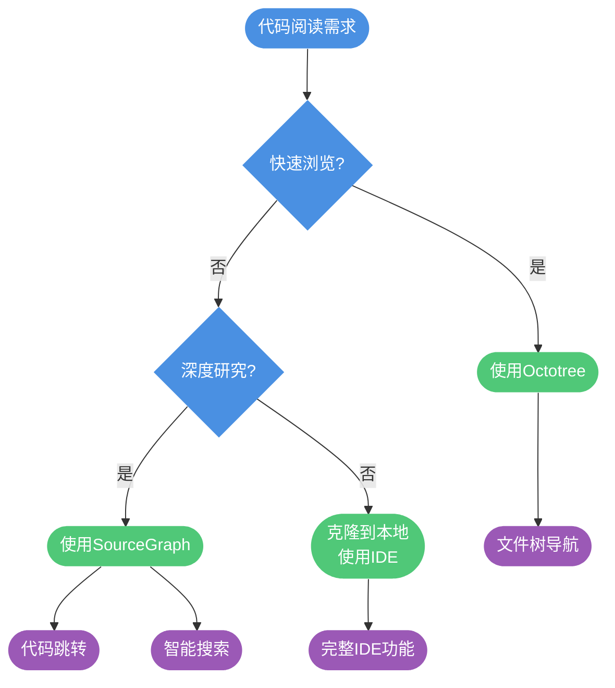
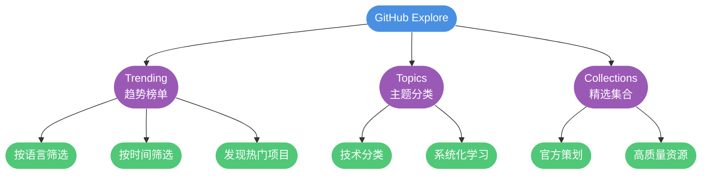
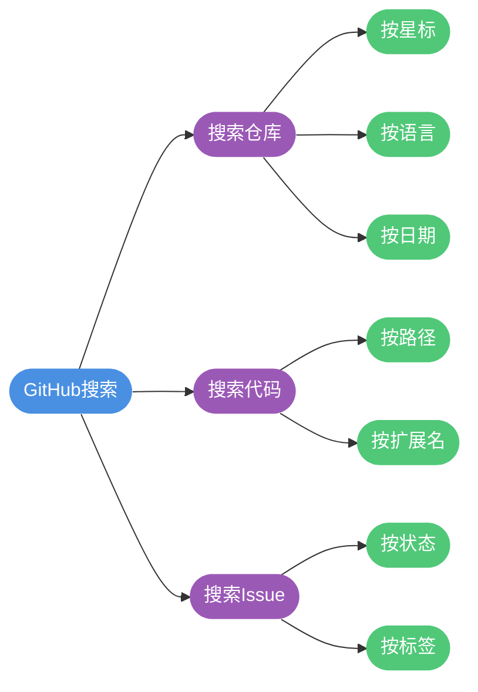

## GitHub 的价值与定位

GitHub不仅仅是一个代码托管平台,更是全球开发者协作、学习和展示的社交网络。作为全球最大的开源代码托管平台,GitHub上汇聚了数亿个项目,从个人学习项目到Linux内核这样的超大型开源项目,应有尽有。

对于开发者而言,GitHub的价值体现在多个层面:

- **代码托管与版本管理**:提供可靠的远程Git仓库服务
- **团队协作平台**:通过Pull Request、Issue、Project等功能支持团队开发
- **个人品牌建设**:展示技术能力,积累开源贡献
- **学习资源宝库**:海量优质开源项目可供学习参考
- **职业发展助力**:优秀的GitHub档案能为求职加分



## 个性化主页打造

### 创建特殊仓库展示README

GitHub提供了一个特殊功能:创建一个与用户名同名的仓库,该仓库的README.md内容会自动显示在个人主页上。这为开发者提供了一个绝佳的自我介绍窗口。

**创建步骤:**

1. 创建一个与GitHub用户名完全相同的仓库
   - 例如用户名为`techdev`,则创建名为`techdev`的仓库
   - 设置为Public(公开)
   - 勾选"Add a README file"

2. 编辑README.md文件,添加个性化内容
   - 个人简介与技术栈
   - 开源项目展示
   - 联系方式
   - 动态统计数据

3. 提交后,访问个人主页即可看到效果

**示例内容结构:**

```markdown
## 👋 你好,我是张三

### 关于我
- 💻 全栈开发工程师,专注于Java生态和前端技术
- 🌱 目前正在深入学习微服务架构和云原生技术
- 📫 联系方式: zhangsan@example.com

### 技术栈


### 开源项目
- [项目A](https://github.com/techdev/project-a) - 企业级权限管理系统
- [项目B](https://github.com/techdev/project-b) - 高性能缓存中间件
```

### 集成动态统计卡片

通过[github-readme-stats](https://github.com/anuraghazra/github-readme-stats)项目,可以在README中嵌入动态生成的统计卡片。

**GitHub统计卡片:**

```markdown

```

显示内容包括:
- 总Star数量
- 总Commit次数
- 总PR数量
- 总Issue数量
- 贡献排名

**最常用语言卡片:**

```markdown

```

**特定仓库卡片:**

```markdown

```

**主题定制:**

支持多种主题风格:
- `dark` - 暗黑风格
- `radical` - 炫彩风格
- `tokyonight` - 东京夜景
- `onedark` - One Dark主题
- `cobalt` - 钴蓝主题



### 添加项目贡献可视化

使用[repobeats](https://repobeats.axiom.co/)可以为开源项目生成精美的贡献统计图表,展示项目活跃度。

**使用方法:**

1. 访问 https://repobeats.axiom.co/
2. 输入仓库地址,如`username/repository`
3. 生成图表链接
4. 将链接嵌入到README中

```markdown

```

图表包含的信息:
- 每月提交趋势
- 贡献者数量
- Issue处理情况
- PR合并统计
- 代码活跃度

## 在线简历与年度报告

### 自动生成GitHub简历

[Resume.github.io](https://resume.github.io/)可以根据GitHub的公开数据自动生成一份技术简历。

**使用方式:**

直接访问`https://resume.github.io/你的用户名`,系统会自动抓取以下信息:

- 个人基本信息(头像、用户名、简介)
- 最受欢迎的仓库
- 贡献统计
- 使用的编程语言分布

**应用场景:**

- 校园招聘或社招的简历附件
- 个人博客的关于页面
- 技术社区的个人主页

**优势:**
- 数据真实可验证
- 自动更新,无需手动维护
- 直观展示技术能力
- 增强技术可信度

### GitHub年度总结报告

[GitHub Wrapped](https://www.githubtrends.io/wrapped)提供类似音乐平台年度总结的功能,生成个性化的GitHub年度报告。

**报告内容包括:**

- 年度总提交次数
- 最活跃的月份
- 最常用的编程语言
- 贡献的开源项目
- 获得的Star数量
- 代码增删统计

**使用时机:**
- 年终总结个人技术成长
- 社交媒体分享(Twitter、微博等)
- 求职时展示技术活跃度
- 团队内部技术氛围营造



## 项目管理增强

### 自定义徽章系统

[Shields.io](https://shields.io/)是GitHub项目中常见徽章的生成平台,可以创建静态或动态徽章。

**静态徽章示例:**

```markdown


```

**动态徽章示例:**

```markdown


```

**常用徽章类型:**

- **CI/CD状态**: 显示构建、测试结果
- **代码覆盖率**: 集成测试覆盖率工具
- **依赖状态**: 显示依赖是否过期
- **下载量**: NPM包、Docker镜像下载统计
- **许可证**: 项目使用的开源许可
- **版本号**: 当前发布版本

**徽章风格定制:**

通过`style`参数调整样式:
- `flat` - 扁平化风格(默认)
- `flat-square` - 方形扁平
- `plastic` - 塑料质感
- `for-the-badge` - 大号徽章
- `social` - 社交风格(适合Star、Fork计数)

### 表情符号使用

GitHub支持在Issue、PR、README等地方使用Emoji表情,让文档更生动。

**常用表情及含义:**

| 表情代码 | 显示效果 | 常用场景 |
|---------|---------|---------|
| `:bug:` | 🐛 | 标记bug相关内容 |
| `:sparkles:` | ✨ | 新功能介绍 |
| `:rocket:` | 🚀 | 性能提升 |
| `:art:` | 🎨 | 改进代码结构 |
| `:memo:` | 📝 | 文档更新 |
| `:fire:` | 🔥 | 删除代码或文件 |
| `:lock:` | 🔒 | 安全相关修复 |
| `:construction:` | 🚧 | 工作进行中 |
| `:white_check_mark:` | ✅ | 测试相关 |
| `:tada:` | 🎉 | 初始提交 |

**使用示例:**

```markdown
## :rocket: 功能特性

- :sparkles: 支持分布式事务
- :zap: 优化数据库查询性能
- :lock: 修复XSS安全漏洞

## :bug: 已知问题

- :construction: 搜索功能正在开发中
```

**表情查询资源:**

- [GitHub Emoji Cheat Sheet](https://github.com/ikatyang/emoji-cheat-sheet)
- [Emojipedia](https://emojipedia.org/)

## 高效代码阅读

### Octotree浏览器插件

Octotree是一款强大的Chrome/Edge插件,为GitHub添加了类似IDE的文件树侧边栏。

**核心功能:**

- **树形文件结构**: 左侧显示完整的目录树
- **快速导航**: 点击文件名直接跳转
- **多标签页支持**: 在不同文件间快速切换
- **书签功能**: 标记常用文件
- **暗黑模式**: 保护视力的夜间主题

**适用场景:**

- 浏览大型项目源码
- 理解项目目录结构
- 快速定位目标文件
- 对比不同分支的文件差异

**安装方式:**

Chrome网上应用店搜索"Octotree"直接安装,或访问Edge扩展商店。

### SourceGraph代码智能

SourceGraph不仅提供代码浏览功能,还具备代码搜索、跳转、引用查找等IDE级别的功能。

**核心能力:**

**代码跳转**
- 点击类名跳转到定义
- 查看方法的所有引用
- 追踪接口的实现类

**代码搜索**
- 支持正则表达式搜索
- 跨仓库搜索
- 搜索结果高亮显示

**浏览增强**
- 在线查看完整项目结构
- 语法高亮
- 代码折叠

**使用方式:**

安装SourceGraph浏览器插件后,GitHub页面会出现"View on Sourcegraph"按钮,点击即可在SourceGraph平台阅读代码。

**对比:**

| 功能 | Octotree | SourceGraph |
|-----|----------|-------------|
| 文件树导航 | ✅ 优秀 | ✅ 良好 |
| 代码跳转 | ❌ 不支持 | ✅ 支持 |
| 引用查找 | ❌ 不支持 | ✅ 支持 |
| 全局搜索 | ❌ 不支持 | ✅ 支持 |
| 性能 | ✅ 轻量快速 | ⚠️ 较重 |
| 使用场景 | 快速浏览 | 深度研究 |



### 克隆到本地深度学习

对于需要深入研究的项目,最好的方式是克隆到本地,使用专业IDE阅读。

**优势:**

- 完整的代码补全和类型提示
- 强大的重构工具
- 调试功能,可以运行和断点调试
- 查找引用、调用层次等高级功能
- 离线也能访问

**推荐工作流:**

```bash
# 1. 克隆仓库
git clone https://github.com/username/awesome-project.git

# 2. 进入项目目录
cd awesome-project

# 3. 查看README了解项目结构
cat README.md

# 4. 安装依赖
# Java项目
mvn install
# 或Node.js项目
npm install

# 5. 使用IDE打开
# IntelliJ IDEA: idea .
# VS Code: code .
```

## GitHub Explore探索功能

GitHub Explore是一个被严重低估的功能板块,它能够帮助开发者发现优质项目、追踪技术趋势、学习新知识。

### Trending趋势榜单

**访问方式:** https://github.com/trending

Trending页面展示最近最热门的仓库,支持多维度筛选:

**语言筛选:**
- 选择特定编程语言(Java、Python、JavaScript等)
- 查看该语言生态的热门项目

**时间范围:**
- Today - 今日热门
- This week - 本周热门
- This month - 本月热门

**应用场景:**

- **追踪技术趋势**: 了解当前流行的技术方向
- **学习优质项目**: 研究Star数快速增长的项目
- **发现工具库**: 找到能提升开发效率的工具
- **开源贡献**: 寻找活跃且欢迎贡献的项目

**使用技巧:**

```markdown
1. 每周查看一次本周Trending,了解技术动态
2. 关注自己技术栈相关语言的趋势
3. 深入研究2-3个感兴趣的项目
4. Star收藏有价值的项目,定期回顾
```

### Topics主题分类

**访问方式:** https://github.com/topics

Topics将项目按照技术领域和主题分类,便于系统化学习。

**热门主题:**

- [JavaScript](https://github.com/topics/javascript) - JavaScript生态项目
- [Machine Learning](https://github.com/topics/machine-learning) - 机器学习相关
- [Data Visualization](https://github.com/topics/data-visualization) - 数据可视化
- [Docker](https://github.com/topics/docker) - 容器化技术
- [Awesome Lists](https://github.com/topics/awesome) - Awesome系列资源汇总

**使用策略:**

- 关注自己学习路径相关的主题
- 定期查看主题下的新项目
- 通过主题发现细分领域的最佳实践

### Collections精选集合

**访问方式:** https://github.com/collections

Collections是GitHub官方策划的主题收藏夹,汇集特定领域的优质资源。

**推荐集合:**

- [Learn to Code](https://github.com/collections/learn-to-code) - 编程学习资源
- [Design Essentials](https://github.com/collections/design-essentials) - 设计工具和资源
- [DevOps Tools](https://github.com/collections/devops-tools) - DevOps工具链
- [Open Source Organizations](https://github.com/collections/open-source-organizations) - 知名开源组织



## GitHub Actions自动化

GitHub Actions是GitHub提供的CI/CD平台,可以自动化执行构建、测试、部署等任务。

### 核心概念

**Workflow(工作流):**
- 定义在`.github/workflows/`目录下的YAML文件
- 描述一系列自动化任务

**Event(事件):**
- 触发工作流的条件
- 如`push`、`pull_request`、`schedule`等

**Job(任务):**
- 工作流中的一组步骤
- 可以并行或串行执行

**Step(步骤):**
- 任务中的单个操作
- 可以运行命令或使用Action

### 实用场景

**自动化测试:**

```yaml
name: Run Tests

on:
  push:
    branches: [ main ]
  pull_request:
    branches: [ main ]

jobs:
  test:
    runs-on: ubuntu-latest
    
    steps:
    - uses: actions/checkout@v3
    
    - name: Set up JDK 17
      uses: actions/setup-java@v3
      with:
        java-version: '17'
        
    - name: Run tests
      run: mvn test
```

**自动部署文档:**

```yaml
name: Deploy Docs

on:
  push:
    branches: [ main ]

jobs:
  deploy:
    runs-on: ubuntu-latest
    
    steps:
    - uses: actions/checkout@v3
    
    - name: Deploy to GitHub Pages
      uses: peaceiris/actions-gh-pages@v3
      with:
        github_token: ${{ secrets.GITHUB_TOKEN }}
        publish_dir: ./docs
```

**定时任务:**

```yaml
name: Daily Report

on:
  schedule:
    - cron: '0 0 * * *'  # 每天UTC时间0点执行

jobs:
  report:
    runs-on: ubuntu-latest
    
    steps:
    - name: Generate report
      run: |
        echo "生成每日报告"
```

### Actions市场

**访问:** https://github.com/marketplace?type=actions

官方和社区提供了数千个现成的Action,涵盖各种常见场景:

- **代码质量检查**: ESLint、SonarQube
- **依赖管理**: Dependabot、Renovate
- **通知推送**: Slack、钉钉、企业微信
- **云服务部署**: AWS、Azure、阿里云
- **Docker镜像**: 构建和推送Docker镜像

**使用示例:**

```yaml
- name: Slack Notification
  uses: 8398a7/action-slack@v3
  with:
    status: ${{ job.status }}
    text: '构建完成!'
    webhook_url: ${{ secrets.SLACK_WEBHOOK }}
```

## 增强功能插件

### Enhanced GitHub

**功能:**
- 显示仓库大小
- 显示每个文件的大小
- 支持单独下载文件或文件夹
- 显示仓库的更新时间

**使用场景:**
- 快速评估项目规模
- 下载特定文件而无需克隆整个仓库
- 了解项目的维护活跃度

### Markdown Preview Enhanced

**功能:**
- 为本地Markdown文件生成目录
- 实时预览Markdown渲染效果
- 支持导出PDF、HTML等格式

**使用场景:**
- 编写项目README
- 维护技术文档
- 生成项目Wiki

**注意:** GitHub已经自带Markdown目录功能,点击文件右上角的目录图标即可展开。

## 搜索技巧

虽然不需要记忆复杂的搜索命令,但掌握一些基本技巧能大幅提升效率。

**按星标筛选:**
```
spring boot stars:>5000
```

**按语言筛选:**
```
redis language:Java
```

**按时间筛选:**
```
vue pushed:>2024-01-01
```

**组合搜索:**
```
微服务 language:Java stars:>1000 pushed:>2023-01-01
```

**在特定用户/组织中搜索:**
```
user:apache kafka
org:spring-projects cloud
```

**搜索Issue和PR:**
```
is:issue is:open label:bug
is:pr is:merged author:username
```



## 最佳实践建议

**个人品牌建设:**

1. **完善个人资料**
   - 使用专业的头像
   - 填写详细的个人简介
   - 添加个人网站或博客链接

2. **保持活跃度**
   - 定期提交代码
   - 参与开源项目讨论
   - 及时回复Issue和PR

3. **展示优质项目**
   - Pin置顶最具代表性的项目
   - 编写详细的README文档
   - 维护项目的更新日志

**项目管理:**

1. **清晰的文档结构**
   - README包含项目介绍、安装、使用说明
   - CONTRIBUTING.md指导贡献者
   - LICENSE明确开源协议

2. **规范的Issue和PR模板**
   - 提供Issue模板,引导用户提供必要信息
   - 设置PR模板,规范代码审查流程

3. **合理使用标签**
   - 为Issue添加分类标签(bug、feature、documentation等)
   - 使用里程碑规划版本
   - 利用Project管理开发进度

**学习成长:**

1. **主动探索**
   - 每周浏览Trending发现新项目
   - 关注感兴趣的开发者
   - 订阅技术主题

2. **深入学习**
   - Star项目后定期回顾
   - Fork项目进行实践
   - 阅读优秀项目的源码

3. **参与贡献**
   - 从简单的文档修正开始
   - 修复标记为"good first issue"的问题
   - 逐步参与核心功能开发

**安全意识:**

1. **保护敏感信息**
   - 不要将密码、密钥提交到公开仓库
   - 使用`.gitignore`排除配置文件
   - 开启Two-Factor Authentication

2. **代码审查**
   - 仔细审查他人的PR
   - 使用自动化安全扫描工具
   - 及时更新依赖修复漏洞

通过掌握这些GitHub使用技巧,你将能够更高效地学习、协作和展示,充分发挥这个全球最大开源平台的价值。
