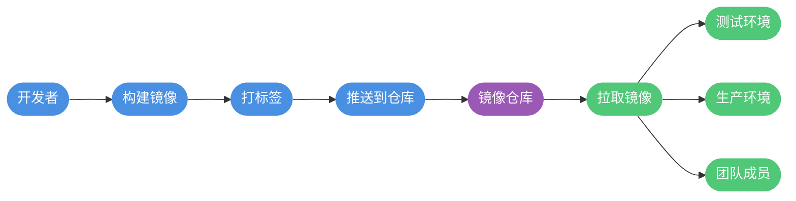

## 容器技术概述

在现代软件开发中,环境配置一直是困扰开发团队的难题。"在我的机器上明明可以运行"这样的问题屡见不鲜。Docker作为领先的容器化解决方案,彻底改变了应用程序的开发、分发和部署方式。

### 什么是容器

容器是一种轻量级的软件打包技术,它将应用程序及其所有运行时依赖项封装在一起,形成一个独立的运行单元。可以把容器理解为一个标准化的软件集装箱:

- 包含应用程序代码和所有必需的库文件
- 提供独立的运行环境
- 与宿主系统和其他容器相互隔离
- 可以在任何支持容器技术的平台上运行

用一个形象的比喻:如果说传统开发模式中,应用程序是散装货物,那么容器就是标准化的集装箱。无论货物是什么,只要装入集装箱,就可以用统一的方式进行运输、装卸和管理。


### Docker的核心价值

Docker是目前最流行的容器平台,它基于Go语言开发,利用Linux内核的Cgroup和namespace等技术实现进程级别的隔离。Docker的核心优势包括:

**环境一致性保障**
- 开发、测试、生产环境完全一致
- 消除"环境差异"导致的问题
- 新成员快速搭建开发环境

**资源利用率提升**
- 秒级启动速度
- 极低的内存和磁盘占用
- 同一台服务器可运行数百个容器

**应用交付简化**
- 一次构建,到处运行
- 版本化管理应用镜像
- 便捷的回滚和升级机制

**微服务架构支撑**
- 服务之间独立部署和扩展
- 容错隔离,单个服务故障不影响全局
- 灵活的服务编排能力


## 容器与虚拟机对比

理解容器技术的最佳方式是将其与传统虚拟机进行对比。两者都实现了资源隔离和分配,但技术原理和应用场景存在显著差异。

### 架构层面差异

**虚拟机架构**

虚拟机通过Hypervisor(虚拟机监控器)在物理硬件上模拟完整的计算机系统:

- 每个虚拟机运行独立的操作系统
- 需要虚拟化整套硬件资源(CPU、内存、磁盘等)
- Guest OS完全独立于Host OS
- 隔离级别极高,安全性强

**容器架构**

容器在操作系统层面实现虚拟化:

- 所有容器共享宿主机的操作系统内核
- 直接运行在宿主机之上
- 仅打包应用程序和依赖库
- 通过namespace和cgroup实现资源隔离


### 性能特性对比

| 对比维度 | 虚拟机 | 容器 |
|---------|--------|------|
| 启动速度 | 分钟级 | 秒级甚至毫秒级 |
| 磁盘占用 | GB级别(含完整OS) | MB级别(仅应用和库) |
| 性能损耗 | 5%-15% | 接近原生性能 |
| 系统支持量 | 单机几十个 | 单机数百上千个 |
| 隔离级别 | 操作系统级,高度隔离 | 进程级,中等隔离 |
| 封装程度 | 完整操作系统 | 仅应用程序 |

### 应用场景选择

**虚拟机更适合的场景:**
- 需要运行不同操作系统(如Windows和Linux混合环境)
- 安全隔离要求极高的场景
- 需要完整OS功能的传统应用
- 云服务提供商的多租户环境

**容器更适合的场景:**
- 微服务架构应用
- 持续集成/持续部署(CI/CD)流程
- 快速开发和测试环境搭建
- 需要快速扩缩容的应用
- 资源利用率要求高的场景

两者并非互相替代关系,而是可以协同工作。例如,在云环境中,可以在虚拟机上运行容器,兼具两者的优势。

## Docker核心组件

Docker平台由多个核心组件协同工作,共同构建完整的容器化解决方案。理解这三大核心概念是掌握Docker的关键。

### 镜像(Image):应用的静态蓝图

Docker镜像是一个只读的模板文件,包含运行应用所需的完整环境:

**镜像的本质**
- 基于Union FS的分层文件系统
- 每一层记录文件系统的变化
- 层层叠加形成完整的运行环境
- 采用写时复制(Copy-on-Write)策略

**分层存储机制**

镜像并非一个巨大的单一文件,而是由多个层(layer)组成:

```dockerfile
# 示例:Node.js应用镜像的分层结构
# 基础层:操作系统
FROM ubuntu:20.04

# 第二层:安装Node.js运行时
RUN apt-get update && apt-get install -y nodejs npm

# 第三层:设置工作目录
WORKDIR /usr/src/app

# 第四层:复制依赖配置文件
COPY package*.json ./

# 第五层:安装应用依赖
RUN npm install

# 第六层:复制应用源码
COPY . .

# 启动命令(不产生新层)
CMD ["node", "server.js"]
```

这种分层设计带来显著优势:
- 不同镜像可以共享相同的基础层,节省存储空间
- 镜像更新时只需下载变化的层
- 利于镜像的版本管理和回滚


### 容器(Container):应用的运行实例

容器是镜像的运行实例,就像类与对象的关系:

**容器的特点**
- 从镜像创建,继承镜像的所有文件
- 在镜像只读层之上添加可写层(容器层)
- 每个容器拥有独立的网络和进程空间
- 容器间相互隔离,互不影响

**容器生命周期管理**

```bash
# 创建并启动容器
docker run -d -p 3000:3000 --name my-node-app node-app:1.0

# 查看运行中的容器
docker ps

# 暂停容器
docker pause my-node-app

# 恢复容器
docker unpause my-node-app

# 停止容器
docker stop my-node-app

# 重启容器
docker restart my-node-app

# 删除容器
docker rm my-node-app
```

**容器数据持久化**

容器本身是临时的,容器删除后其内部数据会丢失。对于需要持久化的数据(如数据库文件),应使用数据卷:

```bash
# 创建命名数据卷
docker volume create postgres-data

# 运行数据库容器,挂载数据卷
docker run -d \
  --name postgres-db \
  -v postgres-data:/var/lib/postgresql/data \
  -e POSTGRES_PASSWORD=secret \
  postgres:14
```

### 仓库(Repository):镜像的分发中心

仓库是存储和分发镜像的场所,类似于代码托管平台:

**仓库类型**

- **公共仓库**
  - Docker Hub:官方公共镜像仓库
  - 阿里云容器镜像服务
  - 腾讯云容器镜像仓库
  - 华为云容器镜像服务

- **私有仓库**
  - Harbor:企业级开源镜像仓库
  - Docker Registry:官方提供的简易仓库
  - GitLab Container Registry

**镜像命名规范**

完整的镜像名称格式为:`registry/namespace/repository:tag`

```bash
# 官方镜像(省略registry和namespace)
docker pull nginx:1.21

# Docker Hub用户镜像
docker pull username/myapp:v1.0

# 私有仓库镜像
docker pull harbor.company.com/project/myapp:latest

# 阿里云镜像
docker pull registry.cn-hangzhou.aliyuncs.com/myspace/myapp:2.0
```

**镜像推送流程**

```bash
# 登录镜像仓库
docker login harbor.company.com

# 为本地镜像打标签
docker tag myapp:latest harbor.company.com/project/myapp:v1.0

# 推送到远程仓库
docker push harbor.company.com/project/myapp:v1.0
```



## Docker工作原理

### 容器隔离技术

Docker依赖Linux内核提供的两大核心技术实现容器隔离:

**Namespace(命名空间)**

Namespace为容器提供独立的系统资源视图:

| Namespace类型 | 隔离内容 | 应用场景 |
|--------------|---------|----------|
| PID | 进程ID | 容器内进程相互独立 |
| Network | 网络设备、协议栈 | 独立的网络配置 |
| Mount | 文件系统挂载点 | 独立的文件系统视图 |
| UTS | 主机名和域名 | 独立的主机标识 |
| IPC | 进程间通信 | 隔离消息队列等 |
| User | 用户和用户组 | 用户权限隔离 |

**Cgroup(控制组)**

Cgroup限制容器可使用的硬件资源:

```bash
# 限制容器使用的CPU和内存
docker run -d \
  --name resource-limited-app \
  --cpus="1.5" \
  --memory="1g" \
  --memory-swap="1g" \
  myapp:latest
```

- CPU限制:限制容器的CPU使用率
- 内存限制:设置内存使用上限,防止OOM
- 磁盘IO限制:控制读写速度
- 网络带宽限制:限制网络流量

### 镜像构建流程

通过Dockerfile可以将应用及其环境打包成镜像:

```dockerfile
# 多阶段构建示例:Java Spring Boot应用
# 阶段1:编译构建
FROM maven:3.8-openjdk-17 AS builder
WORKDIR /build
COPY pom.xml .
RUN mvn dependency:go-offline
COPY src ./src
RUN mvn package -DskipTests

# 阶段2:运行时镜像
FROM openjdk:17-jdk-slim
WORKDIR /app
COPY --from=builder /build/target/*.jar app.jar

# 创建非特权用户
RUN useradd -m appuser
USER appuser

EXPOSE 8080
ENTRYPOINT ["java", "-jar", "/app/app.jar"]
```

构建并运行:

```bash
# 构建镜像
docker build -t spring-app:1.0 .

# 运行容器
docker run -d \
  --name my-spring-app \
  -p 8080:8080 \
  -e SPRING_PROFILES_ACTIVE=prod \
  spring-app:1.0
```


Docker通过这些技术实现了轻量级的应用隔离和标准化交付,为云原生应用提供了坚实的基础。
