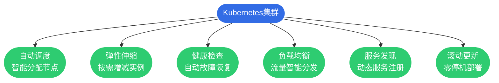

## Dockerfile镜像构建

Dockerfile是一个文本文件,包含了构建Docker镜像的所有指令。通过Dockerfile可以实现镜像构建的自动化和标准化,确保在不同环境下构建出一致的镜像。

### Dockerfile核心指令

Dockerfile由一系列指令组成,每条指令会在镜像中创建一个新的层。

**FROM - 指定基础镜像**

FROM指令必须是Dockerfile的第一条指令(注释除外),用于指定构建的基础镜像:

```dockerfile
# 使用官方Node.js镜像
FROM node:18-alpine

# 使用特定版本的JDK
FROM openjdk:17-jdk-slim

# 多阶段构建指定阶段名称
FROM maven:3.8-openjdk-17 AS builder
```

**LABEL - 添加元数据**

为镜像添加标签信息,便于镜像管理:

```dockerfile
LABEL maintainer="developer@company.com"
LABEL version="1.0.0"
LABEL description="电商系统订单服务"
LABEL org.opencontainers.image.source="https://github.com/company/order-service"
```

**ENV - 设置环境变量**

定义容器运行时的环境变量:

```dockerfile
# 设置应用环境
ENV NODE_ENV=production
ENV APP_PORT=3000

# 设置JVM参数
ENV JAVA_OPTS="-Xmx2g -Xms1g -XX:+UseG1GC"

# 多个变量同时设置
ENV TZ=Asia/Shanghai \
    LANG=C.UTF-8 \
    LC_ALL=C.UTF-8
```

**WORKDIR - 设置工作目录**

指定容器内的工作目录,后续指令的相对路径都基于此目录:

```dockerfile
# 设置工作目录
WORKDIR /app

# WORKDIR会自动创建目录
WORKDIR /usr/local/myapp/data

# 可以使用环境变量
WORKDIR ${APP_HOME}
```

**COPY和ADD - 复制文件**

将构建上下文中的文件复制到镜像中:

```dockerfile
# 复制单个文件
COPY package.json .

# 复制多个文件
COPY package.json package-lock.json ./

# 复制整个目录
COPY ./src ./src

# 支持通配符
COPY *.jar /app/

# 设置文件权限和所有者
COPY --chown=node:node app.js .
```

ADD指令功能更强,但通常推荐使用COPY:

```dockerfile
# ADD可以自动解压tar文件
ADD archive.tar.gz /data/

# ADD可以从URL下载文件(不推荐)
ADD https://example.com/file.txt /tmp/
```

**RUN - 执行命令**

在镜像构建过程中执行命令:

```dockerfile
# Shell格式
RUN apt-get update && apt-get install -y curl

# Exec格式(推荐,避免shell注入)
RUN ["npm", "install", "--production"]

# 多行命令使用反斜杠连接
RUN apt-get update && \
    apt-get install -y \
        git \
        curl \
        vim && \
    apt-get clean && \
    rm -rf /var/lib/apt/lists/*
```

**EXPOSE - 声明端口**

声明容器运行时监听的端口:

```dockerfile
# 声明HTTP端口
EXPOSE 8080

# 声明多个端口
EXPOSE 8080 8443 9090
```

注意:EXPOSE只是声明,实际运行时仍需通过-p参数映射端口。

**CMD和ENTRYPOINT - 容器启动命令**

CMD指定容器启动时的默认命令:

```dockerfile
# Exec格式(推荐)
CMD ["node", "server.js"]

# Shell格式
CMD npm start

# 为ENTRYPOINT提供默认参数
CMD ["--config", "/etc/myapp/config.yml"]
```

ENTRYPOINT指定容器启动时始终执行的命令:

```dockerfile
# 设置入口点
ENTRYPOINT ["java", "-jar", "app.jar"]

# 结合CMD提供默认参数
ENTRYPOINT ["python", "app.py"]
CMD ["--host", "0.0.0.0"]
```

ENTRYPOINT和CMD的组合:

```dockerfile
# 用户可以覆盖CMD,但ENTRYPOINT固定
ENTRYPOINT ["nginx"]
CMD ["-g", "daemon off;"]

# 运行时覆盖CMD参数
# docker run myimage -h
# 实际执行: nginx -h
```

**USER - 指定运行用户**

指定后续指令和容器运行时的用户:

```dockerfile
# 创建用户并切换
RUN adduser -D appuser
USER appuser

# 使用UID:GID格式
USER 1001:1001
```

**VOLUME - 声明数据卷**

声明需要持久化或共享的目录:

```dockerfile
# 声明单个挂载点
VOLUME /data

# 声明多个挂载点
VOLUME ["/var/log", "/var/cache"]
```

**ARG - 构建参数**

定义构建时可传递的变量:

```dockerfile
# 定义构建参数
ARG VERSION=1.0.0
ARG BUILD_DATE

# 使用构建参数
LABEL version=${VERSION}
LABEL build-date=${BUILD_DATE}

# 构建时传递参数
# docker build --build-arg VERSION=2.0.0 .
```

**HEALTHCHECK - 健康检查**

定义容器健康检查方式:

```dockerfile
# HTTP健康检查
HEALTHCHECK --interval=30s --timeout=3s --start-period=40s --retries=3 \
  CMD curl -f http://localhost:8080/health || exit 1

# 自定义健康检查脚本
HEALTHCHECK CMD /app/health-check.sh
```


### 多阶段构建优化

多阶段构建可以显著减小最终镜像的体积,提高安全性:

**Java应用多阶段构建**

```dockerfile
# 第一阶段:编译构建
FROM maven:3.8-openjdk-17 AS builder

# 设置工作目录
WORKDIR /build

# 复制Maven配置文件
COPY pom.xml .
COPY src ./src

# 编译打包
RUN mvn clean package -DskipTests

# 第二阶段:运行时镜像
FROM openjdk:17-jdk-slim

# 创建应用用户
RUN groupadd -r appuser && useradd -r -g appuser appuser

WORKDIR /app

# 仅复制编译产物
COPY --from=builder /build/target/*.jar app.jar

# 切换到非特权用户
USER appuser

# 健康检查
HEALTHCHECK --interval=30s --timeout=3s \
  CMD curl -f http://localhost:8080/actuator/health || exit 1

EXPOSE 8080

ENTRYPOINT ["java", "-jar", "app.jar"]
```

**Node.js应用多阶段构建**

```dockerfile
# 构建阶段
FROM node:18-alpine AS builder

WORKDIR /build

# 复制依赖配置
COPY package*.json ./

# 安装所有依赖(包括devDependencies)
RUN npm ci

# 复制源码
COPY . .

# 构建生产版本
RUN npm run build

# 运行阶段
FROM node:18-alpine

WORKDIR /app

# 仅安装生产依赖
COPY package*.json ./
RUN npm ci --only=production

# 复制构建产物
COPY --from=builder /build/dist ./dist

# 使用非root用户
USER node

EXPOSE 3000

CMD ["node", "dist/server.js"]
```

### 镜像构建最佳实践

**减少镜像层数**

合并多个RUN指令,减少镜像层:

```dockerfile
# 不推荐:创建多个层
RUN apt-get update
RUN apt-get install -y curl
RUN apt-get install -y git
RUN apt-get clean

# 推荐:合并为一个层
RUN apt-get update && \
    apt-get install -y curl git && \
    apt-get clean && \
    rm -rf /var/lib/apt/lists/*
```

**利用构建缓存**

合理安排指令顺序,充分利用Docker的层缓存:

```dockerfile
# 先复制依赖文件
COPY package*.json ./

# 安装依赖(此层可被缓存)
RUN npm install

# 最后复制源码(源码变化不影响依赖层)
COPY . .
```

**使用.dockerignore文件**

排除不必要的文件,加快构建速度:

```plaintext
# .dockerignore
node_modules
npm-debug.log
.git
.idea
*.md
.env.local
dist
coverage
.DS_Store
```

**选择合适的基础镜像**

优先选择官方的Alpine版本镜像:

```dockerfile
# 标准镜像(~900MB)
FROM node:18

# Alpine镜像(~170MB)
FROM node:18-alpine

# Distroless镜像(更小更安全)
FROM gcr.io/distroless/nodejs18-debian11
```

**构建示例命令**

```bash
# 基本构建
docker build -t myapp:1.0 .

# 指定Dockerfile路径
docker build -f Dockerfile.prod -t myapp:prod .

# 传递构建参数
docker build \
  --build-arg VERSION=2.0.0 \
  --build-arg BUILD_DATE=$(date -u +"%Y-%m-%dT%H:%M:%SZ") \
  -t myapp:2.0 .

# 不使用缓存
docker build --no-cache -t myapp:latest .

# 设置构建上下文
docker build -t myapp:1.0 ./myapp
```

## Docker Compose容器编排

对于包含多个容器的应用,手动管理每个容器既繁琐又容易出错。Docker Compose提供了声明式的容器编排方案,通过YAML文件定义整个应用栈。

### Docker Compose文件结构

一个典型的docker-compose.yml文件包含以下主要部分:

```yaml
version: '3.8'

services:
  # 服务定义
  
networks:
  # 网络定义
  
volumes:
  # 数据卷定义
```

### 服务配置详解

**基础配置**

```yaml
services:
  web:
    # 使用预构建镜像
    image: nginx:1.23-alpine
    
    # 或从Dockerfile构建
    build:
      context: ./web
      dockerfile: Dockerfile
      args:
        VERSION: "1.0"
    
    # 容器名称
    container_name: web-server
    
    # 端口映射
    ports:
      - "80:80"
      - "443:443"
    
    # 环境变量
    environment:
      - NODE_ENV=production
      - API_URL=http://api:8080
    
    # 从文件读取环境变量
    env_file:
      - ./config/.env.prod
    
    # 重启策略
    restart: unless-stopped
```

**依赖关系**

```yaml
services:
  database:
    image: postgres:14-alpine
    environment:
      POSTGRES_PASSWORD: secret
  
  backend:
    image: myapi:1.0
    depends_on:
      - database
    environment:
      DB_HOST: database
  
  frontend:
    image: myweb:1.0
    depends_on:
      - backend
    ports:
      - "80:80"
```

**数据卷挂载**

```yaml
services:
  db:
    image: postgres:14
    volumes:
      # 命名卷
      - postgres-data:/var/lib/postgresql/data
      # 绑定挂载
      - ./init.sql:/docker-entrypoint-initdb.d/init.sql:ro
      # 匿名卷
      - /var/lib/postgresql/cache

volumes:
  postgres-data:
    driver: local
```

**网络配置**

```yaml
services:
  app:
    image: myapp:1.0
    networks:
      - frontend
      - backend
  
  db:
    image: postgres:14
    networks:
      - backend

networks:
  frontend:
    driver: bridge
  backend:
    driver: bridge
    internal: true  # 内部网络,不对外
```

**资源限制**

```yaml
services:
  api:
    image: myapi:1.0
    deploy:
      resources:
        limits:
          cpus: '2.0'
          memory: 2G
        reservations:
          cpus: '1.0'
          memory: 1G
```

**健康检查**

```yaml
services:
  web:
    image: myapp:1.0
    healthcheck:
      test: ["CMD", "curl", "-f", "http://localhost:8080/health"]
      interval: 30s
      timeout: 10s
      retries: 3
      start_period: 40s
```

### 完整应用案例

**电商系统微服务架构**

```yaml
version: '3.8'

services:
  # Nginx反向代理
  nginx:
    image: nginx:1.23-alpine
    container_name: gateway
    ports:
      - "80:80"
      - "443:443"
    volumes:
      - ./nginx/nginx.conf:/etc/nginx/nginx.conf:ro
      - ./nginx/ssl:/etc/nginx/ssl:ro
    networks:
      - frontend
    depends_on:
      - user-service
      - product-service
      - order-service
    restart: unless-stopped

  # 用户服务
  user-service:
    build:
      context: ./services/user
      dockerfile: Dockerfile
    container_name: user-service
    environment:
      SPRING_PROFILES_ACTIVE: prod
      DB_HOST: postgres
      DB_NAME: users
      REDIS_HOST: redis
    networks:
      - frontend
      - backend
    depends_on:
      - postgres
      - redis
    restart: unless-stopped

  # 商品服务
  product-service:
    build:
      context: ./services/product
      dockerfile: Dockerfile
    container_name: product-service
    environment:
      SPRING_PROFILES_ACTIVE: prod
      DB_HOST: postgres
      DB_NAME: products
    networks:
      - frontend
      - backend
    depends_on:
      - postgres
    restart: unless-stopped

  # 订单服务
  order-service:
    build:
      context: ./services/order
      dockerfile: Dockerfile
    container_name: order-service
    environment:
      SPRING_PROFILES_ACTIVE: prod
      DB_HOST: postgres
      DB_NAME: orders
      RABBITMQ_HOST: rabbitmq
    networks:
      - frontend
      - backend
    depends_on:
      - postgres
      - rabbitmq
    restart: unless-stopped

  # PostgreSQL数据库
  postgres:
    image: postgres:14-alpine
    container_name: postgres-db
    environment:
      POSTGRES_PASSWORD: dbpass123
    volumes:
      - postgres-data:/var/lib/postgresql/data
      - ./init-scripts:/docker-entrypoint-initdb.d:ro
    networks:
      - backend
    restart: unless-stopped

  # Redis缓存
  redis:
    image: redis:7-alpine
    container_name: redis-cache
    command: redis-server --appendonly yes
    volumes:
      - redis-data:/data
    networks:
      - backend
    restart: unless-stopped

  # RabbitMQ消息队列
  rabbitmq:
    image: rabbitmq:3-management-alpine
    container_name: message-queue
    environment:
      RABBITMQ_DEFAULT_USER: admin
      RABBITMQ_DEFAULT_PASS: admin123
    ports:
      - "15672:15672"  # 管理界面
    volumes:
      - rabbitmq-data:/var/lib/rabbitmq
    networks:
      - backend
    restart: unless-stopped

networks:
  frontend:
    driver: bridge
  backend:
    driver: bridge
    internal: true

volumes:
  postgres-data:
  redis-data:
  rabbitmq-data:
```

### Docker Compose常用命令

**启动服务**

```bash
# 启动所有服务
docker-compose up

# 后台启动
docker-compose up -d

# 重建镜像并启动
docker-compose up --build

# 强制重新创建容器
docker-compose up --force-recreate

# 启动指定服务
docker-compose up nginx postgres
```

**停止服务**

```bash
# 停止所有服务
docker-compose down

# 停止并删除卷
docker-compose down -v

# 停止但不删除容器
docker-compose stop

# 停止指定服务
docker-compose stop user-service
```

**查看服务状态**

```bash
# 查看运行中的服务
docker-compose ps

# 查看所有服务(包括已停止)
docker-compose ps -a

# 查看服务日志
docker-compose logs

# 实时查看日志
docker-compose logs -f

# 查看指定服务日志
docker-compose logs -f nginx
```

**服务管理**

```bash
# 重启服务
docker-compose restart

# 暂停服务
docker-compose pause

# 恢复服务
docker-compose unpause

# 执行命令
docker-compose exec web sh

# 扩展服务实例
docker-compose up -d --scale api=3
```

**构建和推送**

```bash
# 构建镜像
docker-compose build

# 构建指定服务
docker-compose build user-service

# 不使用缓存构建
docker-compose build --no-cache

# 推送镜像到仓库
docker-compose push
```


## 容器编排进阶:Kubernetes

当应用规模增长到需要管理成百上千个容器时,Docker Compose就显得力不从心了。Kubernetes(K8s)作为容器编排的事实标准,提供了企业级的容器管理能力。

### 为什么需要Kubernetes

Docker和Docker Compose虽然解决了容器化和基本编排问题,但在大规模生产环境中存在以下局限:

**Docker的局限性**
- 单机管理,无法跨主机编排
- 没有自动故障恢复机制
- 手动扩缩容,效率低下
- 缺少负载均衡能力
- 服务发现能力有限

**Kubernetes的核心能力**



### K8s核心概念

**Pod - 最小部署单元**

Pod是K8s中的基本调度单位,可以包含一个或多个紧密协作的容器:

```yaml
apiVersion: v1
kind: Pod
metadata:
  name: web-app
  labels:
    app: web
spec:
  containers:
  - name: nginx
    image: nginx:1.23
    ports:
    - containerPort: 80
  - name: log-agent
    image: fluentd:latest
```

**Deployment - 应用部署**

Deployment管理Pod的副本数量和更新策略:

```yaml
apiVersion: apps/v1
kind: Deployment
metadata:
  name: api-deployment
spec:
  replicas: 3
  selector:
    matchLabels:
      app: api
  template:
    metadata:
      labels:
        app: api
    spec:
      containers:
      - name: api
        image: myapi:1.0
        ports:
        - containerPort: 8080
        resources:
          limits:
            cpu: "1"
            memory: "1Gi"
          requests:
            cpu: "500m"
            memory: "512Mi"
```

**Service - 服务发现**

Service为Pod提供稳定的网络访问入口:

```yaml
apiVersion: v1
kind: Service
metadata:
  name: api-service
spec:
  type: LoadBalancer
  selector:
    app: api
  ports:
  - protocol: TCP
    port: 80
    targetPort: 8080
```

### Docker vs Kubernetes对比

| 特性 | Docker/Docker Compose | Kubernetes |
|-----|---------------------|------------|
| 适用规模 | 单机或小规模集群 | 大规模分布式集群 |
| 自动调度 | 不支持 | 智能调度到最优节点 |
| 故障恢复 | 手动重启 | 自动检测并重启 |
| 弹性伸缩 | 手动扩容 | 自动横向扩展 |
| 负载均衡 | 需要额外配置 | 内置负载均衡 |
| 滚动更新 | 需要脚本实现 | 原生支持零停机更新 |
| 学习曲线 | 较平缓 | 较陡峭 |
| 适用场景 | 开发测试、小型应用 | 生产环境、微服务架构 |

### 何时选择K8s

**适合使用Kubernetes的场景:**
- 微服务架构,服务数量众多
- 需要跨多个数据中心部署
- 对高可用性有严格要求
- 需要自动化的故障恢复
- 流量波动大,需要弹性伸缩
- 团队有DevOps文化和实践

**继续使用Docker Compose的场景:**
- 单体应用或服务数量少
- 开发和测试环境
- 单机或小规模部署
- 团队规模小,运维资源有限
- 快速原型验证


## 总结

通过Dockerfile可以实现镜像构建的自动化,多阶段构建技术能够显著优化镜像体积。Docker Compose为多容器应用提供了声明式的编排方案,适合中小规模的应用部署。当应用规模增长到一定程度,Kubernetes提供了企业级的容器编排能力,支持大规模分布式部署和自动化运维。

选择合适的工具取决于具体的应用场景和团队能力。对于大多数开发团队,掌握Docker和Docker Compose已经能够满足日常的容器化需求。
