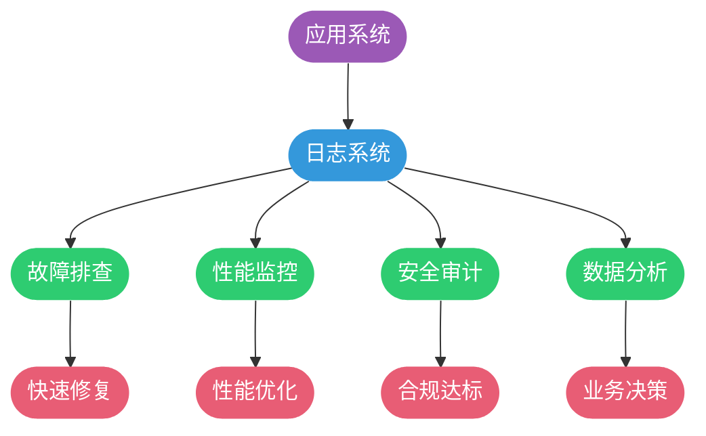

# Java日志框架与门面模式

## 日志在应用开发中的作用

日志是软件系统运行过程中产生的结构化或非结构化文字信息，它就像系统的"黑匣子"，记录着应用运行的每一个关键时刻。在生产环境中，我们无法像开发时那样使用调试器逐行排查问题，日志成为了定位故障、分析性能、审计操作的核心手段。

### 日志的核心价值

**问题诊断与追踪**
- 记录异常堆栈信息，快速定位错误根源
- 追踪业务流程执行路径，发现逻辑缺陷
- 分析系统运行状态，及时发现潜在风险

**运营数据分析**
- 统计用户行为模式，优化产品设计
- 监控系统性能指标，支撑容量规划
- 生成业务报表，辅助决策分析

**安全审计追溯**
- 记录敏感操作日志，满足合规要求
- 追踪用户访问轨迹，防范安全威胁
- 保留操作证据，支持事后审计



### 何时记录日志

阿里巴巴Java开发手册明确规定了日志记录的时机，结合实践经验总结如下：

**系统初始化阶段**

在服务启动或核心模块加载时，务必记录关键配置参数：

```java
public class OrderServiceInitializer {
    private static final Logger logger = LoggerFactory.getLogger(OrderServiceInitializer.class);
    
    public void initialize(ServiceConfig config) {
        logger.info("订单服务开始初始化，数据源配置: {}, 超时设置: {}ms, 重试次数: {}", 
            config.getDataSource(), 
            config.getTimeout(), 
            config.getRetryCount());
        
        // 初始化逻辑
        
        logger.info("订单服务初始化完成，当前运行模式: {}", config.getMode());
    }
}
```

**异常捕获处理**

编程语言提示的异常通常包含重要信息，应当记录完整堆栈：

```java
public class PaymentProcessor {
    private static final Logger logger = LoggerFactory.getLogger(PaymentProcessor.class);
    
    public PaymentResult processPayment(PaymentRequest request) {
        try {
            return paymentGateway.execute(request);
        } catch (NetworkException e) {
            logger.error("支付网关调用失败，订单号: {}", request.getOrderId(), e);
            return PaymentResult.networkError();
        } catch (InsufficientBalanceException e) {
            logger.warn("用户余额不足，用户ID: {}, 所需金额: {}", 
                request.getUserId(), request.getAmount(), e);
            return PaymentResult.insufficientBalance();
        }
    }
}
```

**业务流程分支**

关键业务逻辑的分支走向需要记录，便于追踪流程：

```java
public class RiskControlService {
    private static final Logger logger = LoggerFactory.getLogger(RiskControlService.class);
    
    public boolean checkTransaction(Transaction tx) {
        RiskLevel level = calculateRiskLevel(tx);
        
        if (level == RiskLevel.HIGH) {
            logger.warn("检测到高风险交易，交易ID: {}, 风险因子: {}", 
                tx.getId(), tx.getRiskFactors());
            return false;
        } else if (level == RiskLevel.MEDIUM) {
            logger.info("中风险交易需人工审核，交易ID: {}", tx.getId());
            submitForManualReview(tx);
            return false;
        }
        
        logger.debug("交易通过风控检查，交易ID: {}", tx.getId());
        return true;
    }
}
```

**第三方服务调用**

远程调用务必记录请求和响应参数，第三方服务的日志往往难以获取：

```java
public class SmsNotificationService {
    private static final Logger logger = LoggerFactory.getLogger(SmsNotificationService.class);
    
    public void sendVerificationCode(String mobile, String code) {
        SmsRequest request = SmsRequest.builder()
            .mobile(mobile)
            .template("SMS_VERIFY")
            .params(Map.of("code", code))
            .build();
        
        logger.info("发送短信验证码，手机号: {}, 模板: {}", mobile, request.getTemplate());
        
        SmsResponse response = smsClient.send(request);
        
        if (response.isSuccess()) {
            logger.info("短信发送成功，流水号: {}", response.getMessageId());
        } else {
            logger.error("短信发送失败，错误码: {}, 错误信息: {}", 
                response.getErrorCode(), response.getErrorMsg());
        }
    }
}
```

## Java日志框架生态

Java生态中的日志组件可以划分为三个层次：接口层（门面）、实现层（框架）、适配层（桥接器）。这种分层设计遵循了依赖倒置原则，使得应用代码与具体实现解耦。


### 主流日志框架演进

**java.util.logging (JUL)**

JDK 1.4引入的原生日志实现，无需额外依赖，但功能较弱：

```java
import java.util.logging.Logger;
import java.util.logging.Level;

public class JulExample {
    private static final Logger logger = Logger.getLogger(JulExample.class.getName());
    
    public void execute() {
        logger.log(Level.INFO, "使用JUL记录日志");
        logger.log(Level.WARNING, "配置灵活性较差");
    }
}
```

**Log4j 1.x**

2001年加入Apache基金会，提供了强大的配置能力，但存在性能瓶颈。Apache已于2015年宣布停止维护，全面转向Log4j 2。

**Logback**

由Log4j创始人Ceki Gülcü开发，是SLF4J的原生实现，目前应用最广泛：

- 自动重载配置文件
- 内置过滤器和条件处理
- 压缩归档历史日志
- 优秀的性能表现

**Log4j 2**

Apache推出的新一代日志框架，重写了整体架构：

- 插件化架构设计
- 异步日志器（Async Logger）
- 无垃圾收集模式（Garbage-free）
- 支持Lambda表达式

### 日志门面的价值

日志门面是门面模式在日志领域的经典应用。它定义统一的API接口，将应用代码与具体日志实现隔离，带来以下优势：

**解耦应用与实现**

应用代码只依赖门面接口，底层框架可以随意切换：

```java
// 应用代码始终使用SLF4J API
import org.slf4j.Logger;
import org.slf4j.LoggerFactory;

public class UserService {
    // 编译时依赖slf4j-api
    private static final Logger logger = LoggerFactory.getLogger(UserService.class);
    
    public void registerUser(UserInfo userInfo) {
        logger.info("新用户注册，用户名: {}", userInfo.getUsername());
        // 业务逻辑
    }
}
```

```xml
<!-- 运行时切换实现：从Logback切换到Log4j2只需更换依赖 -->

<!-- 使用Logback实现 -->
<dependency>
    <groupId>ch.qos.logback</groupId>
    <artifactId>logback-classic</artifactId>
</dependency>

<!-- 切换为Log4j2实现 -->
<dependency>
    <groupId>org.apache.logging.log4j</groupId>
    <artifactId>log4j-slf4j-impl</artifactId>
</dependency>
```

**统一团队规范**

不同模块可能使用不同日志框架，门面提供统一编码风格：


**简化日志输出**

SLF4J提供参数化日志，避免手动字符串拼接：

```java
// 不推荐：手动拼接字符串
logger.debug("处理订单，订单号: " + orderId + ", 金额: " + amount);

// 推荐：使用占位符
logger.debug("处理订单，订单号: {}, 金额: {}", orderId, amount);
```

参数化日志的优势：
- 日志级别关闭时，不会执行字符串拼接
- 代码更简洁，可读性更强
- 避免字符串拼接产生的临时对象

### SLF4J最佳实践

**正确的Logger声明**

```java
import org.slf4j.Logger;
import org.slf4j.LoggerFactory;

public class OrderController {
    // 使用当前类的Class对象
    private static final Logger logger = LoggerFactory.getLogger(OrderController.class);
    
    // 不推荐：使用字符串（拼写错误难以发现）
    // private static final Logger logger = LoggerFactory.getLogger("OrderController");
}
```

**异常日志的规范记录**

```java
public class FileProcessor {
    private static final Logger logger = LoggerFactory.getLogger(FileProcessor.class);
    
    // 错误示例：只记录异常消息，丢失堆栈信息
    public void processFileBad(String path) {
        try {
            Files.readAllLines(Paths.get(path));
        } catch (IOException e) {
            logger.error("文件读取失败: {}", e.getMessage()); // 堆栈信息丢失
        }
    }
    
    // 正确示例：完整记录异常
    public void processFileGood(String path) {
        try {
            Files.readAllLines(Paths.get(path));
        } catch (IOException e) {
            logger.error("文件读取失败，路径: {}", path, e); // 保留完整堆栈
        }
    }
}
```

**避免重复记录异常**

```java
public class InvoiceService {
    private static final Logger logger = LoggerFactory.getLogger(InvoiceService.class);
    
    public void generateInvoice(Order order) {
        try {
            invoiceGenerator.generate(order);
        } catch (GenerationException e) {
            // 不推荐：记录后又抛出，导致日志重复
            logger.error("发票生成失败", e);
            throw e; 
        }
    }
    
    // 推荐方案一：只记录不抛出
    public void generateInvoiceV1(Order order) {
        try {
            invoiceGenerator.generate(order);
        } catch (GenerationException e) {
            logger.error("发票生成失败，订单号: {}", order.getId(), e);
            // 处理异常，不再抛出
        }
    }
    
    // 推荐方案二：包装后抛出
    public void generateInvoiceV2(Order order) throws InvoiceException {
        try {
            invoiceGenerator.generate(order);
        } catch (GenerationException e) {
            throw new InvoiceException("发票生成失败", e); // 上层统一记录
        }
    }
}
```

**选择合适的日志级别**

```java
public class InventoryService {
    private static final Logger logger = LoggerFactory.getLogger(InventoryService.class);
    
    public boolean deductStock(String productId, int quantity) {
        // DEBUG: 详细的调试信息，生产环境关闭
        logger.debug("准备扣减库存，商品ID: {}, 数量: {}", productId, quantity);
        
        Stock stock = stockRepository.findById(productId);
        
        if (stock == null) {
            // WARN: 警告信息，业务可继续但需关注
            logger.warn("商品库存记录不存在，商品ID: {}", productId);
            return false;
        }
        
        if (stock.getQuantity() < quantity) {
            // INFO: 正常的业务事件
            logger.info("库存不足，商品ID: {}, 当前库存: {}, 需要: {}", 
                productId, stock.getQuantity(), quantity);
            return false;
        }
        
        try {
            stock.deduct(quantity);
            stockRepository.save(stock);
            // INFO: 成功的关键操作
            logger.info("库存扣减成功，商品ID: {}, 扣减: {}, 剩余: {}", 
                productId, quantity, stock.getQuantity());
            return true;
        } catch (Exception e) {
            // ERROR: 错误信息，影响业务功能
            logger.error("库存扣减失败，商品ID: {}", productId, e);
            return false;
        }
    }
}
```

## Spring Boot中的日志配置

Spring Boot默认使用Logback作为日志实现，提供了开箱即用的日志功能。

### 快速配置日志级别

在`application.yml`中配置：

```yaml
logging:
  level:
    root: INFO
    com.company.order: DEBUG
    com.company.payment: WARN
    org.springframework.web: INFO
    org.hibernate.SQL: DEBUG
  file:
    name: logs/application.log
    max-size: 10MB
    max-history: 30
  pattern:
    console: "%d{HH:mm:ss.SSS} [%thread] %-5level %logger{36} - %msg%n"
    file: "%d{yyyy-MM-dd HH:mm:ss.SSS} [%thread] %-5level %logger{50} - %msg%n"
```

### 自定义Logback配置

创建`logback-spring.xml`实现高级配置：

```xml
<?xml version="1.0" encoding="UTF-8"?>
<configuration>
    <!-- 控制台输出 -->
    <appender name="CONSOLE" class="ch.qos.logback.core.ConsoleAppender">
        <encoder>
            <pattern>%d{HH:mm:ss.SSS} [%thread] %-5level %logger{36} - %msg%n</pattern>
            <charset>UTF-8</charset>
        </encoder>
    </appender>
    
    <!-- 文件输出 -->
    <appender name="FILE" class="ch.qos.logback.core.rolling.RollingFileAppender">
        <file>logs/app.log</file>
        <rollingPolicy class="ch.qos.logback.core.rolling.TimeBasedRollingPolicy">
            <fileNamePattern>logs/app.%d{yyyy-MM-dd}.%i.log.gz</fileNamePattern>
            <timeBasedFileNamingAndTriggeringPolicy 
                class="ch.qos.logback.core.rolling.SizeAndTimeBasedFNATP">
                <maxFileSize>100MB</maxFileSize>
            </timeBasedFileNamingAndTriggeringPolicy>
            <maxHistory>30</maxHistory>
        </rollingPolicy>
        <encoder>
            <pattern>%d{yyyy-MM-dd HH:mm:ss.SSS} [%thread] %-5level %logger{50} - %msg%n</pattern>
        </encoder>
    </appender>
    
    <!-- 错误日志单独输出 -->
    <appender name="ERROR_FILE" class="ch.qos.logback.core.rolling.RollingFileAppender">
        <filter class="ch.qos.logback.classic.filter.LevelFilter">
            <level>ERROR</level>
            <onMatch>ACCEPT</onMatch>
            <onMismatch>DENY</onMismatch>
        </filter>
        <file>logs/error.log</file>
        <rollingPolicy class="ch.qos.logback.core.rolling.TimeBasedRollingPolicy">
            <fileNamePattern>logs/error.%d{yyyy-MM-dd}.log</fileNamePattern>
            <maxHistory>90</maxHistory>
        </rollingPolicy>
        <encoder>
            <pattern>%d{yyyy-MM-dd HH:mm:ss.SSS} [%thread] %-5level %logger{50} - %msg%n</pattern>
        </encoder>
    </appender>
    
    <root level="INFO">
        <appender-ref ref="CONSOLE"/>
        <appender-ref ref="FILE"/>
        <appender-ref ref="ERROR_FILE"/>
    </root>
</configuration>
```

通过日志门面模式，我们实现了应用代码与日志框架的解耦，为后续的维护和升级打下了坚实基础。接下来我们将探讨如何优化日志记录的性能。
