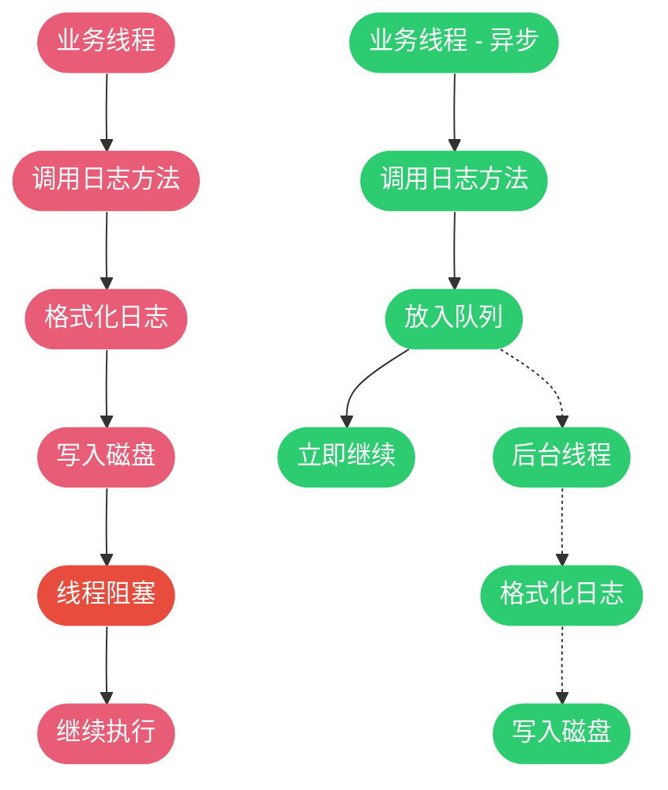
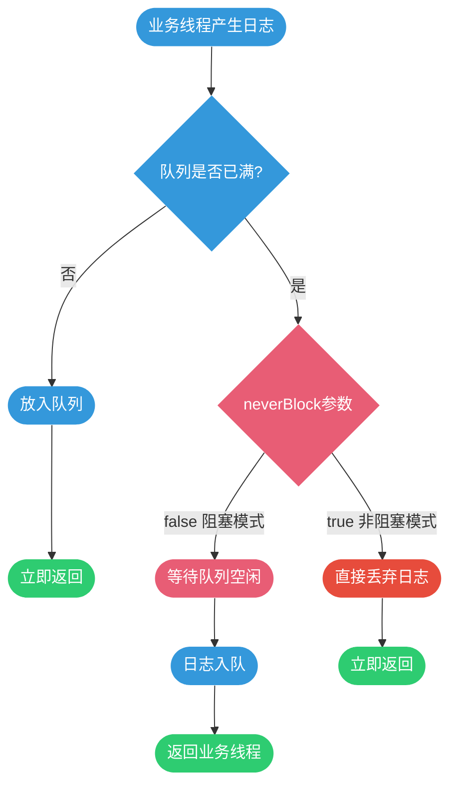

# 日志性能优化实践

## 日志对性能的影响

日志记录看似简单的一行代码，实际上涉及多个耗时操作：字符串拼接、对象序列化、磁盘IO写入。在高并发场景下，不当的日志使用可能成为系统性能的瓶颈。

### 日志操作的性能开销

**字符串拼接成本**

每次日志输出都可能产生大量临时字符串对象：

```java
public class StringConcatPerformance {
    private static final Logger logger = LoggerFactory.getLogger(StringConcatPerformance.class);
    
    // 低效写法：即使日志级别关闭也会执行拼接
    public void processOrder(Order order) {
        logger.debug("开始处理订单: " + order.getId() + 
                     ", 用户: " + order.getUsername() + 
                     ", 金额: " + order.getAmount() + 
                     ", 商品: " + Arrays.toString(order.getItems()));
        // 即使DEBUG级别关闭，字符串拼接仍会执行
    }
    
    // 高效写法：使用占位符
    public void processOrderOptimized(Order order) {
        logger.debug("开始处理订单: {}, 用户: {}, 金额: {}, 商品: {}", 
                     order.getId(), order.getUsername(), 
                     order.getAmount(), order.getItems());
        // 日志级别关闭时，参数不会被计算
    }
}
```

**对象序列化开销**

复杂对象转换为字符串需要消耗CPU和内存：

```java
public class SerializationOverhead {
    private static final Logger logger = LoggerFactory.getLogger(SerializationOverhead.class);
    
    // 问题代码：每次都执行JSON序列化
    public void processRequest(ComplexRequest request) {
        logger.debug("接收到请求: " + JSON.toJSONString(request));
        // JSON序列化是昂贵操作，包含大量对象时更明显
    }
    
    // 优化方案：延迟序列化
    public void processRequestOptimized(ComplexRequest request) {
        if (logger.isDebugEnabled()) {
            logger.debug("接收到请求: {}", JSON.toJSONString(request));
        }
        // 只在需要时才执行序列化
    }
}
```

**磁盘IO阻塞**

同步写入磁盘会阻塞业务线程：



## 条件日志：避免无效计算

### isXxxEnabled条件检查

在记录日志前判断级别是否启用，可避免不必要的参数计算：

```java
public class ConditionalLogging {
    private static final Logger logger = LoggerFactory.getLogger(ConditionalLogging.class);
    
    public void handleEvent(Event event) {
        // 方法调用开销示例
        if (logger.isDebugEnabled()) {
            logger.debug("事件详情: {}", buildDetailedReport(event));
        }
        // buildDetailedReport只在DEBUG开启时执行
    }
    
    private String buildDetailedReport(Event event) {
        // 模拟复杂计算
        StringBuilder report = new StringBuilder();
        report.append("事件ID: ").append(event.getId());
        report.append(", 时间戳: ").append(event.getTimestamp());
        report.append(", 来源: ").append(event.getSource());
        // 查询关联数据
        List<RelatedData> relatedData = queryRelatedData(event.getId());
        report.append(", 关联数据: ").append(relatedData);
        return report.toString();
    }
    
    private List<RelatedData> queryRelatedData(String eventId) {
        // 模拟数据库查询
        return Collections.emptyList();
    }
}
```

### 开源框架中的实践

**Spring框架中的应用**

```java
// Spring AbstractAutowireCapableBeanFactory源码
public class BeanCreationExample {
    private static final Logger logger = LoggerFactory.getLogger(BeanCreationExample.class);
    
    protected Object createBean(String beanName, RootBeanDefinition mbd, Object[] args) {
        if (logger.isTraceEnabled()) {
            logger.trace("创建Bean实例: {}", beanName);
        }
        
        // Bean创建逻辑
        
        if (logger.isDebugEnabled()) {
            logger.debug("完成Bean创建: {}, 类型: {}", beanName, mbd.getBeanClass());
        }
        
        return null; // 简化示例
    }
}
```

**Dubbo框架中的应用**

```java
// Dubbo ProtocolFilterWrapper源码示例
public class RpcInvocationExample {
    private static final Logger logger = LoggerFactory.getLogger(RpcInvocationExample.class);
    
    public Result invoke(Invoker<?> invoker, Invocation invocation) {
        if (logger.isInfoEnabled()) {
            logger.info("RPC调用: {}.{}", 
                invoker.getInterface().getName(),
                invocation.getMethodName());
        }
        
        long startTime = System.currentTimeMillis();
        Result result = invoker.invoke(invocation);
        
        if (logger.isDebugEnabled()) {
            long elapsed = System.currentTimeMillis() - startTime;
            logger.debug("RPC调用完成，耗时: {}ms", elapsed);
        }
        
        return result;
    }
}
```

### 性能对比测试

通过JMH基准测试对比不同方式的性能差异：

```java
@State(Scope.Benchmark)
@BenchmarkMode(Mode.Throughput)
@OutputTimeUnit(TimeUnit.MILLISECONDS)
public class LoggingBenchmark {
    private static final Logger logger = LoggerFactory.getLogger(LoggingBenchmark.class);
    private UserInfo userInfo;
    
    @Setup
    public void setup() {
        // 设置DEBUG级别为关闭
        ((ch.qos.logback.classic.Logger) logger).setLevel(Level.INFO);
        userInfo = new UserInfo("user123", "张三", "18888888888");
    }
    
    @Benchmark
    public void stringConcatenation() {
        // 方式1: 字符串拼接（最慢）
        logger.debug("用户信息: " + userInfo.getId() + 
                     ", 姓名: " + userInfo.getName() + 
                     ", 手机: " + userInfo.getPhone());
    }
    
    @Benchmark
    public void placeholderWithoutCheck() {
        // 方式2: 占位符（较快）
        logger.debug("用户信息: {}, 姓名: {}, 手机: {}", 
                     userInfo.getId(), userInfo.getName(), userInfo.getPhone());
    }
    
    @Benchmark
    public void placeholderWithCheck() {
        // 方式3: 条件检查 + 占位符（最快）
        if (logger.isDebugEnabled()) {
            logger.debug("用户信息: {}, 姓名: {}, 手机: {}", 
                         userInfo.getId(), userInfo.getName(), userInfo.getPhone());
        }
    }
}

// 测试结果（仅供参考，实际结果依赖环境）
// stringConcatenation:            8,500 ops/ms
// placeholderWithoutCheck:       45,000 ops/ms
// placeholderWithCheck:         320,000 ops/ms
```

## 异步日志：解放业务线程

### 同步日志的性能瓶颈

同步日志会导致业务线程等待IO操作完成：

```java
public class SyncLoggingProblem {
    private static final Logger logger = LoggerFactory.getLogger(SyncLoggingProblem.class);
    
    public OrderResult createOrder(OrderRequest request) {
        long startTime = System.currentTimeMillis();
        
        // 1. 业务逻辑执行：50ms
        Order order = buildOrder(request);
        
        // 2. 同步日志写入：可能阻塞5-10ms
        logger.info("订单创建成功，订单号: {}, 用户: {}, 金额: {}", 
                    order.getId(), order.getUserId(), order.getAmount());
        
        // 3. 继续业务逻辑
        notifyUser(order);
        
        long totalTime = System.currentTimeMillis() - startTime;
        // 总耗时 = 业务逻辑 + 日志IO，日志占比可达10%-15%
        
        return OrderResult.success(order);
    }
    
    private Order buildOrder(OrderRequest request) {
        return new Order(); // 简化示例
    }
    
    private void notifyUser(Order order) {
        // 通知用户
    }
}
```

### Logback异步日志配置

使用AsyncAppender将日志写入操作交给后台线程：

```xml
<configuration>
    <!-- 同步文件输出Appender -->
    <appender name="FILE" class="ch.qos.logback.core.rolling.RollingFileAppender">
        <file>logs/application.log</file>
        <rollingPolicy class="ch.qos.logback.core.rolling.TimeBasedRollingPolicy">
            <fileNamePattern>logs/application.%d{yyyy-MM-dd}.log</fileNamePattern>
            <maxHistory>30</maxHistory>
        </rollingPolicy>
        <encoder>
            <pattern>%d{yyyy-MM-dd HH:mm:ss.SSS} [%thread] %-5level %logger{50} - %msg%n</pattern>
        </encoder>
    </appender>
    
    <!-- 异步Appender包装 -->
    <appender name="ASYNC_FILE" class="ch.qos.logback.classic.AsyncAppender">
        <!-- 引用实际的输出Appender -->
        <appender-ref ref="FILE"/>
        
        <!-- 队列大小，默认256，高并发场景建议调大 -->
        <queueSize>1024</queueSize>
        
        <!-- 丢弃阈值，队列剩余容量小于此值时丢弃TRACE/DEBUG/INFO日志 -->
        <!-- 设为0表示不丢弃任何日志 -->
        <discardingThreshold>0</discardingThreshold>
        
        <!-- 队列满时是否阻塞，false会阻塞，true会丢弃日志 -->
        <neverBlock>false</neverBlock>
        
        <!-- 是否提取调用者信息（类名、方法名、行号），开启会影响性能 -->
        <includeCallerData>false</includeCallerData>
    </appender>
    
    <root level="INFO">
        <appender-ref ref="ASYNC_FILE"/>
    </root>
</configuration>
```

### 异步日志关键参数调优

**queueSize - 队列容量**

决定了可缓冲的日志事件数量：

```java
public class QueueSizeExample {
    // 场景1: 低并发系统
    // queueSize: 256（默认值）
    // 每秒100条日志，队列足够
    
    // 场景2: 高并发系统
    // queueSize: 1024 或 2048
    // 每秒10000+条日志，需要更大队列
    
    // 计算公式（参考）：
    // queueSize = 预期QPS × 日志写入延迟（秒）× 安全系数(2-3)
}
```

**discardingThreshold - 丢弃阈值**

队列剩余容量低于此百分比时开始丢弃低级别日志：

```java
public class DiscardingThresholdExample {
    // discardingThreshold = 20（默认值）
    // 队列容量256，剩余容量 < 51 (256*0.2) 时
    // 开始丢弃TRACE、DEBUG、INFO级别日志
    // 保留WARN和ERROR日志
    
    // discardingThreshold = 0
    // 不丢弃任何日志，直到队列满
    // 适用于日志完整性要求高的场景
}
```

**neverBlock - 非阻塞模式**

控制队列满时的行为策略：



```java
public class NeverBlockExample {
    // neverBlock = false（默认）
    // 队列满时，业务线程等待，保证日志不丢失
    // 适用于：日志完整性要求高，可接受短暂阻塞
    
    // neverBlock = true
    // 队列满时，直接丢弃日志，业务线程不阻塞
    // 适用于：性能要求极高，可接受日志丢失
    //        如：大促期间、秒杀场景
}
```

### Log4j2异步日志配置

Log4j2提供了两种异步方式：AsyncAppender和AsyncLogger。

**AsyncAppender方式**

```xml
<?xml version="1.0" encoding="UTF-8"?>
<Configuration status="WARN">
    <Appenders>
        <!-- 同步文件输出 -->
        <RollingFile name="FileAppender" fileName="logs/app.log"
                     filePattern="logs/app-%d{yyyy-MM-dd}.log">
            <PatternLayout>
                <Pattern>%d{yyyy-MM-dd HH:mm:ss.SSS} [%t] %-5level %logger{36} - %msg%n</Pattern>
            </PatternLayout>
            <Policies>
                <TimeBasedTriggeringPolicy/>
                <SizeBasedTriggeringPolicy size="100MB"/>
            </Policies>
        </RollingFile>
        
        <!-- 异步Appender -->
        <Async name="AsyncAppender" bufferSize="1024">
            <AppenderRef ref="FileAppender"/>
        </Async>
    </Appenders>
    
    <Loggers>
        <Root level="INFO">
            <AppenderRef ref="AsyncAppender"/>
        </Root>
    </Loggers>
</Configuration>
```

**AsyncLogger方式（性能更优）**

```xml
<?xml version="1.0" encoding="UTF-8"?>
<Configuration status="WARN">
    <Appenders>
        <RollingFile name="FileAppender" fileName="logs/app.log"
                     filePattern="logs/app-%d{yyyy-MM-dd}.log">
            <PatternLayout>
                <Pattern>%d{yyyy-MM-dd HH:mm:ss.SSS} [%t] %-5level %logger{36} - %msg%n</Pattern>
            </PatternLayout>
        </RollingFile>
    </Appenders>
    
    <Loggers>
        <!-- 异步Logger，性能优于AsyncAppender -->
        <AsyncLogger name="com.company" level="INFO" includeLocation="false">
            <AppenderRef ref="FileAppender"/>
        </AsyncLogger>
        
        <Root level="INFO">
            <AppenderRef ref="FileAppender"/>
        </Root>
    </Loggers>
</Configuration>
```

同时在`log4j2.component.properties`中配置：

```properties
# 使用LMAX Disruptor实现异步
Log4jContextSelector=org.apache.logging.log4j.core.async.AsyncLoggerContextSelector

# 异步队列大小
AsyncLogger.RingBufferSize=262144

# 等待策略：Block(默认), Sleep, Yield
AsyncLogger.WaitStrategy=Block
```

### 异步日志的注意事项

**MDC上下文传递问题**

异步日志会导致ThreadLocal中的MDC数据丢失：

```java
public class MdcProblem {
    private static final Logger logger = LoggerFactory.getLogger(MdcProblem.class);
    
    public void handleRequest(String requestId) {
        // 在主线程设置traceId
        MDC.put("traceId", requestId);
        
        logger.info("开始处理请求"); 
        // 异步日志：后台线程获取不到traceId
        
        // 业务逻辑
        
        MDC.clear();
    }
}
```

解决方案：

**方案一：使用TransmittableThreadLocal**

```xml
<dependency>
    <groupId>com.alibaba</groupId>
    <artifactId>transmittable-thread-local</artifactId>
    <version>2.14.2</version>
</dependency>
```

**方案二：自定义AsyncAppender**

```java
public class MdcAsyncAppender extends AsyncAppender {
    
    @Override
    protected void append(LoggingEvent event) {
        // 在日志事件中保存MDC上下文
        event.getMDCPropertyMap();
        super.append(event);
    }
}
```

**方案三：使用logback-mdc-ttl扩展**

```xml
<dependency>
    <groupId>com.ofpay</groupId>
    <artifactId>logback-mdc-ttl</artifactId>
    <version>1.0.2</version>
</dependency>
```

```xml
<configuration>
    <appender name="ASYNC" class="com.ofpay.logback.mdc.async.TtlMdcAsyncAppender">
        <appender-ref ref="FILE"/>
    </appender>
</configuration>
```

## 日志降级策略

在极端流量场景下（大促、秒杀），日志降级可以释放系统资源：

### 动态调整日志级别

```java
public class DynamicLogLevelAdjuster {
    private static final Logger logger = LoggerFactory.getLogger(DynamicLogLevelAdjuster.class);
    
    /**
     * 动态调整指定Logger的级别
     */
    public void adjustLogLevel(String loggerName, String level) {
        LoggerContext loggerContext = (LoggerContext) LoggerFactory.getILoggerFactory();
        ch.qos.logback.classic.Logger targetLogger = loggerContext.getLogger(loggerName);
        
        targetLogger.setLevel(Level.toLevel(level));
        
        logger.info("日志级别已调整: {} -> {}", loggerName, level);
    }
    
    /**
     * 大促预案：提升全局日志级别至WARN
     */
    public void enablePromotionMode() {
        adjustLogLevel("ROOT", "WARN");
        logger.warn("已开启大促模式，日志降级至WARN");
    }
    
    /**
     * 恢复正常日志级别
     */
    public void disablePromotionMode() {
        adjustLogLevel("ROOT", "INFO");
        logger.info("已关闭大促模式，日志恢复至INFO");
    }
}
```

### 采样日志记录

对高频日志进行采样，降低日志量：

```java
public class SamplingLogger {
    private static final Logger logger = LoggerFactory.getLogger(SamplingLogger.class);
    private final AtomicLong counter = new AtomicLong(0);
    private final int sampleRate; // 采样率：1/N
    
    public SamplingLogger(int sampleRate) {
        this.sampleRate = sampleRate;
    }
    
    public void logWithSampling(String message, Object... args) {
        long count = counter.incrementAndGet();
        
        // 每N次记录一次日志
        if (count % sampleRate == 0) {
            logger.info(message, args);
        }
    }
    
    // 使用示例
    public void processMessage(Message msg) {
        // 每100条消息只记录1条日志
        logWithSampling("处理消息: {}", msg.getId());
    }
}
```

### 基于配置中心的动态开关

集成Apollo、Nacos等配置中心，实现实时日志开关：

```java
@Component
public class LogControlService {
    private static final Logger logger = LoggerFactory.getLogger(LogControlService.class);
    
    @Value("${logging.detail.enabled:true}")
    private boolean detailLogEnabled;
    
    public void processTransaction(Transaction tx) {
        // 通过配置中心控制详细日志
        if (detailLogEnabled) {
            logger.info("交易详情: {}", JSON.toJSONString(tx));
        }
        
        // 核心日志始终记录
        logger.info("交易完成，交易号: {}, 金额: {}", tx.getId(), tx.getAmount());
    }
}
```

通过合理使用条件检查、异步日志和降级策略，可以在保证日志完整性的前提下，最大限度降低日志记录对系统性能的影响。
