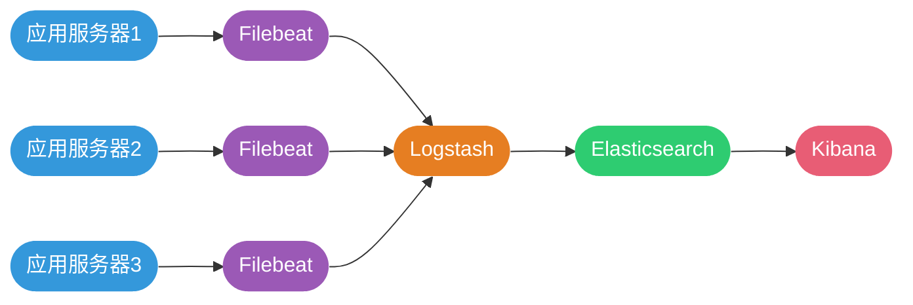

# 分布式日志系统架构

## 分布式环境的日志挑战

在单体应用时代，所有日志集中存储在一台服务器上，通过`tail -f`或`grep`命令即可查看和分析。但随着微服务架构的普及，一个完整的业务请求可能涉及数十个服务，每个服务又部署在多台服务器上，日志分散在不同的机器和文件中。

### 传统日志管理的困境

**日志分散难以追踪**

一次用户下单操作可能产生如下调用链：


排查一个订单问题需要：
1. 登录API网关服务器A查看请求入口日志
2. 登录订单服务集群B1-B3逐台查找订单处理日志
3. 登录库存服务集群C1-C2检查库存扣减记录
4. 登录支付服务集群D1-D5追踪支付流水
5. 登录通知服务器E确认消息发送状态

**操作复杂效率低下**

```bash
# 传统日志查询流程
ssh user@server-b1
grep "order_id:12345" /var/log/app.log
exit

ssh user@server-b2
grep "order_id:12345" /var/log/app.log
exit

# 重复N台服务器...
```

**无法关联分析**

- 不同服务的日志格式不统一
- 时间戳可能存在偏差
- 缺少统一的请求ID关联
- 无法绘制完整的调用链路

### 集中式日志系统的价值

分布式日志系统通过统一采集、存储和分析，解决了上述问题：


**核心优势：**
- **集中查询**：一个界面搜索全部日志
- **实时检索**：秒级响应海量日志查询
- **关联分析**：基于traceId串联完整链路
- **可视化展示**：图表化呈现日志趋势
- **智能告警**：异常模式自动触发通知

## ELK技术栈详解

ELK是目前最流行的开源日志解决方案，由Elastic公司主导开发，已演进为Elastic Stack（包含Beats、Logstash、Elasticsearch、Kibana）。

### 核心组件介绍

**Elasticsearch - 分布式搜索引擎**

基于Lucene构建的全文检索引擎，提供分布式、实时的搜索和分析能力：

- **倒排索引**：高效的全文检索
- **水平扩展**：轻松支持PB级数据
- **RESTful API**：简单易用的HTTP接口
- **准实时搜索**：秒级数据可见

```json
// 查询示例：搜索最近1小时的ERROR日志
POST /logs-2024.11/_search
{
  "query": {
    "bool": {
      "must": [
        { "match": { "level": "ERROR" }},
        { "range": { "@timestamp": { "gte": "now-1h" }}}
      ]
    }
  },
  "size": 100,
  "sort": [{ "@timestamp": "desc" }]
}
```

**Logstash - 日志处理管道**

功能强大的数据处理引擎，支持采集、转换、输出三阶段：

```ruby
# Logstash配置示例
input {
  # 从Kafka读取日志
  kafka {
    bootstrap_servers => "kafka1:9092,kafka2:9092"
    topics => ["app-logs"]
    codec => json
  }
}

filter {
  # 解析JSON格式日志
  json {
    source => "message"
  }
  
  # 提取时间戳
  date {
    match => ["timestamp", "ISO8601"]
    target => "@timestamp"
  }
  
  # Grok解析非结构化日志
  grok {
    match => { "message" => "%{IP:client_ip} %{WORD:method} %{URIPATH:path} %{NUMBER:status}" }
  }
  
  # 添加地理位置信息
  geoip {
    source => "client_ip"
    target => "geo"
  }
}

output {
  # 输出到Elasticsearch
  elasticsearch {
    hosts => ["es1:9200", "es2:9200"]
    index => "logs-%{+YYYY.MM.dd}"
  }
  
  # 同时输出到标准输出（调试用）
  stdout {
    codec => rubydebug
  }
}
```

**Kibana - 数据可视化平台**

提供强大的数据探索和可视化能力：

- **Discover**：交互式日志搜索
- **Visualize**：创建图表（柱状图、饼图、地图等）
- **Dashboard**：组合多个图表形成仪表盘
- **Alerting**：配置告警规则

**Filebeat - 轻量级日志采集器**

Beats家族中专门用于日志采集的组件，相比Logstash更轻量：

```yaml
# filebeat.yml配置示例
filebeat.inputs:
  # 采集应用日志
  - type: log
    enabled: true
    paths:
      - /var/log/app/*.log
    fields:
      service: order-service
      env: production
    multiline:
      pattern: '^[0-9]{4}-[0-9]{2}-[0-9]{2}'
      negate: true
      match: after
      
  # 采集Nginx访问日志
  - type: log
    enabled: true
    paths:
      - /var/log/nginx/access.log
    fields:
      service: nginx
      type: access

# 输出到Kafka（推荐）
output.kafka:
  hosts: ["kafka1:9092", "kafka2:9092"]
  topic: "app-logs"
  partition.round_robin:
    reachable_only: false
  compression: gzip
  
# 或直接输出到Elasticsearch
# output.elasticsearch:
#   hosts: ["es1:9200", "es2:9200"]
#   index: "logs-%{+yyyy.MM.dd}"
```

### 经典ELK架构

**基础版架构**

适合中小规模应用，日志量 < 1GB/天：



**生产级架构**

引入Kafka削峰、Nginx反向代理、ES集群：


**架构优势：**
- **Kafka缓冲**：应对流量峰值，保护下游组件
- **Logstash集群**：水平扩展处理能力
- **ES集群**：高可用、高性能存储
- **Nginx代理**：统一入口、权限控制

### 实战：搭建本地ELK环境

使用Docker Compose快速启动：

```yaml
# docker-compose.yml
version: '3.8'

services:
  elasticsearch:
    image: docker.elastic.co/elasticsearch/elasticsearch:8.11.0
    container_name: elasticsearch
    environment:
      - discovery.type=single-node
      - "ES_JAVA_OPTS=-Xms512m -Xmx512m"
      - xpack.security.enabled=false
    ports:
      - "9200:9200"
    volumes:
      - es-data:/usr/share/elasticsearch/data
    networks:
      - elk

  logstash:
    image: docker.elastic.co/logstash/logstash:8.11.0
    container_name: logstash
    volumes:
      - ./logstash/pipeline:/usr/share/logstash/pipeline
    ports:
      - "5044:5044"
      - "9600:9600"
    environment:
      - "LS_JAVA_OPTS=-Xms256m -Xmx256m"
    depends_on:
      - elasticsearch
    networks:
      - elk

  kibana:
    image: docker.elastic.co/kibana/kibana:8.11.0
    container_name: kibana
    ports:
      - "5601:5601"
    environment:
      - ELASTICSEARCH_HOSTS=http://elasticsearch:9200
    depends_on:
      - elasticsearch
    networks:
      - elk

  filebeat:
    image: docker.elastic.co/beats/filebeat:8.11.0
    container_name: filebeat
    user: root
    volumes:
      - ./filebeat/filebeat.yml:/usr/share/filebeat/filebeat.yml
      - /var/log:/var/log:ro
      - /var/lib/docker/containers:/var/lib/docker/containers:ro
    depends_on:
      - logstash
    networks:
      - elk

volumes:
  es-data:

networks:
  elk:
    driver: bridge
```

启动环境：

```bash
docker-compose up -d

# 访问Kibana
open http://localhost:5601
```

## 轻量级方案：Loki

对于中小型项目，ELK可能过于重量级。Grafana Labs推出的Loki提供了更轻量的替代方案。

### Loki的设计哲学

**只索引元数据，不索引内容**

Elasticsearch会对日志全文建立索引，而Loki只索引标签（Label）：

```yaml
# Loki索引策略
{
  "stream": {
    "service": "order-service",
    "env": "production",
    "host": "server-01"
  },
  "values": [
    ["1638360000000000000", "Processing order: order_12345"],
    ["1638360001000000000", "Order validated successfully"]
  ]
}
```

**优势：**
- 索引体积小，存储成本低
- 写入性能高，无需分词
- 天然支持Grafana可视化

**劣势：**
- 全文搜索较慢
- 不适合复杂查询场景

### Loki架构


### 快速部署Loki

```yaml
# docker-compose.yml
version: '3.8'

services:
  loki:
    image: grafana/loki:2.9.0
    ports:
      - "3100:3100"
    command: -config.file=/etc/loki/local-config.yaml
    networks:
      - loki

  promtail:
    image: grafana/promtail:2.9.0
    volumes:
      - /var/log:/var/log
      - ./promtail-config.yml:/etc/promtail/config.yml
    command: -config.file=/etc/promtail/config.yml
    networks:
      - loki

  grafana:
    image: grafana/grafana:10.2.0
    ports:
      - "3000:3000"
    environment:
      - GF_SECURITY_ADMIN_PASSWORD=admin
    networks:
      - loki

networks:
  loki:
```

Promtail配置：

```yaml
# promtail-config.yml
server:
  http_listen_port: 9080
  grpc_listen_port: 0

positions:
  filename: /tmp/positions.yaml

clients:
  - url: http://loki:3100/loki/api/v1/push

scrape_configs:
  - job_name: system
    static_configs:
      - targets:
          - localhost
        labels:
          job: varlogs
          __path__: /var/log/*.log
          
  - job_name: application
    static_configs:
      - targets:
          - localhost
        labels:
          job: app
          service: order-service
          env: production
          __path__: /var/log/app/*.log
```

## ClickHouse日志存储方案

ClickHouse作为高性能列式数据库，在日志存储领域展现出优秀的性能。B站、快手、携程等公司已将其应用于日志场景。

### 为什么选择ClickHouse

**成本优势**

相比Elasticsearch，ClickHouse存储成本降低60%-80%：

- 列式存储，压缩比更高
- 无需全文索引，空间占用小
- 支持冷热数据分层

**写入性能**

支持每秒数百万行的写入吞吐：

```sql
-- 单次批量写入1000万条日志
INSERT INTO logs SELECT 
    now() - rand() % 86400 AS timestamp,
    ['INFO', 'WARN', 'ERROR'][rand() % 3 + 1] AS level,
    concat('user_', toString(rand() % 10000)) AS user_id,
    concat('message_', toString(rand())) AS message
FROM numbers(10000000)
```

**查询能力**

支持复杂的聚合分析：

```sql
-- 统计各服务每小时错误数趋势
SELECT 
    toStartOfHour(timestamp) AS hour,
    service,
    countIf(level = 'ERROR') AS error_count
FROM logs
WHERE timestamp >= now() - INTERVAL 1 DAY
GROUP BY hour, service
ORDER BY hour DESC, error_count DESC
```

### ClickHouse日志表设计

```sql
CREATE TABLE logs (
    timestamp DateTime,
    trace_id String,
    service LowCardinality(String),
    level LowCardinality(String),
    host LowCardinality(String),
    logger String,
    thread String,
    message String,
    exception String,
    date Date DEFAULT toDate(timestamp)
) ENGINE = MergeTree()
PARTITION BY toYYYYMMDD(date)
ORDER BY (service, level, timestamp)
TTL date + INTERVAL 30 DAY
SETTINGS index_granularity = 8192;
```

**设计要点：**
- **分区键**：按日期分区，便于删除过期数据
- **排序键**：按查询热点字段排序
- **TTL**：自动清理历史数据
- **LowCardinality**：优化低基数字段存储

### ClickVisual可视化平台

开源的ClickHouse日志查询平台：

```bash
# 部署ClickVisual
docker run -d \
  --name clickvisual \
  -p 19001:19001 \
  -e MYSQL_DSN="root:password@tcp(mysql:3306)/clickvisual" \
  clickvisual/clickvisual:latest
```

核心功能：
- **日志查询**：类似Kibana的搜索界面
- **SQL分析**：支持复杂ClickHouse SQL
- **告警配置**：基于查询结果的告警
- **数据可视化**：图表展示

## 云原生日志方案对比

| 方案 | 适用场景 | 成本 | 性能 | 复杂度 |
|------|---------|------|------|--------|
| **ELK** | 大型企业、功能要求全 | 高 | 查询快 | 高 |
| **Loki** | 中小团队、已用Grafana | 低 | 写入快 | 低 |
| **ClickHouse** | 海量日志、分析需求多 | 中 | 写入/查询均衡 | 中 |
| **阿里云SLS** | 快速上线、运维能力弱 | 按量计费 | 优秀 | 极低 |
| **自建文件+grep** | 个人项目、日志量小 | 极低 | 差 | 低 |

选型建议：
- **资金充足** → 云产品（阿里云SLS、腾讯云CLS）
- **日志量大** → ClickHouse + ClickVisual
- **已用Prometheus/Grafana** → Loki
- **功能要求全** → ELK Stack
- **快速落地** → Loki或云产品

通过构建合适的分布式日志系统，可以极大提升问题定位效率，为系统稳定性提供坚实保障。
