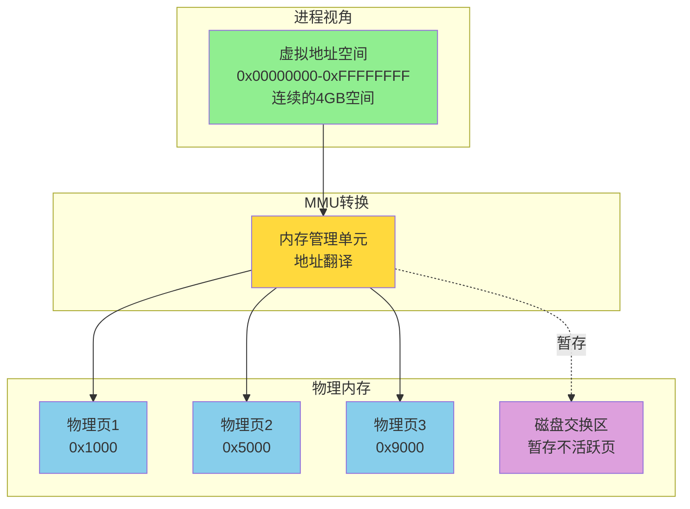
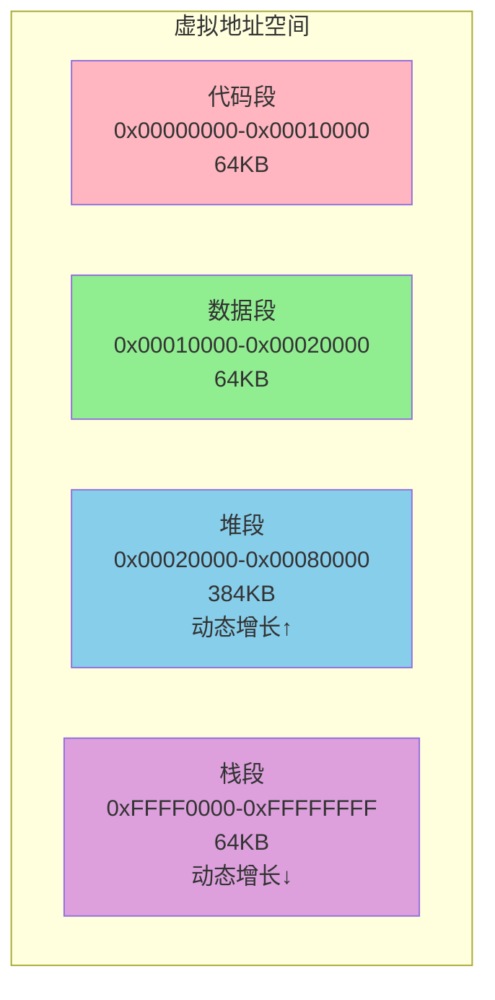
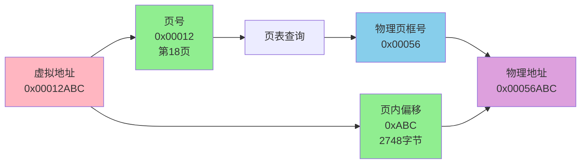
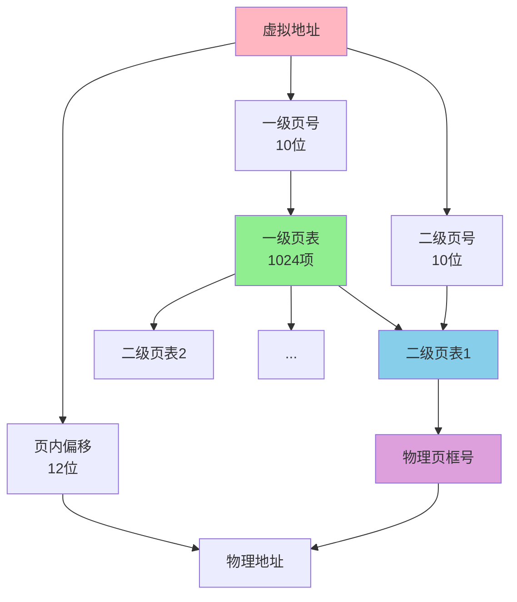
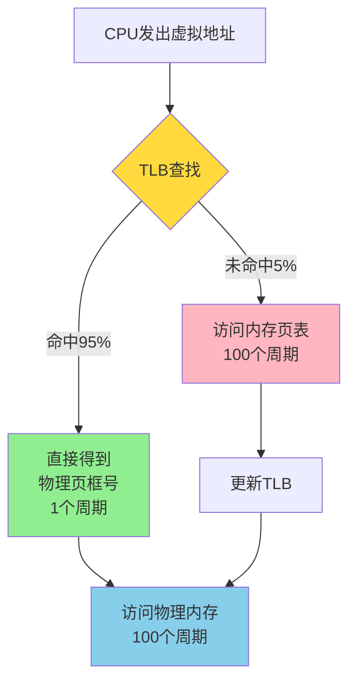
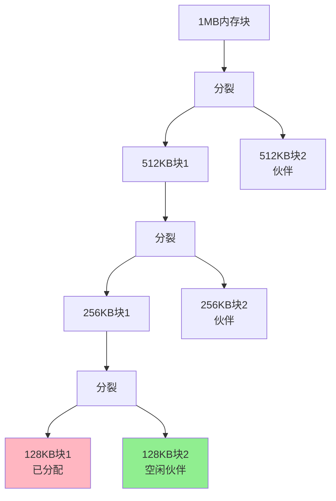

## 虚拟内存与地址映射

现代操作系统广泛采用虚拟内存技术来管理进程的内存空间。虚拟内存是一种逻辑上的内存抽象,它为每个进程提供了独立且连续的地址空间,而实际的物理内存可能是分散的、有限的。

### 虚拟内存的核心价值

#### 进程隔离
每个进程都拥有独立的虚拟地址空间,进程A无法直接访问进程B的内存。在电商系统中,订单服务进程和支付服务进程各自拥有独立的内存空间,一个服务的内存错误不会波及其他服务。

#### 内存利用率提升
操作系统只需将进程当前活跃的数据页加载到物理内存中,其余数据可以暂存在磁盘的交换分区。一个4GB物理内存的系统可以运行多个总内存需求超过4GB的进程。

#### 简化内存管理
程序员使用统一的虚拟地址编程,无需关心物理内存的实际分布。编译器生成的代码中,变量地址、函数地址都是虚拟地址,运行时由MMU自动转换为物理地址。



### 地址翻译过程

虚拟地址到物理地址的转换由CPU内的内存管理单元(MMU)完成。主要有三种映射机制:分段、分页和段页结合。

## 分段机制

分段机制将程序的虚拟地址空间划分为多个逻辑段,每个段都有明确的语义。

### 段的划分

一个进程通常包含以下逻辑段:
- **代码段(Text Segment)**:存放可执行指令,只读
- **数据段(Data Segment)**:存放全局变量和静态变量
- **堆段(Heap Segment)**:动态分配的内存,向上增长
- **栈段(Stack Segment)**:函数调用栈,向下增长



### 段表与地址映射

操作系统为每个进程维护一个段表,记录每个段的信息:

| 段号 | 段基址(物理地址) | 段长度 | 访问权限 |
|------|----------------|--------|---------|
| 0(代码段) | 0x100000 | 64KB | 只读 |
| 1(数据段) | 0x180000 | 64KB | 读写 |
| 2(堆段) | 0x200000 | 384KB | 读写 |
| 3(栈段) | 0x500000 | 64KB | 读写 |

**地址翻译示例**:
- 虚拟地址:段号2(堆段),段内偏移0x1000
- 查段表:段基址0x200000
- 物理地址 = 0x200000 + 0x1000 = 0x201000

### 外部碎片问题

分段机制容易产生外部碎片。假设一个8GB内存的系统运行4个进程:
- 进程1:占用1GB(段1)
- 进程2:占用3GB(段2)
- 进程3:占用2GB(段3)  
- 进程4:占用1GB(段4)

内存布局:`[段1-1GB][段2-3GB][段3-2GB][段4-1GB]`

当进程1和进程4结束后,释放了2GB内存,但这2GB不连续,无法分配给需要2GB连续空间的新进程。


## 分页机制

分页机制将物理内存和虚拟地址空间都划分为固定大小的页,解决了外部碎片问题。

### 页与页框

- **虚拟页(Page)**:虚拟地址空间的基本单位,通常4KB
- **物理页框(Page Frame)**:物理内存的基本单位,与虚拟页大小相同
- **页号**:虚拟地址的高位,用于索引页表
- **页内偏移**:虚拟地址的低位,在物理页框内的偏移量

对于32位系统,4KB页面大小:
- 虚拟地址32位 = 页号20位 + 页内偏移12位
- 最多支持2^20 = 1,048,576个虚拟页
- 每页4KB,总虚拟地址空间4GB



### 页表结构

#### 单级页表
最简单的页表是一个数组,虚拟页号作为索引,存储对应的物理页框号。

页表项(PTE)通常包含:
- **物理页框号**(20位)
- **有效位**(1位):页面是否在内存中
- **读写位**(1位):是否可写
- **用户/内核位**(1位):访问权限
- **访问位**(1位):是否被访问过
- **脏位**(1位):是否被修改过

#### 多级页表
单级页表会占用大量内存。对于4GB虚拟地址空间,需要1M个页表项,每项4字节,总共4MB。如果系统运行100个进程,仅页表就占用400MB。

多级页表按需分配,只为实际使用的虚拟页分配页表项。32位系统常用二级页表:



### 快表(TLB)

地址翻译需要访问页表,而页表在内存中,每次内存访问都要先访问页表,性能开销巨大。

快表(Translation Lookaside Buffer, TLB)是CPU内的高速缓存,缓存最近使用的页表项。

**访问流程**:
1. CPU发出虚拟地址
2. TLB查找该虚拟页号
3. **TLB命中**:直接获取物理页框号,耗时约1个时钟周期
4. **TLB未命中**:访问内存中的页表,耗时约100个时钟周期,并将结果缓存到TLB

**局部性原理**:
程序访问内存具有时间局部性和空间局部性,最近访问的页面很可能再次访问,相邻的页面也可能被访问。因此TLB命中率通常很高(90%-99%),大幅提升性能。

实际测试:
- 无TLB:每次内存访问需要200个周期(100周期查页表 + 100周期访问内存)
- 有TLB(95%命中率):平均耗时 = 0.95×101 + 0.05×200 = 106个周期



### 页缺失与换页

当访问的虚拟页不在物理内存中时,会触发页缺失(Page Fault)。

#### 页缺失类型

**硬性页缺失**:
- 物理内存中没有对应页面
- 操作系统从磁盘加载页面到内存
- 耗时较长(毫秒级)

**软性页缺失**:
- 物理内存中有页面,但页表项未建立
- 仅需更新页表
- 耗时较短(微秒级)

#### 页面置换算法

当物理内存满时,需要选择一个页面换出到磁盘,为新页面腾出空间。

**最佳置换(OPT)**:
- 淘汰未来最长时间不会访问的页面
- 理论最优,但无法预知未来
- 用于评估其他算法性能

**先进先出(FIFO)**:
- 淘汰最早进入内存的页面
- 实现简单,但可能淘汰频繁使用的页面
- 存在Belady异常:增加页框数反而提高缺页率

**最近最少使用(LRU)**:
- 淘汰最长时间未使用的页面
- 性能接近OPT,广泛应用
- 实现需要维护访问时间戳或链表

**时钟算法(Clock)**:
- LRU的近似实现,开销更小
- 维护一个环形链表和访问位
- 扫描时清除访问位,第二次扫描到未访问页面时淘汰

实际应用 - MySQL InnoDB Buffer Pool:
InnoDB改进了LRU算法,将缓冲池分为young区和old区,新读取的页面先进入old区,避免全表扫描污染缓存。


## 段页结合

段页机制结合了分段和分页的优点:
- 逻辑上按段划分,符合程序结构
- 物理上按页管理,避免外部碎片

### 地址翻译

两次映射:
1. **段式映射**:虚拟地址 = 段号 + 段内偏移 → 线性地址
2. **页式映射**:线性地址 = 页号 + 页内偏移 → 物理地址


## 内存碎片与管理策略

### 内部碎片
已分配但未使用的内存。例如,进程申请65字节,系统按2的幂次分配128字节,浪费63字节。

### 外部碎片
未分配的内存太小且分散,无法满足分配请求。

### 伙伴系统

Linux采用伙伴系统管理物理内存,按2的幂次划分内存块。

**分配流程**:
- 申请65KB内存
- 找到128KB块(2^7)
- 分配后,将其从128KB链表中移除

**合并流程**:
- 释放128KB块
- 检查其伙伴块(相邻的128KB)是否空闲
- 如果空闲,合并为256KB块
- 递归合并直到无法合并



**优点**:快速分配和回收,减少外部碎片
**缺点**:仍有内部碎片,Linux用SLAB分配器进一步优化

## 实战示例

### 查看进程内存映射

```bash
# 查看进程的虚拟内存布局
cat /proc/1234/maps

# 输出示例
00400000-00410000 r-xp 00000000 08:01 1234567  /usr/bin/app  # 代码段
00610000-00611000 rw-p 00010000 08:01 1234567  /usr/bin/app  # 数据段
00621000-00642000 rw-p 00000000 00:00 0        [heap]        # 堆
7fff1234000-7fff1235000 rw-p 00000000 00:00 0  [stack]       # 栈
```

### 监控页缺失

```bash
# 查看进程的页缺失统计
ps -o pid,min_flt,maj_flt,cmd 1234

# min_flt: 软性页缺失(页在内存中)
# maj_flt: 硬性页缺失(需从磁盘加载)
```

高频硬性页缺失通常意味着:
- 物理内存不足,频繁换页
- 进程访问模式随机,局部性差
- 需要增加物理内存或优化程序

### 调整换页策略

```bash
# 查看当前swappiness值(0-100)
cat /proc/sys/vm/swappiness

# 值越大越倾向于使用swap,默认60
# 调整为10,减少换页,适合内存充足的服务器
echo 10 > /proc/sys/vm/swappiness
```

通过合理配置虚拟内存参数,可以在不同场景下优化系统性能。例如,数据库服务器通常将swappiness设为0-10,避免数据库缓存被换出导致性能下降。
