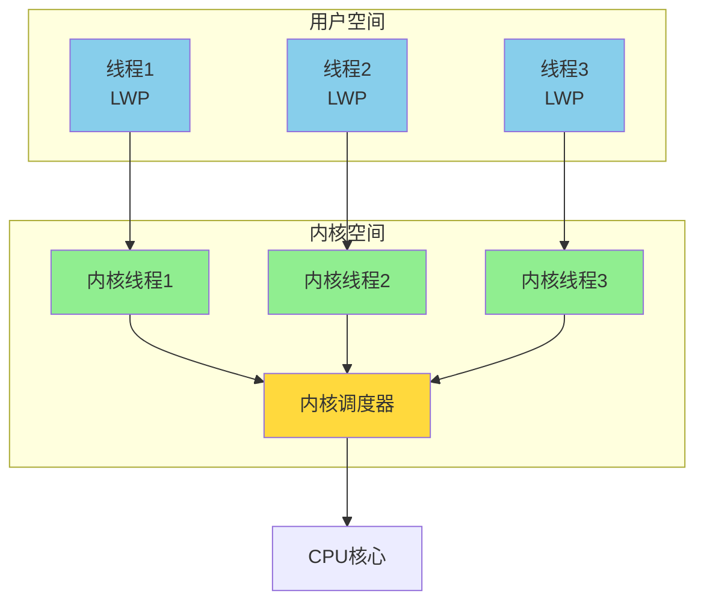
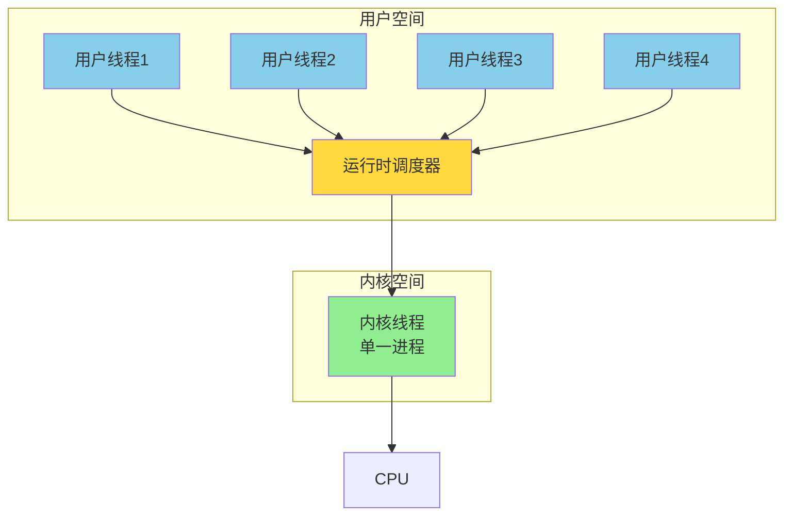
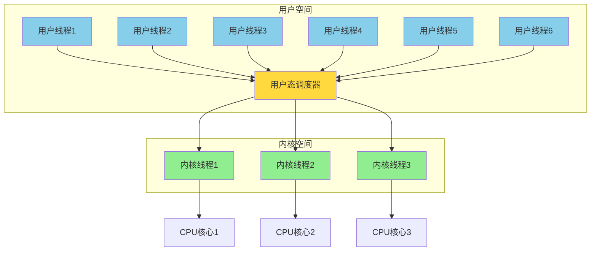

## 线程的本质

线程是比进程更轻量级的执行单元,它的引入可以将进程的资源分配和执行调度分离:
- **进程**:负责资源分配和保护
- **线程**:负责执行调度和任务运行

各个线程既可以共享进程资源(内存、文件句柄等),又可以被操作系统独立调度,实现并发执行。

但你是否思考过:线程到底是由谁实现的?是操作系统内核吗?还是编程语言运行时?答案是都有可能,这取决于线程的实现方式。

## 三种线程实现方式

线程的实现主要有三种模型:内核线程、用户线程和混合实现。

### 内核线程实现(1:1模型)

**内核线程(Kernel-Level Thread, KLT)** 由操作系统内核直接支持和管理。

#### 工作机制

每个用户线程对应一个内核线程,线程的创建、销毁、调度都由内核完成。应用程序通过轻量级进程(Light Weight Process, LWP)接口使用内核线程。



#### 优势

**真正的并行**:
- 多个线程可以分配到不同CPU核心上真正并行执行
- 一个线程阻塞不会影响其他线程继续运行

**内核直接调度**:
- 操作系统可以为线程分配合适的CPU时间
- 支持优先级调度、时间片轮转等成熟算法

**稳定可靠**:
- 线程崩溃不会影响整个进程
- 内核对线程状态有完整的掌控

#### 劣势

**创建销毁开销大**:
每次线程操作都需要系统调用,陷入内核态:
```java
// 创建线程需要系统调用
Thread t = new Thread(() -> {
    System.out.println("Hello");
});
t.start();  // 内核创建新线程,分配内核资源
```

时间开销:
- 创建线程:约几十微秒(需要分配内核线程控制块、栈空间等)
- 销毁线程:约几十微秒
- 上下文切换:约几微秒

**线程数量受限**:
由于每个线程都需要内核资源(内核栈、线程描述符等),系统能创建的线程数量有限:
- Linux默认每个线程8MB栈空间
- 32位系统用户空间约3GB,理论最多约375个线程
- 64位系统虽然地址空间大,但内核数据结构仍然有限

**示例 - Linux线程限制**:
```bash
# 查看最大线程数
$ cat /proc/sys/kernel/threads-max
63304

# 查看单个进程最大线程数
$ ulimit -u
15882
```

#### 实际应用

**Java线程(早期版本)**:
Java在Linux上使用NPTL(Native POSIX Thread Library),采用1:1模型:
```java
public class ThreadDemo {
    public static void main(String[] args) {
        // 每个Java线程对应一个内核线程
        Thread t = new Thread(() -> {
            while (true) {
                try { Thread.sleep(1000); } catch (Exception e) {}
            }
        });
        t.start();
        
        // 可以在系统中看到对应的内核线程
        // ps -eLf | grep java
    }
}
```

**C++ std::thread**:
C++11标准库的线程也是基于内核线程:
```cpp
#include <thread>
#include <iostream>

void worker() {
    std::cout << "Thread ID: " << std::this_thread::get_id() << std::endl;
}

int main() {
    std::thread t1(worker);  // 创建内核线程
    std::thread t2(worker);
    t1.join();
    t2.join();
    return 0;
}
```

### 用户线程实现(N:1模型)

**用户线程**完全在用户空间实现,操作系统内核感知不到线程的存在,只能看到进程。

#### 工作机制

应用程序自己实现线程库,包括:
- **线程创建/销毁**:在用户空间分配栈和控制块
- **线程调度**:运行时系统决定切换哪个线程
- **上下文切换**:保存/恢复寄存器,切换栈指针



#### 优势

**创建销毁快**:
- 无需系统调用,仅在用户空间分配栈和控制块
- 创建耗时:约几百纳秒(比内核线程快100倍)

**上下文切换快**:
- 无需陷入内核,仅保存/恢复少量寄存器
- 切换耗时:约几十纳秒

**线程数量不受限**:
- 不消耗内核资源,可以创建成千上万个线程
- 适合大规模并发场景(如C10K问题)

**跨平台**:
- 只需在用户空间实现,不依赖特定操作系统
- 应用程序可以自定义调度策略

#### 劣势

**无法利用多核**:
- 所有用户线程映射到一个内核线程
- 即使有多个CPU核心,同时只有一个用户线程在执行

```java
// 示例:创建4个用户线程
UserThread t1 = new UserThread(() -> compute());  // 计算密集任务
UserThread t2 = new UserThread(() -> compute());
UserThread t3 = new UserThread(() -> compute());
UserThread t4 = new UserThread(() -> compute());

// 在4核CPU上,4个线程仍然串行执行,只能用到1个核心!
// CPU利用率:25%
```

**一个阻塞全部阻塞**:
- 如果一个用户线程调用阻塞的系统调用(如read),整个进程被阻塞
- 所有用户线程都无法运行

```python
def thread_func():
    data = file.read()  # 阻塞系统调用
    # 整个进程被阻塞,其他用户线程也停止运行!
    process_data(data)
```

**调度复杂**:
- 应用程序需要自己实现调度算法
- 需要处理信号、IO等复杂情况

#### 实际应用

**早期的用户态线程库**:
- **GNU Pth**:C语言的协作式用户线程库
- **State Threads**:用于高性能服务器的用户线程库

**现代的协程**:
- **Python asyncio**:基于事件循环的协程
- **JavaScript async/await**:异步编程模型
- **Lua coroutine**:协作式多任务

这些现代实现通过异步IO和事件循环,避免了阻塞问题。

### 混合实现(M:N模型)

结合内核线程和用户线程的优点,N个用户线程映射到M个内核线程上。

#### 工作机制



#### 优势

**兼顾灵活性和性能**:
- 用户线程创建销毁快,数量不受限
- 内核线程利用多核,真正并行

**避免全部阻塞**:
- 一个用户线程阻塞时,调度器可将其他用户线程分配到空闲的内核线程
- 不会因为一个阻塞影响全局

**自定义调度**:
- 应用可以实现特定的调度策略
- 同时利用内核调度的成熟算法

#### 劣势

**实现复杂**:
- 需要协调用户态和内核态两级调度
- 处理线程间同步、信号等问题复杂

**调试困难**:
- 两级调度使得问题定位困难
- 性能分析工具可能无法准确追踪

#### 实际应用

**Go语言的goroutine**:
Go采用GMP模型(Goroutine-Machine-Processor):
- **G(goroutine)**:用户态线程,轻量级,栈初始2KB
- **M(Machine)**:内核线程,对应OS线程
- **P(Processor)**:逻辑处理器,维护可运行的G队列

```go
package main

import (
    "fmt"
    "runtime"
    "time"
)

func main() {
    runtime.GOMAXPROCS(4)  // 使用4个内核线程
    
    // 创建10000个goroutine,映射到4个内核线程
    for i := 0; i < 10000; i++ {
        go func(id int) {
            time.Sleep(time.Second)
            fmt.Println("Goroutine", id)
        }(i)
    }
    
    time.Sleep(2 * time.Second)
}
```

**Java虚拟线程(Project Loom)**:
JDK 19引入的虚拟线程(Virtual Thread),采用M:N模型:
```java
// JDK 19+
try (var executor = Executors.newVirtualThreadPerTaskExecutor()) {
    // 创建100万个虚拟线程,映射到少量内核线程
    for (int i = 0; i < 1_000_000; i++) {
        executor.submit(() -> {
            Thread.sleep(Duration.ofSeconds(1));
            return i;
        });
    }
}
```

**Erlang进程**:
Erlang的"进程"实际是轻量级用户线程,映射到调度器线程:
```erlang
% 创建100万个Erlang进程
lists:foreach(fun(I) ->
    spawn(fun() ->
        timer:sleep(1000),
        io:format("Process ~p~n", [I])
    end)
end, lists:seq(1, 1000000)).
```

## 线程实现对比

| 特性 | 内核线程(1:1) | 用户线程(N:1) | 混合实现(M:N) |
|------|--------------|--------------|--------------|
| 创建开销 | 大(几十微秒) | 小(几百纳秒) | 中等 |
| 切换开销 | 大(几微秒) | 小(几十纳秒) | 中等 |
| 并行执行 | 支持多核 | 仅单核 | 支持多核 |
| 阻塞处理 | 一个阻塞不影响他人 | 一个阻塞全部阻塞 | 一个阻塞可迁移 |
| 线程数量 | 受限(数千) | 不受限(数百万) | 不受限(数百万) |
| 调度控制 | 内核决定 | 应用决定 | 两级调度 |
| 实现复杂度 | 低 | 中等 | 高 |
| 典型应用 | Java(早期)、C++ | GNU Pth | Go、Erlang |

## 选择建议

### 何时使用内核线程

**适用场景**:
- 线程数量较少(数十到数百)
- CPU密集型任务,需要充分利用多核
- 需要操作系统提供的完整线程功能(信号、优先级等)

**典型应用**:
- 桌面应用程序
- 中等并发的服务器(几百并发连接)
- 数据库查询处理

### 何时使用用户线程/协程

**适用场景**:
- 大规模并发(数万到数百万连接)
- IO密集型任务,大量时间在等待
- 需要极快的创建/切换速度

**典型应用**:
- 高并发Web服务器(C10K/C10M问题)
- 网络爬虫
- 即时通讯服务
- 游戏服务器

### 何时使用混合实现

**适用场景**:
- 既需要大规模并发,又要利用多核
- 复杂的异步编程模型
- 对性能和可扩展性要求极高

**典型应用**:
- 微服务框架(如Go的Web框架)
- 分布式系统
- 高性能中间件(消息队列、缓存等)

## 演进趋势

### 从内核线程到协程

随着互联网的发展,并发规模从数百增长到数百万,内核线程模型逐渐无法满足需求:


**C10K问题**:
2000年代,如何用单台服务器处理1万并发连接?内核线程模型下:
- 1万线程 × 8MB栈 = 80GB内存(不现实)
- 上下文切换开销巨大

**解决方案演进**:
1. **事件驱动(Nginx、Node.js)**:单线程+事件循环
2. **协程(Go、Python asyncio)**:用户态调度,百万并发
3. **虚拟线程(Java Loom)**:M:N模型,兼顾易用性和性能

### 未来方向

- **更轻量的虚拟线程**:启动时间、内存占用进一步降低
- **更智能的调度**:根据任务特征自动选择调度策略
- **硬件辅助**:利用CPU的虚拟化特性加速线程切换

编程范式也在变化:
- 从"线程+锁"到"消息传递"(Actor模型)
- 从"共享内存"到"不可变数据"(函数式编程)

无论底层实现如何变化,目标始终是:以更低的开销,支持更高的并发,提供更好的开发体验。
