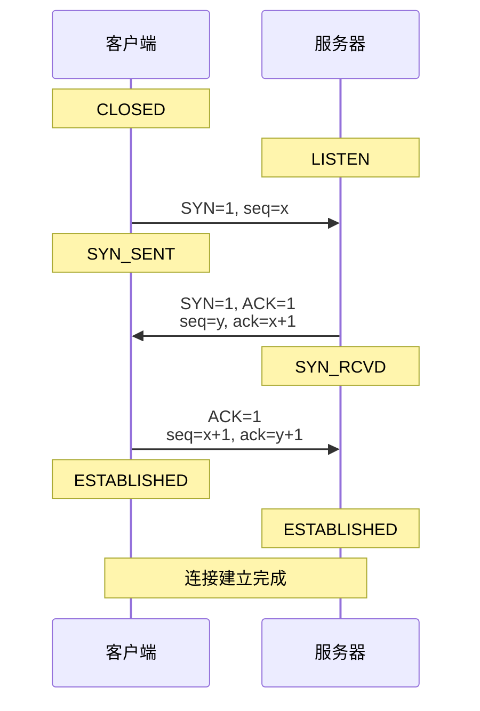
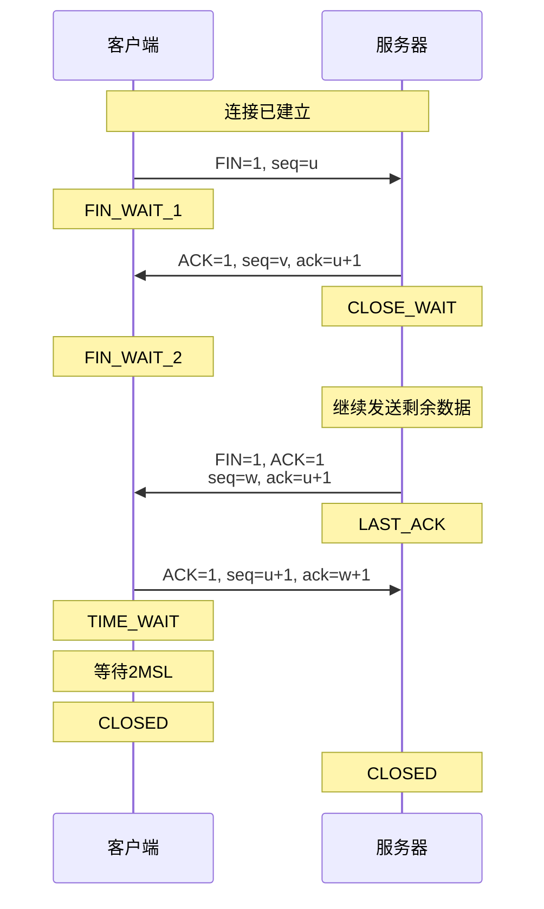
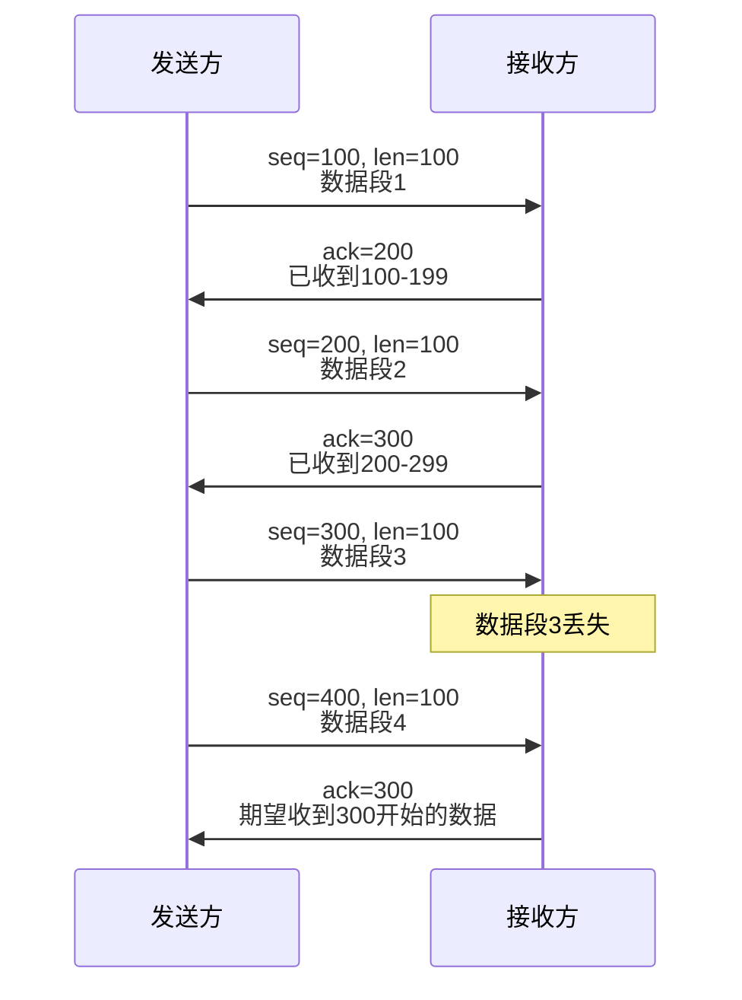
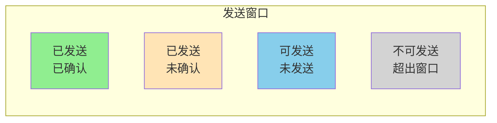
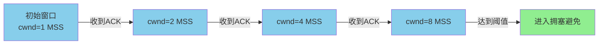
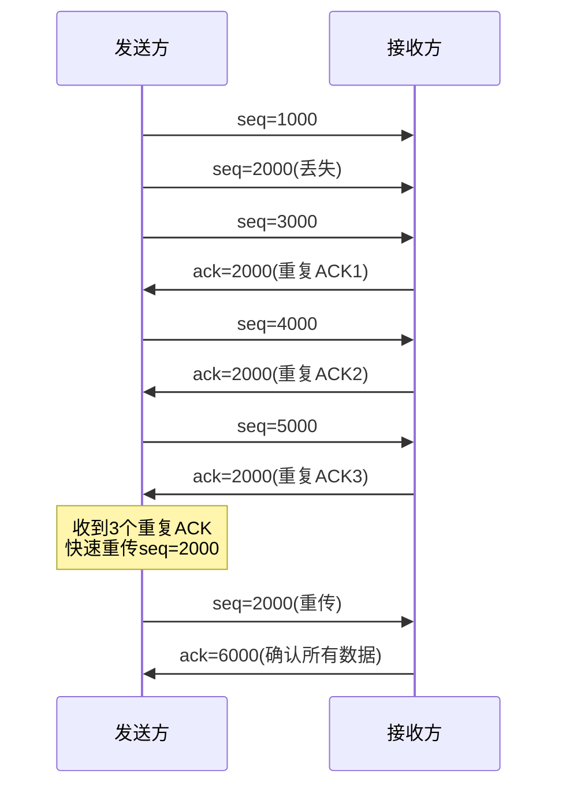
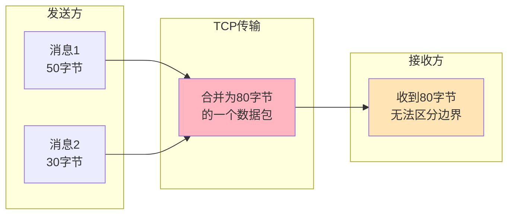

## TCP连接建立与释放

TCP作为面向连接的协议,在数据传输前需要建立连接,传输结束后需要释放连接。这个过程通过三次握手和四次挥手完成,是保证通信可靠性的基础。

### 三次握手机制

在客户端与服务器建立TCP连接时,需要经过三次数据交互来确认双方的收发能力:



**第一次握手:客户端发起连接**

客户端向服务器发送SYN(同步序列号)报文段,其中包含初始序列号x。发送后,客户端进入SYN_SENT状态,等待服务器确认。

在实际应用中,当浏览器访问电商网站时,浏览器作为客户端会向服务器80端口发起SYN请求,这标志着TCP连接建立的开始。

**第二次握手:服务器响应并发起连接**

服务器收到SYN报文后,如果同意建立连接,会回复一个SYN+ACK报文。其中ACK字段确认收到客户端的SYN(ack=x+1),同时自己也发送一个SYN请求(seq=y)。服务器进入SYN_RCVD状态。

此时,服务器已经验证了客户端的发送能力和自己的接收能力。服务器也向客户端表明了自己的发送意愿,等待客户端确认。

**第三次握手:客户端确认**

客户端收到服务器的SYN+ACK后,向服务器发送ACK报文(ack=y+1),确认收到服务器的SYN。客户端进入ESTABLISHED状态,可以开始发送数据。服务器收到ACK后也进入ESTABLISHED状态。

在电商下单场景中,完成三次握手后,客户端就可以通过这个TCP连接发送订单数据到服务器。

### 为什么需要三次握手

三次握手的设计目的是验证双方的收发能力,并防止已失效的连接请求突然又传送到服务器引起错误:

**验证双方收发能力**

- 第一次握手:服务器确认客户端发送能力正常、服务器接收能力正常
- 第二次握手:客户端确认服务器收发能力正常、客户端收发能力正常
- 第三次握手:服务器确认客户端接收能力正常

只有三次握手才能让双方都确认对方的收发能力正常。如果只有两次握手,服务器无法确认客户端的接收能力。

**防止旧连接请求**

假设客户端发送的连接请求在网络中滞留,连接释放后该请求才到达服务器。如果是两次握手,服务器收到后会建立连接并一直等待数据,造成资源浪费。而三次握手中,客户端不会对这个旧请求回复ACK,服务器会因超时而关闭连接。

在高并发场景下,如秒杀系统,大量客户端同时发起连接。三次握手机制能够有效识别和丢弃旧的或重复的连接请求,保证服务器资源的高效利用。

### 四次挥手机制

TCP连接是全双工的,关闭连接需要双方都完成数据传输并确认,因此需要四次挥手:



**第一次挥手:客户端发起关闭**

当客户端完成数据发送后,向服务器发送FIN报文,表示不再发送数据(但仍可接收数据)。客户端进入FIN_WAIT_1状态。

在订单支付场景中,当客户端发送完支付请求并收到服务器的支付结果后,会主动发起FIN关闭连接。

**第二次挥手:服务器确认**

服务器收到FIN后,发送ACK确认收到关闭请求。此时服务器进入CLOSE_WAIT状态,可能还有数据需要发送给客户端。客户端收到ACK后进入FIN_WAIT_2状态。

**第三次挥手:服务器发起关闭**

服务器完成数据发送后,向客户端发送FIN报文,表示准备关闭连接。服务器进入LAST_ACK状态。

**第四次挥手:客户端确认**

客户端收到服务器的FIN后,发送ACK确认。客户端进入TIME_WAIT状态,等待2MSL(最大报文段生存时间)后才真正关闭连接。服务器收到ACK后立即进入CLOSED状态。

### TIME_WAIT的必要性

客户端在发送最后一个ACK后,需要等待2MSL才能关闭连接,这是为了:

1. 确保最后的ACK能够到达服务器。如果服务器没收到ACK会重传FIN,客户端还能响应
2. 确保当前连接的所有报文都已在网络中消失,避免旧连接的报文影响新连接

在高并发Web服务器上,大量TIME_WAIT状态的连接可能占用端口资源。可以通过调整`tcp_tw_reuse`参数来复用TIME_WAIT状态的端口。

## TCP可靠传输机制

TCP通过多种机制保证数据传输的完整性、有序性和准确性:

### 序列号与确认应答

TCP为每个字节的数据分配唯一的序列号,接收方通过ACK报文确认已收到的数据:



在文件传输场景中,假设需要传输1MB的文件。TCP会将文件分割成多个报文段(如每个1460字节),为每个字节编号。接收方根据序列号重组数据,即使报文乱序到达也能正确还原原始文件。

### 超时重传

发送方维护一个重传定时器,如果在规定时间内没有收到ACK,会重传数据:

**动态超时时间计算**

TCP采用自适应的超时重传机制,根据网络的往返时间(RTT)动态调整超时时间(RTO):

```
平滑往返时间 = (1-α) × 旧平滑RTT + α × 新RTT样本
RTO = 平滑RTT + 4 × RTT偏差
```

在跨境电商场景中,服务器与海外仓库系统通信时,网络延迟较大且不稳定。TCP会根据实际网络情况动态调整重传超时时间,避免过早重传造成网络拥塞,也避免超时过长影响用户体验。

### 滑动窗口

TCP使用滑动窗口机制实现流量控制,防止发送方发送数据过快导致接收方缓冲区溢出:



接收方在ACK报文中携带自己的可用缓冲区大小(窗口大小),发送方根据这个值控制发送速率。当接收方缓冲区满时,会通告窗口大小为0,发送方停止发送,直到接收方处理完数据后再通告非零窗口。

在实时日志采集系统中,日志采集客户端向服务器发送日志数据时,滑动窗口机制确保不会因为发送过快导致服务器处理不过来而丢失日志。

## TCP拥塞控制

拥塞控制的目的是防止发送方发送过多数据导致网络拥塞,与流量控制关注接收方能力不同,拥塞控制关注整个网络的承载能力:

### 慢启动

连接建立初期,发送方不知道网络状况,采用指数增长的方式探测网络容量:



初始时,拥塞窗口(cwnd)设置为1个MSS(最大报文段大小,通常为1460字节)。每收到一个ACK,cwnd加倍,实现指数增长。当cwnd达到慢启动阈值(ssthresh)时,转入拥塞避免阶段。

在CDN边缘节点向源站回源获取内容时,通过慢启动机制逐步提升传输速率,避免突然占用大量带宽影响其他业务。

### 拥塞避免

进入拥塞避免阶段后,cwnd以线性方式增长,每个RTT增加1个MSS,谨慎地探测网络容量上限。

### 快重传与快恢复

当发送方连续收到三个重复的ACK时,判断数据包丢失,立即重传该包,而无需等待超时:



快重传机制能够在网络出现零星丢包时快速恢复,避免等待超时导致的性能下降。快恢复则是在快重传后,将ssthresh设为cwnd的一半,cwnd设为ssthresh加3个MSS,然后进入拥塞避免阶段,而不是回到慢启动。

在视频会议系统中,偶尔的网络抖动可能导致少量丢包。快重传机制能够迅速恢复丢失的音视频数据包,减少卡顿现象。

## TCP粘包与拆包

TCP是面向流的协议,应用层发送的数据在TCP层被看作连续的字节流,不保留应用层的消息边界,这就可能导致粘包和拆包问题:

### 粘包现象

发送方发送的多个小数据包被TCP合并成一个大数据包发送,接收方无法区分原始的消息边界:



在即时通讯系统中,客户端短时间内发送多条短消息,这些消息可能被粘连在一起传输,服务器需要有机制正确拆分出每条消息。

### 拆包现象

发送方发送的大数据包被TCP拆分成多个小数据包发送,接收方需要多次接收才能获得完整数据:

应用层发送1000字节的消息,但TCP的MSS是500字节,数据会被拆分成两个包发送。接收方需要缓存第一个包,等待第二个包到达后才能拼接出完整消息。

### 解决方案

应用层需要定义消息协议来解决粘包拆包问题:

**固定长度**

每个消息固定长度,不足部分用空格填充。接收方按固定长度读取数据。这种方式简单但浪费带宽,适合消息长度比较统一的场景。

```java
// 发送端:每条消息固定256字节
public void sendMessage(String msg) {
    byte[] data = new byte[256];
    byte[] msgBytes = msg.getBytes(StandardCharsets.UTF_8);
    System.arraycopy(msgBytes, 0, data, 0, msgBytes.length);
    socketChannel.write(ByteBuffer.wrap(data));
}
```

**分隔符**

在每个消息末尾添加特殊分隔符(如换行符),接收方读取到分隔符就知道一个消息结束:

```java
// 使用换行符作为分隔符
public void sendMessage(String msg) {
    String message = msg + "\n";
    socketChannel.write(ByteBuffer.wrap(message.getBytes()));
}
```

Redis的RESP协议就使用`\r\n`作为分隔符。但需要注意消息内容不能包含分隔符,或者对分隔符进行转义处理。

**消息头+消息体**

在消息头中指定消息体的长度,接收方先读取固定长度的消息头,解析出消息体长度后,再读取相应长度的消息体:

```java
// 消息格式:4字节长度 + 消息体
public void sendMessage(String msg) {
    byte[] msgBytes = msg.getBytes(StandardCharsets.UTF_8);
    ByteBuffer buffer = ByteBuffer.allocate(4 + msgBytes.length);
    buffer.putInt(msgBytes.length);  // 写入消息长度
    buffer.put(msgBytes);            // 写入消息体
    buffer.flip();
    socketChannel.write(buffer);
}
```

Dubbo、gRPC等RPC框架都采用这种方式,消息头除了长度字段,还包含魔数、协议版本、消息类型等信息,确保协议的扩展性和兼容性。

## TCP性能优化

### 重传率监控

TCP重传率是衡量网络质量的重要指标,过高的重传率表明网络存在丢包、拥塞等问题:

在Linux系统中,可以通过netstat命令查看TCP统计信息:

```bash
# 查看重传相关统计
netstat -s | grep -i retrans

# 输出示例
    63570 segments retransmitted
    13197 fast retransmits
    27 retransmits in slow start
```

重传率计算公式:

```
重传率 = 重传报文段数 / 总发送报文段数
```

正常情况下,重传率应低于1%。如果重传率持续超过3%,需要排查网络质量问题。

在云服务环境中,跨地域的服务调用可能出现较高的重传率。可以通过专线连接、优化网络路由等方式降低丢包率,提升服务质量。

### Nagle算法

Nagle算法用于减少小包发送,提高网络利用率:

- 如果发送方有数据要发送且之前发送的数据都已收到ACK,则立即发送
- 否则,缓存数据直到凑够一个MSS大小,或收到之前数据的ACK

对于交互式应用(如SSH、Telnet),可以禁用Nagle算法(`TCP_NODELAY`),减少延迟。而对于批量数据传输,启用Nagle算法可以减少网络中的小包数量,提高效率。

### 参数调优

**TCP连接队列**

```bash
# 增加SYN队列长度,应对SYN洪泛攻击
net.ipv4.tcp_max_syn_backlog = 4096

# 增加accept队列长度,避免高并发时连接被拒绝
net.core.somaxconn = 1024
```

**TIME_WAIT复用**

```bash
# 允许TIME_WAIT状态的socket用于新连接
net.ipv4.tcp_tw_reuse = 1

# 快速回收TIME_WAIT连接(谨慎使用)
net.ipv4.tcp_tw_recycle = 0
```

在高并发Web服务器上,合理调整这些参数能够显著提升系统的连接处理能力,避免因端口耗尽而拒绝新连接。
