## HTTP协议概述

HTTP(HyperText Transfer Protocol,超文本传输协议)是互联网应用层最重要的协议之一,它定义了客户端与服务器之间请求和响应的标准格式。从1991年诞生至今,HTTP经历了多个版本的演进,每个版本都针对当时互联网的需求进行了优化。

### HTTP工作原理

HTTP基于请求-响应模式工作,客户端(通常是浏览器)向服务器发送HTTP请求,服务器处理请求后返回HTTP响应:

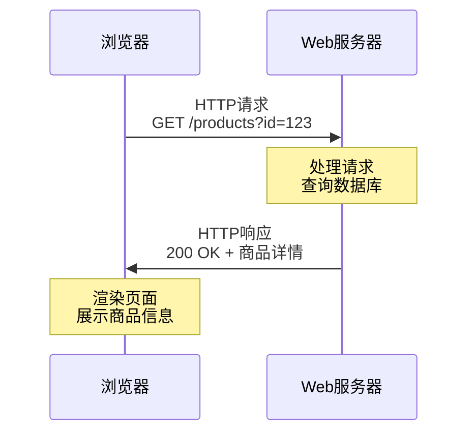

在电商系统中,用户点击商品链接时,浏览器发送HTTP GET请求到服务器,服务器查询数据库获取商品信息,将数据封装成HTTP响应返回给浏览器,浏览器解析响应并渲染商品详情页面。

## HTTP/1.0时代

HTTP/1.0于1996年发布,这是HTTP协议的第一个正式版本。它的核心特点是短连接模式:

### 短连接机制

每个HTTP请求都需要建立新的TCP连接,请求完成后立即关闭连接:

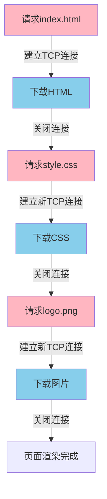

一个包含HTML、CSS、多张图片的网页需要建立多次TCP连接。每次连接都要经历三次握手和四次挥手,这在网络延迟较大时会严重影响页面加载速度。

### 性能瓶颈

假设一个网页包含1个HTML文件、3个CSS文件、10张图片,在HTTP/1.0中需要建立14次TCP连接。如果每次TCP握手需要100ms,仅连接建立就要消耗1.4秒,这在现代互联网环境下是无法接受的。

## HTTP/1.1的改进

HTTP/1.1于1999年发布,至今仍是使用最广泛的HTTP版本。它引入了持久连接、管道化等重要特性:

### 持久连接(Keep-Alive)

HTTP/1.1默认启用持久连接,允许在同一个TCP连接上发送多个HTTP请求:

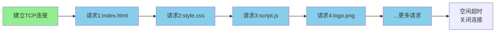

持久连接通过`Connection: keep-alive`头部实现,服务器可以设置连接超时时间。在新闻门户网站中,用户浏览一篇文章时,文章内容、图片、评论等资源可以复用同一个TCP连接加载,大幅提升加载速度。

### 管道化(Pipelining)

管道化允许客户端在收到前一个请求的响应之前发送下一个请求,减少等待时间:

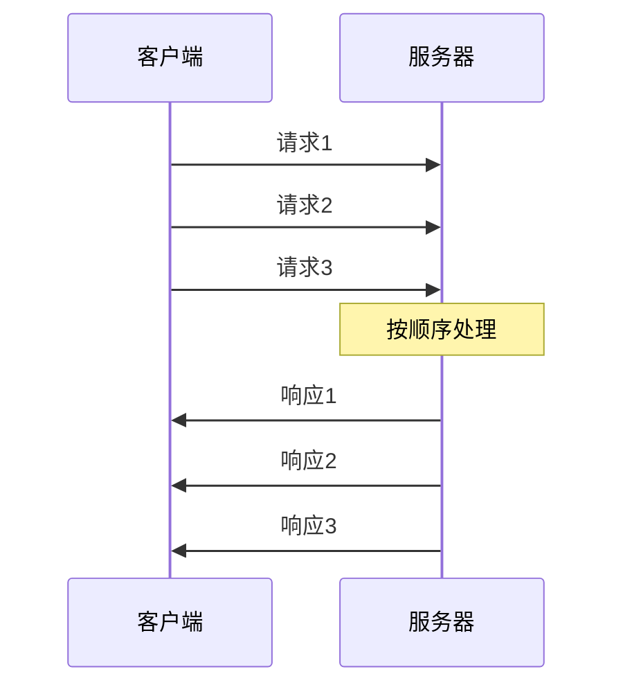

但管道化存在队头阻塞问题:服务器必须按照请求的顺序返回响应。如果第一个请求处理耗时较长,后续请求的响应都会被阻塞,即使它们已经处理完毕。

### 队头阻塞问题

假设客户端依次请求:
1. 大文件video.mp4(10MB,需要5秒)
2. 小文件logo.png(10KB,需要10ms)
3. 小文件data.json(1KB,需要5ms)

即使logo.png和data.json很快处理完,也必须等待video.mp4传输完毕才能返回给客户端。这就是HTTP层的队头阻塞。

## HTTP/2革新

HTTP/2于2015年发布,从根本上改变了HTTP的传输方式,引入了二进制分帧、多路复用等创新特性:

### 二进制分帧层

HTTP/2在应用层和传输层之间引入二进制分帧层,将HTTP消息分割成更小的帧进行传输:

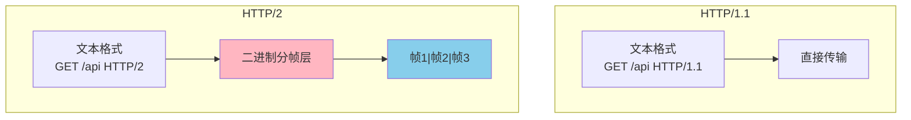

HTTP/2定义了多种帧类型:
- **DATA帧**:携带HTTP消息体
- **HEADERS帧**:携带HTTP头部
- **SETTINGS帧**:协商连接参数
- **WINDOW_UPDATE帧**:流量控制

### 多路复用

HTTP/2的多路复用允许在单个TCP连接上并发传输多个数据流,彻底解决了HTTP层的队头阻塞:

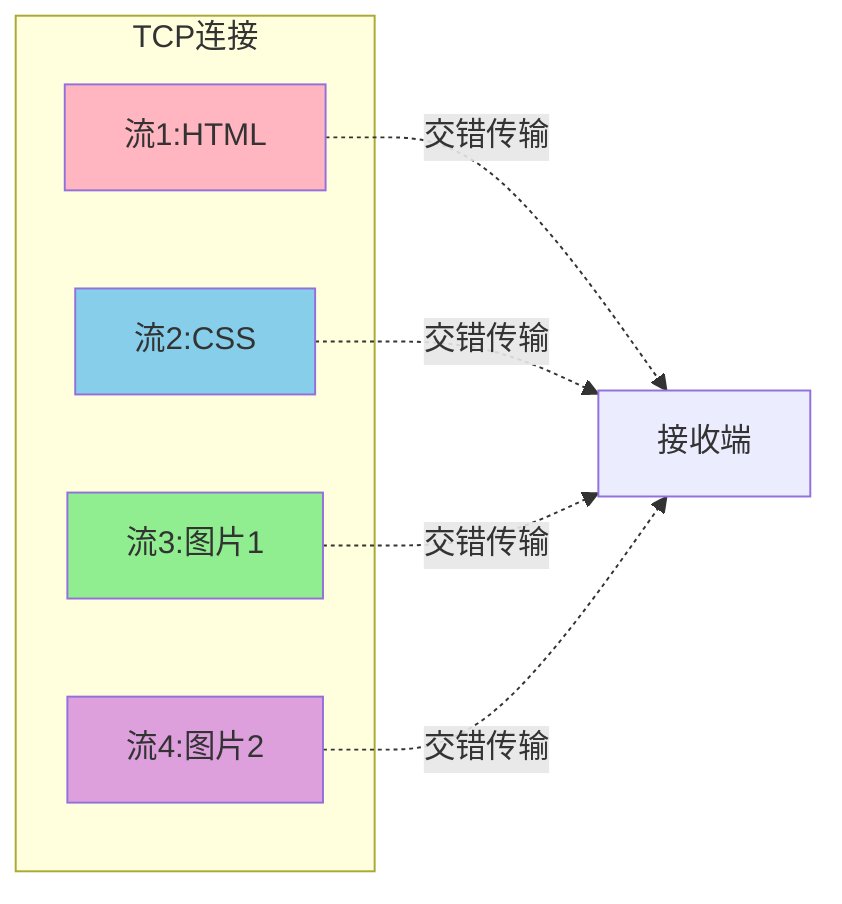

每个流有独立的标识符,帧可以乱序发送,接收端根据流ID重组数据。在视频网站中,播放器可以同时请求视频流、弹幕数据、推荐列表,这些请求不会相互阻塞,显著提升用户体验。

### 头部压缩(HPACK)

HTTP请求头通常包含大量重复信息(如User-Agent、Cookie等),HTTP/2使用HPACK算法压缩头部:

**静态表**:预定义常见头部字段的映射
**动态表**:记录连接中出现过的头部字段

首次请求:
```
:method: GET
:path: /api/products
user-agent: Mozilla/5.0...
cookie: session=abc123; user=john
```

后续请求只需发送差异部分:
```
:path: /api/cart  (其他字段引用动态表)
```

在移动网络环境下,头部压缩能显著减少数据传输量,降低流量消耗,加快页面加载速度。

### 服务器推送

HTTP/2允许服务器主动向客户端推送资源,无需等待客户端请求:

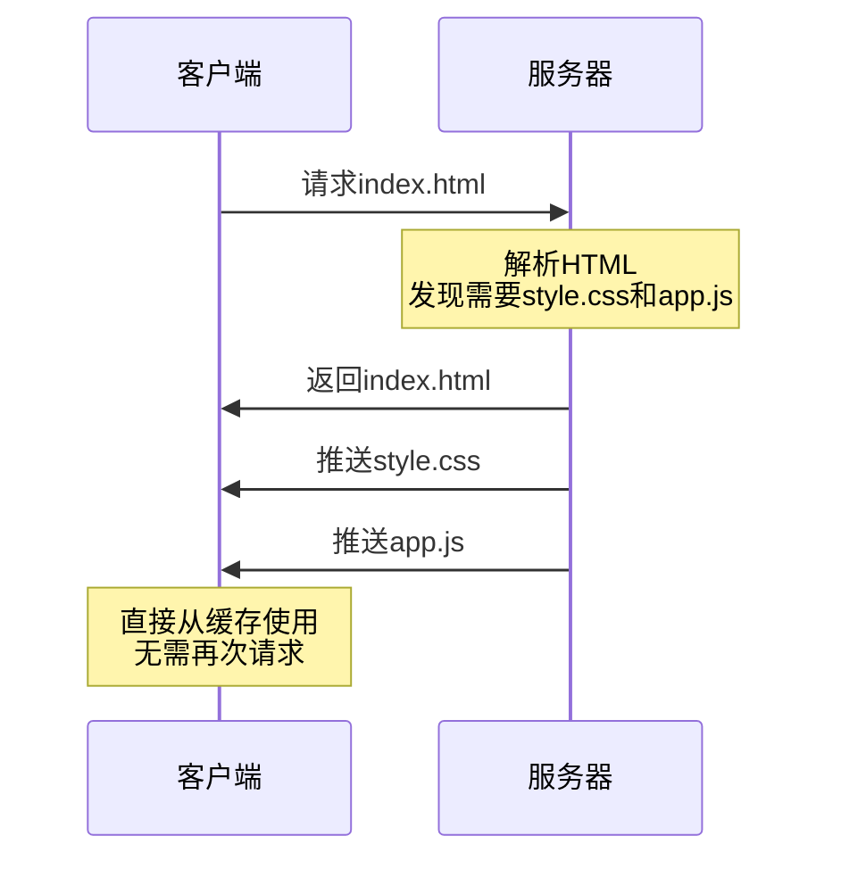

当客户端请求HTML页面时,服务器分析发现页面需要CSS和JavaScript文件,直接将这些资源推送给客户端。客户端渲染页面时,从本地缓存读取资源,无需发送额外请求。

但服务器推送在实践中效果不佳:
- 客户端可能已缓存资源,推送造成浪费
- 推送时机难以把握,可能影响关键资源加载
- HTTP/3已移除服务器推送特性

### HTTP/2的TCP问题

虽然HTTP/2解决了HTTP层的队头阻塞,但TCP层的队头阻塞仍然存在:

HTTP/2所有流复用同一个TCP连接,如果某个TCP数据包丢失,所有流都要等待该包重传,即使丢失的包只属于其中一个流。这在弱网环境下会严重影响性能。

## HTTP/3的突破

HTTP/3于2022年正式发布,它抛弃了TCP,转而使用基于UDP的QUIC协议,从底层解决了队头阻塞问题:

### QUIC协议优势

QUIC(Quick UDP Internet Connections)在UDP基础上实现了类似TCP的可靠传输:

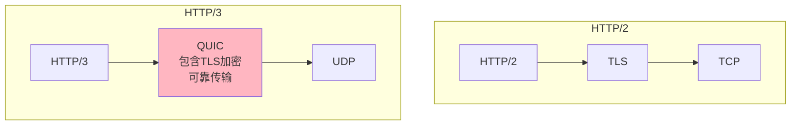

**独立的流管理**

QUIC为每个流分配独立的传输通道,一个流的丢包不影响其他流:

在直播场景中,如果视频流出现丢包,只需重传视频数据,不会阻塞弹幕、礼物等其他流的传输,用户体验更流畅。

**0-RTT连接建立**

QUIC支持0-RTT快速握手,客户端首次连接后会保存服务器的配置信息,后续连接可以在首个数据包中直接携带应用数据:

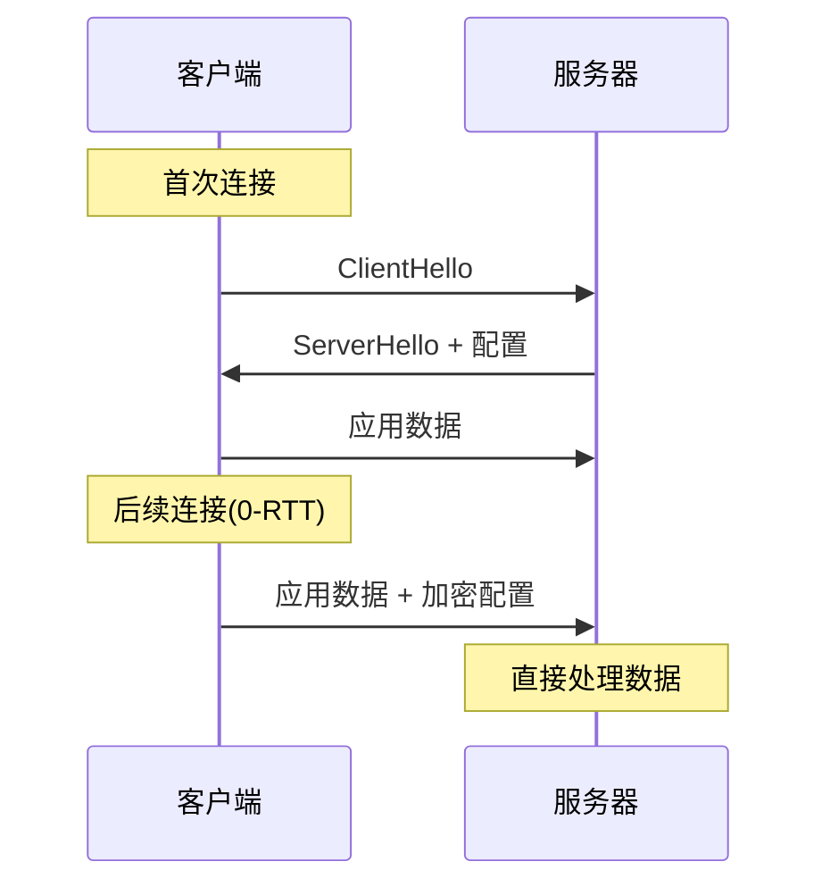

相比HTTP/2需要TCP三次握手(1.5 RTT)加TLS握手(1-2 RTT),HTTP/3的0-RTT能显著降低首次请求延迟,在跨境电商等长距离通信场景优势明显。

**连接迁移**

QUIC使用连接ID标识连接,而不是IP+端口四元组。当用户从WiFi切换到4G网络时,IP地址改变,但QUIC连接不会中断:

在移动端购物应用中,用户在WiFi环境下浏览商品,出门后切换到移动网络,支付流程不会因网络切换而中断,提升了交易成功率。

### HTTP/3挑战

**中间设备兼容性**

许多企业防火墙、负载均衡器对UDP支持不佳,可能阻断QUIC流量。HTTP/3需要配合HTTP/2降级方案,增加了部署复杂度。

**CPU开销**

QUIC的加密、拥塞控制都在用户态实现,相比内核态的TCP,CPU消耗更高。但随着硬件性能提升和QUIC优化,这个问题逐渐减轻。

## HTTPS安全传输

HTTPS是HTTP的安全版本,通过TLS(传输层安全)协议对HTTP通信进行加密:

### HTTPS与HTTP的区别

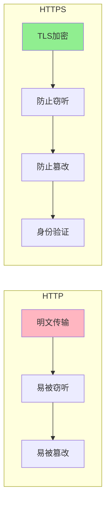

| 特性 | HTTP | HTTPS |
|------|------|-------|
| 默认端口 | 80 | 443 |
| 数据传输 | 明文 | 加密 |
| 安全性 | 低,易被中间人攻击 | 高,使用TLS加密 |
| 性能 | 较快,无加解密开销 | 略慢,有加解密开销 |
| 证书 | 不需要 | 需要CA颁发的证书 |
| SEO | 搜索引擎优先级低 | 优先级高 |

在在线支付场景中,HTTPS加密传输确保用户的银行卡号、密码等敏感信息不会被黑客截获。现代浏览器对非HTTPS网站会显示"不安全"警告,推动全网HTTPS化。

### TLS握手过程

HTTPS在TCP连接建立后,需要进行TLS握手协商加密参数:

**TLS 1.2握手(2-RTT)**

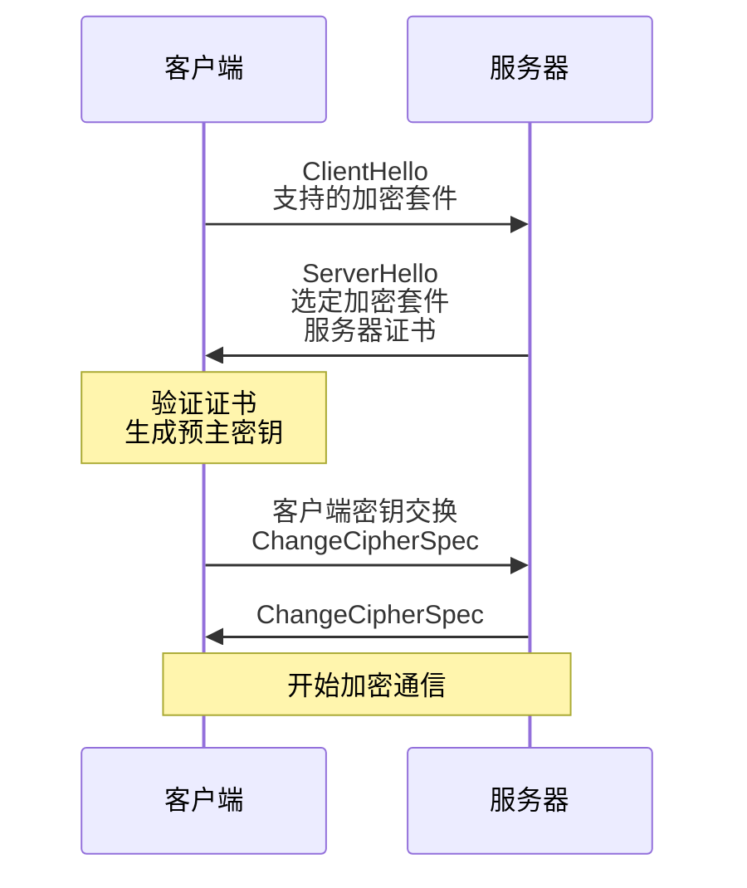

**TLS 1.3优化(1-RTT)**

TLS 1.3简化了握手流程,减少了往返次数:

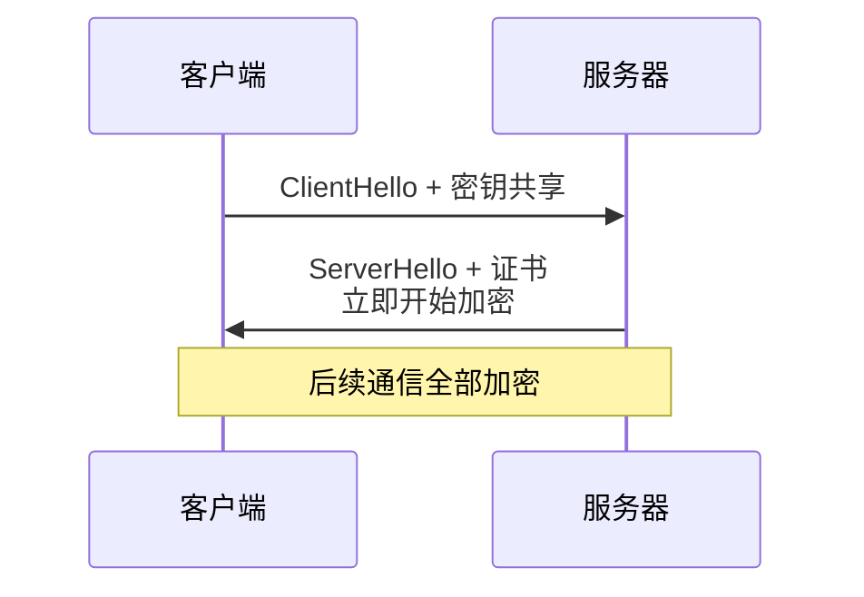

在CDN加速场景中,TLS 1.3能够降低边缘节点与客户端的握手延迟,配合HTTP/2,显著提升HTTPS网站的访问速度。

## HTTP状态码与重定向

### 常见状态码

- **2xx成功**:200 OK(请求成功)、201 Created(资源创建成功)
- **3xx重定向**:301永久重定向、302临时重定向、304资源未修改
- **4xx客户端错误**:400请求格式错误、401未授权、404资源不存在
- **5xx服务器错误**:500服务器内部错误、502网关错误、503服务不可用

### 301与302的区别

**301永久重定向**

表示资源已永久移动到新位置,浏览器和搜索引擎会缓存这个重定向:

```
HTTP/1.1 301 Moved Permanently
Location: https://www.newdomain.com/products
```

适用场景:
- 网站更换域名
- 统一HTTP跳转到HTTPS
- 旧URL永久废弃

搜索引擎会将旧URL的权重转移给新URL,用户下次访问时浏览器直接请求新地址。

**302临时重定向**

表示资源临时移动,客户端不应缓存:

```
HTTP/1.1 302 Found
Location: https://m.example.com/products
```

适用场景:
- 短链服务
- 根据用户设备跳转(PC版/移动版)
- 临时维护页面

在短链系统中,使用302重定向能够统计点击次数。如果使用301,浏览器会缓存,后续点击无法统计。

## HTTP版本对比总结

| 特性 | HTTP/1.1 | HTTP/2 | HTTP/3 |
|------|----------|--------|--------|
| 发布年份 | 1999 | 2015 | 2022 |
| 传输协议 | TCP | TCP | UDP(QUIC) |
| 连接复用 | Keep-Alive | 是 | 是 |
| 多路复用 | 否 | 是 | 是 |
| 队头阻塞 | HTTP层+TCP层 | TCP层 | 无 |
| 头部压缩 | 否 | HPACK | QPACK |
| 服务器推送 | 否 | 是 | 否(已移除) |
| 连接建立 | TCP 3次握手<br/>TLS 1-2 RTT | TCP 3次握手<br/>TLS 1-2 RTT | 0-1 RTT |

在实际应用中,根据业务特点选择HTTP版本:
- **HTTP/1.1**:兼容性好,适合低复杂度场景
- **HTTP/2**:主流选择,平衡性能与兼容性
- **HTTP/3**:前沿技术,适合对延迟敏感的场景(直播、游戏等)

主流网站如Google、Facebook、Cloudflare都已支持HTTP/3,随着浏览器和服务器软件的成熟,HTTP/3将逐渐成为互联网的新标准。
