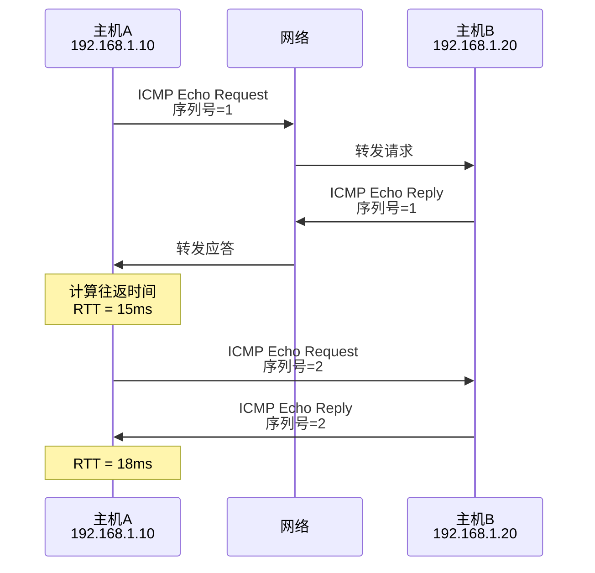
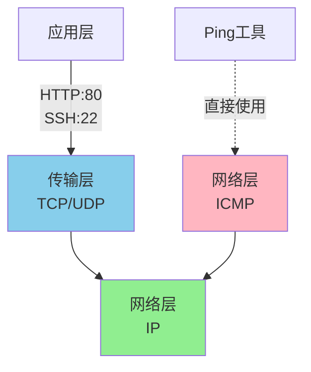
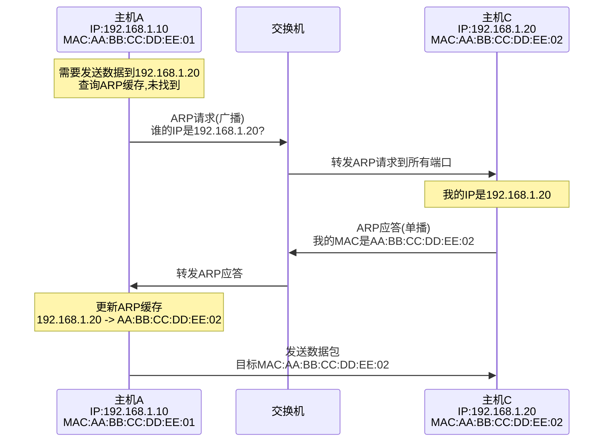
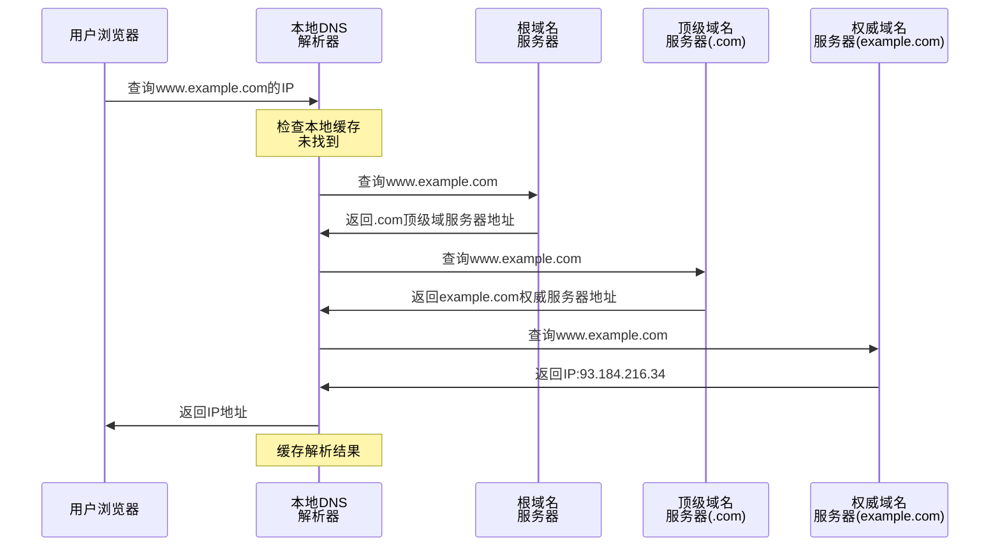
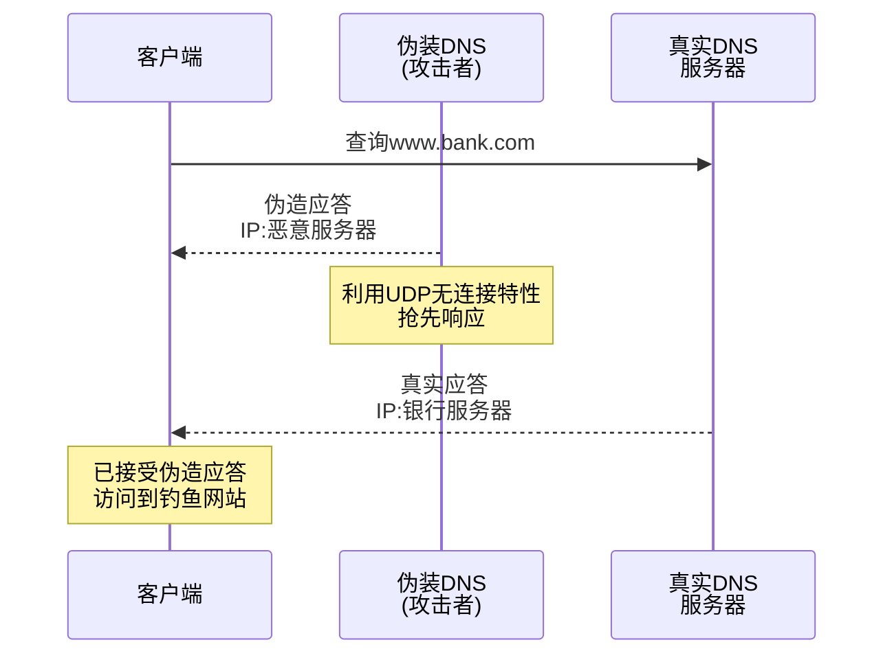
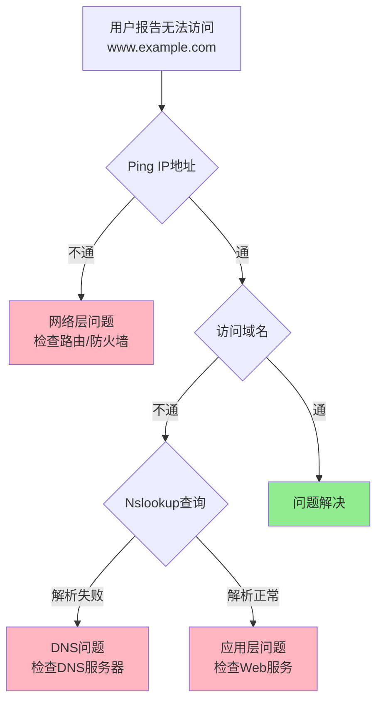

## Ping网络诊断工具

Ping是网络管理中最常用的诊断工具,用于测试目标主机的连通性和网络延迟。它基于ICMP(Internet Control Message Protocol,互联网控制报文协议)实现。

### Ping工作原理

Ping通过发送ICMP回显请求(Echo Request)报文到目标主机,目标主机收到后回复ICMP回显应答(Echo Reply)报文:



在运维工作中,当用户反馈无法访问服务器时,首先使用ping命令检查网络连通性:

```bash
# Ping服务器IP地址
ping 192.168.1.100

# 输出示例
64 bytes from 192.168.1.100: icmp_seq=1 ttl=64 time=2.45 ms
64 bytes from 192.168.1.100: icmp_seq=2 ttl=64 time=1.98 ms
64 bytes from 192.168.1.100: icmp_seq=3 ttl=64 time=2.12 ms
```

从输出可以看到:
- **icmp_seq**:ICMP报文序列号
- **ttl**:生存时间,经过每个路由器减1,用于防止路由环路
- **time**:往返时间,反映网络延迟

### ICMP协议特性

ICMP工作在网络层,用于传递控制消息,主要功能包括:

**差错报告**

当数据包无法到达目标或发生异常时,路由器会向源主机发送ICMP差错报文:
- **目标不可达**:端口关闭、主机不可达、网络不可达
- **超时**:TTL值减为0
- **参数错误**:IP首部字段有误

**网络诊断**

除了Echo Request/Reply,ICMP还提供其他诊断功能:
- **时间戳请求/应答**:测量网络延迟
- **地址掩码请求/应答**:获取子网掩码

### Ping为什么不需要端口

传输层协议(TCP/UDP)使用端口号区分同一主机上的不同服务。而Ping基于ICMP协议,属于网络层,直接封装在IP数据包中,不经过传输层,因此不需要端口号。



在防火墙配置中,禁ping通常是屏蔽ICMP协议,而不是屏蔽某个端口。这与禁止SSH(屏蔽22端口)的方式不同。

## ARP地址解析协议

ARP(Address Resolution Protocol)用于在局域网内将IP地址解析为MAC地址,是数据链路层和网络层之间的桥梁。

### ARP工作流程

当主机需要向同一网段的另一台主机发送数据时:



在企业办公网络中,当电脑A向打印机发送打印任务时:
1. 电脑A通过ARP获取打印机的MAC地址
2. 将打印数据封装在以太网帧中,目标MAC地址为打印机MAC
3. 交换机根据MAC地址表将数据帧转发到打印机所在端口

### ARP缓存机制

频繁的ARP广播会消耗网络带宽,因此主机会缓存已解析的IP-MAC映射:

```bash
# 查看ARP缓存表
arp -a

# 输出示例
Internet地址         物理地址              类型
192.168.1.1          00-1a-2b-3c-4d-5e    动态
192.168.1.20         aa-bb-cc-dd-ee-02    动态
192.168.1.254        ff-ee-dd-cc-bb-aa    静态
```

- **动态条目**:通过ARP学习,有生存时间(通常几分钟)
- **静态条目**:手动配置,永久有效

在数据中心网络中,核心设备的ARP条目可以配置为静态,避免ARP表项超时导致的通信中断。

### RARP反向地址解析

RARP(Reverse ARP)与ARP相反,用于通过MAC地址获取IP地址:


RARP主要用于无盘工作站启动场景:机器上电时只知道自己的MAC地址(网卡烧录),通过RARP服务器获取IP地址后才能启动操作系统。

现代网络中,RARP已被DHCP(动态主机配置协议)取代,DHCP不仅能分配IP地址,还能配置子网掩码、网关、DNS服务器等参数,功能更强大。

## DNS域名系统

DNS(Domain Name System)是互联网的基础服务,将人类易记的域名转换为机器能理解的IP地址。

### DNS解析过程

当用户在浏览器输入www.example.com时,DNS解析经历多个步骤:



以访问电商网站为例:

1. **浏览器缓存**:首先检查浏览器DNS缓存,如果之前访问过,直接使用缓存的IP
2. **操作系统缓存**:检查系统DNS缓存和hosts文件
3. **本地DNS服务器**:通常是ISP提供或公司内网DNS服务器
4. **递归查询**:本地DNS服务器代表客户端向根服务器查询
5. **返回结果**:获得IP地址后建立TCP连接,开始HTTP通信

### DNS记录类型

DNS服务器存储多种类型的记录:

**A记录**:域名到IPv4地址的映射

```
www.example.com.    IN  A    93.184.216.34
```

**AAAA记录**:域名到IPv6地址的映射

```
www.example.com.    IN  AAAA 2606:2800:220:1:248:1893:25c8:1946
```

**CNAME记录**:域名别名

```
blog.example.com.   IN  CNAME www.example.com.
```

在CDN加速场景中,www.example.com可能指向一个CNAME记录,解析到CDN厂商的域名,再根据用户地理位置解析到最近的边缘节点IP。

**MX记录**:邮件服务器地址

```
example.com.        IN  MX  10 mail.example.com.
```

数字10是优先级,数值越小优先级越高。邮件系统根据MX记录找到目标邮箱的邮件服务器。

**NS记录**:域名服务器地址

```
example.com.        IN  NS  ns1.example.com.
example.com.        IN  NS  ns2.example.com.
```

### DNS缓存与TTL

DNS记录有TTL(Time To Live)值,指定缓存有效期:

```
www.example.com.  300  IN  A  93.184.216.34
```

TTL为300秒,意味着DNS解析器可以缓存这条记录5分钟。

**TTL设置策略**:
- **TTL较短**(如60秒):适合频繁变更IP的场景,如灰度发布、故障切换
- **TTL较长**(如86400秒):适合稳定的服务,减少DNS查询次数,提升性能

在网站迁移场景中,提前几天将TTL调短,确保切换时用户能快速感知新IP,避免长时间缓存旧IP导致访问失败。

### DNS安全问题

**DNS污染**

攻击者伪装成DNS服务器,返回错误的IP地址:



**防护措施**:
- 使用DNSSEC验证DNS响应的真实性
- 部署DNS over HTTPS(DoH)或DNS over TLS(DoT),加密DNS查询
- 使用可信的公共DNS服务(如8.8.8.8、1.1.1.1)

**DNS劫持**

攻击者攻破DNS服务器,直接修改域名解析记录:

在企业网络中,如果内网DNS服务器被入侵,攻击者可以将内部系统域名解析到恶意服务器,窃取员工凭证和敏感数据。

**防护措施**:
- 加固DNS服务器安全,定期更新补丁
- 实施访问控制,只允许授权人员修改DNS记录
- 部署DNS监控系统,及时发现异常解析行为

## 网络工具实战

### Traceroute路由追踪

Traceroute用于追踪数据包到达目标主机经过的路由路径:

```bash
# Linux使用traceroute
traceroute www.example.com

# Windows使用tracert
tracert www.example.com

# 输出示例
traceroute to www.example.com (93.184.216.34), 30 hops max
 1  192.168.1.1 (192.168.1.1)  2.456 ms  1.234 ms  1.567 ms
 2  10.0.0.1 (10.0.0.1)  5.789 ms  5.234 ms  5.678 ms
 3  221.x.x.x (221.x.x.x)  12.345 ms  11.234 ms  12.456 ms
 4  * * *
 5  93.184.216.34 (93.184.216.34)  89.123 ms  88.456 ms  89.789 ms
```

Traceroute的工作原理:
1. 发送TTL=1的数据包,第一个路由器TTL减为0,返回ICMP超时报文
2. 发送TTL=2的数据包,第二个路由器返回ICMP超时报文
3. 依次递增TTL,直到到达目标主机

在网络故障排查中,如果traceroute显示某一跳延迟突然增大,或出现`* * *`(超时),说明该节点存在问题,可能是路由器过载、链路拥塞或防火墙配置不当。

### Nslookup DNS查询

Nslookup是专门的DNS查询工具:

```bash
# 查询域名A记录
nslookup www.example.com

# 输出示例
Server:  192.168.1.1
Address: 192.168.1.1#53

Non-authoritative answer:
Name:    www.example.com
Address: 93.184.216.34

# 指定DNS服务器查询
nslookup www.example.com 8.8.8.8

# 查询特定类型记录
nslookup -type=MX example.com
```

在域名迁移场景中,使用nslookup验证新DNS记录是否生效:

```bash
# 查询权威DNS服务器
nslookup -type=NS example.com

# 直接向权威DNS查询
nslookup www.example.com ns1.example.com
```

### Netstat网络连接状态

Netstat显示系统的网络连接、路由表、接口统计等信息:

```bash
# 查看所有TCP连接
netstat -ant

# 查看监听端口
netstat -tuln

# 查看各状态的连接数量
netstat -an | awk '/^tcp/ {print $6}' | sort | uniq -c

# 输出示例
    150 ESTABLISHED
     25 TIME_WAIT
      5 SYN_SENT
      8 LISTEN
```

在Web服务器性能调优时,通过netstat监控连接状态分布:
- **ESTABLISHED过多**:可能需要增加服务器实例
- **TIME_WAIT大量堆积**:考虑调整`tcp_tw_reuse`参数
- **SYN_SENT过多**:可能遭受SYN洪泛攻击

### 综合诊断流程

当用户反馈无法访问服务时,系统化的诊断流程:



1. **Ping IP地址**:验证网络层连通性
2. **Ping域名**:验证DNS解析和端到端连通性
3. **Nslookup域名**:检查DNS解析是否正确
4. **Traceroute追踪**:定位网络路径上的瓶颈节点
5. **Telnet端口**:验证应用服务是否正常监听
6. **Curl测试**:模拟HTTP请求,检查应用层响应

通过这套组合工具,可以快速定位问题发生在网络层、传输层还是应用层,大幅提升故障排查效率。
