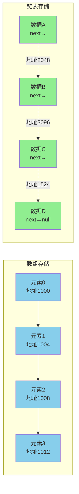
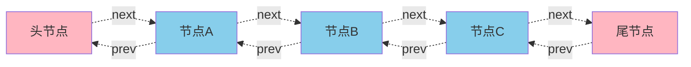
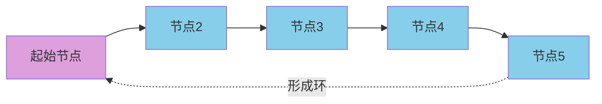
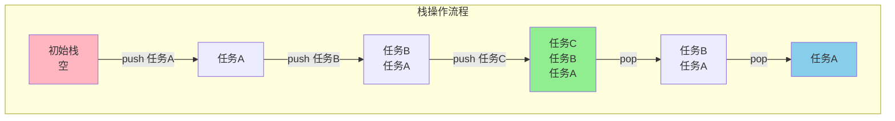
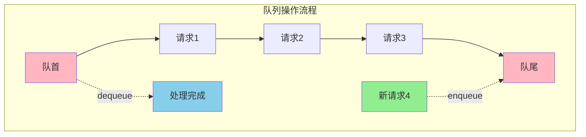
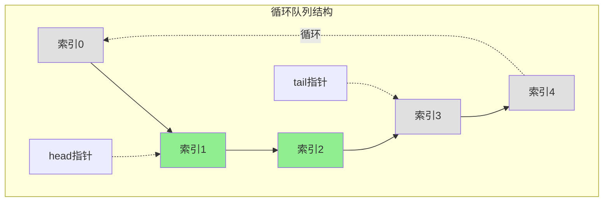

## 数组与链表的本质差异

数组和链表是两种最基础的数据集合结构,它们在内存组织方式和访问特性上有着根本性的区别。

**数组**采用**连续的内存空间**存储元素,每个元素可以通过索引直接定位。想象一个仓库中排列整齐的货架,每个货架都有固定的编号,只要知道编号就能立即找到对应位置的货物。这种特性使得数组具有极快的随机访问速度。

**链表**则使用**非连续的内存块**存储元素,每个元素(节点)除了存储数据外,还保存着下一个节点的地址信息。这类似于一场寻宝游戏,每个宝箱中不仅有宝物,还有指向下一个宝箱位置的线索,必须按顺序逐个寻找。



### 核心特性对比

| 对比维度 | 数组 | 链表 |
|---------|------|------|
| 内存布局 | 连续分配 | 分散存储 |
| 索引访问 | O(1)常数时间 | O(n)线性查找 |
| 值查找 | 无序O(n),有序O(log n) | O(n)顺序遍历 |
| 空间利用 | 预分配可能浪费 | 动态分配,额外存储指针 |
| 插入删除 | 平均移动n/2个元素 | 仅修改指针引用 |
| 大小变更 | 固定容量,扩容成本高 | 灵活伸缩 |

### 实际应用场景

在设计一个**在线购物车系统**时:
- **商品展示列表**适合用数组:需要频繁通过索引跳转到指定页码的商品
- **购物车商品管理**适合用链表:用户经常添加、删除商品,链表的插入删除操作效率更高

### 链表的扩展形态

**双向链表**中的每个节点不仅指向后继节点,还保存了前驱节点的引用。这使得可以从任意节点双向遍历,在某些场景下能显著提升效率。



**环形链表**的最后一个节点指向链表中的某个节点(通常是头节点),形成闭环结构。这种结构在实现循环缓冲区、约瑟夫环问题等场景中非常实用。



## 栈与队列的运作机制

栈和队列虽然都是受限的线性表结构,但它们的数据存取规则截然相反:**栈遵循后进先出(LIFO)**,**队列遵循先进先出(FIFO)**。

### 栈的特性与实现

栈只允许在一端(栈顶)进行插入和删除操作。想象一个羽毛球筒,球只能从顶部放入和取出,最后放入的球会最先被取出。

**数组实现栈**效率最高,因为栈的操作都集中在一端,不需要移动其他元素:

```java
class TaskStack {
    private int topIndex = -1;
    private int capacity;
    private String[] tasks;

    public TaskStack(int capacity) {
        this.capacity = capacity;
        tasks = new String[capacity];
    }

    public boolean isFull() {
        return topIndex == capacity - 1;
    }

    public boolean isEmpty() {
        return topIndex == -1;
    }

    public void push(String task) {
        if (isFull()) {
            throw new RuntimeException("任务栈已满,无法添加新任务");
        }
        tasks[++topIndex] = task;
    }

    public String pop() {
        if (isEmpty()) {
            throw new RuntimeException("任务栈为空");
        }
        String task = tasks[topIndex--];
        return task;
    }
}
```



**栈的典型应用**:
- **函数调用栈**: 程序执行时,每次函数调用都会将调用信息压栈,返回时出栈恢复上一层执行环境
- **表达式求值**: 将中缀表达式转换为后缀表达式并计算
- **浏览器历史记录**: 后退功能依赖栈结构维护访问历史

### 队列的特性与实现

队列在一端(队尾)插入,在另一端(队首)删除。类似于超市收银台的排队系统,先到的顾客先结账离开。

**链表实现队列**更为合理,因为需要在两端进行操作,链表可以高效地在头尾插入删除:

```java
class RequestQueue {
    
    Node frontNode;
    Node rearNode;
    int count;
    
    public void enqueue(String request) {
        Node newNode = new Node(request);
        if (isEmpty()) {
            frontNode = newNode;
            rearNode = frontNode;
        } else {
            rearNode.next = newNode;
            rearNode = newNode;
        }
        count++;
    }

    public String dequeue() {
        if (isEmpty()) {
            throw new RuntimeException("队列为空,没有待处理请求");
        }
        String request = frontNode.data;
        frontNode = frontNode.next;
        count--;
        return request;
    }

    public boolean isEmpty() {
        return count == 0;
    }

    private static class Node {
        public String data;
        public Node next;
        public Node(String data) {
            this.data = data;
        }
    }
}
```



**队列的典型应用**:
- **消息中间件**: 生产者将消息放入队列,消费者按顺序处理,实现异步解耦
- **任务调度系统**: 按提交顺序执行批处理任务
- **广度优先搜索**: 图和树的层次遍历依赖队列实现

### 特殊队列结构

**双端队列(Deque)**允许在队首和队尾同时进行插入和删除操作,兼具栈和队列的特性:

```java
Deque<String> orders = new LinkedList<>();
orders.offerFirst("VIP订单");  // 队首插入
orders.offerLast("普通订单");   // 队尾插入
orders.pollFirst();            // 队首移除
orders.pollLast();             // 队尾移除
```

**循环队列**解决了数组实现普通队列时的空间浪费问题。当队尾指针到达数组末尾时,会循环回到数组开头继续使用已释放的空间:

```java
class CircularBuffer {
    private final String[] buffer;
    private int head = 0;
    private int tail = 0;
    
    public boolean enqueue(String data) {
        if ((tail + 1) % buffer.length == head) {
            // 队列已满,可以选择扩容或覆盖旧数据
            return false;
        }
        buffer[tail] = data;
        tail = (tail + 1) % buffer.length;
        return true;
    }
    
    public String dequeue() {
        if (isEmpty()) {
            return null;
        }
        String data = buffer[head];
        head = (head + 1) % buffer.length;
        return data;
    }
    
    public boolean isEmpty() {
        return head == tail;
    }
    
    public CircularBuffer(int capacity) {
        this.buffer = new String[capacity];
    }
}
```



**循环队列的应用场景**:
- **音视频缓冲区**: 流媒体播放时的数据缓存,新数据覆盖已播放的旧数据
- **日志系统**: 固定大小的日志缓冲区,自动覆盖最早的日志
- **网络数据包缓存**: 在接收端缓存一定数量的数据包

## 数据结构选择策略

在实际开发中,选择合适的数据结构需要综合考虑:

**优先使用数组的场景**:
- 需要频繁通过索引随机访问元素
- 数据规模相对固定,不需要频繁调整大小
- 内存空间要求紧凑,不希望额外的指针开销

**优先使用链表的场景**:
- 频繁进行插入和删除操作
- 数据规模动态变化,难以预估
- 不需要随机访问,主要是顺序遍历

**优先使用栈的场景**:
- 需要记录历史状态并支持回退(如编辑器的撤销功能)
- 处理具有嵌套结构的问题(如括号匹配、递归模拟)
- 深度优先搜索算法

**优先使用队列的场景**:
- 需要按先后顺序处理任务
- 实现生产者-消费者模式
- 广度优先搜索算法

Java标准库的选择参考:
```java
// 栈操作
Stack<Integer> stack = new Stack<>();
Deque<Integer> betterStack = new ArrayDeque<>();  // 性能更优

// 队列操作
Queue<String> queue = new LinkedList<>();
Queue<String> arrayQueue = new ArrayDeque<>();    // 数组实现,性能更优
```

