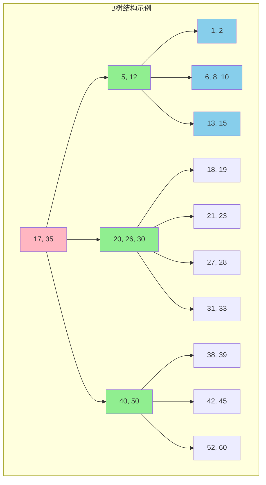
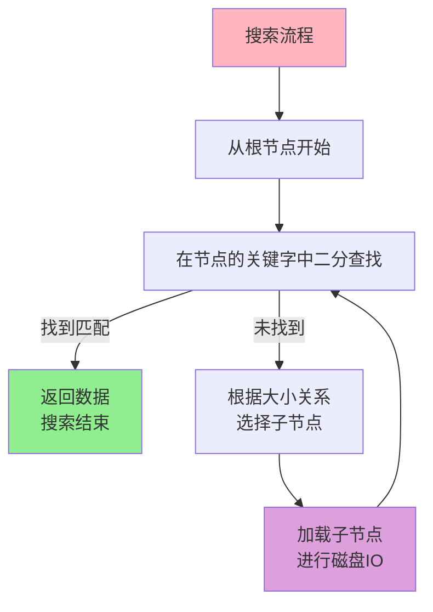
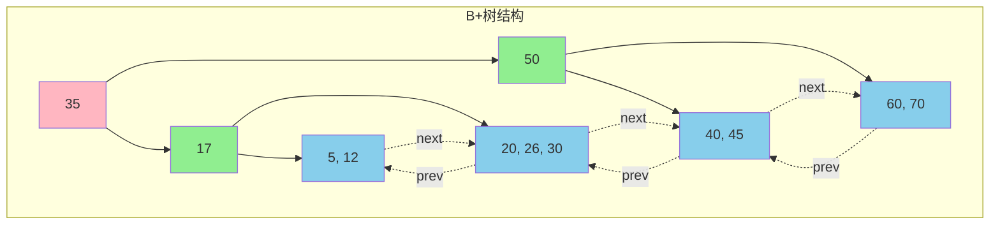
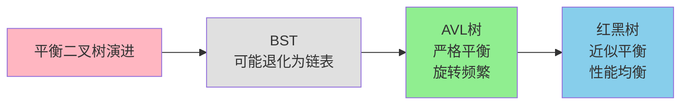
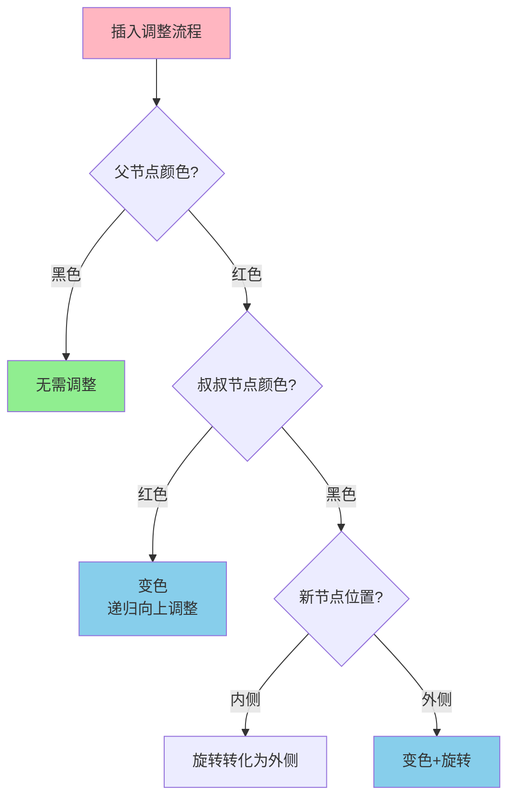

## B树与B+树的设计思想

B树和B+树是专为**减少磁盘访问次数**而设计的多路平衡搜索树,在数据库和文件系统中扮演着核心角色。

### B树的结构特性

B树(B-Tree)的"B"代表Balanced(平衡),它通过允许每个节点包含**多个关键字和子节点**来降低树的高度。

一棵m阶B树必须满足以下约束:
1. 每个节点最多包含 m 个子节点
2. 非叶子节点(除根节点外)至少有 ⌈m/2⌉ 个子节点
3. 根节点至少有2个子节点(除非它是叶子节点)
4. 有k个子节点的非叶子节点包含 k-1 个关键字
5. 所有叶子节点都在同一层,保证高度一致

### B树的核心优势

**降低树高**: 假设存储100万条记录,二叉搜索树的高度约为20层,而一棵200阶的B树高度只需要3层。每次磁盘IO对应一个节点访问,B树可以将磁盘访问次数从20次减少到3次。

**数据就近存储**: B树的节点可以设计为磁盘页的大小(通常4KB或8KB),一次磁盘读取就能获取一个节点的所有关键字,充分利用了磁盘的顺序读取性能。

**支持范围查询**: B树的关键字有序排列,通过中序遍历可以获得有序数据序列。

### B树的数据分布

在B树中,**数据可以存储在任何节点**中(包括非叶子节点和叶子节点)。当在MongoDB中查找一个文档时,可能在非叶子节点就找到目标数据,搜索即可结束。

### B+树的结构改进

B+树是B树的变种,主要有两处关键改进:

**改进1: 数据下沉到叶子层**
在B+树中,**所有数据只存储在叶子节点**,非叶子节点只保存关键字和指针,用于索引导航。这使得非叶子节点可以容纳更多的关键字,进一步降低树高。

**改进2: 叶子节点链式连接**
B+树的所有叶子节点通过双向指针形成**有序链表**,这个设计使得范围查询和顺序扫描变得极其高效。

### B+树的性能优势

**范围查询效率高**: 查询"年龄在25-35岁之间的用户"时,B+树只需定位到起始叶子节点,然后沿着链表顺序读取,无需回溯到父节点。而B树需要中序遍历整棵树。

**非叶子节点容量大**: 由于不存储数据,非叶子节点可以容纳更多索引项。假设一个磁盘页8KB,B树节点可能存储100个索引项,而B+树可以存储200个,树高更低。

**顺序IO友好**: 全表扫描时,B+树只需顺序遍历叶子链表,充分利用磁盘预读和缓存;B树则需要频繁的随机IO访问不同层级的节点。

### MySQL的选择

MySQL的InnoDB存储引擎选择B+树作为索引结构,原因包括:
- **聚簇索引**: 叶子节点直接存储完整的数据行,通过主键查询只需一次B+树查找
- **辅助索引**: 叶子节点存储主键值,通过回表操作获取完整数据
- **区间扫描**: 执行`SELECT * FROM users WHERE age BETWEEN 20 AND 30`时,B+树的叶子链表能快速完成范围读取

## 红黑树的自平衡机制

红黑树是一种**自平衡的二叉搜索树**,通过节点着色和特定规则维护近似平衡,确保操作的时间复杂度稳定在O(log n)。

### 红黑树的五大规则

1. **节点颜色**: 每个节点标记为红色或黑色
2. **根节点为黑**: 树的根节点必须是黑色
3. **红色节点约束**: 红色节点的两个子节点必须是黑色(不能有连续的红色节点)
4. **叶子节点为黑**: 所有空节点(NIL)视为黑色叶子节点
5. **黑高一致**: 从任意节点到其所有叶子节点的路径上,黑色节点数量相同

```mermaid
graph TB
    A["13<br/>黑"] --> B["8<br/>红"]
    A --> C["17<br/>红"]
    B --> D["1<br/>黑"]
    B --> E["11<br/>黑"]
    C --> F["15<br/>黑"]
    C --> G["25<br/>黑"]
    D --> H["NIL<br/>黑"]
    D --> I["NIL<br/>黑"]
    E --> J["NIL<br/>黑"]
    E --> K["NIL<br/>黑"]
    
    style A fill:#404040
    style B fill:#DC143C
    style C fill:#DC143C
    style D fill:#404040
    style E fill:#404040
    style F fill:#404040
    style G fill:#404040
```

### 为什么需要红黑树

**AVL树的问题**: AVL树要求任意节点的左右子树高度差不超过1,虽然保证了完美平衡,但每次插入、删除都可能触发多次旋转调整,维护成本高。

**红黑树的权衡**: 红黑树放宽了平衡条件,只保证最长路径不超过最短路径的2倍。这种"近似平衡"使得插入和删除操作的旋转次数显著减少,在实际应用中性能更优。

### 插入操作的调整

新插入的节点初始着色为**红色**(因为红色节点不会破坏黑高规则)。之后根据父节点和叔叔节点的颜色进行调整:

**情况1: 新节点是根节点**
直接将节点重新着色为黑色。

**情况2: 父节点是黑色**
不违反任何规则,无需调整。

**情况3: 父节点和叔叔节点都是红色**
将父节点和叔叔节点变为黑色,祖父节点变为红色,然后将祖父节点视为新插入节点,递归调整。

```mermaid
graph TB
    subgraph 变色前
        A1["爷节点<br/>黑"] --> B1["父节点<br/>红"]
        A1 --> C1["叔节点<br/>红"]
        B1 --> D1["新节点<br/>红"]
    end
    
    subgraph 变色后
        A2["爷节点<br/>红"] --> B2["父节点<br/>黑"]
        A2 --> C2["叔节点<br/>黑"]
        B2 --> D2["新节点<br/>红"]
    end
    
    style A1 fill:#404040
    style B1 fill:#DC143C
    style C1 fill:#DC143C
    style D1 fill:#DC143C
    style A2 fill:#DC143C
    style B2 fill:#404040
    style C2 fill:#404040
    style D2 fill:#DC143C
```

**情况4: 父节点是红色,叔叔节点是黑色,新节点在内侧**
先进行一次旋转,将情况转化为情况5。

**情况5: 父节点是红色,叔叔节点是黑色,新节点在外侧**
将父节点变为黑色,祖父节点变为红色,然后对祖父节点进行旋转。

### 红黑树的实际应用

**Java集合框架**:
- `TreeMap`和`TreeSet`底层使用红黑树实现,保证元素有序且操作时间复杂度为O(log n)
- `HashMap`在JDK8中,当链表长度超过8时,会将链表转化为红黑树,避免哈希冲突导致的性能退化

**Linux内核**:
- 完全公平调度器(CFS)使用红黑树管理可运行进程,快速选择优先级最高的进程
- 虚拟内存管理使用红黑树组织内存区域

## 三种树结构对比

| 特性 | B树 | B+树 | 红黑树 |
|-----|-----|------|--------|
| 节点结构 | 多路,数据分布在所有节点 | 多路,数据仅在叶子节点 | 二叉,数据在所有节点 |
| 树高 | 低(多路) | 最低(非叶子节点容量大) | 较高(二叉) |
| 范围查询 | 需要中序遍历 | 叶子链表顺序扫描 | 中序遍历 |
| 点查询 | 可能在非叶子节点结束 | 必须到叶子节点 | O(log n) |
| 适用场景 | 文档数据库(MongoDB) | 关系数据库索引(MySQL) | 内存数据结构(TreeMap) |
| 存储介质 | 优化磁盘IO | 优化磁盘IO | 适合内存操作 |

## 选择指南

**选择B+树的场景**:
- 需要频繁的范围查询和排序操作
- 数据存储在磁盘上,需要减少IO次数
- 需要支持全表顺序扫描
- 典型应用: 关系数据库索引、文件系统目录

**选择红黑树的场景**:
- 数据完全在内存中
- 需要频繁的插入和删除操作
- 需要维护数据的有序性
- 典型应用: Java的TreeMap、进程调度、内存管理

**选择B树的场景**:
- 数据记录较大,适合在非叶子节点存储
- 点查询比范围查询更频繁
- 典型应用: MongoDB的索引、某些文件系统

在实际开发中,通常不需要手动实现这些复杂的树结构,而是选择合适的数据库或集合类。理解它们的原理有助于:
- 优化数据库查询,合理设计索引
- 选择合适的数据结构提升性能
- 分析系统瓶颈,定位性能问题
