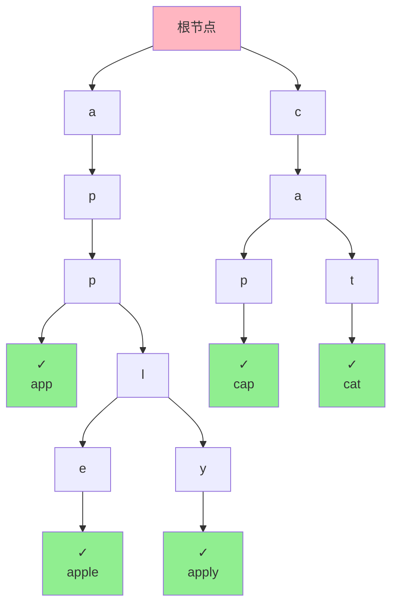
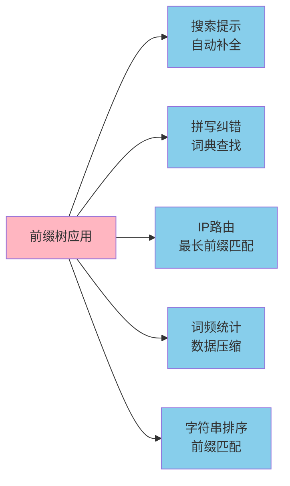
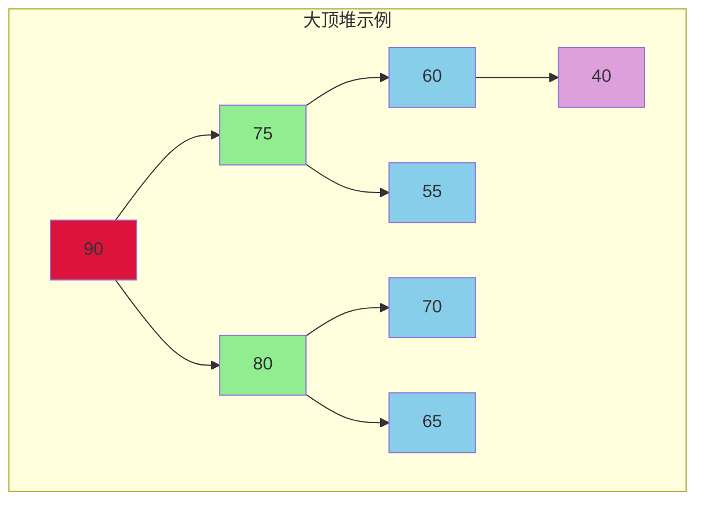
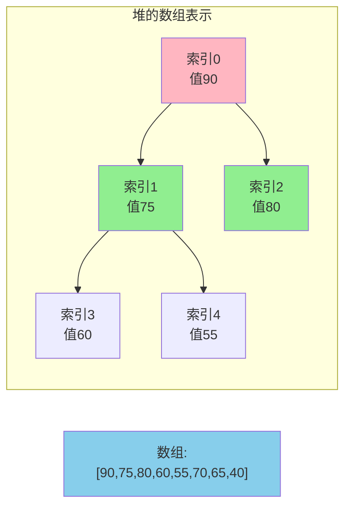
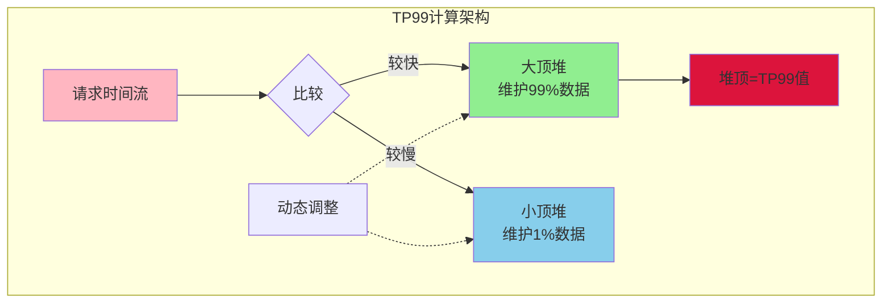

## 前缀树的设计原理

前缀树(Trie Tree,也称字典树或单词查找树)是一种专门用于**高效处理字符串集合**的树形数据结构。它的核心思想是**共享公共前缀**,将具有相同前缀的字符串合并存储,从而节省空间并加速查询。

### 前缀树的结构特征

**节点组织方式**:
- 根节点不存储字符,是一个空节点
- 除根节点外,每个节点代表一个字符
- 从根节点到某个节点的路径,连接起来形成一个字符串
- 每个节点的所有子节点代表不同的字符

假设有以下单词集合: `["app", "apple", "apply", "cat", "cap"]`



### 前缀树的时间复杂度优势

**传统字符串查找**: 在包含n个字符串的集合中查找某个长度为m的字符串,需要逐个比较,时间复杂度为**O(n × m)**。

**前缀树查找**: 只需沿着树从根节点走到目标节点,时间复杂度仅为**O(m)**,与字符串数量n无关。当字符串集合很大时,性能提升非常显著。

### Java实现前缀树

```java
class AutoCompleteTrie {
    
    private TrieNode root;
    
    public AutoCompleteTrie() {
        this.root = new TrieNode();
    }
    
    // 插入单词
    public void insert(String word) {
        TrieNode current = root;
        for (char ch : word.toCharArray()) {
            int index = ch - 'a';
            if (current.children[index] == null) {
                current.children[index] = new TrieNode();
            }
            current = current.children[index];
        }
        current.isEndOfWord = true;
    }
    
    // 查询单词是否存在
    public boolean search(String word) {
        TrieNode current = root;
        for (char ch : word.toCharArray()) {
            int index = ch - 'a';
            if (current.children[index] == null) {
                return false;
            }
            current = current.children[index];
        }
        return current.isEndOfWord;
    }
    
    // 查询是否存在某个前缀
    public boolean startsWith(String prefix) {
        TrieNode current = root;
        for (char ch : prefix.toCharArray()) {
            int index = ch - 'a';
            if (current.children[index] == null) {
                return false;
            }
            current = current.children[index];
        }
        return true;
    }
    
    private static class TrieNode {
        TrieNode[] children;
        boolean isEndOfWord;
        
        public TrieNode() {
            this.children = new TrieNode[26];  // 假设只有小写字母
            this.isEndOfWord = false;
        }
    }
}
```

### 前缀树的应用场景

**搜索引擎的自动补全**
当用户在搜索框输入"jav"时,系统可以快速从前缀树中找到所有以"jav"开头的词条:`["java", "javascript", "javafx"]`,实时展示候选项。

**拼写检查与纠错**
将词典构建成前缀树,检查用户输入的单词是否存在。如果不存在,可以通过前缀树快速找到相似的正确单词建议。

**IP路由表查找**
网络路由器使用前缀树存储路由表,通过IP地址的前缀快速匹配最长前缀,确定数据包的转发路径。

**词频统计**
在前缀树的节点中增加计数器字段,可以统计每个单词出现的频次。相比哈希表,前缀树能够节省存储空间(因为共享前缀)。



### 前缀树的空间优化

**标准前缀树的问题**: 每个节点需要一个固定大小的数组存储子节点指针,对于字符集较大的场景(如支持Unicode字符),空间开销巨大。

**压缩前缀树(Radix Tree)**: 将只有一个子节点的节点链压缩为一个节点,节点存储字符串片段而非单个字符。这种优化在稀疏字符串集合中能显著节省空间。

## 堆的核心机制

堆是一种特殊的**完全二叉树**,它满足**堆序性质**:在大顶堆中,任意节点的值都大于等于其子节点的值;在小顶堆中,任意节点的值都小于等于其子节点的值。

### 堆与普通二叉树的区别

**完全二叉树约束**: 堆必须是完全二叉树,即除了最后一层外,其他层的节点都是满的,且最后一层的节点从左到右连续排列。这个特性使得堆可以用**数组高效存储**。

**堆序性质**: 父子节点之间有严格的大小关系,但左右子节点之间没有顺序要求。



### 数组存储堆的映射关系

由于堆是完全二叉树,可以用数组按层次顺序存储节点。对于数组索引i的节点:
- **父节点索引**: (i - 1) / 2
- **左子节点索引**: 2 × i + 1
- **右子节点索引**: 2 × i + 2



### 堆的插入操作(上浮)

在大顶堆中插入新元素95的过程:
1. 将95添加到数组末尾(堆的最后位置)
2. 比较95与其父节点80,发现95更大
3. 交换95和80的位置
4. 继续向上比较,直到找到合适位置或到达根节点

```java
class PriorityTaskHeap {
    private int[] heap;
    private int size;
    
    public void insert(int priority) {
        heap[size] = priority;
        heapifyUp(size);
        size++;
    }
    
    private void heapifyUp(int index) {
        while (index > 0) {
            int parentIndex = (index - 1) / 2;
            if (heap[index] <= heap[parentIndex]) {
                break;
            }
            // 交换父子节点
            swap(index, parentIndex);
            index = parentIndex;
        }
    }
    
    private void swap(int i, int j) {
        int temp = heap[i];
        heap[i] = heap[j];
        heap[j] = temp;
    }
}
```

### 堆的删除操作(下沉)

删除堆顶元素(优先级最高的任务)的过程:
1. 将堆顶元素与最后一个元素交换
2. 删除最后一个元素(原堆顶)
3. 将新的堆顶元素向下调整,与其较大的子节点交换
4. 重复下沉,直到满足堆序性质

```java
public int extractMax() {
    if (size == 0) {
        throw new RuntimeException("堆为空");
    }
    
    int maxValue = heap[0];
    heap[0] = heap[size - 1];
    size--;
    heapifyDown(0);
    
    return maxValue;
}

private void heapifyDown(int index) {
    while (true) {
        int leftChild = 2 * index + 1;
        int rightChild = 2 * index + 2;
        int largest = index;
        
        if (leftChild < size && heap[leftChild] > heap[largest]) {
            largest = leftChild;
        }
        if (rightChild < size && heap[rightChild] > heap[largest]) {
            largest = rightChild;
        }
        
        if (largest == index) {
            break;  // 已满足堆序性质
        }
        
        swap(index, largest);
        index = largest;
    }
}
```

### 堆的典型应用

**优先队列**
任务调度系统中,紧急任务优先级高,普通任务优先级低。使用大顶堆,每次取出堆顶元素就是优先级最高的任务。

```java
PriorityQueue<Task> taskQueue = new PriorityQueue<>(
    (t1, t2) -> t2.priority - t1.priority  // 按优先级降序
);

taskQueue.offer(new Task("紧急任务", 100));
taskQueue.offer(new Task("普通任务", 50));
taskQueue.offer(new Task("低优先级", 10));

Task nextTask = taskQueue.poll();  // 获取优先级最高的任务
```

**TopK问题**
从海量数据中找出最大的K个元素。维护一个大小为K的小顶堆:
- 遍历所有数据,如果当前元素大于堆顶,则替换堆顶并调整堆
- 最终堆中的K个元素就是最大的K个

```java
public List<Integer> findTopK(int[] nums, int k) {
    PriorityQueue<Integer> minHeap = new PriorityQueue<>(k);
    
    for (int num : nums) {
        if (minHeap.size() < k) {
            minHeap.offer(num);
        } else if (num > minHeap.peek()) {
            minHeap.poll();
            minHeap.offer(num);
        }
    }
    
    return new ArrayList<>(minHeap);
}
```

**TP99性能统计**
TP99表示99%的请求响应时间。使用两个堆动态维护:
- 大顶堆存储前99%的较快请求
- 小顶堆存储后1%的较慢请求
- 大顶堆的堆顶即为TP99值



**堆排序**
利用堆的性质实现排序:
1. 构建大顶堆(时间复杂度O(n))
2. 依次取出堆顶元素放到数组末尾,并调整堆
3. 最终得到升序数组

时间复杂度O(n log n),空间复杂度O(1),是原地排序算法。

### 堆与其他结构对比

| 操作 | 堆 | 平衡二叉树 | 普通数组 |
|-----|----|-----------| -------|
| 查找最值 | O(1) | O(log n) | O(n) |
| 插入元素 | O(log n) | O(log n) | O(1) |
| 删除最值 | O(log n) | O(log n) | O(n) |
| 查找任意元素 | O(n) | O(log n) | O(n) |
| 空间复杂度 | O(n) | O(n) | O(n) |

**选择堆的场景**:
- 只关心最大值或最小值,不需要查询其他元素
- 需要动态维护数据集合的极值
- 实现优先队列、定时任务调度
- TopK问题、中位数问题

**不适合用堆的场景**:
- 需要频繁查找任意元素
- 需要维护全局有序性(此时红黑树更合适)
- 需要支持范围查询

## 两种特殊树的对比

| 维度 | 前缀树 | 堆 |
|-----|-------|----|
| 数据类型 | 字符串集合 | 数值/可比较对象 |
| 核心优势 | 共享前缀,快速前缀匹配 | 快速获取最值 |
| 时间复杂度 | 查询O(m),m为字符串长度 | 取最值O(1),插入删除O(log n) |
| 空间复杂度 | 取决于字符集大小和共享程度 | O(n) |
| 典型应用 | 搜索提示、拼写检查 | 优先队列、TopK问题 |
| 底层存储 | 多叉树(链式结构) | 完全二叉树(数组存储) |

在实际开发中:
- **前缀树**适合处理大量字符串的场景,如搜索引擎、编辑器的代码补全
- **堆**适合需要动态维护数据极值的场景,如任务调度、实时统计

两者都是针对特定问题优化的专用数据结构,理解它们的设计思想有助于在面对类似问题时设计出高效的解决方案。
