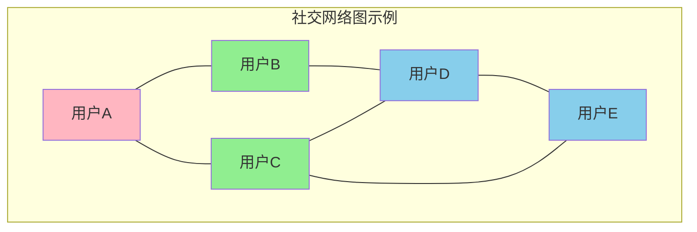
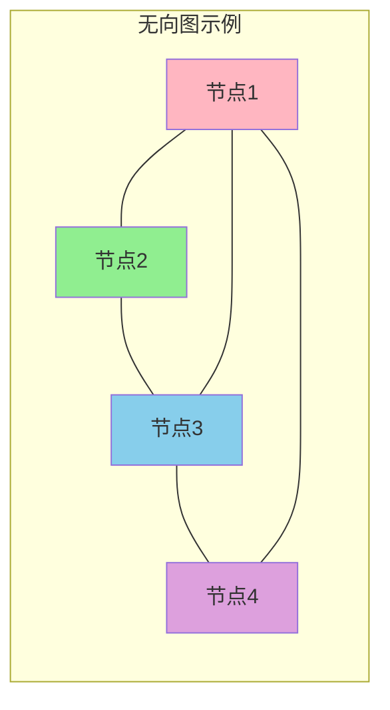
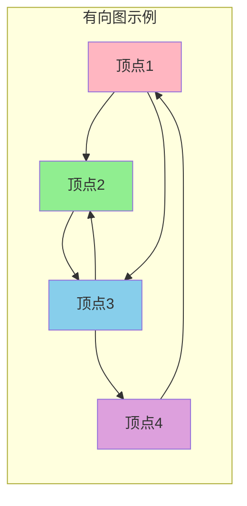
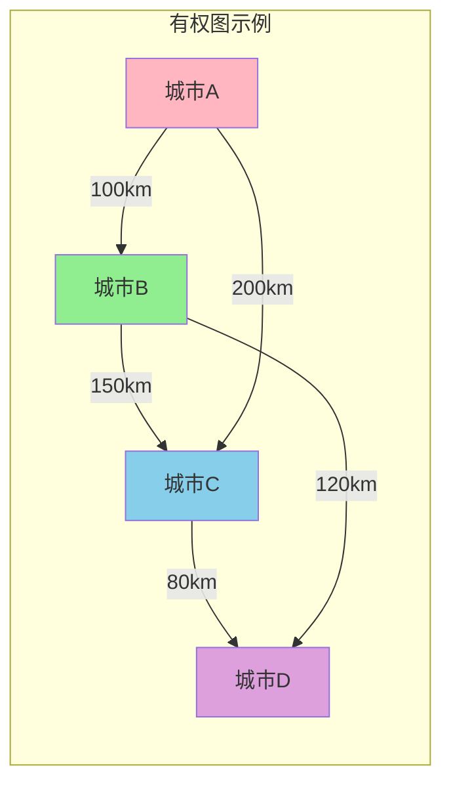
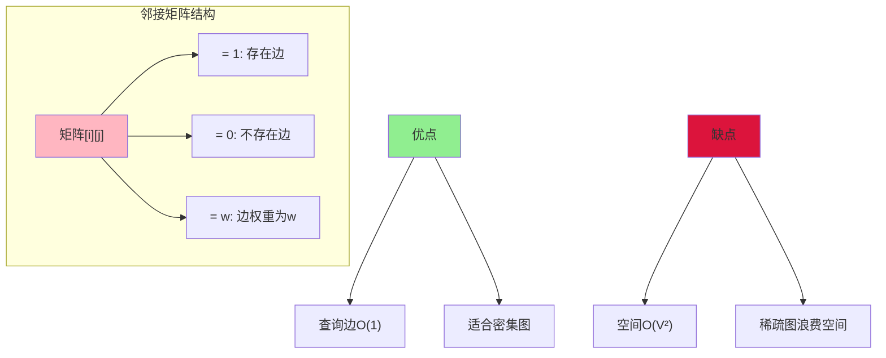
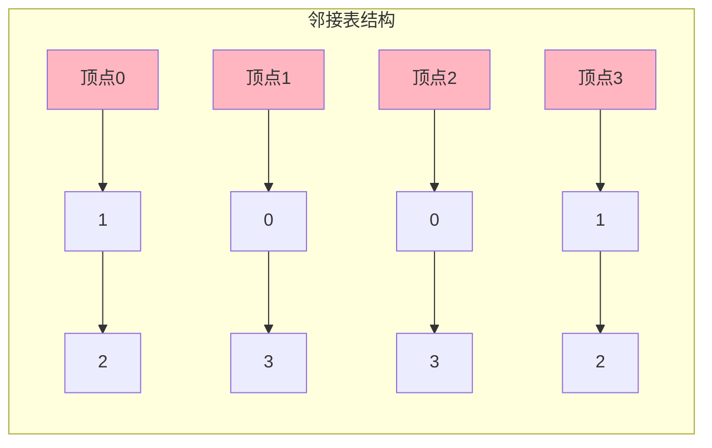
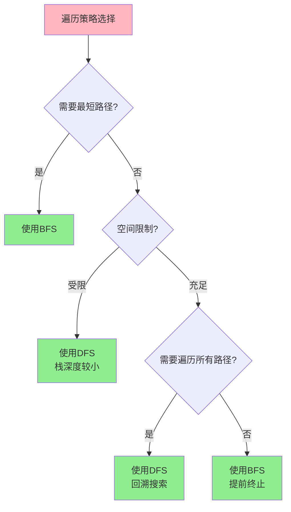

## 图的本质与特征

图是用于表达**复杂多对多关系**的数据结构,由 **顶点(Vertex)**和**边(Edge)** 组成。与树的严格层次结构不同,图中的任意两个顶点都可能存在连接关系,且允许存在环路。

在现实世界中,许多场景都可以用图来建模:
- **社交网络**: 用户是顶点,好友关系是边
- **交通网络**: 城市是顶点,道路是边
- **互联网**: 网页是顶点,超链接是边
- **依赖关系**: 软件模块是顶点,依赖关系是边



### 图的基本术语

**顶点(Vertex)**: 图中的基本单元,代表一个实体
**边(Edge)**: 连接两个顶点的关系
**度(Degree)**: 与顶点相连的边的数量
**路径(Path)**: 从一个顶点到另一个顶点经过的顶点序列
**环(Cycle)**: 起点和终点相同的路径

## 有向图与无向图

### 无向图

在无向图中,边没有方向,表示双向对等的关系。如果顶点A与顶点B之间有边相连,则可以从A到达B,也可以从B到达A。

**典型应用**:
- 好友关系: 如果A是B的好友,那么B也是A的好友
- 物理连接: 两台计算机通过网线相连,数据可以双向传输
- 合作关系: 企业之间的合作伙伴关系



### 有向图

有向图的边具有方向性,从一个顶点指向另一个顶点。如果存在从A到B的边,不代表存在从B到A的边。

**典型应用**:
- 关注关系: A关注B,但B不一定关注A
- 网页链接: 页面A链接到页面B,但B不一定链接A
- 任务依赖: 任务A必须在任务B之前完成
- 资金流动: 账户A向账户B转账



### 有向图与无向图的区别

| 特性 | 有向图 | 无向图 |
|-----|-------|--------|
| 边的性质 | 有方向,单向或双向 | 无方向,天然双向 |
| 表示方法 | A→B | A—B |
| 度的概念 | 入度和出度 | 总度数 |
| 应用场景 | 权限控制、依赖关系 | 对等关系、物理连接 |
| 邻接矩阵 | 非对称矩阵 | 对称矩阵 |

## 有权图与无权图

### 无权图

边没有权重,只表示顶点之间存在连接关系。所有的边都是等价的。

**应用场景**: 好友关系网络、简单的连通性判断

### 有权图

边附带一个权重值,表示两个顶点之间关系的某种度量,如距离、成本、时间、容量等。



**应用场景**:
- 地图导航: 权重表示距离或预计时间
- 网络流量: 权重表示带宽或容量
- 社交影响力: 权重表示关系亲密度
- 成本优化: 权重表示费用或资源消耗

## 图的存储方式

### 邻接矩阵

使用二维数组存储图,数组元素`matrix[i][j]`表示顶点i到顶点j是否存在边(或边的权重)。

**无向图的邻接矩阵示例**:
```
     A  B  C  D
A [  0  1  1  0 ]
B [  1  0  1  1 ]
C [  1  1  0  1 ]
D [  0  1  1  0 ]
```

**有向图的邻接矩阵**:
```
     A  B  C  D
A [  0  1  0  0 ]
B [  0  0  1  1 ]
C [  1  0  0  0 ]
D [  0  0  1  0 ]
```



**Java实现**:
```java
class GraphMatrix {
    private int[][] adjacencyMatrix;
    private int vertexCount;
    
    public GraphMatrix(int vertexCount) {
        this.vertexCount = vertexCount;
        adjacencyMatrix = new int[vertexCount][vertexCount];
    }
    
    // 添加无向边
    public void addEdge(int from, int to) {
        adjacencyMatrix[from][to] = 1;
        adjacencyMatrix[to][from] = 1;
    }
    
    // 添加有向边
    public void addDirectedEdge(int from, int to, int weight) {
        adjacencyMatrix[from][to] = weight;
    }
    
    // 判断是否存在边
    public boolean hasEdge(int from, int to) {
        return adjacencyMatrix[from][to] != 0;
    }
}
```

### 邻接表

为每个顶点维护一个链表,存储与该顶点直接相连的其他顶点。



**Java实现**:
```java
class GraphList {
    private List<List<Edge>> adjacencyList;
    private int vertexCount;
    
    public GraphList(int vertexCount) {
        this.vertexCount = vertexCount;
        adjacencyList = new ArrayList<>(vertexCount);
        for (int i = 0; i < vertexCount; i++) {
            adjacencyList.add(new ArrayList<>());
        }
    }
    
    public void addEdge(int from, int to, int weight) {
        adjacencyList.get(from).add(new Edge(to, weight));
    }
    
    public List<Edge> getNeighbors(int vertex) {
        return adjacencyList.get(vertex);
    }
    
    static class Edge {
        int destination;
        int weight;
        
        public Edge(int destination, int weight) {
            this.destination = destination;
            this.weight = weight;
        }
    }
}
```

**邻接表的优势**:
- 空间效率高,只存储实际存在的边,适合稀疏图
- 遍历某个顶点的所有邻居效率高
- 大多数实际应用中的图都是稀疏的

## 图的遍历算法

### 深度优先搜索(DFS)

深度优先搜索沿着图的边**尽可能深入**,直到无法继续时回溯。类似于树的前序遍历,通常使用**栈或递归**实现。

**应用场景**:
- 检测图中是否存在环
- 拓扑排序(任务调度)
- 求解迷宫问题
- 查找连通分量

```java
class DFSTraversal {
    private boolean[] visited;
    private List<Integer> result;
    
    public List<Integer> dfs(GraphList graph, int startVertex) {
        visited = new boolean[graph.vertexCount];
        result = new ArrayList<>();
        dfsRecursive(graph, startVertex);
        return result;
    }
    
    private void dfsRecursive(GraphList graph, int vertex) {
        visited[vertex] = true;
        result.add(vertex);
        
        for (GraphList.Edge edge : graph.getNeighbors(vertex)) {
            if (!visited[edge.destination]) {
                dfsRecursive(graph, edge.destination);
            }
        }
    }
}
```

**栈实现DFS**:
```java
public List<Integer> dfsWithStack(GraphList graph, int start) {
    List<Integer> result = new ArrayList<>();
    boolean[] visited = new boolean[graph.vertexCount];
    Stack<Integer> stack = new Stack<>();
    
    stack.push(start);
    
    while (!stack.isEmpty()) {
        int vertex = stack.pop();
        
        if (visited[vertex]) continue;
        
        visited[vertex] = true;
        result.add(vertex);
        
        // 将未访问的邻居压栈
        for (GraphList.Edge edge : graph.getNeighbors(vertex)) {
            if (!visited[edge.destination]) {
                stack.push(edge.destination);
            }
        }
    }
    
    return result;
}
```

### 广度优先搜索(BFS)

广度优先搜索**逐层扩展**,先访问距离起点近的顶点,再访问距离远的顶点。使用**队列**实现。

**应用场景**:
- 求最短路径(无权图)
- 社交网络的多度关系查找
- 网络爬虫的层次爬取
- 推荐系统的关联推荐

```java
class BFSTraversal {
    public List<Integer> bfs(GraphList graph, int startVertex) {
        List<Integer> result = new ArrayList<>();
        boolean[] visited = new boolean[graph.vertexCount];
        Queue<Integer> queue = new LinkedList<>();
        
        visited[startVertex] = true;
        queue.offer(startVertex);
        
        while (!queue.isEmpty()) {
            int vertex = queue.poll();
            result.add(vertex);
            
            for (GraphList.Edge edge : graph.getNeighbors(vertex)) {
                if (!visited[edge.destination]) {
                    visited[edge.destination] = true;
                    queue.offer(edge.destination);
                }
            }
        }
        
        return result;
    }
}
```

**层次遍历**(记录每一层的节点):
```java
public List<List<Integer>> bfsLevels(GraphList graph, int start) {
    List<List<Integer>> levels = new ArrayList<>();
    boolean[] visited = new boolean[graph.vertexCount];
    Queue<Integer> queue = new LinkedList<>();
    
    visited[start] = true;
    queue.offer(start);
    
    while (!queue.isEmpty()) {
        int levelSize = queue.size();
        List<Integer> currentLevel = new ArrayList<>();
        
        for (int i = 0; i < levelSize; i++) {
            int vertex = queue.poll();
            currentLevel.add(vertex);
            
            for (GraphList.Edge edge : graph.getNeighbors(vertex)) {
                if (!visited[edge.destination]) {
                    visited[edge.destination] = true;
                    queue.offer(edge.destination);
                }
            }
        }
        
        levels.add(currentLevel);
    }
    
    return levels;
}
```

### DFS与BFS的对比



| 特性 | DFS | BFS |
|-----|-----|-----|
| 数据结构 | 栈(递归) | 队列 |
| 空间复杂度 | O(h),h为图的深度 | O(w),w为图的最大宽度 |
| 最短路径 | 不保证 | 保证(无权图) |
| 完备性 | 可能陷入无限循环 | 一定能找到解 |
| 应用场景 | 拓扑排序、环检测 | 最短路径、层级关系 |

## 图的实际应用

### 社交网络分析
- **好友推荐**: 通过BFS查找二度、三度人脉
- **影响力传播**: 使用DFS模拟信息在网络中的扩散
- **社区发现**: 通过连通分量识别紧密联系的群体

### 网络路由
- **最短路径**: Dijkstra算法在有权图中找到最短路径
- **负载均衡**: 通过图的多条路径分散流量
- **故障恢复**: 检测图的连通性,寻找备用路径

### 任务调度
- **依赖管理**: 有向无环图(DAG)表示任务依赖关系
- **拓扑排序**: 确定任务执行顺序
- **关键路径**: 找到项目中耗时最长的任务链

### 推荐系统
- **协同过滤**: 构建用户-物品二部图
- **知识图谱**: 通过图遍历发现实体间的潜在关系
- **内容关联**: 基于图的相似度计算推荐相关内容

图作为最灵活的数据结构,能够表达现实世界中复杂的关系网络。掌握图的基本概念和遍历算法,是解决复杂问题的重要基础。
