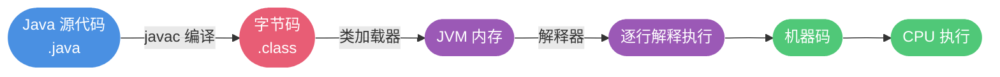

# Java 语言特性与核心概念

## Java 的主要特性有哪些?

Java 作为一门流行的编程语言,具有以下核心特性:

1. **面向对象**:支持封装、继承和多态三大特性,让代码结构更清晰
2. **跨平台性**:通过 JVM 实现"一次编写,到处运行",这是 Java 最显著的优势之一
3. **内置多线程**:语言层面原生支持多线程编程,而 C++ 需要依赖操作系统 API
4. **自动内存管理**:JVM 提供垃圾回收机制,程序员无需手动释放内存
5. **安全机制**:提供访问控制、类型检查等多层安全保障
6. **丰富的类库**:标准库功能强大,支持网络编程、数据库操作等
7. **高性能优化**:JIT 编译器在运行时优化热点代码,提升执行效率
8. **异常处理机制**:完善的异常体系让程序更健壮

> **补充说明**:从 C++11 开始,C++ 也引入了标准多线程库(std::thread),可以跨平台使用。

值得一提的是,虽然"跨平台"曾是 Java 的最大卖点,但在容器技术(如 Docker)成熟的今天,跨平台已不再是 Java 的独特优势。**Java 真正的核心竞争力在于其庞大而成熟的生态系统**。

## Java SE 和 Java EE 有什么区别?

- **Java SE**(Standard Edition):Java 标准平台,包含 Java 语言核心 API、JVM 等基础组件。适用于桌面应用和简单的服务端程序开发。

- **Java EE**(Enterprise Edition):Java 企业平台,在 SE 基础上扩展了企业级开发规范,如 Servlet、JSP、JPA、EJB、JMS 等。专门用于构建大型分布式企业应用。

简而言之:SE 是基础版,EE 是增强版。SE 适合中小型应用,EE 适合复杂的企业级系统。

> Java ME(Micro Edition)是 Java 微型版,主要用于嵌入式设备开发(如早期手机),现已基本淘汰。

## JVM、JDK 和 JRE 的关系

### JVM(Java Virtual Machine)

Java 虚拟机是执行 Java 字节码的运行环境。它针对不同操作系统(Windows/Linux/macOS)有特定实现,但能保证相同字节码产生相同结果,这正是 Java 跨平台的关键。


如图所示,不仅 Java,Kotlin、Groovy、Scala 等语言都可以编译成 `.class` 字节码在 JVM 上运行。

**JVM 的实现并非唯一**。除了最常用的 HotSpot VM,还有 IBM J9、Azul Zing、Oracle JRockit 等多种实现,只要符合 JVM 规范即可。

### JDK(Java Development Kit)

JDK 是 Java 开发工具包,包含:
- JRE(运行环境)
- 编译器(javac)
- 调试器(jdb)
- 文档生成器(javadoc)
- 其他开发工具

### JRE(Java Runtime Environment)

JRE 是 Java 运行环境,包含:
- JVM
- Java 核心类库

**三者关系**:JDK = JRE + 开发工具,JRE = JVM + 类库


**重要变化**:从 JDK 9 开始引入模块化系统,配合 jlink 工具可以创建定制化的运行时环境。从 JDK 11 起,Oracle 不再单独提供 JRE 下载。

## 什么是字节码?为什么要使用字节码?

字节码(Bytecode)是 JVM 能够理解的中间代码,存储在 `.class` 文件中。它不针对特定处理器,只面向虚拟机,这使得 Java 兼具解释型语言的可移植性和编译型语言的高效性。

**Java 程序执行流程**:



关键在于 `.class → 机器码` 这一步:
1. 类加载器加载字节码
2. 解释器逐行执行(较慢)
3. **JIT 编译器**发现热点代码后编译成机器码缓存,下次直接使用(快速)

这就是为什么说 **Java 是编译与解释并存的语言**。


> HotSpot VM 采用惰性评估策略,只编译热点代码(基于二八定律),执行次数越多,优化效果越好。

**JDK/JRE/JVM/JIT 关系图**:


## 为什么说 Java 是"编译与解释并存"?

高级语言的执行方式通常分为两类:

- **编译型**(如 C++/Go/Rust):通过编译器一次性将源码翻译成机器码。优点是执行速度快,缺点是开发效率低。

- **解释型**(如 Python/JavaScript):通过解释器逐行翻译执行。优点是开发效率高,缺点是执行速度慢。

Java 结合了两者优势:
1. **编译阶段**:javac 将 `.java` 编译成 `.class` 字节码
2. **运行阶段**:解释器执行字节码 + JIT 编译器优化热点代码

这种混合模式让 Java 既保持了可移植性,又获得了不错的性能。

## AOT 编译有什么优势?为何不全面采用?

JDK 9 引入了 **AOT(Ahead of Time Compilation)** 提前编译模式。它在程序运行前就将代码编译成机器码,属于静态编译。

**JIT vs AOT 对比**:

| 指标 | JIT(即时编译) | AOT(提前编译) |
|------|--------------|-------------|
| 启动速度 | 慢(需预热) | 快 |
| 内存占用 | 较大 | 较小 |
| 峰值性能 | 高(优化充分) | 一般 |
| 打包体积 | 较大 | 较小 |
| 适用场景 | 长时间运行的应用 | 云原生/微服务 |

**为什么不全用 AOT?**

虽然 AOT 在启动速度和内存占用上有优势,但存在局限:
1. **不支持 Java 动态特性**:反射、动态代理、JNI、动态加载等特性无法使用
2. **影响框架使用**:Spring、Hibernate 等依赖动态特性的框架需要特殊适配
3. **性能上限较低**:缺少运行时优化,极限性能不如 JIT

因此,AOT 更适合云原生、Serverless 等对启动速度敏感的场景,而传统应用仍以 JIT 为主。

**GraalVM**:一个支持 AOT 和 JIT 的高性能 JDK,既能提前编译,也能即时编译,是当前 AOT 技术的代表。

## Oracle JDK 与 OpenJDK 的差异

**发展历史**:
- 2006 年:Sun 公司开源 Java,诞生 OpenJDK
- 2009 年:Oracle 收购 Sun,基于 OpenJDK 推出 Oracle JDK

**主要区别**:

1. **开源性**
   - OpenJDK:完全开源,遵循 GPL v2 协议
   - Oracle JDK:部分闭源,使用 BCL/OTN 协议

2. **费用**
   - OpenJDK:完全免费
   - Oracle JDK:商业使用收费(JDK 8u221 之前的版本可免费,JDK 17+ 仅 3 年免费期)

3. **功能特性**
   - JDK 11 之前:Oracle JDK 有独占功能(如 JFR、JMC)
   - JDK 11 之后:功能基本一致,Oracle 将私有组件捐赠给开源社区

4. **支持周期**
   - OpenJDK:不提供 LTS 长期支持
   - Oracle JDK:每三年发布一个 LTS 版本

> 虽然 OpenJDK 官方不提供 LTS,但 Alibaba Dragonwell、Amazon Corretto、Azul Zulu 等基于 OpenJDK 的发行版提供了长期支持。

**如何选择?**

建议使用 OpenJDK 或其商业发行版(如 Alibaba Dragonwell、Amazon Corretto),原因:
- 完全免费
- 可自由修改定制
- 更新更频繁
- 商业发行版提供专业支持

### Java 与 C++ 的主要区别

Java 和 C++ 都是面向对象语言,但差异明显:

| 特性 | Java | C++ |
|------|------|-----|
| 指针 | 不支持,更安全 | 支持,灵活但易出错 |
| 继承 | 单继承,接口多实现 | 支持多重继承 |
| 内存管理 | 自动 GC | 手动管理 |
| 运算符重载 | 不支持 | 支持 |
| 跨平台 | JVM 保证跨平台 | 需重新编译 |
| 性能 | 略慢于 C++ | 更接近硬件,性能更高 |

## 基本语法要点

### Java 的注释形式

Java 支持三种注释:

```java
// 1. 单行注释:用于解释单行代码逻辑

/*
 * 2. 多行注释:用于解释代码块
 * 实际开发中较少使用
 */

/**
 * 3. 文档注释:用于生成 JavaDoc 文档
 * @author 作者名
 * @param 参数说明
 * @return 返回值说明
 */
```

**注意事项**:
- 编译器会在编译前移除所有注释,字节码中不包含注释
- 好的代码应该自解释,减少不必要的注释
- 《Clean Code》建议:用清晰的命名和代码结构代替复杂注释

示例:
```java
// 不好的写法
// 检查员工是否有资格获得全部福利
if ((employee.flags & HOURLY_FLAG) && (employee.age > 65))

// 好的写法  
if (employee.isEligibleForFullBenefits())
```

## 标识符与关键字的区别

- **标识符**:程序中用于命名类、变量、方法等的名称
- **关键字**:被 Java 赋予特殊含义的保留标识符,不能用作普通标识符

类比:开店要起名字(标识符),但不能叫"警察局"(关键字)。

## Java 关键字一览

| 分类 | 关键字 |
|------|--------|
| 访问控制 | private、protected、public |
| 类与方法修饰 | abstract、class、extends、final、implements、interface、native、new、static、strictfp、synchronized、transient、volatile、enum |
| 流程控制 | if、else、switch、case、default、for、while、do、break、continue、return、instanceof、assert |
| 异常处理 | try、catch、throw、throws、finally |
| 包管理 | package、import |
| 基本类型 | byte、short、int、long、float、double、char、boolean |
| 变量引用 | super、this、void |
| 保留字 | goto、const |

> 注意:`true`、`false`、`null` 看起来像关键字,但实际上是字面值。

## 自增自减运算符详解

Java 提供 `++` 和 `--` 运算符简化自增自减操作:

```java
int x = 5;
int a = x++;  // a=5, x=6 (先赋值后自增)
int b = ++x;  // b=7, x=7 (先自增后赋值)
```

**记忆口诀**:符号在前先运算,符号在后后运算。

**经典面试题**:
```java
int x = 5;
int y = x++ + ++x + x--;
// 执行过程:
// x++ -> 使用5,x变成6
// ++x -> x变成7,使用7  
// x-- -> 使用7,x变成6
// y = 5 + 7 + 7 = 19
// 最终: y=19, x=6
```

## 移位运算符的应用

移位运算符在源码中广泛使用,如 HashMap 的 hash 方法:

```java
static final int hash(Object key) {
    int h;
    return (key == null) ? 0 : (h = key.hashCode()) ^ (h >>> 16);
}
```

Java 提供三种移位运算符:

| 运算符 | 说明 | 示例 |
|--------|------|------|
| `<<` | 左移,低位补0 | `5 << 2` 等价于 5×2² = 20 |
| `>>` | 带符号右移,高位补符号位 | `-8 >> 2` 等价于 -8÷2² = -2 |
| `>>>` | 无符号右移,高位补0 | `-8 >>> 2` 结果为大正数 |

**使用场景**:
1. **快速乘除**:`x << 3` 比 `x * 8` 更快
2. **位标志操作**:用一个 int 存储 32 个布尔值
3. **哈希计算**:混淆数据提高分布均匀性
4. **权限控制**:用位运算表示多种权限组合

```java
// 权限位运算示例
final int READ = 1 << 0;    // 0001
final int WRITE = 1 << 1;   // 0010  
final int EXECUTE = 1 << 2; // 0100

int permission = READ | WRITE;  // 授予读写权限
boolean canRead = (permission & READ) != 0;  // 检查是否有读权限
```

**注意**:
- 移位位数超过类型位数会先取模:int 类型移位 33 位等于移位 1 位(33%32=1)
- 不能对 float、double 使用移位运算
- short、byte、char 移位前会先转换为 int

## continue、break 和 return 的区别

在循环控制中:
- `continue`:跳过本次循环,继续下一次循环
- `break`:跳出整个循环体
- `return`:结束整个方法的执行

```java
for (int i = 0; i < 5; i++) {
    if (i == 2) continue;  // 跳过 i=2
    if (i == 4) break;     // i=4 时退出循环
    System.out.println(i); // 输出: 0 1 3
}
System.out.println("循环结束");
```

## 数据类型详解

### Java 的基本数据类型

Java 有 8 种基本类型:

| 类型 | 字节 | 位数 | 默认值 | 取值范围 |
|------|------|------|--------|----------|
| byte | 1 | 8 | 0 | -128 ~ 127 |
| short | 2 | 16 | 0 | -32768 ~ 32767 |
| int | 4 | 32 | 0 | -2^31 ~ 2^31-1 |
| long | 8 | 64 | 0L | -2^63 ~ 2^63-1 |
| float | 4 | 32 | 0.0f | 1.4E-45 ~ 3.4E38 |
| double | 8 | 64 | 0.0d | 4.9E-324 ~ 1.8E308 |
| char | 2 | 16 | '\u0000' | 0 ~ 65535 |
| boolean | 1 | - | false | true/false |

**为什么最大值要减1?**

因为在补码表示法中,最高位是符号位(0 正 1 负),剩余位表示数值。比如 byte:
- 最小值:`10000000` = -128
- 最大值:`01111111` = 127

如果再加 1 就会溢出变成负数。

**注意事项**:
```java
long num = 10000000000L;  // 长整型必须加 L
float pi = 3.14f;          // 浮点型必须加 f
char letter = 'A';         // 字符用单引号
String text = "Hello";     // 字符串用双引号
```

### 基本类型与包装类的区别

| 对比项 | 基本类型 | 包装类型 |
|--------|----------|----------|
| 使用场景 | 局部变量、常量 | 集合、泛型、对象属性 |
| 存储位置 | 栈(局部变量)或堆(成员变量) | 堆 |
| 默认值 | 有默认值(0/false/null) | null |
| 比较方式 | `==` 比较值 | `==` 比较地址,`equals()` 比较值 |
| 空间占用 | 小 | 大(对象头+字段) |
| 是否可用于泛型 | 否 | 是 |

```java
// 基本类型
int age = 25;              // 存储在栈上
System.out.println(age);   // 25

// 包装类型  
Integer score = 90;        // 自动装箱
Integer score2 = 90;
System.out.println(score == score2);      // true (缓存)
System.out.println(score.equals(score2)); // true

Integer num1 = 200;
Integer num2 = 200;  
System.out.println(num1 == num2);         // false (超出缓存)
```

### 包装类的缓存机制

为了优化性能,部分包装类实现了缓存:

| 包装类 | 缓存范围 | 是否可配置 |
|--------|----------|------------|
| Byte | -128~127 | 否 |
| Short | -128~127 | 否 |
| Integer | -128~127 | 是(`-XX:AutoBoxCacheMax`) |
| Long | -128~127 | 否 |
| Character | 0~127 | 否 |
| Boolean | true/false | 否 |
| Float | 无 | - |
| Double | 无 | - |

**Integer 缓存源码**:
```java
public static Integer valueOf(int i) {
    if (i >= IntegerCache.low && i <= IntegerCache.high)
        return IntegerCache.cache[i + (-IntegerCache.low)];
    return new Integer(i);
}
```

**面试陷阱**:
```java
Integer a = 100;
Integer b = 100;  
System.out.println(a == b);  // true (缓存)

Integer c = 200;
Integer d = 200;
System.out.println(c == d);  // false (超出缓存)

Integer e = 100;
Integer f = new Integer(100);
System.out.println(e == f);  // false (new 强制创建新对象)
```

**最佳实践**:包装类型比较永远用 `equals()`。

### 自动装箱与拆箱

- **装箱**:基本类型 → 包装类型,调用 `valueOf()`
- **拆箱**:包装类型 → 基本类型,调用 `xxxValue()`

```java
Integer num = 100;    // 自动装箱,等价于 Integer.valueOf(100)
int value = num;      // 自动拆箱,等价于 num.intValue()
```

**性能陷阱**:
```java
// 错误写法:频繁拆装箱影响性能
private static long sum() {
    Long sum = 0L;  // 应该用 long 而非 Long
    for (long i = 0; i <= Integer.MAX_VALUE; i++)
        sum += i;   // 每次循环都会拆箱、计算、装箱
    return sum;
}

// 正确写法
private static long sum() {
    long sum = 0L;  // 使用基本类型
    for (long i = 0; i <= Integer.MAX_VALUE; i++)
        sum += i;
    return sum;
}
```

### 浮点数精度丢失问题

浮点数在计算机中用二进制表示,很多十进制小数无法精确表示:

```java
float a = 0.3f - 0.2f;  // 0.100000024
float b = 0.2f - 0.1f;  // 0.099999905
System.out.println(a == b);  // false
```

**原因**:0.2 转二进制是无限循环小数:
```
0.2 × 2 = 0.4 → 0
0.4 × 2 = 0.8 → 0  
0.8 × 2 = 1.6 → 1
0.6 × 2 = 1.2 → 1
0.2 × 2 = 0.4 → 0  (循环)
```

**解决方案**:使用 `BigDecimal`

```java
BigDecimal a = new BigDecimal("0.3");
BigDecimal b = new BigDecimal("0.2");
BigDecimal result = a.subtract(b);
System.out.println(result);  // 0.1

// 比较值用 compareTo,返回 0 表示相等
BigDecimal x = new BigDecimal("1.0");
BigDecimal y = new BigDecimal("1.00");  
System.out.println(x.equals(y));      // false (精度不同)
System.out.println(x.compareTo(y) == 0);  // true (值相等)
```

### 超大整数如何表示?

long 的最大值是 2^63-1,超过后会溢出:

```java
long max = Long.MAX_VALUE;
System.out.println(max + 1);  // -9223372036854775808 (溢出变最小值)
```

**解决方案**:使用 `BigInteger`

```java
BigInteger big = new BigInteger("9223372036854775808");
BigInteger result = big.add(BigInteger.ONE);
System.out.println(result);  // 9223372036854775809
```

> BigInteger 内部用 int[] 数组存储,理论上可以表示任意大小的整数,但性能比基本类型差。

## 变量详解

### 成员变量与局部变量的区别

| 对比项 | 成员变量 | 局部变量 |
|--------|----------|----------|
| 定义位置 | 类内,方法外 | 方法内或方法参数 |
| 修饰符 | 可用 public/private/static 等 | 不能用访问修饰符 |
| 存储位置 | 堆(对象属性)或方法区(static) | 栈 |
| 生命周期 | 与对象或类同生死 | 方法调用时创建,结束时销毁 |
| 默认值 | 有默认值 | 无默认值,必须初始化 |

```java
public class Demo {
    private int age;        // 成员变量,默认值 0
    private static String name;  // 静态成员变量,默认值 null
    
    public void test() {
        int count;          // 局部变量,无默认值
        // System.out.println(count);  // 编译错误:未初始化
        count = 0;
        System.out.println(count);  // 0
    }
}
```

**为什么成员变量有默认值?**

1. **安全性**:避免读取到垃圾值导致程序异常
2. **编译器控制力**:局部变量生命周期短,编译器能检查是否初始化;成员变量生命周期长,可能在多处赋值,编译器无法预测,因此提供默认值作为兜底

### 静态变量的作用

静态变量被 `static` 修饰,特点:
- 属于类,不属于对象
- 所有实例共享同一份数据
- 可通过类名直接访问
- 存储在方法区/元空间

```java
public class Counter {
    private static int count = 0;  // 静态变量
    private int id;                // 实例变量
    
    public Counter() {
        count++;  // 每创建一个对象,count 加 1
        id = count;
    }
    
    public static void main(String[] args) {
        Counter c1 = new Counter();
        Counter c2 = new Counter();
        Counter c3 = new Counter();
        System.out.println(Counter.count);  // 3
    }
}
```

**常见用法**:定义常量
```java
public class Constants {
    public static final String APP_NAME = "MyApp";
    public static final int MAX_SIZE = 1000;
}
```

### 字符常量与字符串常量的区别

```java
char letter = 'A';          // 字符常量:单引号,占 2 字节
String text = "Hello";      // 字符串常量:双引号,占多字节

System.out.println('A' + 1);      // 66 (字符可参与运算)
System.out.println("A" + 1);      // "A1" (字符串拼接)

// 内存占用
System.out.println(Character.BYTES);  // 2
System.out.println("Hello".getBytes().length);  // 5
```

## 方法详解

### 方法的分类

按参数和返回值可分为四类:

```java
// 1. 无参无返回值
public void printHello() {
    System.out.println("Hello");
}

// 2. 有参无返回值  
public void printMessage(String msg) {
    System.out.println(msg);
}

// 3. 无参有返回值
public int getRandomNumber() {
    return (int)(Math.random() * 100);
}

// 4. 有参有返回值
public int add(int a, int b) {
    return a + b;
}
```

### 静态方法与实例方法

**调用方式差异**:
```java
public class MathUtil {
    // 静态方法
    public static int add(int a, int b) {
        return a + b;
    }
    
    // 实例方法
    public int multiply(int a, int b) {
        return a * b;
    }
}

// 使用
int sum = MathUtil.add(3, 5);        // 静态方法:类名调用

MathUtil util = new MathUtil();
int product = util.multiply(3, 5);   // 实例方法:对象调用
```

**访问限制**:
```java
public class Demo {
    private int instanceVar = 1;       // 实例变量
    private static int staticVar = 2;  // 静态变量
    
    // 静态方法
    public static void staticMethod() {
        System.out.println(staticVar);      // OK:访问静态变量
        // System.out.println(instanceVar);  // Error:不能访问实例变量
        // instanceMethod();                 // Error:不能调用实例方法
    }
    
    // 实例方法  
    public void instanceMethod() {
        System.out.println(instanceVar);  // OK:可以访问实例变量
        System.out.println(staticVar);    // OK:可以访问静态变量
        staticMethod();                   // OK:可以调用静态方法
    }
}
```

**为什么静态方法不能访问非静态成员?**

因为静态方法属于类,类加载时就存在,而实例成员属于对象,对象创建后才存在。在静态方法执行时,可能还没有对象实例,自然无法访问实例成员。

### 方法重载(Overload)

在同一个类中,方法名相同但参数不同(类型、个数、顺序),称为重载。

```java
public class Calculator {
    // 重载方法
    public int add(int a, int b) {
        return a + b;
    }
    
    public double add(double a, double b) {
        return a + b;
    }
    
    public int add(int a, int b, int c) {
        return a + b + c;
    }
}
```

**注意**:
- 重载与返回值类型无关
- 编译器根据参数列表选择最匹配的方法

### 方法重写(Override)

子类重新实现父类的方法,要求:
1. 方法名、参数列表必须相同
2. 返回值类型:相同或子类
3. 访问权限:不能更严格
4. 抛出异常:不能更多更宽泛

```java
class Animal {
    public Animal eat() {
        System.out.println("动物吃东西");
        return this;
    }
}

class Dog extends Animal {
    @Override
    public Dog eat() {  // 返回值改为子类 Dog
        System.out.println("狗吃骨头");
        return this;
    }
}
```

**重载 vs 重写**:

| 对比项 | 重载(Overload) | 重写(Override) |
|--------|----------------|----------------|
| 发生范围 | 同一个类 | 父子类 |
| 方法名 | 相同 | 相同 |
| 参数列表 | 不同 | 相同 |
| 返回值 | 无关 | 相同或子类 |
| 访问修饰符 | 无关 | 不能更严格 |
| 绑定时期 | 编译期(静态绑定) | 运行期(动态绑定) |

### 可变长参数

Java 5 引入可变参数,语法为 `类型...`:

```java
public void printNumbers(int... numbers) {
    for (int num : numbers) {
        System.out.println(num);
    }
}

// 调用
printNumbers(1, 2, 3, 4, 5);  // 传入多个参数
printNumbers(1);              // 传入一个参数  
printNumbers();               // 不传参数也行
```

**限制**:
- 可变参数必须是最后一个参数
- 一个方法最多一个可变参数

```java
// 错误写法
public void method(int... a, String... b) { }  // Error

// 正确写法
public void method(String name, int... scores) { }  // OK
```

**重载优先级**:

可变参数方法的优先级最低,编译器会优先匹配固定参数的方法:

```java
public class Test {
    public static void print(String a, String b) {
        System.out.println("固定参数");
    }
    
    public static void print(String... args) {
        System.out.println("可变参数");
    }
    
    public static void main(String[] args) {
        print("A", "B");        // 输出:固定参数
        print("A", "B", "C");  // 输出:可变参数
    }
}
```
