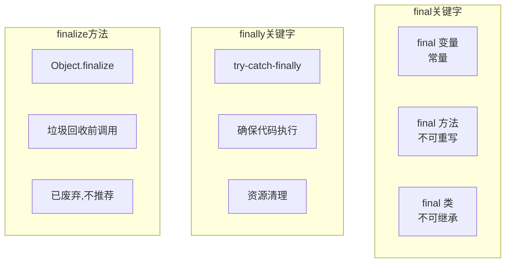
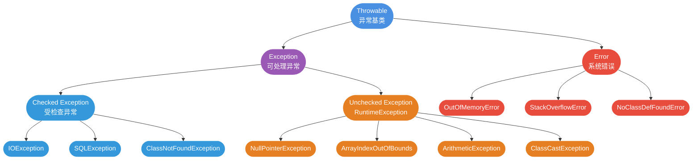

# 异常处理与 final/finally/finalize

## 异常处理

### final、finally、finalize 的区别

final、finally 和 finalize 是 Java 中三个完全不同的概念,它们之间没有直接关系,只是名称相似容易混淆。

#### final 关键字

**作用**:用于声明常量、防止继承或方法重写

final 可以修饰变量、方法和类:

**1. final 变量**:一旦赋值后不可修改,即常量

```java
public class FinalVariableDemo {
    // final 成员变量必须初始化
    private final int MAX_SIZE = 100;
    
    // final 静态常量
    public static final String APP_NAME = "MyApp";
    
    public void test() {
        // final 局部变量
        final int count = 10;
        // count = 20;  // 编译错误:无法修改 final 变量
        
        // final 引用变量:引用不可变,但对象内容可变
        final List<String> list = new ArrayList<>();
        list.add("Hello");  // 可以修改对象内容
        // list = new ArrayList<>();  // 编译错误:不能修改引用
    }
}
```

**2. final 方法**:不能被子类重写

```java
public class Parent {
    // final 方法不能被重写
    public final void show() {
        System.out.println("这个方法不能被重写");
    }
}

public class Child extends Parent {
    // @Override
    // public void show() {  // 编译错误:不能重写 final 方法
    //     System.out.println("尝试重写");
    // }
}
```

**3. final 类**:不能被继承

```java
// final 类不能被继承
public final class FinalClass {
    // String、Integer 等包装类都是 final 类
}

// public class SubClass extends FinalClass {  // 编译错误:不能继承 final 类
// }
```

#### finally 关键字

**作用**:异常处理的一部分,用于确保代码块总是执行

finally 与 try-catch 配合使用,通常用于资源清理:

```java
public void readFile(String path) {
    FileInputStream fis = null;
    try {
        fis = new FileInputStream(path);
        // 读取文件内容
        int data = fis.read();
        System.out.println(data);
    } catch (IOException e) {
        System.err.println("读取文件失败: " + e.getMessage());
    } finally {
        // 无论是否发生异常,finally 块都会执行
        // 通常用于关闭资源
        if (fis != null) {
            try {
                fis.close();
            } catch (IOException e) {
                e.printStackTrace();
            }
        }
    }
}
```

**finally 的执行时机**:
- try 块正常执行完毕后执行 finally
- catch 块捕获异常后执行 finally
- try 或 catch 中有 return 语句,在 return 前执行 finally
- 某些特殊情况下 finally 可能不执行(如 System.exit()、JVM 崩溃等)

#### finalize 方法

**作用**:对象被垃圾回收前的清理方法

finalize 是 Object 类的一个方法,在对象被垃圾回收器回收前调用:

```java
public class FinalizeDemo {
    @Override
    protected void finalize() throws Throwable {
        try {
            // 在对象被回收前执行清理操作
            System.out.println("对象即将被回收");
            // 释放资源,如关闭文件、数据库连接等
        } finally {
            super.finalize();
        }
    }
}
```

**为什么不推荐使用 finalize**:

1. **调用时机不确定**:无法保证何时被调用,甚至可能不被调用
2. **性能开销大**:会影响垃圾回收效率
3. **可能导致对象复活**:finalize 中可以让对象重新被引用
4. **从 Java 9 开始已被废弃**:推荐使用 try-with-resources 或 Cleaner API

```java
// 不推荐:使用 finalize
public class OldWay {
    private FileInputStream fis;
    
    @Override
    protected void finalize() throws Throwable {
        if (fis != null) {
            fis.close();
        }
    }
}

// 推荐:使用 try-with-resources
public class NewWay {
    public void readFile(String path) {
        try (FileInputStream fis = new FileInputStream(path)) {
            // 使用文件流
        } catch (IOException e) {
            e.printStackTrace();
        }
        // 自动关闭,无需 finalize
    }
}
```

#### 三者对比总结

| 特性 | final | finally | finalize |
|------|------|---------|----------|
| **类型** | 关键字 | 关键字 | 方法 |
| **用途** | 声明常量/防止继承或重写 | 异常处理,确保代码执行 | 对象回收前的清理 |
| **修饰对象** | 变量、方法、类 | try-catch 语句块 | Object 类的方法 |
| **是否推荐** | 推荐使用 | 推荐使用 | 不推荐(已废弃) |
| **执行时机** | 编译时确定 | 异常处理时执行 | 垃圾回收时可能执行 |



### 异常类层次结构



所有异常的共同祖先是 `Throwable`,分为两大类:

**1. Exception(可处理异常)**
- **Checked Exception**(受检查异常):编译时必须处理
  - IOException
  - SQLException  
  - ClassNotFoundException

- **Unchecked Exception**(非受检查异常):编译时可不处理
  - RuntimeException 及其子类
  - NullPointerException
  - ArrayIndexOutOfBoundsException
  - ArithmeticException

**2. Error(系统错误)**
- JVM 运行错误,程序无法处理
- OutOfMemoryError
- StackOverflowError
- NoClassDefFoundError

### Exception 与 Error 的差异

```java
// Exception:可以捕获并处理
try {
    int result = 10 / 0;
} catch (ArithmeticException e) {
    System.out.println("除数不能为 0");
}

// Error:不建议捕获,应该避免发生
public class StackOverflowDemo {
    public static void main(String[] args) {
        recursion();  // 递归无出口,最终导致 StackOverflowError
    }
    
    public static void recursion() {
        recursion();
    }
}
```

### Checked Exception 与 Unchecked Exception

**Checked Exception(受检查异常)**:编译器强制要求处理

```java
// 必须处理,否则编译不通过
public void readFile(String path) throws IOException {
    FileReader reader = new FileReader(path);  // 可能抛 FileNotFoundException
    // ...
}

// 处理方式 1: try-catch
public void method1() {
    try {
        readFile("test.txt");
    } catch (IOException e) {
        e.printStackTrace();
    }
}

// 处理方式 2: throws 声明
public void method2() throws IOException {
    readFile("test.txt");
}
```

**Unchecked Exception(非受检查异常)**:编译器不强制处理

```java
// RuntimeException 及其子类,可以不处理
public int divide(int a, int b) {
    return a / b;  // 可能抛 ArithmeticException,但编译通过
}

public String getName(User user) {
    return user.getName();  // 可能抛 NullPointerException
}

// 常见的 RuntimeException
public class CommonExceptions {
    public static void main(String[] args) {
        // 1. NullPointerException
        String str = null;
        // str.length();  // NPE
        
        // 2. ArrayIndexOutOfBoundsException
        int[] arr = {1, 2, 3};
        // int x = arr[5];  // 数组越界
        
        // 3. ClassCastException
        Object obj = "Hello";
        // Integer num = (Integer) obj;  // 类型转换异常
        
        // 4. NumberFormatException
        // int num = Integer.parseInt("abc");  // 数字格式异常
        
        // 5. IllegalArgumentException
        // setAge(-5);  // 参数非法
    }
    
    public static void setAge(int age) {
        if (age < 0) {
            throw new IllegalArgumentException("年龄不能为负数");
        }
    }
}
```

### 异常处理最佳实践

默认使用 **Unchecked Exception**,只在必要时用 Checked Exception:

```java
// 推荐:用 RuntimeException 表示代码 Bug
public class UserService {
    public User findById(Long id) {
        if (id == null) {
            throw new IllegalArgumentException("ID 不能为 null");  // 非受检查
        }
        // ...
        return null;
    }
}

// 只在业务逻辑必须处理时用 Checked Exception
public class PaymentService {
    // 余额不足是正常业务分支,强制调用者处理
    public void pay(double amount) throws InsufficientBalanceException {
        if (balance < amount) {
            throw new InsufficientBalanceException("余额不足");
        }
        // 执行支付
    }
}
```

### try-catch-finally 用法

```java
try {
    // 可能抛异常的代码
    int result = riskyOperation();
    System.out.println("结果:" + result);
} catch (SpecificException e) {
    // 处理特定异常
    System.out.println("处理特定异常:" + e.getMessage());
} catch (Exception e) {
    // 处理其他异常
    System.out.println("处理通用异常:" + e.getMessage());
} finally {
    // 无论是否发生异常,都会执行
    // 通常用于资源清理
    System.out.println("清理资源");
}
```

**注意**:不要在 finally 中使用 return,会屏蔽 try 中的 return

```java
public int badExample() {
    try {
        return 1;
    } finally {
        return 2;  // 不好!将覆盖 try 中的返回值
    }
}

// 返回 2,而不是 1
```

### finally 一定会执行吗?

**大多数情况下会**,但有例外:

```java
// 1. System.exit() 终止 JVM
try {
    System.exit(0);  // JVM 退出,finally 不执行
} finally {
    System.out.println("不会执行");
}

// 2. 线程被 kill
Thread.currentThread().stop();  // 强制停止线程

// 3. CPU 关闭
// 无法模拟...
```

### try-with-resources 用法

Java 7 引入,自动关闭资源:

```java
// 传统方式:手动关闭资源
Scanner scanner = null;
try {
    scanner = new Scanner(new File("test.txt"));
    while (scanner.hasNext()) {
        System.out.println(scanner.nextLine());
    }
} catch (FileNotFoundException e) {
    e.printStackTrace();
} finally {
    if (scanner != null) {
        scanner.close();  // 手动关闭
    }
}

// try-with-resources:自动关闭
try (Scanner scanner = new Scanner(new File("test.txt"))) {
    while (scanner.hasNext()) {
        System.out.println(scanner.nextLine());
    }
} catch (FileNotFoundException e) {
    e.printStackTrace();
}
// 自动调用 scanner.close()

// 多个资源
try (BufferedReader br = new BufferedReader(new FileReader("input.txt"));
     BufferedWriter bw = new BufferedWriter(new FileWriter("output.txt"))) {
    String line;
    while ((line = br.readLine()) != null) {
        bw.write(line);
        bw.newLine();
    }
}
```

**适用条件**:资源必须实现 `AutoCloseable` 或 `Closeable` 接口。

### 异常使用注意事项

```java
// 1. 不要将异常定义为静态变量
public class BadExample {
    private static final Exception EXCEPTION = new Exception("错误");  // 错误!
    
    public void method() throws Exception {
        throw EXCEPTION;  // 所有地方抛同一个异常,堆栈信息不准
    }
}

// 2. 抛出更具体的异常
public class GoodExample {
    public void parseInt(String str) {
        if (!str.matches("\\d+")) {
            throw new NumberFormatException("无效数字:" + str);  // 具体异常
        }
    }
}

// 3. 避免重复记录日志
public class LogExample {
    public void process() {
        try {
            riskyOperation();
        } catch (Exception e) {
            log.error("操作失败", e);  // 已经记录日志
            throw e;  // 再次抛出时不要再记录
        }
    }
}

/ 4. 异常信息要有意义
throw new Exception("错误");  // 不好
throw new Exception("用户名不能为空");  // 好
```

### 为什么不建议使用异常控制业务流程

在《Effective Java》一书中,作者明确指出:**不应该使用异常来控制常规的业务流程**。异常机制是为处理非预期的错误情况而设计的,将其用于正常的业务逻辑控制会带来诸多问题。

#### 什么是用异常控制业务流程

简单来说,就是将异常作为程序的正常执行路径,而不是仅仅用于处理错误情况。

**典型的错误示例**:使用异常处理数据验证

```java
// 不推荐:使用异常控制业务流程
public class UserService {
    public User createUser(String username, String email) {
        try {
            // 尝试创建用户
            User user = new User(username, email);
            return userRepository.save(user);
        } catch (IllegalArgumentException e) {
            // 捕获参数校验异常来控制业务流程
            log.warn("用户创建失败: {}", e.getMessage());
            return null;
        }
    }
}

// 推荐:使用条件判断
public class UserService {
    public User createUser(String username, String email) {
        // 先进行业务校验
        if (username == null || username.isEmpty()) {
            log.warn("用户名不能为空");
            return null;
        }
        if (email == null || !email.contains("@")) {
            log.warn("邮箱格式不正确");
            return null;
        }
        
        // 正常创建用户
        User user = new User(username, email);
        return userRepository.save(user);
    }
}
```

#### 使用异常控制业务流程的问题

**1. 严重的性能问题**

异常的创建和处理开销非常大,主要体现在:

```java
public class PerformanceTest {
    public static void main(String[] args) {
        int iterations = 100000;
        
        // 测试1:使用异常控制流程
        long start = System.currentTimeMillis();
        for (int i = 0; i < iterations; i++) {
            try {
                throw new Exception("测试异常");
            } catch (Exception e) {
                // 捕获并继续
            }
        }
        System.out.println("异常方式耗时: " + (System.currentTimeMillis() - start) + "ms");
        
        // 测试2:使用条件判断
        start = System.currentTimeMillis();
        for (int i = 0; i < iterations; i++) {
            if (false) {
                // 条件不满足
            }
        }
        System.out.println("判断方式耗时: " + (System.currentTimeMillis() - start) + "ms");
    }
}
// 输出结果:
// 异常方式耗时: 约 2000-3000ms
// 判断方式耗时: 约 1-2ms
```

**性能差异的原因**:
- 创建异常对象需要填充完整的调用栈信息(StackTrace)
- 异常的抛出和捕获涉及 JVM 的栈展开(Stack Unwinding)机制
- 频繁的异常处理会影响 JIT 编译器的优化

**2. 违背异常设计的初衷**

Java 异常机制的设计目的是处理**非预期的错误情况**,而不是作为控制流程的工具:

```java
// 错误示例:用异常控制循环退出
public class BadLoop {
    public void processArray(String[] array) {
        try {
            int i = 0;
            while (true) {
                System.out.println(array[i]);
                i++;
            }
        } catch (ArrayIndexOutOfBoundsException e) {
            // 用异常来跳出循环
        }
    }
}

// 正确做法:使用循环条件
public class GoodLoop {
    public void processArray(String[] array) {
        for (int i = 0; i < array.length; i++) {
            System.out.println(array[i]);
        }
    }
}
```

这样的代码会:
- 降低代码的可读性和可维护性
- 让其他开发者难以理解代码的真实意图
- 违背"代码即文档"的最佳实践

**3. 影响事务的正确回滚**

在涉及数据库事务的场景中,异常被捕获可能导致事务无法正常回滚:

```java
@Service
public class OrderService {
    @Autowired
    private OrderRepository orderRepository;
    
    @Autowired
    private InventoryService inventoryService;
    
    // 错误示例:异常被捕获导致事务无法回滚
    @Transactional
    public void createOrder(Order order) {
        // 保存订单
        orderRepository.save(order);
        
        try {
            // 扣减库存
            inventoryService.deductStock(order.getProductId(), order.getQuantity());
        } catch (InsufficientStockException e) {
            // 异常被捕获,事务不会回滚
            // 导致订单已保存,但库存扣减失败
            log.error("库存不足", e);
            return;
        }
        
        // 其他业务逻辑...
    }
    
    // 正确做法:让异常向上抛出,或手动回滚
    @Transactional(rollbackFor = Exception.class)
    public void createOrderCorrect(Order order) throws BusinessException {
        // 先检查库存
        if (!inventoryService.checkStock(order.getProductId(), order.getQuantity())) {
            throw new BusinessException("库存不足");
        }
        
        // 保存订单
        orderRepository.save(order);
        
        // 扣减库存
        inventoryService.deductStock(order.getProductId(), order.getQuantity());
    }
}
```

**4. 过度依赖底层实现细节**

使用异常控制业务流程往往会过度依赖特定的异常类型:

```java
// 不推荐:依赖特定的数据库异常
public class ProductService {
    public Product saveProduct(Product product) {
        try {
            // 尝试保存商品
            return productRepository.save(product);
        } catch (DataIntegrityViolationException e) {
            // 依赖 Spring Data 的特定异常
            if (e.getCause() instanceof ConstraintViolationException) {
                // 进一步依赖具体的数据库异常
                return productRepository.findByCode(product.getCode());
            }
            throw e;
        }
    }
}

// 推荐:先检查再操作
public class ProductService {
    public Product saveProduct(Product product) {
        // 先查询是否存在
        Product existing = productRepository.findByCode(product.getCode());
        if (existing != null) {
            // 已存在,返回现有数据
            return existing;
        }
        
        // 不存在,执行保存
        return productRepository.save(product);
    }
}
```

**带来的风险**:
- 框架或数据库版本升级可能改变异常类型
- 不同的数据库可能抛出不同的异常
- 代码的可移植性变差
- 单元测试难以编写和维护

**5. API 设计不清晰**

良好的 API 设计应该明确表达意图,而使用异常控制流程会模糊 API 的真正用途:

```java
// 不好的 API 设计
public class CacheService {
    /**
     * 获取缓存数据
     * 注意:如果缓存不存在会抛出 CacheNotFoundException
     */
    public String get(String key) throws CacheNotFoundException {
        String value = cache.get(key);
        if (value == null) {
            throw new CacheNotFoundException("Key not found: " + key);
        }
        return value;
    }
}

// 使用方不得不用异常控制流程
public class UserService {
    public String getUserName(Long userId) {
        try {
            return cacheService.get("user:" + userId);
        } catch (CacheNotFoundException e) {
            // 缓存未命中是正常情况,不应该用异常表示
            return loadFromDatabase(userId);
        }
    }
}

// 好的 API 设计
public class CacheService {
    /**
     * 获取缓存数据
     * @return 缓存值,如果不存在返回 null
     */
    public String get(String key) {
        return cache.get(key);
    }
    
    /**
     * 获取缓存数据,如果不存在则执行加载函数
     */
    public String getOrLoad(String key, Supplier<String> loader) {
        String value = cache.get(key);
        if (value == null) {
            value = loader.get();
            cache.put(key, value);
        }
        return value;
    }
}

// 使用方代码更清晰
public class UserService {
    public String getUserName(Long userId) {
        return cacheService.getOrLoad(
            "user:" + userId,
            () -> loadFromDatabase(userId)
        );
    }
}
```

#### 正确使用异常的原则

```java
// 1. 异常应该表示真正的错误情况
public class FileService {
    public String readFile(String path) throws IOException {
        // IOException 表示文件不存在或读取失败,这是真正的错误
        return Files.readString(Paths.get(path));
    }
}

// 2. 正常的业务分支应该用返回值或条件判断
public class LoginService {
    public LoginResult login(String username, String password) {
        // 用户不存在是正常的业务情况,不应该抛异常
        User user = userRepository.findByUsername(username);
        if (user == null) {
            return LoginResult.failure("用户不存在");
        }
        
        // 密码错误也是正常的业务情况
        if (!passwordEncoder.matches(password, user.getPassword())) {
            return LoginResult.failure("密码错误");
        }
        
        return LoginResult.success(user);
    }
}

// 3. 使用 Optional 处理可能为空的情况
public class UserService {
    public Optional<User> findById(Long id) {
        return Optional.ofNullable(userRepository.findById(id));
    }
    
    // 使用时
    public void processUser(Long userId) {
        findById(userId)
            .ifPresentOrElse(
                user -> System.out.println("找到用户: " + user.getName()),
                () -> System.out.println("用户不存在")
            );
    }
}

// 4. 业务异常应该明确且有意义
public class PaymentService {
    public void pay(Order order) throws InsufficientBalanceException, PaymentTimeoutException {
        Account account = accountRepository.findById(order.getAccountId());
        
        // 余额不足是业务异常,但这是预期的错误情况
        if (account.getBalance() < order.getAmount()) {
            throw new InsufficientBalanceException(
                String.format("余额不足,当前余额: %.2f,需要: %.2f",
                    account.getBalance(), order.getAmount())
            );
        }
        
        // 执行支付...
    }
}
```

#### 总结

**异常应该用于表示异常情况,而不是控制正常的程序流程。**

记住以下几点:
1. **性能考虑**:异常的创建和处理代价高昂,不适合高频场景
2. **语义明确**:异常应该表示非预期的错误,不应该用于正常业务逻辑
3. **事务安全**:捕获异常可能影响事务回滚,导致数据不一致
4. **降低耦合**:避免过度依赖特定的异常类型和底层实现
5. **API 设计**:清晰的 API 应该通过返回值或方法名表达意图,而不是强制调用者处理异常

合理的做法是:
- **预期的情况**:使用返回值、Optional、条件判断
- **非预期的错误**:使用异常机制
- **业务校验**:先检查后操作,而不是先操作后捕获异常