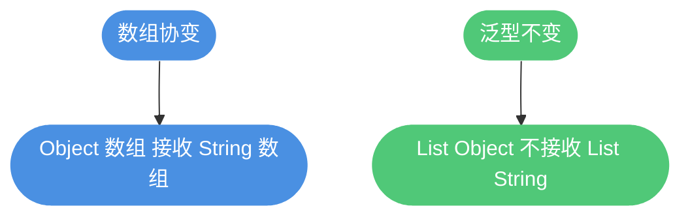
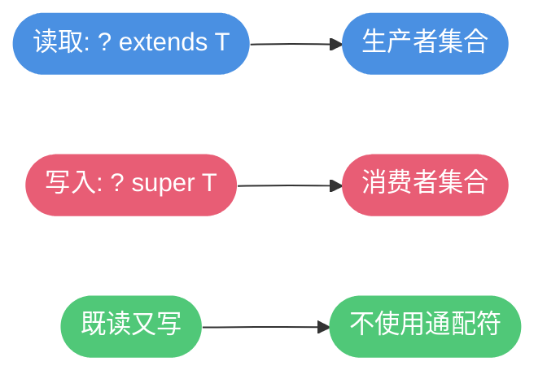

# 泛型详解

## 泛型的作用

Java 5 引入泛型,主要作用:
1. **类型安全**:编译期检查类型错误
2. **消除强制转换**:自动类型转换
3. **提高代码复用**:编写通用代码

```java
// 没有泛型
List raw = new ArrayList();
raw.add("通知");
raw.add(2024);            // 可加入不同类型
String s1 = (String) raw.get(0);  // 需要强转
String s2 = (String) raw.get(1);  // 运行时异常

// 使用泛型
List<String> msgs = new ArrayList<>();
msgs.add("通知");
// msgs.add(2024);  // 编译错误:类型不匹配
String ok = msgs.get(0);  // 无需强转
```

## 泛型的使用方式

### 1. 泛型类

```java
// 邮件投递箱:支持任意类型的消息载荷
public class Mailbox<T> {
    private T payload;

    public void put(T payload) {
        this.payload = payload;
    }

    public T take() {
        return payload;
    }
}

// 使用
Mailbox<String> textBox = new Mailbox<>();
textBox.put("欢迎使用");
String msg = textBox.take();

Mailbox<Integer> idBox = new Mailbox<>();
idBox.put(100);
int id = idBox.take();
```

### 2. 泛型接口

```java
public interface Comparable<T> {
    int compareTo(T other);
}

// 指定类型:按人口比较城市
public class City implements Comparable<City> {
    private final String name;
    private final int population;

    public City(String name, int population) {
        this.name = name;
        this.population = population;
    }

    @Override
    public int compareTo(City other) {
        return Integer.compare(this.population, other.population);
    }
}

// 保留泛型:用于任意可比较类型
public class Wrapper<T extends Comparable<T>> implements Comparable<T> {
    private final T value;

    public Wrapper(T value) { this.value = value; }

    @Override
    public int compareTo(T other) {
        return value.compareTo(other);
    }
}
```

### 3. 泛型方法

```java
public class SensorUtil {
    // 泛型方法:打印读数
    public static <T> void printReadings(T[] readings) {
        for (T r : readings) {
            System.out.print(r + " ");
        }
        System.out.println();
    }

    public static void main(String[] args) {
        Double[] temps = {23.5, 24.0, 22.9};
        String[] events = {"open", "close"};

        printReadings(temps);
        printReadings(events);
    }
}
```

**注意**:静态泛型方法不能使用类的泛型参数

```java
public class MyClass<T> {
    // 错误:静态方法不能使用类的 T
    // public static void method(T param) { }
    
    // 正确:声明自己的泛型参数
    public static <E> void method(E param) { }
}
```

## 项目中泛型的应用

```java
// 1. 通用响应体
public class Response<T> {
    private int code;
    private String message;
    private T data;

    public static <T> Response<T> ok(T data) {
        Response<T> r = new Response<>();
        r.code = 200;
        r.message = "OK";
        r.data = data;
        return r;
    }

    public static <T> Response<T> fail(String msg) {
        Response<T> r = new Response<>();
        r.code = 500;
        r.message = msg;
        return r;
    }
}

// 使用
Response<Integer> count = Response.ok(42);
Response<List<String>> names = Response.ok(Arrays.asList("Alice", "Bob"));

// 2. 通用仓库
public class Repository<T> {
    private final List<T> store = new ArrayList<>();

    public void save(T item) { store.add(item); }
    public List<T> findAll() { return new ArrayList<>(store); }
}

Repository<String> logs = new Repository<>();
logs.save("系统启动");
List<String> all = logs.findAll();
```

## 常用类型参数约定

- `T`: 类型(Type)
- `E`: 元素(Element)
- `K`/`V`: 键/值(Key/Value)
- `N`: 数值(Number)
- `?`: 未知类型(通配符)
- `S/U/...`: 另一占位类型名,语义与 `T` 类似

## 协变、逆变与不变

- 数组是协变的:`Object[]` 可以接收 `String[]`
- 泛型默认不变: `List<Object>` 与 `List<String>` 无继承关系
- 使用通配符可表达读/写意图



## 通配符与 Object 的区别

- `List<?>`: 可读不可写(除 `null`),可接收任何具体泛型的 `List`
- `List<Object>`: 可读可写,但不能接收 `List<String>` 等具体泛型

```java
List<?> any = new ArrayList<String>();
Object x = ((List<?>) any).get(0); // 可读
// any.add("x"); // 不允许写入

List<Object> objs = new ArrayList<>();
objs.add(123); // 可写
// List<String> ss = objs; // 编译错误
```

## 反射绕过泛型检查(示例)

```java
// 将非整数值塞进 List<Integer> (不推荐,仅示例)
List<Integer> ids = new ArrayList<>();
Method m = ids.getClass().getMethod("add", Object.class);
m.invoke(ids, UUID.randomUUID().toString());
System.out.println(ids.get(0));
```

## 边界通配符: extends 与 super

- `? extends T`: 上界,适合读取
- `? super T`: 下界,适合写入
- PECS 原则: Producer-Extends, Consumer-Super

```java
// 事件队列:读取与写入
class Event {}
class LoginEvent extends Event {}

// 上界:只读
void readEvents(List<? extends Event> events) {
    Event e = events.get(0);
}

// 下界:只写
void publishLogin(List<? super LoginEvent> outbox) {
    outbox.add(new LoginEvent());
}
```



## 类型擦除机制

- 编译期擦除类型参数,将 `T` 替换为 `Object` 或上界类型
- 运行期不保留具体泛型信息(非可重新化类型)

```java
// 泛型版本
public class Repository<T> {
    T data;
    void save(T value) { this.data = value; }
}

// 擦除后等价
public class Repository_Erased {
    Object data;
    void save(Object value) { this.data = value; }
}
```


## 受类型擦除影响的限制

- 不能创建泛型数组:`new List<String>[10]`(编译错误)
- 不能捕获泛型异常多次分支
- 静态上下文不可引用类的类型参数
- 不能直接 `new T()` 或 `T.class`

```java
// 通过传入 Class<T> 解决 new T() 问题
class Factory<T> {
    private final Class<T> type;
    Factory(Class<T> type) { this.type = type; }
    T create() throws Exception { return type.getDeclaredConstructor().newInstance(); }
}
```
