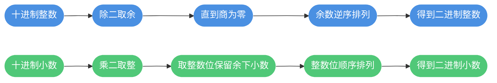
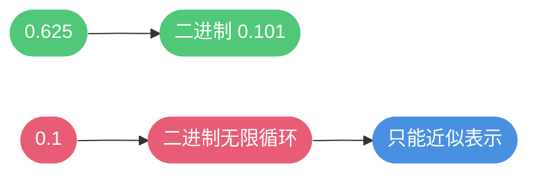
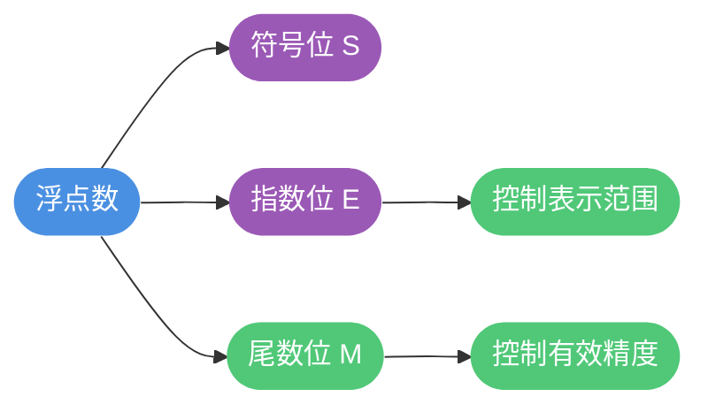
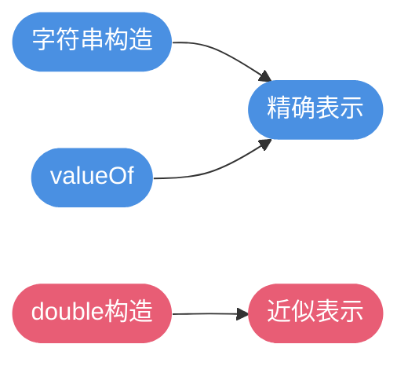

# Java数值与金额精度

## 为什么金额不能用浮点数

浮点数是近似值表示,在二进制无法精确表示的十进制小数(如 0.1)上会出现误差,累积后导致结算结果不稳定。


### 十进制转二进制方法

整数转换采用除二取余逆序排列,小数转换采用乘二取整顺序排列。



示例说明:
- 十进制 127 转二进制按除二取余逆序排列得到二进制 1111111
- 十进制 0.625 乘二取整得到二进制 0.101

### 不是所有十进制小数都能用二进制精确表示

像 0.1 这类十进制小数在二进制中呈无限循环形式,因此只能用近似值表示。



### IEEE 754 简要

浮点数在计算机中由三个部分组成: 符号位 S, 指数位 E, 尾数位 M。



常见规格:
- 单精度 32位, 双精度 64位
- 位数有限导致某些十进制小数只能用近似值表示

### 代码示例: 浮点代数误差

```java
double x = 0.1;
double y = 0.2;
System.out.println(x + y); // 0.30000000000000004
```

### 避免精度丢失的做法
- 金额运算避免使用 float 和 double
- 使用 BigDecimal 表示十进制并控制舍入策略
- 仅在展示层格式化为两位小数,过程保留足够精度

## BigDecimal 构造方式差异

同样的十进制文本使用不同构造方式,得到的对象可能不同。

```java
// 场景: 停车计费
BigDecimal a = new BigDecimal("0.1");
BigDecimal b = BigDecimal.valueOf(0.1);
BigDecimal c = new BigDecimal(0.1);

System.out.println(a); // 0.1
System.out.println(b); // 0.1
System.out.println(c); // 0.1000000000000000055511151231257827...
```

结论:
- 使用 `new BigDecimal(String)` 或 `BigDecimal.valueOf(double)` 保证十进制文本按期望表示
- 避免 `new BigDecimal(double)` 直接构造



## BigDecimal 内部表示与标度
BigDecimal 以无标度值与标度的组合表示十进制数,数值计算公式为: unscaledValue × 10^(-scale)。

- 例: 123.45 的无标度值为 12345, 标度为 2
- 标度为正表示小数位数; 标度为零表示整数; 标度为负表示小数点左移的位数

```java
BigDecimal x = new BigDecimal("123.45");
int s = x.scale();
System.out.println(s);
```

构造的标度差异:
- `BigDecimal(int)` 与 `BigDecimal(long)` 的标度为 0
- `BigDecimal(String)` 的标度为字符串小数位数
- `BigDecimal(double)` 的标度受二进制近似影响,应避免直接使用

## 金额选择: BigDecimal vs Long(分)

两种常见做法:
- 元为单位: 代码用 `BigDecimal`, 数据库 `DECIMAL`
- 分为单位: 代码用 `long`, 数据库 `BIGINT`

示例对比(外卖账单服务费率):

```java
// 元为单位:过程保留小数
BigDecimal amountYuan = new BigDecimal("1");
BigDecimal rate = new BigDecimal("0.004");
BigDecimal feeYuan = amountYuan.multiply(rate).setScale(3, RoundingMode.HALF_UP);
BigDecimal settleYuan = feeYuan.multiply(new BigDecimal("2")).setScale(2, RoundingMode.HALF_UP); // 0.01

// 分为单位:每次都丢小数
long amountCent = 100;
BigDecimal feeCent1 = new BigDecimal(amountCent).multiply(rate); // 0.4
long roundCent1 = feeCent1.setScale(0, RoundingMode.HALF_UP).longValue(); // 0
long totalCent = roundCent1 * 2; // 0
```

结论:
- 涉及费率/利率等乘除运算时用 `BigDecimal` 保留过程,在最终时再统一四舍五入
- 只做加减计数且无小数运算时可用 `long`(分)

## BigDecimal 等值比较: equals vs compareTo

`equals` 同时比较值与标度, `compareTo` 只比较数值大小。

```java
// 场景: 优惠券阈值判断
BigDecimal threshold = new BigDecimal("50.00");
BigDecimal paid1 = new BigDecimal("50");

boolean eq = threshold.equals(paid1);      // false (标度不同)
boolean ok = threshold.compareTo(paid1) == 0; // true (数值相等)
```

建议:
- 等值判断使用 `compareTo(...) == 0`
- 业务入参统一格式化标度以便存储一致

## 负数绝对值不一定正数

`int` 的最小值 `Integer.MIN_VALUE` 的绝对值溢出仍为负数。取绝对值前扩大到 `long` 避免溢出。

```java
// 订单编号哈希的绝对值
int h = Integer.MIN_VALUE;
long safe = Math.abs((long) h); // 2147483648
```

### 整型范围与溢出

整型的表示范围与字节数相关,溢出不会抛异常,需注意边界。

- `byte`: -128 到 127
- `short`: -32768 到 32767
- `int`: -2147483648 到 2147483647
- `long`: -2^63 到 2^63-1

```java
int i = Integer.MAX_VALUE;
int j = Integer.MAX_VALUE;
int k = i + j;
System.out.println(k);
```

## 实战建议

```java
// 金额统一工具
class Money {
    static BigDecimal yuan(String s) { return new BigDecimal(s); }
    static BigDecimal fee(BigDecimal amt, BigDecimal rate) {
        return amt.multiply(rate).setScale(6, RoundingMode.HALF_UP);
    }
    static BigDecimal settle(BigDecimal v) { return v.setScale(2, RoundingMode.HALF_UP); }
}

BigDecimal amt = Money.yuan("12.35");
BigDecimal rate = Money.yuan("0.0035");
BigDecimal fee = Money.fee(amt, rate);
BigDecimal finalPay = Money.settle(amt.add(fee));
```


