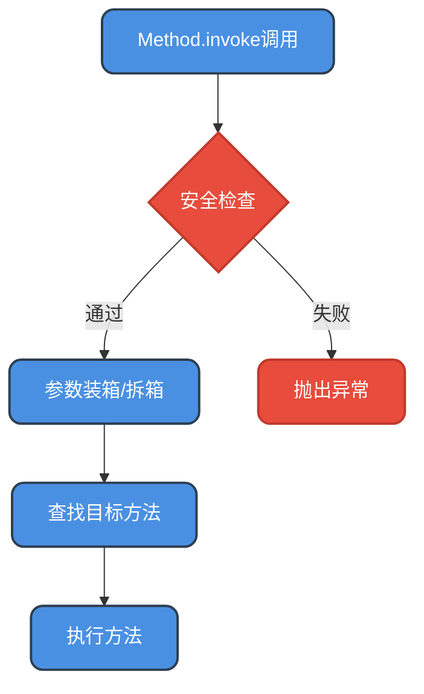
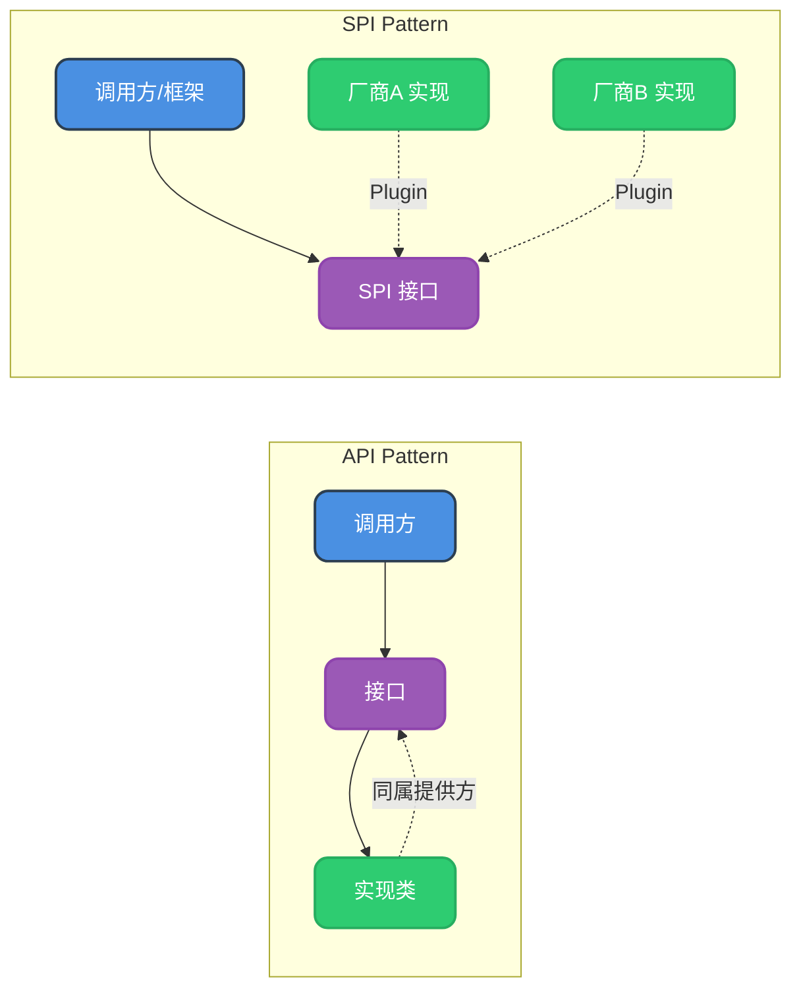
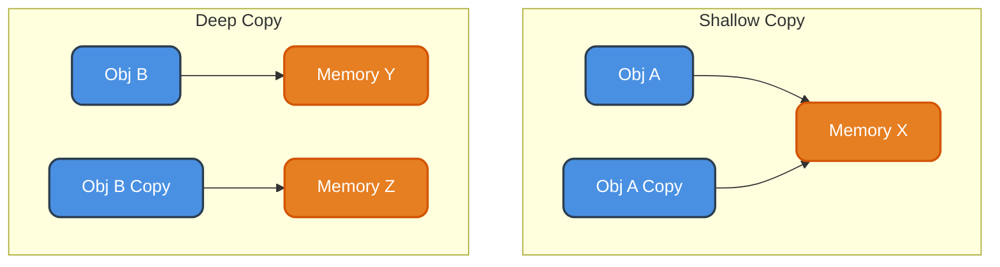
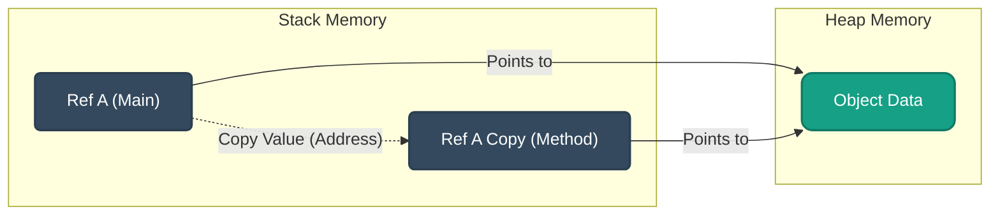

# 反射与动态代理

本文深入剖析 Java 开发中常见的核心机制，涵盖反射、动态代理、SPI、对象拷贝、对象创建及参数传递等高频面试考点与实战原理。

## 1. 反射机制 (Reflection)

### 什么是反射？

反射是 Java 语言被视为"准动态语言"的关键性质。它允许程序在**运行时**（Runtime）借助 `Reflection API` 获取任何类的内部信息（如成员变量、构造器、成员方法等），并能直接操作任意对象的内部属性及方法。

简单来说，反射就是把 Java 类中的各种成分映射成一个个 Java 对象。

#### 代码示例：传统方式 vs 反射方式

假设我们有一个 `Product` 类：

```java
public class Product {
    private String name;
    
    public Product() {}
    
    public Product(String name) {
        this.name = name;
    }
    
    public void launch() {
        System.out.println(name + " is launching!");
    }
    
    private void internalProcess() {
        System.out.println("Processing...");
    }
}
```

使用反射操作：

```java
// 1. 获取 Class 对象
Class<?> clazz = Class.forName("com.example.Product");

// 2. 创建实例 (调用无参构造)
Object product = clazz.newInstance();

// 3. 获取并设置字段 (即使是 private)
Field nameField = clazz.getDeclaredField("name");
nameField.setAccessible(true); // 暴力反射
nameField.set(product, "SuperPhone");

// 4. 调用方法
Method launchMethod = clazz.getMethod("launch");
launchMethod.invoke(product);
```

### 反射的优缺点

| 特性 | 说明 |
| :--- | :--- |
| **优点** | **极高的灵活性**：能在运行时动态加载类，是各种框架（Spring, MyBatis）的底层基石。 |
| **缺点** | **性能开销**：涉及动态解析，JVM 无法进行有效优化（如 JIT 內联）。<br />**安全隐患**：破坏了封装性，可以访问私有成员。<br />**代码可读性**：逻辑隐晦，不易调试。 |

### 为什么反射比较慢？

反射的性能开销主要来自以下几个方面：

1.  **动态解析**：JVM 无法在编译期确定调用的具体方法，必须在运行时查找，无法使用 JIT（即时编译）优化。
2.  **安全检查**：反射调用时，JVM 需要进行可见性检查（CheckAccess）。
3.  **参数封装**：`Method.invoke` 方法接收 `Object[]` 参数，涉及基本类型的自动装箱（Boxing）和拆箱（Unboxing），产生大量临时对象。



### 应用场景

*   **Spring IoC 容器**：通过 XML 配置或注解，利用反射实例化 Bean。
*   **JDBC 驱动加载**：`Class.forName("com.mysql.cj.jdbc.Driver")`。
*   **RPC 框架**：动态代理底层也依赖反射。

---

## 2. 动态代理 (Dynamic Proxy)

代理模式是 Java 中常用的设计模式，用于在不修改目标对象代码的前提下，对目标对象的功能进行扩展（如添加日志、事务控制、权限校验）。

### 静态代理 vs 动态代理

*   **静态代理**：在编译期就已经确定了代理类，一个代理类只能为一个接口服务，代码冗余。
*   **动态代理**：在运行期通过反射或字节码技术动态生成代理类，更加灵活。

### JDK 动态代理

基于 `java.lang.reflect.Proxy` 和 `InvocationHandler` 实现。**要求目标对象必须实现接口**。

#### 代码示例

```java
// 接口
interface PaymentService {
    void pay(double amount);
}

// 目标类
class AliPay implements PaymentService {
    public void pay(double amount) {
        System.out.println("AliPay: " + amount);
    }
}

// 动态代理处理器
class LogHandler implements InvocationHandler {
    private Object target;
    
    public LogHandler(Object target) { this.target = target; }
    
    @Override
    public Object invoke(Object proxy, Method method, Object[] args) throws Throwable {
        System.out.println(">> Log: Start transaction");
        Object result = method.invoke(target, args); // 反射调用
        System.out.println(">> Log: End transaction");
        return result;
    }
}

// 测试
PaymentService target = new AliPay();
PaymentService proxy = (PaymentService) Proxy.newProxyInstance(
    target.getClass().getClassLoader(),
    target.getClass().getInterfaces(),
    new LogHandler(target)
);
proxy.pay(100.0);
```

### CGLIB 动态代理

基于 ASM 字节码框架，通过**继承**目标类并重写方法来实现。**不需要目标类实现接口**，但目标类不能是 `final` 的。

```java
// 目标类 (无接口)
class WechatPay {
    public void pay(double amount) {
        System.out.println("WechatPay: " + amount);
    }
}

// CGLIB 拦截器
class CglibInterceptor implements MethodInterceptor {
    @Override
    public Object intercept(Object obj, Method method, Object[] args, MethodProxy proxy) throws Throwable {
        System.out.println(">> CGLIB: Verify security");
        Object result = proxy.invokeSuper(obj, args); // 调用父类方法
        System.out.println(">> CGLIB: Notify user");
        return result;
    }
}
```

### JDK 与 CGLIB 对比

| 维度 | JDK 动态代理 | CGLIB 动态代理 |
| :--- | :--- | :--- |
| **实现原理** | 基于反射，生成接口的实现类 | 基于 ASM，生成目标类的子类 |
| **前提条件** | 目标类必须实现接口 | 目标类不能为 final |
| **性能** | JDK 8 之后性能已有很大提升 | 较复杂，首次生成慢，执行快 |
| **Spring 选择** | Bean 实现接口时默认用 JDK | Bean 未实现接口时默认用 CGLIB |

---

## 3. SPI 机制 (Service Provider Interface)

### 什么是 SPI？

SPI (Service Provider Interface) 是 Java 提供的一套用来被第三方实现或者扩展的 API，是一种**服务发现机制**。它允许框架定义接口，而具体的实现交由第三方组件提供，实现了模块间的解耦。

### API vs SPI

*   **API**：接口和实现通常位于同一包或由同一方提供，供客户端直接调用。
*   **SPI**：接口由调用方定义，实现由第三方提供。



### SPI 实现步骤

1.  **定义接口**：例如 `SearchEngine`。
2.  **提供实现**：`GoogleSearch`, `BingSearch`。
3.  **配置文件**：在 `src/main/resources/META-INF/services/` 下创建文件，文件名是接口全限定名，内容是实现类全限定名。
4.  **加载使用**：使用 `ServiceLoader` 加载。

```java
// 加载所有实现
ServiceLoader<SearchEngine> loaders = ServiceLoader.load(SearchEngine.class);
for (SearchEngine engine : loaders) {
    engine.search("Hello SPI");
}
```

---

## 4. 对象的深拷贝与浅拷贝

在 Java 中，拷贝对象时主要涉及引用的拷贝和内容的拷贝。

### 浅拷贝 (Shallow Copy)

只复制对象的引用地址，或者只复制对象的第一层属性。如果属性是引用类型，原对象和拷贝对象指向同一个内存地址。

*   **实现方式**：实现 `Cloneable` 接口并重写 `clone()` 方法（默认行为）。

### 深拷贝 (Deep Copy)

复制对象及其引用的所有子对象，产生一个完全独立的新对象结构。

*   **实现方式**：
    1.  重写 `clone()`，递归调用子对象的 `clone()`。
    2.  **序列化**：将对象序列化为字节流再反序列化（最常用，推荐 `JSON` 转换或 `Apache Commons SerializationUtils`）。

#### 内存结构对比



---

## 5. 对象创建的五种方式

Java 中创建对象不仅仅只有 `new` 这一种方式。

### 1. 使用 new 关键字
最常见的方式，调用构造函数。
```java
User user = new User();
```

### 2. 使用反射 (Reflection)
*   `Class.newInstance()`: 调用无参构造。
*   `Constructor.newInstance()`: 可以调用有参或私有构造。

### 3. 使用 clone() 方法
不调用构造函数，直接在内存中复制对象。需要实现 `Cloneable` 接口。

### 4. 使用反序列化 (Deserialization)
从文件或网络流中恢复对象，不调用构造函数。
```java
ObjectInputStream in = new ObjectInputStream(new FileInputStream("data.obj"));
User user = (User) in.readObject();
```

### 5. 使用 Unsafe 类
直接操作内存分配实例，不调用构造函数。Spring 等底层框架偶尔使用，不建议业务代码使用。

### 为什么建议自定义一个无参构造函数？

1.  **框架需求**：大部分框架（Spring, Hibernate, MyBatis）在反射创建对象时，默认调用无参构造器。
2.  **序列化**：子类实现序列化时，父类如果未实现序列化接口，必须有一个无参构造器，否则反序列化会报错。
3.  **继承机制**：子类构造器默认会调用 `super()`，如果父类没有无参构造且未显式调用有参构造，编译会失败。

---

## 6. Java 参数传递机制

### 值传递 vs 引用传递

*   **值传递 (Pass by Value)**：传递的是变量的副本。
*   **引用传递 (Pass by Reference)**：传递的是变量的地址引用（C++ 中的 `&`）。

### Java 的求值策略

**Java 只有值传递！**

*   对于**基本数据类型**，传递的是数据的副本。
*   对于**引用数据类型**，传递的是**引用的副本**（即对象地址的拷贝）。

这就好比你有一把家里的钥匙（引用），你复制了一把钥匙给朋友（传参）。
1.  朋友可以用钥匙开门进去把你家电视砸了（修改对象属性），你会受到影响。
2.  朋友把他的钥匙扔了，换了一把别的房子的钥匙（修改引用本身），这对你手里的钥匙和你家房子没有任何影响。



> **总结**：在方法内修改引用指向的对象属性，外部可见；在方法内让引用指向新对象，外部不可见。
