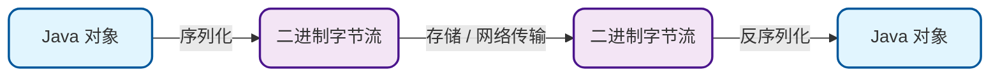
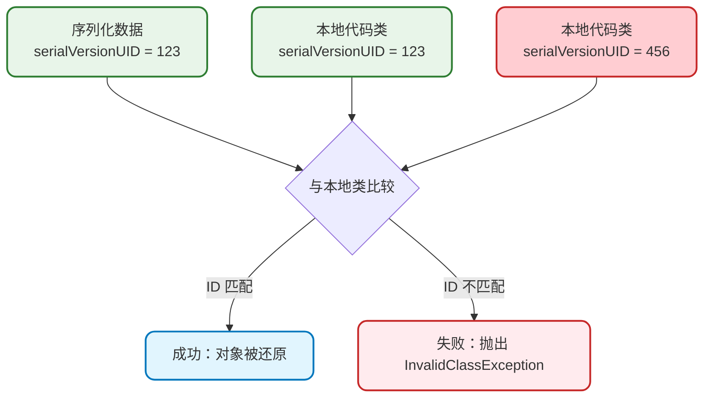
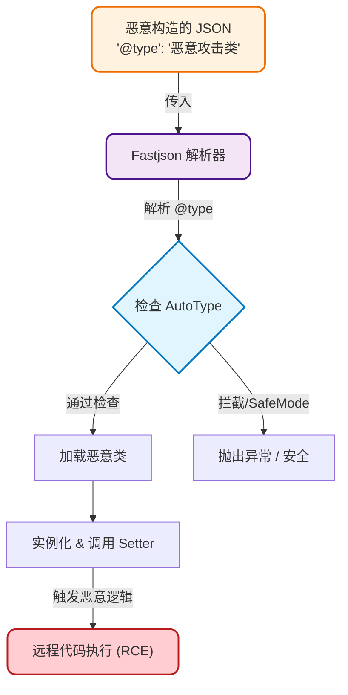

## 什么是序列化与反序列化

在 Java 应用程序的生命周期中，对象通常存在于内存（堆）中。只要 JVM 处于运行状态，这些对象就会存在。然而，一旦 JVM 停止运行，这些对象的状态就会丢失。

但在许多实际场景中，我们需要：
1.  **持久化**：将对象的状态保存下来（例如保存到文件或数据库中），以便在未来重新读取。
2.  **网络传输**：在网络上传输对象（例如 RPC 调用、微服务通信），这就需要将对象转换为可以在网络上传输的格式（如二进制流）。

为了解决这些问题，Java 引入了序列化机制。

*   **序列化 (Serialization)**：将 Java 对象转换成字节序列（Byte Stream）的过程。
*   **反序列化 (Deserialization)**：将字节序列恢复为 Java 对象的过程。



## Java 序列化的实现

在 Java 中，要使一个类可以被序列化，该类必须实现 `java.io.Serializable` 接口。这是一个标记接口（Marker Interface），它没有任何方法，仅仅用于告诉 JVM 该类可以进行序列化处理。

### 基本使用示例

我们以一个“游戏角色”（GameCharacter）为例。假设我们需要保存角色的基本信息（昵称、等级、经验值），但不需要保存当前临时的会话 ID。

```java
import java.io.*;

// 1. 实现 Serializable 接口
public class GameCharacter implements Serializable {
    // 建议显式定义 serialVersionUID
    private static final long serialVersionUID = 1L;

    private String nickname;
    private int level;
    private long experience;
    
    // transient 关键字修饰的变量不会被序列化
    private transient String currentSessionId;

    public GameCharacter(String nickname, int level, long experience, String currentSessionId) {
        this.nickname = nickname;
        this.level = level;
        this.experience = experience;
        this.currentSessionId = currentSessionId;
    }

    @Override
    public String toString() {
        return "GameCharacter{" +
                "nickname='" + nickname + '\'' +
                ", level=" + level +
                ", experience=" + experience +
                ", currentSessionId='" + currentSessionId + '\'' + // 反序列化后这里会是 null
                '}';
    }
    
    // 省略 Getter 和 Setter
}
```

### 序列化与反序列化操作

我们可以使用 `ObjectOutputStream` 进行序列化，使用 `ObjectInputStream` 进行反序列化。

```java
public class SerializationDemo {
    public static void main(String[] args) {
        GameCharacter player = new GameCharacter("HeroOne", 10, 5000L, "sess-999");
        System.out.println("序列化前: " + player);

        String fileName = "player.dat";

        // 序列化过程
        try (ObjectOutputStream oos = new ObjectOutputStream(new FileOutputStream(fileName))) {
            oos.writeObject(player);
            System.out.println("对象已序列化到文件: " + fileName);
        } catch (IOException e) {
            e.printStackTrace();
        }

        // 反序列化过程
        try (ObjectInputStream ois = new ObjectInputStream(new FileInputStream(fileName))) {
            GameCharacter loadedPlayer = (GameCharacter) ois.readObject();
            System.out.println("反序列化后: " + loadedPlayer);
        } catch (IOException | ClassNotFoundException e) {
            e.printStackTrace();
        }
    }
}
```

**输出结果可能如下：**

```text
序列化前: GameCharacter{nickname='HeroOne', level=10, experience=5000, currentSessionId='sess-999'}
对象已序列化到文件: player.dat
反序列化后: GameCharacter{nickname='HeroOne', level=10, experience=5000, currentSessionId='null'}
```

注意：`currentSessionId` 字段因为被 `transient` 修饰，在反序列化后其值为 `null`。

## 深入理解 serialVersionUID

在上面的例子中，我们定义了一个 `private static final long serialVersionUID = 1L;`。这是一个版本控制 ID。

### 它的作用是什么？
Java 的序列化机制通过 `serialVersionUID` 来验证版本一致性。在反序列化时，JVM 会将字节流中的 `serialVersionUID` 与本地相应实体类（即代码中的类）的 `serialVersionUID` 进行比较：
*   **如果相同**：认为版本一致，可以进行反序列化。
*   **如果不同**：抛出 `java.io.InvalidClassException` 异常。

### 为什么建议显式定义？
如果我们没有显式定义这个 ID，Java 编译器会自动根据类的结构（类名、接口名、成员方法、属性等）生成一个哈希值作为 `serialVersionUID`。

这会带来一个隐患：**如果类结构发生了极其微小的变化（例如增加了一个无关紧要的属性，或者修改了方法名），自动生成的 ID 就会改变。** 这会导致之前序列化好的数据无法被反序列化。



**最佳实践**：始终手动定义 `serialVersionUID`，通常设为 `1L`。这样即使类添加了新字段，旧版本的序列化数据仍然可以被兼容读取（新字段会被赋默认值）。

## 常见的序列化框架与安全问题

除了 Java 原生的序列化，业界还有很多流行的 JSON 序列化框架，如 **Fastjson**、**Jackson**、**Gson** 等。它们通常用于 Web 开发中前后端的数据交互。

然而，序列化技术也经常伴随着安全风险，最著名的就是 **Fastjson 反序列化漏洞**。

### Fastjson 的 AutoType 机制

Fastjson 在序列化时，为了能在反序列化时准确地恢复对象的类型（特别是当对象字段是接口或抽象类时），引入了 `AutoType` 功能。

假设我们有一个 `Garage`（车库）类，里面停着一辆 `Vehicle`（交通工具，接口）。

```java
interface Vehicle {
    void drive();
}

class Car implements Vehicle {
    private String model;
    // ...
}

class Garage {
    private Vehicle vehicle;
    // ...
}
```

当我们使用 Fastjson 开启 `SerializerFeature.WriteClassName` 序列化 `Garage` 对象时，生成的 JSON 会包含 `@type` 字段：

```json
{
    "@type": "com.example.Garage",
    "vehicle": {
        "@type": "com.example.Car", 
        "model": "Tesla"
    }
}
```

这个 `@type` 告诉 Fastjson：把 `vehicle` 字段反序列化成 `com.example.Car` 类。

### 漏洞原理

问题在于，如果攻击者能够控制传入的 JSON 字符串，他们就可以将 `@type` 指向任何他们想要的类。

如果攻击者将 `@type` 指向一个危险的类（Gadget 类），例如 `com.sun.rowset.JdbcRowSetImpl`（JDK 自带的一个类），并利用该类的 Setter 方法触发恶意的远程代码执行（RCE），服务器就会在反序列化时被攻击。



### 如何防御？

1.  **升级版本**：Fastjson 官方不断在更新黑名单，拦截已知的危险类。
2.  **开启 SafeMode**：Fastjson v1.2.68+ 引入了 `SafeMode`。配置后，Fastjson 将完全禁用 `AutoType`，即忽略 JSON 中的 `@type` 字段。这是最彻底的解决方式，但需要评估对业务代码的影响。

    ```java
    // 开启 SafeMode
    ParserConfig.getGlobalInstance().setSafeMode(true);
    ```

3.  **使用其他框架**：在某些场景下，迁移到 Jackson 或 Gson 也是一种选择，它们默认的安全策略有所不同。

## 总结

1.  **序列化**是将对象转换为可传输/存储格式的核心机制。
2.  **Serializable** 接口是 Java 原生序列化的必须要实现的标记接口。
3.  **transient** 关键字用于忽略不需要序列化的敏感或临时数据。
4.  **serialVersionUID** 用于保证版本兼容性，务必显式定义。
5.  在使用 Fastjson 等框架时，务必关注**反序列化漏洞**，及时升级版本或开启安全模式（SafeMode）。
