# Java集合框架详解

## 集合框架总览

### 什么是Java集合框架

Java集合框架是Java开发中最常用的工具之一,它为我们提供了一套完整的数据结构和算法实现。简单来说,集合就是一个容器,用来存储和管理一组对象。

Java集合框架主要包含两大类型:
- **Collection接口**: 用于存储单个元素的集合
- **Map接口**: 用于存储键值对(key-value)的集合

### 为什么需要使用集合

在实际开发中,我们经常需要存储一组对象,虽然数组也能完成这个任务,但数组存在诸多局限:

1. **长度固定**: 数组创建后长度不可变,无法动态扩展
2. **类型单一**: 数组只能存储同一类型的元素
3. **操作复杂**: 增删元素需要手动移动其他元素
4. **功能有限**: 缺少高级操作如排序、查找等内置方法

相比之下,Java集合框架提供了:
- 动态扩容能力
- 丰富的API方法
- 多样化的数据结构
- 泛型支持保证类型安全
- 内置算法提高开发效率

### 集合框架的层次结构

Java集合框架的核心接口主要分为以下几类:

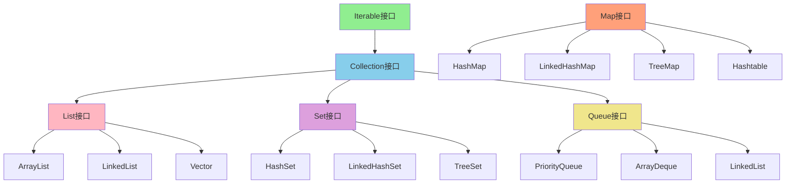

### 四大接口的特点对比

| 接口 | 有序性 | 可重复性 | 主要特点 | 使用场景 |
|------|--------|----------|----------|----------|
| **List** | 有序 | 可重复 | 按索引存储,维护插入顺序 | 需要保持元素顺序的场景 |
| **Set** | 无序 | 不可重复 | 自动去重,不保证顺序 | 需要元素唯一性的场景 |
| **Queue** | 有序 | 可重复 | 按特定规则排队 | 任务调度、消息队列 |
| **Map** | Key无序 | Key不可重复 | 键值对映射 | 需要快速查找的场景 |

## List接口详解

### List的底层实现

List接口的主要实现类及其底层数据结构:

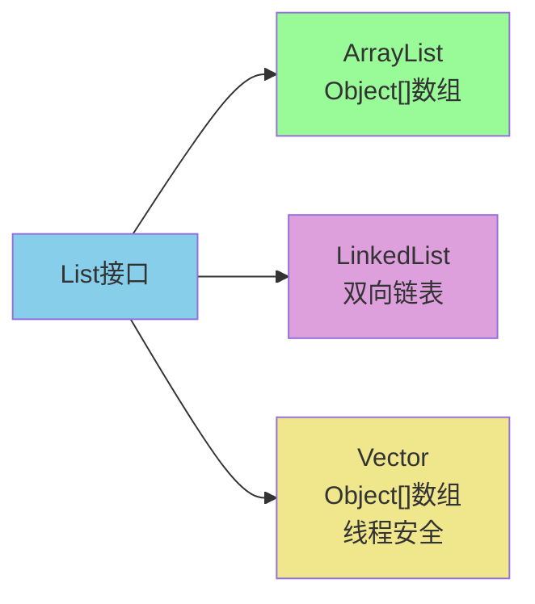

**底层结构说明**:
- **ArrayList**: 基于动态数组,查询快,增删慢
- **LinkedList**: 基于双向链表,增删快,查询慢  
- **Vector**: 类似ArrayList但线程安全,性能较低(已过时)

### ArrayList vs 数组

ArrayList相比传统数组的优势:

**数组示例**:
```java
// 创建固定大小的数组
String[] courses = new String[]{"数学", "语文", "英语"};

// 修改元素
courses[0] = "物理";
System.out.println(Arrays.toString(courses)); // [物理, 语文, 英语]

// 删除元素需要手动移位
for (int i = 0; i < courses.length - 1; i++) {
    courses[i] = courses[i + 1];
}
courses[courses.length - 1] = null;
System.out.println(Arrays.toString(courses)); // [语文, 英语, null]
```

**ArrayList示例**:
```java
// 创建动态列表
ArrayList<String> courses = new ArrayList<>(Arrays.asList("数学", "语文", "英语"));

// 添加元素
courses.add("物理");
System.out.println(courses); // [数学, 语文, 英语, 物理]

// 修改元素
courses.set(0, "化学");
System.out.println(courses); // [化学, 语文, 英语, 物理]

// 删除元素
courses.remove(0);
System.out.println(courses); // [语文, 英语, 物理]
```

**主要区别**:

| 特性 | 数组 | ArrayList |
|------|------|----------|
| 长度 | 固定 | 动态扩容 |
| 泛型支持 | 不支持 | 支持 |
| 基本类型 | 直接存储 | 需要包装类 |
| API方法 | 少 | 丰富 |
| 创建方式 | 必须指定大小 | 可选大小 |

### ArrayList vs Vector

**ArrayList**:
- 非线程安全,性能更高
- 是List的主要实现类
- 适用于单线程环境

**Vector**:
- 线程安全,使用synchronized同步
- JDK 1.0引入的古老类
- 性能较差,已被淘汰

**现代替代方案**:
```java
// 推荐使用并发集合
List<String> safeList = new CopyOnWriteArrayList<>();

// 或者手动同步
List<String> syncList = Collections.synchronizedList(new ArrayList<>());
```

### Vector vs Stack

- **Vector**: 可变长数组,线程安全的List
- **Stack**: 继承自Vector,实现后进先出(LIFO)栈

两者都使用synchronized实现线程安全,但现在都已过时,推荐使用:
- **Deque接口**: 替代Stack
- **ConcurrentHashMap**: 替代线程安全需求

### ArrayList的null值处理

ArrayList可以存储null值,但**不推荐**:

```java
ArrayList<String> subjects = new ArrayList<>();
subjects.add(null);
subjects.add("计算机网络");
System.out.println(subjects); // [null, 计算机网络]
```

**不推荐的原因**:
1. null值没有实际意义
2. 容易导致空指针异常
3. 使代码难以维护和理解

### ArrayList的时间复杂度分析

**插入操作**:

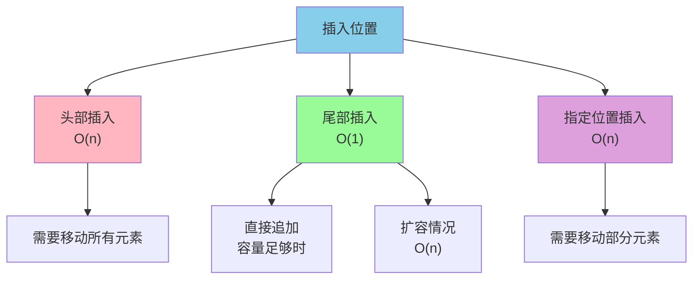

**详细说明**:

1. **头部插入**: O(n)
   - 所有元素需要向后移动
   - 最坏情况

2. **尾部插入**: O(1)或O(n)
   - 容量充足时: O(1)
   - 需要扩容时: O(n)

3. **指定位置插入**: O(n)
   - 平均移动n/2个元素

**删除操作**:

1. **头部删除**: O(n) - 所有元素前移
2. **尾部删除**: O(1) - 直接删除
3. **指定位置删除**: O(n) - 平均移动n/2个元素

**图示例子**:

```java
// 底层数组容量为10,当前存储5个元素
// 索引: 0   1   2   3   4   5   6   7   8   9
// 数据: [10, 20, 30, 40, 50,  ,  ,  ,  ,  ]

// 在索引2插入元素60
// 索引: 0   1   2   3   4   5   6   7   8   9
// 数据: [10, 20, 60, 30, 40, 50,  ,  ,  ,  ]

// 删除索引2的元素
// 索引: 0   1   2   3   4   5   6   7   8   9
// 数据: [10, 20, 30, 40, 50,  ,  ,  ,  ,  ]
```

### LinkedList的时间复杂度分析

LinkedList基于双向链表实现:

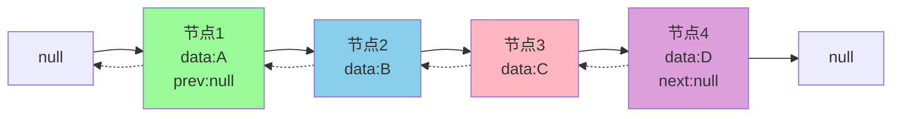

**时间复杂度**:

| 操作 | 时间复杂度 | 说明 |
|------|-----------|------|
| 头部插入/删除 | O(1) | 只需修改头指针 |
| 尾部插入/删除 | O(1) | 只需修改尾指针 |
| 指定位置插入/删除 | O(n) | 需要遍历定位 |
| 随机访问 | O(n) | 需要遍历链表 |

**删除节点示意**:

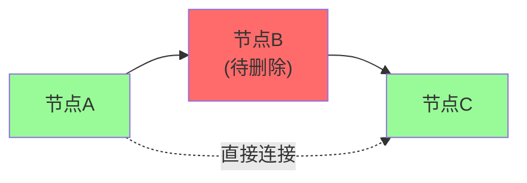

### LinkedList为什么不实现RandomAccess接口

**RandomAccess接口**是一个标记接口,表示支持快速随机访问:

```java
public interface RandomAccess {
    // 空接口,仅作标记
}
```

**原因分析**:

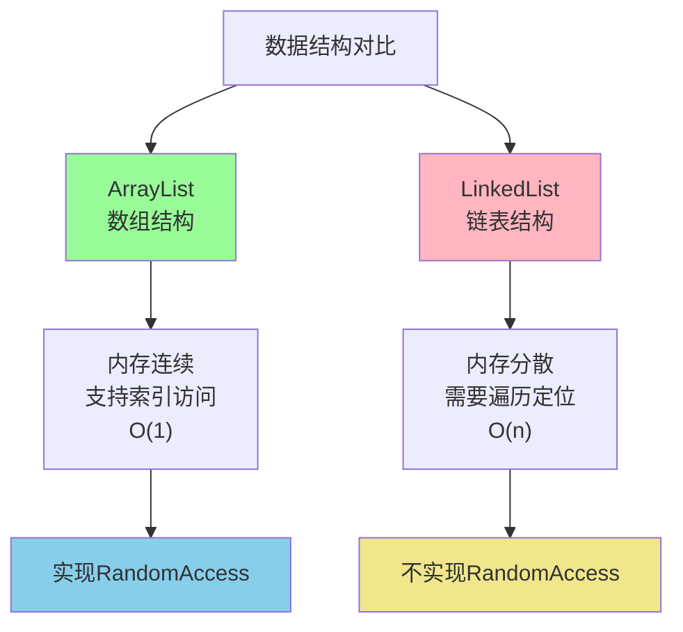

**Collections工具类的应用**:

```java
public static <T> int binarySearch(List<? extends Comparable<? super T>> list, T key) {
    // 判断是否支持随机访问
    if (list instanceof RandomAccess || list.size() < BINARYSEARCH_THRESHOLD)
        return Collections.indexedBinarySearch(list, key);  // 索引访问
    else
        return Collections.iteratorBinarySearch(list, key); // 迭代器访问
}
```

### ArrayList vs LinkedList全面对比

**核心差异**:

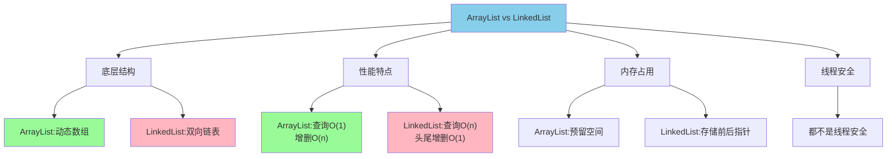

**详细对比表**:

| 特性 | ArrayList | LinkedList |
|------|----------|------------|
| **底层结构** | Object[]数组 | 双向链表 |
| **随机访问** | 支持,O(1) | 不支持,O(n) |
| **头部插入** | O(n) | O(1) |
| **尾部插入** | O(1) | O(1) |
| **中间插入** | O(n) | O(n) |
| **内存占用** | 预留容量空间 | 每个节点额外存储两个指针 |
| **RandomAccess** | 实现 | 未实现 |
| **适用场景** | 查询多,改动少 | 头尾操作频繁 |

**实际使用建议**:

> 在99%的场景下,优先使用ArrayList。即使是频繁增删的场景,ArrayList的性能通常也不会比LinkedList差。连LinkedList的作者Joshua Bloch都表示自己从不使用LinkedList。

**原因**:
1. ArrayList的局部性更好,CPU缓存友好
2. LinkedList每次增删都要创建对象,GC压力大
3. LinkedList只在头尾操作时才有O(1)优势

### ArrayList扩容机制

ArrayList的扩容机制是面试高频考点:

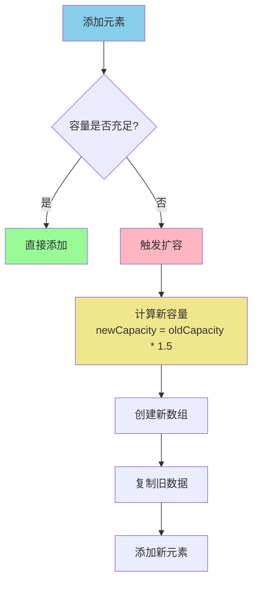

**扩容步骤**:
1. 检查容量是否充足
2. 不足时扩容为原来的1.5倍
3. 创建新数组
4. 复制原数组数据
5. 添加新元素

**扩容细节分析**:

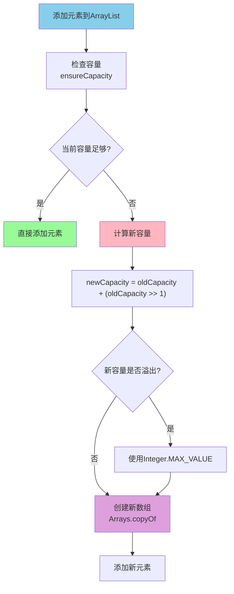

**源码解析**:

```java
// ArrayList的扩容核心方法
private void grow(int minCapacity) {
    // 获取旧容量
    int oldCapacity = elementData.length;
    
    // 计算新容量:旧容量的1.5倍
    // oldCapacity >> 1 等价于 oldCapacity / 2
    int newCapacity = oldCapacity + (oldCapacity >> 1);
    
    // 检查新容量是否足够
    if (newCapacity - minCapacity < 0)
        newCapacity = minCapacity;
    
    // 检查新容量是否超过最大值
    if (newCapacity - MAX_ARRAY_SIZE > 0)
        newCapacity = hugeCapacity(minCapacity);
    
    // 复制到新数组
    elementData = Arrays.copyOf(elementData, newCapacity);
}
```

**关键点说明**:

| 特性 | 说明 |
|------|------|
| **扩容倍数** | 1.5倍(右移1位相当于除以2) |
| **最大容量** | Integer.MAX_VALUE - 8 (约21亿) |
| **扩容时机** | 添加元素时容量不足 |
| **时间复杂度** | O(n),需要复制所有元素 |
| **空间浪费** | 可能预留较多空闲空间 |

**Vector的扩容对比**:

```java
// Vector扩容为原来的2倍
int newCapacity = oldCapacity + ((capacityIncrement > 0) ?
                                 capacityIncrement : oldCapacity);
```

### ArrayList与Vector的扩容对比

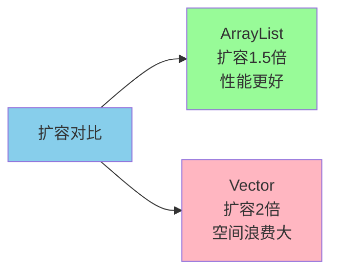

**为什么ArrayList扩容是1.5倍?**

1. **节省内存**: 相比2倍扩容,1.5倍更节省空间
2. **黄金分割**: 1.5接近黄金分割比例,能够充分利用之前释放的内存
3. **性能平衡**: 既避免频繁扩容,又不会浪费太多内存

### 使用LinkedList实现LRU缓存

LRU(Least Recently Used,最近最少使用)是一种常见的缓存淘汰策略。我们可以用LinkedList实现一个简单的LRU缓存:

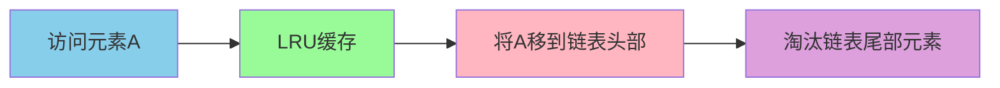

**实现原理**:
- 最近访问的元素放在链表头部
- 链表尾部是最久未使用的元素
- 缓存满时淘汰尾部元素

**代码实现**:

```java
public class SimpleLRUCache<T> {
    private final int capacity;  // 缓存容量
    private final LinkedList<T> cache = new LinkedList<>();
    
    public SimpleLRUCache(int capacity) {
        this.capacity = capacity;
    }
    
    /**
     * 添加元素到缓存
     */
    public void put(T element) {
        // 如果元素已存在,先移除
        cache.remove(element);
        
        // 检查容量
        if (cache.size() >= capacity) {
            // 移除最久未使用的元素(尾部)
            T removed = cache.removeLast();
            System.out.println("缓存已满,淘汰: " + removed);
        }
        
        // 将新元素添加到头部
        cache.addFirst(element);
    }
    
    /**
     * 访问缓存中的元素
     */
    public T get(int index) {
        if (index < 0 || index >= cache.size()) {
            return null;
        }
        
        // 获取元素
        T element = cache.get(index);
        
        // 将访问的元素移到头部(表示最近使用)
        cache.remove(element);
        cache.addFirst(element);
        
        return element;
    }
    
    /**
     * 获取缓存当前状态
     */
    public LinkedList<T> getCache() {
        return new LinkedList<>(cache);
    }
    
    @Override
    public String toString() {
        return "LRU缓存: " + cache.toString();
    }
}

// 使用示例
public class LRUTest {
    public static void main(String[] args) {
        SimpleLRUCache<String> cache = new SimpleLRUCache<>(3);
        
        // 添加元素
        cache.put("页面A");
        cache.put("页面B");
        cache.put("页面C");
        System.out.println(cache); // [页面C, 页面B, 页面A]
        
        // 访问页面A,A移到最前面
        cache.get(2);
        System.out.println(cache); // [页面A, 页面C, 页面B]
        
        // 添加新页面D,淘汰最久未用的页面B
        cache.put("页面D");
        System.out.println(cache); // [页面D, 页面A, 页面C]
    }
}
```

**输出结果**:
```
LRU缓存: [页面C, 页面B, 页面A]
LRU缓存: [页面A, 页面C, 页面B]
缓存已满,淘汰: 页面B
LRU缓存: [页面D, 页面A, 页面C]
```

**LRU缓存的应用场景**:
- 浏览器页面缓存
- 数据库查询结果缓存
- Redis等缓存系统
- 操作系统页面置换算法

### ArrayList的subList陷阱

ArrayList的subList方法在使用时需要特别注意,它返回的是**原List的视图**,而不是一个新的独立List。

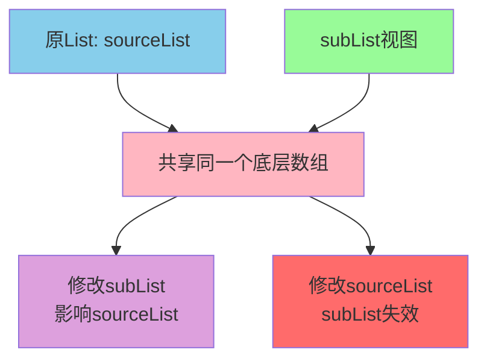

**subList的底层原理**:

```java
public List<E> subList(int fromIndex, int toIndex) {
    subListRangeCheck(fromIndex, toIndex, size);
    // 返回SubList内部类实例
    return new SubList(this, 0, fromIndex, toIndex);
}

// SubList是ArrayList的内部类
private class SubList extends AbstractList<E> {
    private final AbstractList<E> parent;  // 指向原List
    private final int parentOffset;
    private final int offset;
    int size;
    
    SubList(AbstractList<E> parent, int offset, 
            int fromIndex, int toIndex) {
        this.parent = parent;  // 保存原List引用
        this.parentOffset = fromIndex;
        this.offset = offset + fromIndex;
        this.size = toIndex - fromIndex;
        this.modCount = ArrayList.this.modCount;
    }
}
```

**使用陷阱示例**:

**陷阱1: 类型转换错误**

```java
List<String> books = new ArrayList<>();
books.add("Java编程思想");
books.add("Effective Java");
books.add("深入理解JVM");

// 错误:不能强转为ArrayList
try {
    ArrayList<String> subBooks = (ArrayList<String>) books.subList(0, 2);
} catch (ClassCastException e) {
    System.out.println("错误: subList返回的是SubList,不是ArrayList!");
}

// 正确:使用List接口接收
List<String> subBooks = books.subList(0, 2);
System.out.println("子列表: " + subBooks);
```

**陷阱2: 非结构性修改的相互影响**

```java
List<String> languages = new ArrayList<>();
languages.add("Java");
languages.add("Python");
languages.add("Go");
languages.add("C++");
languages.add("JavaScript");

// 获取子列表[索引1-3)
List<String> subLang = languages.subList(1, 4);
System.out.println("原列表: " + languages);
System.out.println("子列表: " + subLang);

// 修改子列表的元素
subLang.set(1, "Rust");

System.out.println("\n修改子列表后:");
System.out.println("原列表: " + languages);  // [Java, Python, Rust, C++, JavaScript]
System.out.println("子列表: " + subLang);    // [Python, Rust, C++]
```

**输出**:
```
原列表: [Java, Python, Go, C++, JavaScript]
子列表: [Python, Go, C++]

修改子列表后:
原列表: [Java, Python, Rust, C++, JavaScript]
子列表: [Python, Rust, C++]
```

**陷阱3: 结构性修改子列表影响原列表**

```java
List<Integer> numbers = new ArrayList<>();
for (int i = 1; i <= 6; i++) {
    numbers.add(i * 10);
}

List<Integer> subNumbers = numbers.subList(2, 5);
System.out.println("原列表: " + numbers);    // [10, 20, 30, 40, 50, 60]
System.out.println("子列表: " + subNumbers); // [30, 40, 50]

// 在子列表中添加元素
subNumbers.add(999);

System.out.println("\n向子列表添加元素后:");
System.out.println("原列表: " + numbers);    // [10, 20, 30, 40, 50, 999, 60]
System.out.println("子列表: " + subNumbers); // [30, 40, 50, 999]
```

**陷阱4: 结构性修改原列表导致异常**

```java
List<String> cities = new ArrayList<>();
cities.add("北京");
cities.add("上海");
cities.add("广州");
cities.add("深圳");
cities.add("杭州");

List<String> subCities = cities.subList(1, 4);
System.out.println("原列表: " + cities);
System.out.println("子列表: " + subCities);

// 修改原列表的结构
cities.add("成都");

try {
    // 尝试访问子列表会抛出异常
    System.out.println("子列表: " + subCities);
} catch (ConcurrentModificationException e) {
    System.out.println("错误: 原列表结构改变后,子列表失效!");
}
```

**三种修改的总结**:

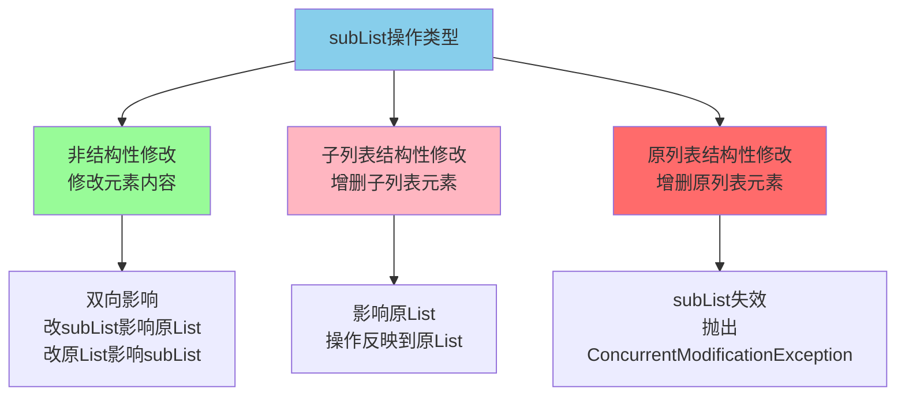

**如何安全使用subList**:

```java
// 方法1: 创建独立的副本
List<String> original = new ArrayList<>(Arrays.asList("A", "B", "C", "D"));
List<String> independent = new ArrayList<>(original.subList(1, 3));

// 方法2: 使用Stream API
List<String> streamCopy = original.stream()
    .skip(1)
    .limit(2)
    .collect(Collectors.toList());

// 方法3: 使用Guava库
List<String> guavaCopy = Lists.newArrayList(original.subList(1, 3));

// 修改副本不影响原列表
independent.add("E");
System.out.println("原列表: " + original);      // [A, B, C, D]
System.out.println("独立副本: " + independent);  // [B, C, E]
```

**最佳实践建议**:

| 使用场景 | 推荐方法 |
|---------|----------|
| 只读访问子列表 | 直接使用subList |
| 需要修改子列表 | 创建独立副本 |
| 原列表可能变化 | 避免使用subList |
| 需要类型转换 | 使用List接口,不要强转 |

### 集合的fail-fast和fail-safe机制

**fail-fast(快速失败)**:

设计思想: 一旦检测到可能发生错误,立即抛出异常,停止执行。

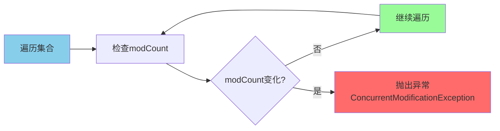

**ArrayList的fail-fast示例**:

```java
List<Integer> scores = new ArrayList<>();
CountDownLatch latch = new CountDownLatch(2);

for (int i = 1; i <= 5; i++) {
    scores.add(i * 10);
}
System.out.println("初始成绩列表: " + scores);

// 线程1: 遍历列表
Thread reader = new Thread(() -> {
    try {
        for (Integer score : scores) {
            System.out.println("读取线程看到成绩: " + score);
            Thread.sleep(100);
        }
    } catch (ConcurrentModificationException e) {
        System.err.println("!!! 检测到并发修改,快速失败!");
    } catch (InterruptedException e) {
        e.printStackTrace();
    } finally {
        latch.countDown();
    }
});

// 线程2: 修改列表
Thread writer = new Thread(() -> {
    try {
        Thread.sleep(50);
        System.out.println("-> 修改线程删除成绩20...");
        scores.remove(Integer.valueOf(20));
        System.out.println("-> 修改完成");
    } catch (InterruptedException e) {
        e.printStackTrace();
    } finally {
        latch.countDown();
    }
});

reader.start();
writer.start();
latch.await();

System.out.println("最终列表: " + scores);
```

**输出结果**:
```
初始成绩列表: [10, 20, 30, 40, 50]
读取线程看到成绩: 10
-> 修改线程删除成绩20...
-> 修改完成
!!! 检测到并发修改,快速失败!
最终列表: [10, 30, 40, 50]
```

**底层实现**:

```java
public E next() {
    // 检查并发修改
    checkForComodification();
    // 返回下一个元素
    return (E) elementData[lastRet = i];
}

final void checkForComodification() {
    // modCount与expectedModCount不一致则抛异常
    if (modCount != expectedModCount)
        throw new ConcurrentModificationException();
}
```

**fail-safe(安全失败)**:

设计思想: 即使发生错误也能继续运行,适合不稳定环境。

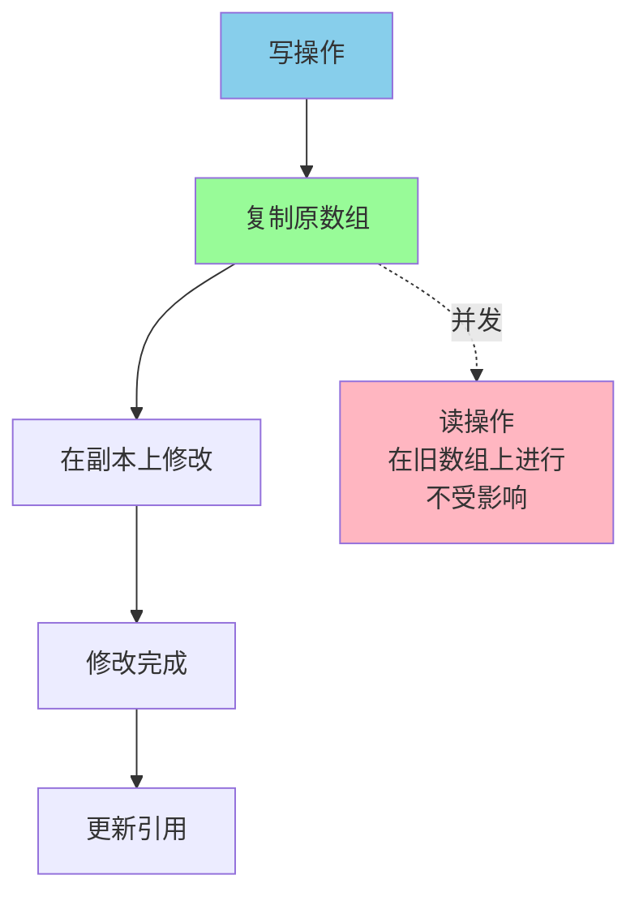

**CopyOnWriteArrayList示例**:

```java
public boolean add(E e) {
    final ReentrantLock lock = this.lock;
    lock.lock();
    try {
        // 获取原数组
        Object[] elements = getArray();
        int len = elements.length;
        // 复制数组
        Object[] newElements = Arrays.copyOf(elements, len + 1);
        // 在副本上添加
        newElements[len] = e;
        // 更新引用
        setArray(newElements);
        return true;
    } finally {
        lock.unlock();
    }
}
```

**优缺点对比**:

| 机制 | 优点 | 缺点 | 适用场景 |
|------|------|------|----------|
| fail-fast | 及时发现问题<br/>避免数据不一致 | 不支持并发 | 单线程环境 |
| fail-safe | 支持并发读写 | 内存开销大<br/>无法保证实时性 | 读多写少 |

## Set接口详解

### Set的底层实现

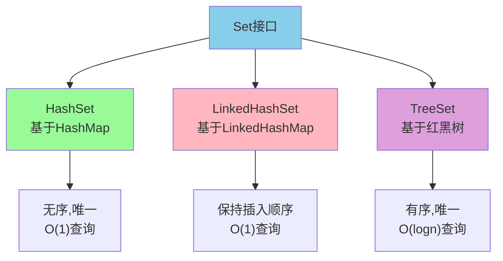

**底层结构说明**:
- **HashSet**: 基于HashMap,元素作为key存储,value为固定对象
- **LinkedHashSet**: HashSet的子类,通过链表维护插入顺序
- **TreeSet**: 基于红黑树,自动排序

### 无序性和不可重复性

**无序性**:
- 不是随机性
- 元素存储位置由哈希值决定
- 不按数组索引顺序存储

**不可重复性**:
- 通过equals()判断
- 需要同时重写equals()和hashCode()

**示例**:

```java
public class Student {
    private String name;
    private int age;
    
    // 构造方法
    public Student(String name, int age) {
        this.name = name;
        this.age = age;
    }
    
    // 重写equals
    @Override
    public boolean equals(Object o) {
        if (this == o) return true;
        if (o == null || getClass() != o.getClass()) return false;
        Student student = (Student) o;
        return age == student.age && Objects.equals(name, student.name);
    }
    
    // 重写hashCode
    @Override
    public int hashCode() {
        return Objects.hash(name, age);
    }
}

// 使用HashSet
Set<Student> students = new HashSet<>();
students.add(new Student("张三", 20));
students.add(new Student("张三", 20)); // 重复,不会添加
students.add(new Student("李四", 21));

System.out.println("学生人数: " + students.size()); // 输出: 2
```

### HashSet vs LinkedHashSet vs TreeSet

**全面对比**:

| 特性 | HashSet | LinkedHashSet | TreeSet |
|------|---------|---------------|----------|
| 底层结构 | HashMap | LinkedHashMap | 红黑树 |
| 有序性 | 无序 | 插入顺序 | 自然/定制排序 |
| 查询性能 | O(1) | O(1) | O(logn) |
| null值 | 允许一个 | 允许一个 | 不允许 |
| 线程安全 | 否 | 否 | 否 |
| 使用场景 | 快速去重 | 保持顺序去重 | 需要排序 |

**使用示例**:

```java
// HashSet - 无序
Set<String> hashSet = new HashSet<>();
hashSet.add("香蕉");
hashSet.add("苹果");
hashSet.add("橘子");
System.out.println(hashSet); // 输出顺序不确定

// LinkedHashSet - 保持插入顺序
Set<String> linkedSet = new LinkedHashSet<>();
linkedSet.add("香蕉");
linkedSet.add("苹果");
linkedSet.add("橘子");
System.out.println(linkedSet); // [香蕉, 苹果, 橘子]

// TreeSet - 自然排序
Set<String> treeSet = new TreeSet<>();
treeSet.add("香蕉");
treeSet.add("苹果");
treeSet.add("橘子");
System.out.println(treeSet); // [苹果, 橘子, 香蕉] (拼音排序)
```

### Comparable vs Comparator

两个接口都用于对象排序,但使用方式不同:

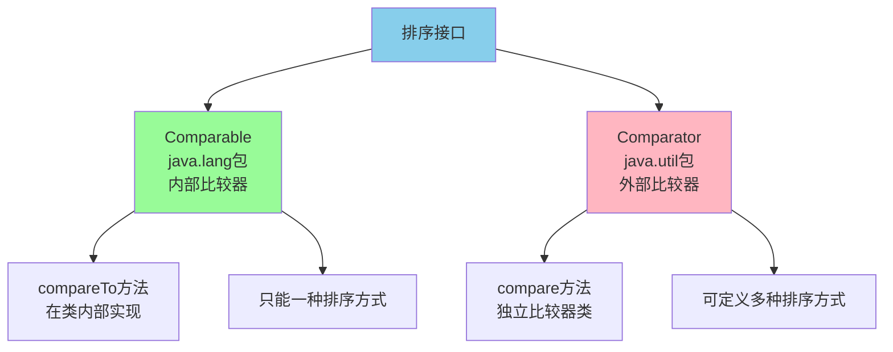

**Comparable接口 - 内部排序**:

```java
// 商品类实现Comparable接口
public class Product implements Comparable<Product> {
    private String name;
    private double price;
    
    public Product(String name, double price) {
        this.name = name;
        this.price = price;
    }
    
    // 实现compareTo方法 - 按价格排序
    @Override
    public int compareTo(Product other) {
        return Double.compare(this.price, other.price);
    }
    
    @Override
    public String toString() {
        return name + ": ¥" + price;
    }
}

// 使用TreeSet自动排序
TreeSet<Product> products = new TreeSet<>();
products.add(new Product("键盘", 299.0));
products.add(new Product("鼠标", 89.0));
products.add(new Product("显示器", 1299.0));

System.out.println("按价格排序:");
for (Product p : products) {
    System.out.println(p);
}
// 输出:
// 鼠标: ¥89.0
// 键盘: ¥299.0
// 显示器: ¥1299.0
```

**Comparator接口 - 外部排序**:

```java
// 定义多个比较器
ArrayList<Integer> nums = new ArrayList<>();
nums.add(50);
nums.add(30);
nums.add(80);
nums.add(10);
nums.add(60);

System.out.println("原始数据: " + nums);

// 自然排序(升序)
Collections.sort(nums);
System.out.println("升序排序: " + nums);

// 定制排序(降序)
Collections.sort(nums, new Comparator<Integer>() {
    @Override
    public int compare(Integer o1, Integer o2) {
        return o2.compareTo(o1);
    }
});
System.out.println("降序排序: " + nums);

// Lambda表达式简化
Collections.sort(nums, (o1, o2) -> o1.compareTo(o2));
System.out.println("升序排序: " + nums);
```

**选择建议**:
- 使用Comparable: 当类有一个默认的自然排序
- 使用Comparator: 需要多种排序方式或不能修改类源码

## Queue接口详解

### Queue vs Deque

**Queue(单端队列)**:


遵循FIFO(先进先出)规则:

| 操作 | 抛出异常 | 返回特殊值 |
|------|----------|------------|
| 插入队尾 | add(e) | offer(e) |
| 删除队首 | remove() | poll() |
| 查询队首 | element() | peek() |

**Deque(双端队列)**:

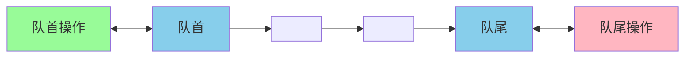

两端都可以插入和删除:

| 操作 | 抛出异常 | 返回特殊值 |
|------|----------|------------|
| 插入队首 | addFirst(e) | offerFirst(e) |
| 插入队尾 | addLast(e) | offerLast(e) |
| 删除队首 | removeFirst() | pollFirst() |
| 删除队尾 | removeLast() | pollLast() |
| 查询队首 | getFirst() | peekFirst() |
| 查询队尾 | getLast() | peekLast() |

**Deque可模拟栈**:

```java
Deque<String> stack = new ArrayDeque<>();
stack.push("第一层");
stack.push("第二层");
stack.push("第三层");

System.out.println(stack.pop()); // 第三层
System.out.println(stack.pop()); // 第二层
```

### ArrayDeque vs LinkedList

| 特性 | ArrayDeque | LinkedList |
|------|-----------|------------|
| 底层结构 | 可变长数组+双指针 | 双向链表 |
| null值 | 不支持 | 支持 |
| 引入版本 | JDK 1.6 | JDK 1.2 |
| 扩容 | 需要扩容 | 不需要 |
| 内存分配 | 连续内存 | 每次申请堆空间 |
| 性能 | 更快 | 较慢 |

**推荐**: 优先使用ArrayDeque实现队列和栈,性能更好。

### PriorityQueue优先队列

PriorityQueue是一个基于优先级堆的队列:

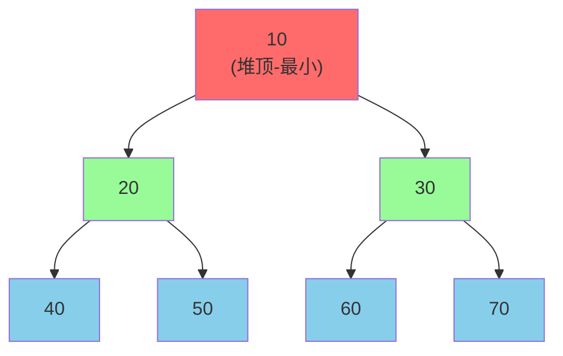

**特点**:
- 基于二叉堆实现
- 默认小顶堆(最小值优先)
- 插入/删除: O(logn)
- 非线程安全
- 不支持null和non-comparable对象

**使用示例**:

```java
// 默认小顶堆
PriorityQueue<Integer> minHeap = new PriorityQueue<>();
minHeap.offer(50);
minHeap.offer(20);
minHeap.offer(80);
minHeap.offer(10);

System.out.println("小顶堆依次取出:");
while (!minHeap.isEmpty()) {
    System.out.println(minHeap.poll()); // 10, 20, 50, 80
}

// 大顶堆(通过Comparator)
PriorityQueue<Integer> maxHeap = new PriorityQueue<>((a, b) -> b - a);
maxHeap.offer(50);
maxHeap.offer(20);
maxHeap.offer(80);
maxHeap.offer(10);

System.out.println("大顶堆依次取出:");
while (!maxHeap.isEmpty()) {
    System.out.println(maxHeap.poll()); // 80, 50, 20, 10
}
```

### BlockingQueue阻塞队列

BlockingQueue继承自Queue,支持阻塞操作:

```mermaid
graph TB
    A["BlockingQueue"]
    B["ArrayBlockingQueue<br/>数组+有界"]
    C["LinkedBlockingQueue<br/>链表+可选有界"]
    D["PriorityBlockingQueue<br/>优先级+无界"]
    E["SynchronousQueue<br/>不存储元素"]
    F["DelayQueue<br/>延迟队列"]
    
    A --> B
    A --> C
    A --> D
    A --> E
    A --> F
    
    style A fill:#87CEEB
    style B fill:#98FB98
    style C fill:#FFB6C1
    style D fill:#DDA0DD
    style E fill:#F0E68C
    style F fill:#FFA07A
```

**主要特性**:
- 队列空时,获取操作阻塞
- 队列满时,插入操作阻塞
- 用于生产者-消费者模型

**ArrayBlockingQueue vs LinkedBlockingQueue**:

| 特性 | ArrayBlockingQueue | LinkedBlockingQueue |
|------|-------------------|---------------------|
| 底层实现 | 数组 | 链表 |
| 是否有界 | 必须指定容量 | 可选(默认无界) |
| 锁机制 | 单锁(生产消费共用) | 双锁(读写分离) |
| 内存占用 | 预分配 | 动态分配 |
| 性能 | 锁竞争大 | 锁竞争小 |

## Map接口详解

### Map的底层实现

```mermaid
graph TB
    A["Map接口"]
    B["HashMap<br/>数组+链表/红黑树"]
    C["LinkedHashMap<br/>HashMap+双向链表"]
    D["TreeMap<br/>红黑树"]
    E["Hashtable<br/>数组+链表<br/>线程安全"]
    
    B1["无序,O(1)"]
    C1["插入顺序,O(1)"]
    D1["排序,O(logn)"]
    E1["线程安全,过时"]
    
    A --> B
    A --> C
    A --> D
    A --> E
    
    B --> B1
    C --> C1
    D --> D1
    E --> E1
    
    style A fill:#87CEEB
    style B fill:#98FB98
    style C fill:#FFB6C1
    style D fill:#DDA0DD
    style E fill:#F0E68C
```

**底层结构说明**:

- **HashMap**: 
  - JDK 1.7: 数组+链表
  - JDK 1.8+: 数组+链表+红黑树(链表长度>8且数组长度≥64时转换)
  
- **LinkedHashMap**: 继承HashMap,增加双向链表维护顺序

- **TreeMap**: 红黑树实现,key自动排序

- **Hashtable**: 类似HashMap但线程安全,已过时

## 集合的遍历方式

### Collection的遍历方式

```mermaid
graph TD
    A["Collection遍历方式"]
    B["传统for循环"]
    C["Iterator迭代器"]
    D["foreach循环"]
    E["Stream API"]
    
    B1["基于索引<br/>仅List支持"]
    C1["通用方式<br/>所有集合"]
    D1["语法糖<br/>底层用Iterator"]
    E1["函数式编程<br/>JDK 1.8+"]
    
    A --> B
    A --> C
    A --> D
    A --> E
    
    B --> B1
    C --> C1
    D --> D1
    E --> E1
    
    style A fill:#87CEEB
    style B fill:#98FB98
    style C fill:#FFB6C1
    style D fill:#DDA0DD
    style E fill:#F0E68C
```

**示例代码**:

```java
List<String> courses = Arrays.asList("Java", "Python", "Go", "C++");

// 1. 传统for循环
for (int i = 0; i < courses.size(); i++) {
    System.out.println(courses.get(i));
}

// 2. Iterator迭代器
Iterator<String> iterator = courses.iterator();
while (iterator.hasNext()) {
    System.out.println(iterator.next());
}

// 3. foreach循环
for (String course : courses) {
    System.out.println(course);
}

// 4. Stream API
courses.stream().forEach(System.out::println);
```

### Iterable vs Iterator

```mermaid
graph LR
    A["Iterable接口<br/>是否可迭代"] --> B["iterator()方法"]
    B --> C["返回Iterator<br/>如何迭代"]
    C --> D["hasNext()"]
    C --> E["next()"]
    C --> F["remove()"]
    
    style A fill:#87CEEB
    style C fill:#FFB6C1
```

**职责分离**:
- **Iterable**: 表示集合可迭代
- **Iterator**: 定义迭代的具体方式

**实现示例**:

```java
class MyList<E> implements Iterable<E> {
    private Object[] elements;
    private int size;
    
    // 实现Iterable接口
    public Iterator<E> iterator() {
        return new MyIterator();
    }
    
    // 内部Iterator实现类
    private class MyIterator implements Iterator<E> {
        private int cursor = 0;
        
        public boolean hasNext() {
            return cursor < size;
        }
        
        public E next() {
            return (E) elements[cursor++];
        }
    }
}
```

## 集合选择指南

### 根据特性选择

```mermaid
graph TD
    A["选择集合"]
    B{"存储方式?"}
    C["单一元素"]
    D["键值对"]
    
    E{"是否需要排序?"}
    F{"是否允许重复?"}
    G{"是否需要排序?"}
    
    H["TreeMap"]
    I["LinkedHashMap"]
    J["HashMap"]
    
    K["允许重复"]
    L["不允许重复"]
    
    M{"是否需要排序?"}
    N{"是否需要排序?"}
    
    O["TreeSet"]
    P["LinkedHashSet"]
    Q["HashSet"]
    
    R["ArrayList"]
    S["LinkedList"]
    
    A --> B
    B --> C
    B --> D
    
    D --> E
    E -- 是 --> H
    E -- 保持插入顺序 --> I
    E -- 否 --> J
    
    C --> F
    F --> K
    F --> L
    
    K --> M
    M -- 是 --> R
    M -- 否 --> S
    
    L --> N
    N -- 是 --> O
    N -- 保持插入顺序 --> P
    N -- 否 --> Q
    
    style A fill:#87CEEB
    style H fill:#98FB98
    style J fill:#FFB6C1
    style Q fill:#DDA0DD
    style R fill:#F0E68C
```

### 使用建议总结

**List选择**:
- 默认选择: **ArrayList**
- 频繁增删: **ArrayList**(不是LinkedList!)
- 线程安全: **CopyOnWriteArrayList**

**Set选择**:
- 快速去重: **HashSet**
- 保持顺序: **LinkedHashSet**  
- 自动排序: **TreeSet**

**Queue选择**:
- 普通队列: **ArrayDeque**
- 优先队列: **PriorityQueue**
- 阻塞队列: **ArrayBlockingQueue**

**Map选择**:
- 默认选择: **HashMap**
- 保持顺序: **LinkedHashMap**
- 自动排序: **TreeMap**
- 线程安全: **ConcurrentHashMap**

## Collection vs Collections

### 本质区别

```mermaid
graph LR
    A["Collection<br/>接口"] --> B["定义集合规范"]
    B --> C["List/Set/Queue"]
    
    D["Collections<br/>工具类"] --> E["提供静态方法"]
    E --> F["排序/查找/同步"]
    
    style A fill:#87CEEB
    style D fill:#FFB6C1
```

**Collection**:
- 集合框架的根接口
- 定义通用的集合操作
- 有众多实现类

**Collections**:
- 工具类,不能实例化
- 提供静态方法操作集合
- 类似Arrays之于数组

### Collections常用方法

```java
List<Integer> nums = new ArrayList<>(Arrays.asList(5, 2, 8, 1, 9));

// 排序
Collections.sort(nums);
System.out.println(nums); // [1, 2, 5, 8, 9]

// 反转
Collections.reverse(nums);
System.out.println(nums); // [9, 8, 5, 2, 1]

// 打乱
Collections.shuffle(nums);
System.out.println(nums); // 随机顺序

// 最大值/最小值
int max = Collections.max(nums);
int min = Collections.min(nums);

// 线程安全包装
List<Integer> syncList = Collections.synchronizedList(nums);
Set<String> syncSet = Collections.synchronizedSet(new HashSet<>());
Map<String, String> syncMap = Collections.synchronizedMap(new HashMap<>());

// 不可变集合
List<String> immutableList = Collections.unmodifiableList(nums);
```

## 总结

### 核心知识点回顾

1. **集合框架结构**: Collection和Map两大体系
2. **List实现类**: ArrayList(数组)和LinkedList(链表)
3. **Set实现类**: HashSet、LinkedHashSet、TreeSet
4. **Queue实现类**: PriorityQueue、ArrayDeque、BlockingQueue
5. **Map实现类**: HashMap、LinkedHashMap、TreeMap
6. **并发安全**: fail-fast和fail-safe机制
7. **排序接口**: Comparable和Comparator
8. **遍历方式**: for、Iterator、foreach、Stream

### 面试重点

```mermaid
graph TB
    A["集合面试重点"]
    B["ArrayList扩容机制"]
    C["HashMap原理"]
    D["ConcurrentHashMap"]
    E["fail-fast机制"]
    F["ArrayList vs LinkedList"]
    
    A --> B
    A --> C
    A --> D
    A --> E
    A --> F
    
    style A fill:#87CEEB
    style B fill:#FF6B6B
    style C fill:#FF6B6B
    style D fill:#FF6B6B
    style E fill:#98FB98
    style F fill:#98FB98
```

掌握这些知识点,就能应对大部分Java集合相关的面试问题了!