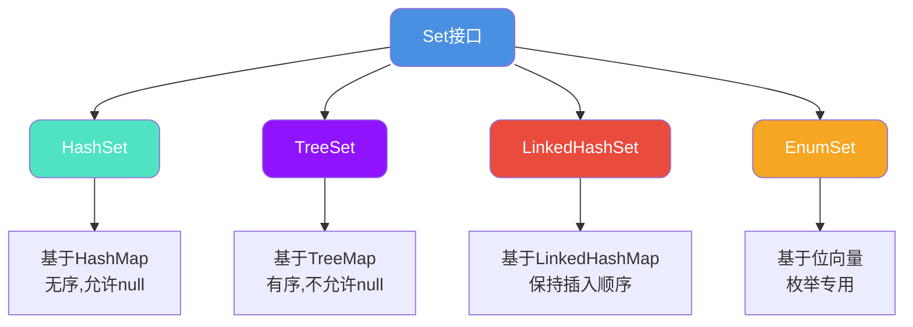
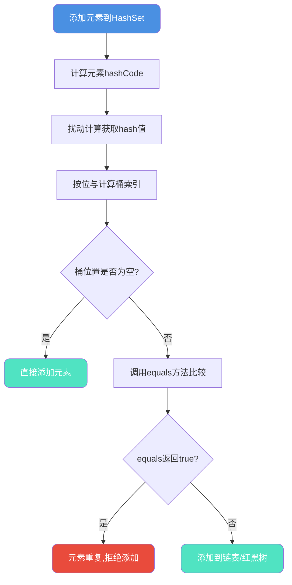
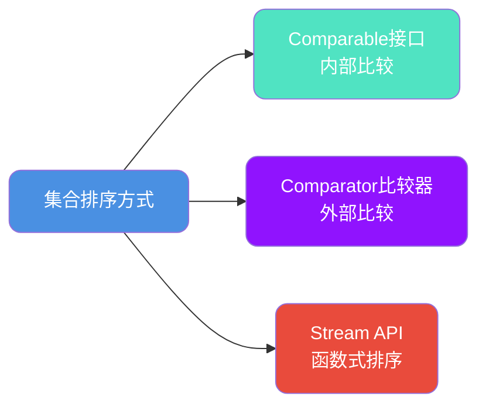
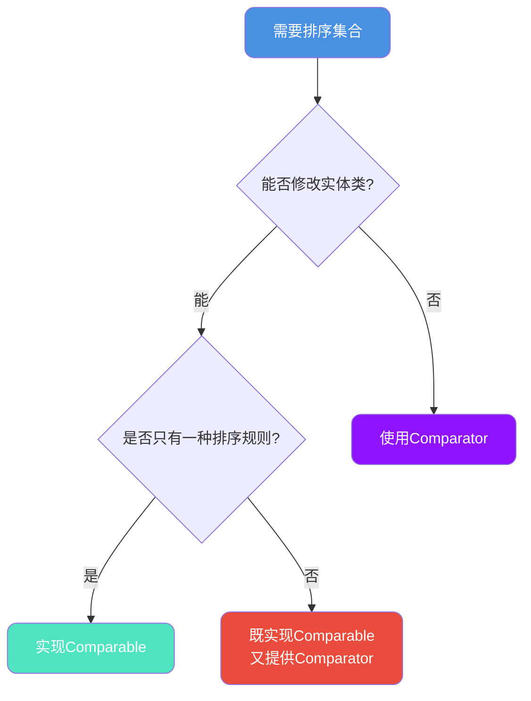

## Set集合去重原理

Set作为Java集合框架中的重要接口,其核心特性是**元素唯一性**。理解Set如何保证元素不重复,对于正确使用Set至关重要。

### Set体系结构



## HashSet去重机制

### 底层实现原理

HashSet内部通过HashMap实现,所有元素存储为HashMap的key,value统一使用PRESENT占位对象:

```java
public class HashSet<E> extends AbstractSet<E> {
    // 内部使用HashMap存储
    private transient HashMap<E,Object> map;
    
    // 所有value使用同一个PRESENT对象
    private static final Object PRESENT = new Object();
    
    public HashSet() {
        map = new HashMap<>();
    }
    
    public boolean add(E e) {
        // 将元素作为key存入HashMap
        return map.put(e, PRESENT) == null;
    }
    
    public boolean contains(Object o) {
        return map.containsKey(o);
    }
}
```

### 去重核心流程



### 实战示例:用户去重

```java
public class UserDeduplication {
    public static void main(String[] args) {
        Set<User> userSet = new HashSet<>();
        
        // 添加用户信息
        userSet.add(new User("10001", "张三", 25));
        userSet.add(new User("10002", "李四", 28));
        userSet.add(new User("10001", "张三", 25));  // 重复,不会添加
        userSet.add(new User("10003", "王五", 30));
        
        System.out.println("去重后用户数: " + userSet.size());  // 3
        
        userSet.forEach(user -> 
            System.out.println(user.getUserId() + ": " + user.getName())
        );
    }
    
    static class User {
        private String userId;
        private String name;
        private int age;
        
        public User(String userId, String name, int age) {
            this.userId = userId;
            this.name = name;
            this.age = age;
        }
        
        @Override
        public int hashCode() {
            // 基于userId计算hash
            return Objects.hash(userId);
        }
        
        @Override
        public boolean equals(Object obj) {
            if (this == obj) return true;
            if (!(obj instanceof User)) return false;
            User other = (User) obj;
            return Objects.equals(userId, other.userId);
        }
        
        // getter方法省略...
    }
}
```

**输出结果:**
```
去重后用户数: 3
10001: 张三
10002: 李四
10003: 王五
```

## TreeSet去重与排序

### 红黑树存储结构

TreeSet基于TreeMap实现,内部使用红黑树存储数据,自动排序:

```java
public class TreeSet<E> extends AbstractSet<E> {
    private transient NavigableMap<E,Object> m;
    
    private static final Object PRESENT = new Object();
    
    public TreeSet() {
        this(new TreeMap<>());
    }
    
    public boolean add(E e) {
        return m.put(e, PRESENT) == null;
    }
}
```

### 比较器排序机制

TreeSet通过`compareTo()`或`Comparator`判断元素是否重复:

```java
public class ProductRanking {
    public static void main(String[] args) {
        // 使用自然排序(需要实现Comparable)
        Set<Product> naturalOrder = new TreeSet<>();
        naturalOrder.add(new Product("P001", "笔记本电脑", 5999.0));
        naturalOrder.add(new Product("P002", "智能手机", 3299.0));
        naturalOrder.add(new Product("P003", "平板电脑", 2599.0));
        naturalOrder.add(new Product("P001", "笔记本电脑", 5999.0));  // 重复
        
        System.out.println("自然排序结果:");
        naturalOrder.forEach(p -> 
            System.out.println(p.getProductId() + ": " + p.getPrice())
        );
        
        // 使用自定义比较器
        Set<Product> priceOrder = new TreeSet<>(
            Comparator.comparingDouble(Product::getPrice).reversed()
        );
        priceOrder.addAll(naturalOrder);
        
        System.out.println("\n按价格降序:");
        priceOrder.forEach(p -> 
            System.out.println(p.getName() + ": " + p.getPrice())
        );
    }
    
    static class Product implements Comparable<Product> {
        private String productId;
        private String name;
        private double price;
        
        public Product(String productId, String name, double price) {
            this.productId = productId;
            this.name = name;
            this.price = price;
        }
        
        @Override
        public int compareTo(Product other) {
            // 基于productId排序和去重
            return this.productId.compareTo(other.productId);
        }
        
        // getter方法省略...
    }
}
```

**输出结果:**
```
自然排序结果:
P001: 5999.0
P002: 3299.0
P003: 2599.0

按价格降序:
笔记本电脑: 5999.0
智能手机: 3299.0
平板电脑: 2599.0
```

## LinkedHashSet有序去重

LinkedHashSet结合了HashSet的去重能力和LinkedHashMap的有序性:

```java
public class OrderPreservingDedup {
    public static void main(String[] args) {
        // 保持插入顺序的去重
        Set<String> accessLog = new LinkedHashSet<>();
        
        accessLog.add("/home");
        accessLog.add("/products");
        accessLog.add("/cart");
        accessLog.add("/home");      // 重复,不添加
        accessLog.add("/checkout");
        accessLog.add("/products");  // 重复,不添加
        
        System.out.println("用户访问路径(去重后):");
        accessLog.forEach(System.out::println);
    }
}
```

**输出结果:**
```
用户访问路径(去重后):
/home
/products
/cart
/checkout
```

### 内部结构对比

| 特性 | HashSet | TreeSet | LinkedHashSet |
|-----|---------|---------|---------------|
| 底层实现 | HashMap | TreeMap | LinkedHashMap |
| 是否有序 | 无序 | 自然排序/自定义排序 | 插入顺序 |
| 允许null | 是(仅1个) | 否 | 是(仅1个) |
| 性能 | O(1) | O(log n) | O(1) |
| 去重依据 | hashCode + equals | compareTo/Comparator | hashCode + equals |

## BitSet高效去重

### BitSet原理

BitSet使用位数组实现,每个bit位代表一个数字是否存在,极大节省空间:

```java
public class BitSetDemo {
    public static void main(String[] args) {
        // 场景:处理0-1000万之间的数字去重
        BitSet uniqueNumbers = new BitSet();
        
        // 添加数字
        int[] numbers = {10, 500, 10000, 500, 999999, 10};
        for (int num : numbers) {
            uniqueNumbers.set(num);  // 将对应位置为1
        }
        
        System.out.println("唯一数字数量: " + uniqueNumbers.cardinality());
        
        // 遍历所有存在的数字
        System.out.println("去重后的数字:");
        for (int i = uniqueNumbers.nextSetBit(0); i >= 0; 
             i = uniqueNumbers.nextSetBit(i + 1)) {
            System.out.println(i);
        }
    }
}
```

**输出结果:**
```
唯一数字数量: 4
去重后的数字:
10
500
10000
999999
```

### 空间效率对比

**场景**: 存储1亿个int范围内的随机数

| 实现方式 | 内存占用 | 说明 |
|---------|---------|------|
| `HashSet<Integer>` | ~16 GB | 4字节 × 2³² |
| BitSet | ~512 MB | 1bit × 2³² ÷ 8 |
| **节省比例** | **96.875%** | BitSet仅为HashSet的1/32 |

### BitSet适用场景

```java
public class BigDataDedup {
    
    // 场景1: 找出1-1亿中未出现的数字
    public static Set<Integer> findMissingNumbers(int[] data, int range) {
        BitSet existing = new BitSet(range);
        for (int num : data) {
            existing.set(num);
        }
        
        Set<Integer> missing = new HashSet<>();
        for (int i = 1; i <= range; i++) {
            if (!existing.get(i)) {
                missing.add(i);
            }
        }
        return missing;
    }
    
    // 场景2: 大量数字排序
    public static int[] sortNumbers(int[] data) {
        BitSet bitSet = new BitSet();
        for (int num : data) {
            bitSet.set(num);
        }
        
        int[] sorted = new int[bitSet.cardinality()];
        int index = 0;
        for (int i = bitSet.nextSetBit(0); i >= 0; 
             i = bitSet.nextSetBit(i + 1)) {
            sorted[index++] = i;
        }
        return sorted;
    }
}
```

**BitSet局限性:**
- 仅适用于整数类型
- 数值范围差距大时浪费空间(如存储[1, 10亿])
- 不能存储对象

## 集合排序技术详解

### 三大排序方式



## 方式一: Comparable自然排序

### 实现Comparable接口

```java
public class EmployeeSorting {
    public static void main(String[] args) {
        List<Employee> employees = new ArrayList<>();
        employees.add(new Employee("E003", "王五", 25, 8000));
        employees.add(new Employee("E001", "张三", 28, 12000));
        employees.add(new Employee("E002", "李四", 28, 10000));
        employees.add(new Employee("E004", "赵六", 30, 15000));
        
        // 使用自然排序
        Collections.sort(employees);
        
        System.out.println("排序后的员工列表:");
        employees.forEach(System.out::println);
    }
    
    static class Employee implements Comparable<Employee> {
        private String empId;
        private String name;
        private int age;
        private double salary;
        
        public Employee(String empId, String name, int age, double salary) {
            this.empId = empId;
            this.name = name;
            this.age = age;
            this.salary = salary;
        }
        
        @Override
        public int compareTo(Employee other) {
            // 先按年龄升序
            int ageCompare = Integer.compare(this.age, other.age);
            if (ageCompare != 0) {
                return ageCompare;
            }
            // 年龄相同则按薪资降序
            return Double.compare(other.salary, this.salary);
        }
        
        @Override
        public String toString() {
            return String.format("%s: %s, 年龄:%d, 薪资:%.2f", 
                empId, name, age, salary);
        }
    }
}
```

**输出结果:**
```
排序后的员工列表:
E003: 王五, 年龄:25, 薪资:8000.00
E001: 张三, 年龄:28, 薪资:12000.00
E002: 李四, 年龄:28, 薪资:10000.00
E004: 赵六, 年龄:30, 薪资:15000.00
```

## 方式二: Comparator外部比较器

### 匿名内部类方式

```java
public class ComparatorSorting {
    public static void main(String[] args) {
        List<Order> orders = new ArrayList<>();
        orders.add(new Order("O003", 299.9, "2024-01-15"));
        orders.add(new Order("O001", 599.0, "2024-01-10"));
        orders.add(new Order("O002", 299.9, "2024-01-12"));
        
        // 使用匿名Comparator
        Collections.sort(orders, new Comparator<Order>() {
            @Override
            public int compare(Order o1, Order o2) {
                // 先按金额降序
                int amountCompare = Double.compare(o2.getAmount(), o1.getAmount());
                if (amountCompare != 0) {
                    return amountCompare;
                }
                // 金额相同按日期升序
                return o1.getOrderDate().compareTo(o2.getOrderDate());
            }
        });
        
        orders.forEach(System.out::println);
    }
    
    static class Order {
        private String orderId;
        private double amount;
        private String orderDate;
        
        // 构造器和getter省略...
        
        @Override
        public String toString() {
            return String.format("%s: %.2f元, %s", orderId, amount, orderDate);
        }
    }
}
```

### Lambda表达式简化

```java
// 方式1: Lambda完整写法
Collections.sort(orders, (o1, o2) -> {
    int amountCompare = Double.compare(o2.getAmount(), o1.getAmount());
    if (amountCompare != 0) {
        return amountCompare;
    }
    return o1.getOrderDate().compareTo(o2.getOrderDate());
});

// 方式2: 链式Comparator(推荐)
Collections.sort(orders, 
    Comparator.comparingDouble(Order::getAmount).reversed()
              .thenComparing(Order::getOrderDate)
);

// 方式3: List.sort方法(Java 8+)
orders.sort(
    Comparator.comparingDouble(Order::getAmount).reversed()
              .thenComparing(Order::getOrderDate)
);
```

### Comparator常用方法

| 方法 | 说明 | 示例 |
|-----|------|------|
| comparing() | 提取比较键 | `Comparator.comparing(User::getName)` |
| comparingInt() | int类型比较 | `Comparator.comparingInt(User::getAge)` |
| comparingDouble() | double类型比较 | `Comparator.comparingDouble(Product::getPrice)` |
| reversed() | 反转排序 | `Comparator.comparing(User::getName).reversed()` |
| thenComparing() | 次级排序 | `comparing(User::getAge).thenComparing(User::getName)` |
| nullsFirst() | null值优先 | `Comparator.nullsFirst(naturalOrder())` |
| nullsLast() | null值靠后 | `Comparator.nullsLast(naturalOrder())` |

## 方式三: Stream API排序

### 基础Stream排序

```java
public class StreamSorting {
    public static void main(String[] args) {
        List<Product> products = Arrays.asList(
            new Product("P001", "键盘", 299.0),
            new Product("P002", "鼠标", 99.0),
            new Product("P003", "显示器", 1299.0),
            new Product("P004", "耳机", 199.0)
        );
        
        // Stream自然排序(需要实现Comparable)
        List<Product> sorted1 = products.stream()
                .sorted()
                .collect(Collectors.toList());
        
        // Stream使用Comparator
        List<Product> sorted2 = products.stream()
                .sorted(Comparator.comparingDouble(Product::getPrice))
                .collect(Collectors.toList());
        
        // 复杂排序:价格降序
        List<Product> sorted3 = products.stream()
                .sorted(Comparator.comparingDouble(Product::getPrice).reversed())
                .collect(Collectors.toList());
        
        System.out.println("按价格升序:");
        sorted2.forEach(p -> 
            System.out.println(p.getName() + ": " + p.getPrice())
        );
    }
    
    static class Product {
        private String productId;
        private String name;
        private double price;
        
        // 构造器和getter省略...
    }
}
```

### Stream高级排序场景

```java
public class AdvancedStreamSorting {
    
    // 场景1: 多字段排序
    public static List<Student> sortStudents(List<Student> students) {
        return students.stream()
                .sorted(Comparator.comparing(Student::getGrade).reversed()
                                  .thenComparing(Student::getName))
                .collect(Collectors.toList());
    }
    
    // 场景2: 自定义null处理
    public static List<Product> sortWithNulls(List<Product> products) {
        return products.stream()
                .sorted(Comparator.comparing(
                    Product::getCategory,
                    Comparator.nullsLast(String::compareTo)
                ))
                .collect(Collectors.toList());
    }
    
    // 场景3: 并行排序(大数据量)
    public static List<Order> parallelSort(List<Order> orders) {
        return orders.parallelStream()
                .sorted(Comparator.comparingDouble(Order::getAmount).reversed())
                .collect(Collectors.toList());
    }
}
```

## Comparable vs Comparator

### 使用场景对比

| 对比维度 | Comparable | Comparator |
|---------|-----------|------------|
| **定义位置** | 实体类内部 | 外部独立类 |
| **排序规则** | 固定唯一 | 可定义多种 |
| **修改成本** | 需要修改实体类 | 无需修改实体类 |
| **适用场景** | 自然排序、默认排序 | 多种排序规则 |
| **第三方类** | 无法使用 | 可以使用 |

### 选择决策



## compareTo与equals的区别

### 设计目的不同

- **compareTo**: 用于排序,判断大小关系
- **equals**: 用于判断相等性,业务语义上的等价

### 实战示例

```java
public class CompareVsEquals {
    public static void main(String[] args) {
        // BigDecimal的compareTo vs equals
        BigDecimal d1 = new BigDecimal("1.0");
        BigDecimal d2 = new BigDecimal("1.00");
        
        System.out.println("compareTo: " + (d1.compareTo(d2) == 0));  // true
        System.out.println("equals: " + d1.equals(d2));              // false
        
        // String的使用场景
        String s1 = "hello";
        String s2 = new String("hello");
        
        System.out.println("compareTo: " + (s1.compareTo(s2) == 0));  // true
        System.out.println("equals: " + s1.equals(s2));               // true
    }
}
```

**输出结果:**
```
compareTo: true
equals: false
compareTo: true
equals: true
```

## Set排序的特殊性

### SortedSet接口

虽然Set无序,但SortedSet提供了排序能力:

```java
public class SortedSetDemo {
    public static void main(String[] args) {
        // TreeSet自动排序
        SortedSet<Integer> scores = new TreeSet<>();
        scores.add(85);
        scores.add(92);
        scores.add(78);
        scores.add(95);
        scores.add(88);
        
        System.out.println("最低分: " + scores.first());
        System.out.println("最高分: " + scores.last());
        System.out.println("90分以下: " + scores.headSet(90));
        System.out.println("90分及以上: " + scores.tailSet(90));
    }
}
```

**输出结果:**
```
最低分: 78
最高分: 95
90分以下: [78, 85, 88]
90分及以上: [92, 95]
```

### LinkedHashSet保持插入顺序

```java
public class InsertionOrderSet {
    public static void main(String[] args) {
        Set<String> operations = new LinkedHashSet<>();
        operations.add("登录");
        operations.add("浏览商品");
        operations.add("添加购物车");
        operations.add("浏览商品");  // 重复,不添加
        operations.add("结算");
        
        System.out.println("用户操作流程:");
        operations.forEach(System.out::println);
    }
}
```

**输出结果:**
```
用户操作流程:
登录
浏览商品
添加购物车
结算
```

通过理解不同Set实现类的特性和排序机制,可以在实际开发中选择最合适的数据结构,实现高效的去重和排序功能。
