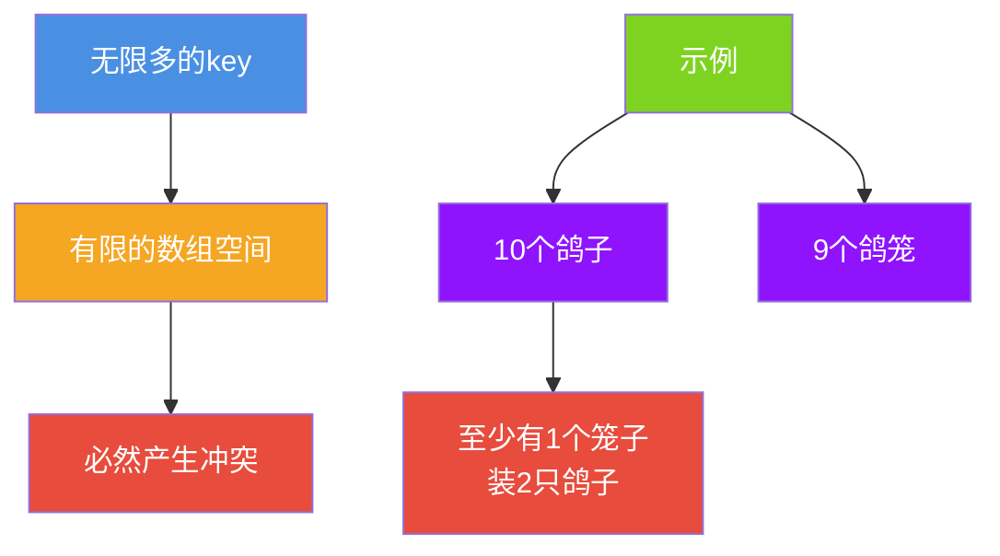
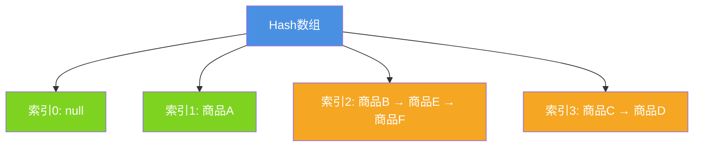
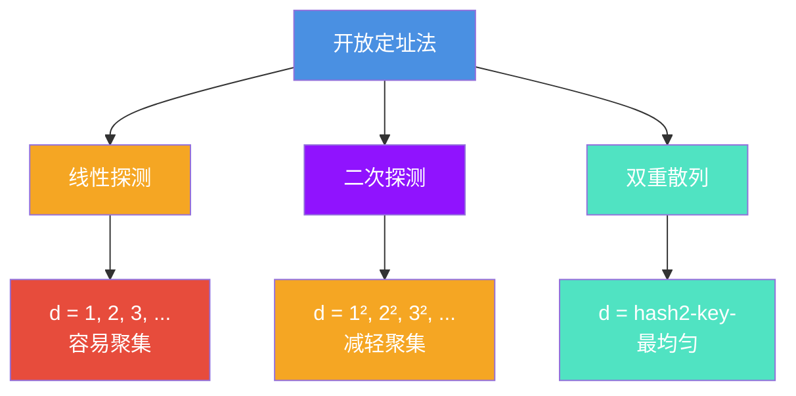
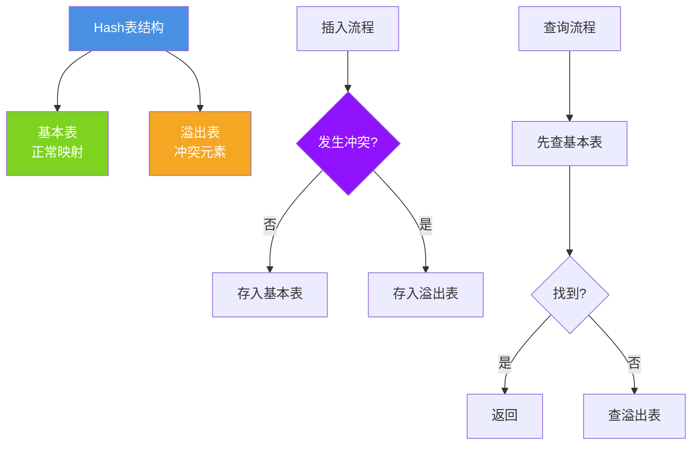
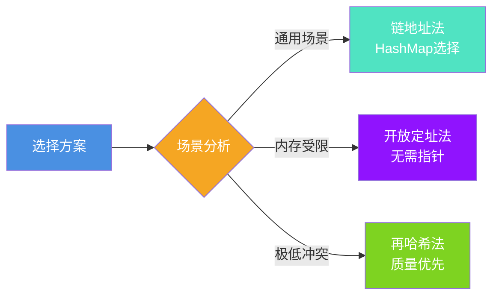
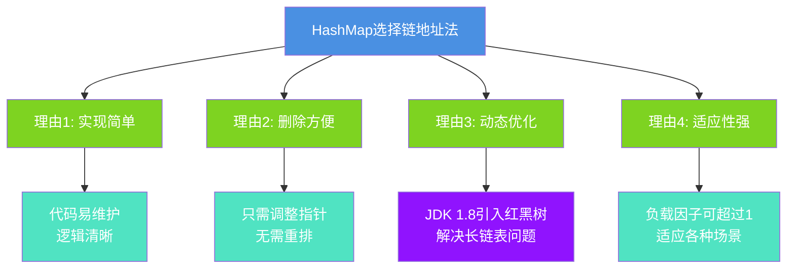

# Hash冲突原理与解决方案

## 引言

Hash冲突是哈希表不可避免的问题。不同的key经过hash计算后可能映射到同一个位置,这就是hash冲突。本文将全面解析hash冲突的本质、常见解决方案,以及HashMap的选择。

## Hash冲突的本质

### 鸽笼原理



### 冲突示例

```java
public class CollisionDemo {
    
    public static void main(String[] args) {
        // 示例1: 不同字符串hash相同
        String str1 = "Aa";
        String str2 = "BB";
        
        System.out.println("Aa hashCode: " + str1.hashCode());  // 2112
        System.out.println("BB hashCode: " + str2.hashCode());  // 2112
        
        // 示例2: 自定义冲突
        Map<CollidingKey, String> map = new HashMap<>();
        map.put(new CollidingKey("key1"), "value1");
        map.put(new CollidingKey("key2"), "value2");
        map.put(new CollidingKey("key3"), "value3");
        
        // 所有key的hash都是1,必然冲突
    }
    
    static class CollidingKey {
        private String value;
        
        CollidingKey(String value) {
            this.value = value;
        }
        
        @Override
        public int hashCode() {
            return 1;  // 故意返回相同hash
        }
        
        @Override
        public boolean equals(Object obj) {
            if (!(obj instanceof CollidingKey)) return false;
            return this.value.equals(((CollidingKey) obj).value);
        }
    }
}
```

## 主流解决方案

### 方案一: 链地址法 (Separate Chaining)

这是HashMap采用的方案,也是最常用的方法。

#### 基本原理



#### 实现示例

```java
public class ChainHashMap<K, V> {
    private static final int DEFAULT_CAPACITY = 16;
    private Node<K, V>[] table;
    private int size;
    
    static class Node<K, V> {
        K key;
        V value;
        Node<K, V> next;
        
        Node(K key, V value, Node<K, V> next) {
            this.key = key;
            this.value = value;
            this.next = next;
        }
    }
    
    @SuppressWarnings("unchecked")
    public ChainHashMap() {
        table = (Node<K, V>[]) new Node[DEFAULT_CAPACITY];
    }
    
    public void put(K key, V value) {
        int index = hash(key) % table.length;
        
        // 查找是否已存在
        Node<K, V> node = table[index];
        while (node != null) {
            if (node.key.equals(key)) {
                node.value = value;  // 更新
                return;
            }
            node = node.next;
        }
        
        // 头插法添加新节点
        Node<K, V> newNode = new Node<>(key, value, table[index]);
        table[index] = newNode;
        size++;
    }
    
    public V get(K key) {
        int index = hash(key) % table.length;
        Node<K, V> node = table[index];
        
        while (node != null) {
            if (node.key.equals(key)) {
                return node.value;
            }
            node = node.next;
        }
        
        return null;
    }
    
    private int hash(K key) {
        int h = key.hashCode();
        return h ^ (h >>> 16);
    }
}
```

#### 优缺点分析

**优点:**
1. 实现简单,逻辑清晰
2. 删除操作方便(只需调整指针)
3. 负载因子可以大于1
4. 对hash函数要求不严格

**缺点:**
1. 链表过长时查询性能差 (O(n))
2. 需要额外的指针空间
3. 缓存不友好(链表节点分散)

**HashMap的优化:**
JDK 1.8引入红黑树,当链表长度≥8时转为树,查询性能从O(n)提升到O(log n)。

### 方案二: 开放定址法 (Open Addressing)

当发生冲突时,寻找下一个空位置。

#### 线性探测

```java
public class LinearProbingMap<K, V> {
    private K[] keys;
    private V[] values;
    private int capacity;
    private int size;
    
    @SuppressWarnings("unchecked")
    public LinearProbingMap(int capacity) {
        this.capacity = capacity;
        keys = (K[]) new Object[capacity];
        values = (V[]) new Object[capacity];
    }
    
    public void put(K key, V value) {
        int index = hash(key) % capacity;
        
        // 线性探测找空位
        while (keys[index] != null) {
            if (keys[index].equals(key)) {
                values[index] = value;  // 更新
                return;
            }
            index = (index + 1) % capacity;  // 线性探测
        }
        
        keys[index] = key;
        values[index] = value;
        size++;
    }
    
    public V get(K key) {
        int index = hash(key) % capacity;
        
        while (keys[index] != null) {
            if (keys[index].equals(key)) {
                return values[index];
            }
            index = (index + 1) % capacity;
        }
        
        return null;
    }
    
    private int hash(K key) {
        return Math.abs(key.hashCode());
    }
}
```

#### 探测方式对比



**线性探测示例:**

```
初始数组: [null, null, null, null, null]

插入key1 (hash=2): [null, null, key1, null, null]
插入key2 (hash=2): [null, null, key1, key2, null]  ← 冲突,放在index 3
插入key3 (hash=2): [null, null, key1, key2, key3]  ← 冲突,放在index 4
```

**优缺点:**

**优点:**
1. 不需要额外指针空间
2. 缓存友好(数据连续)
3. 适合内存受限场景

**缺点:**
1. 容易产生聚集(Clustering)
2. 负载因子不能太高(通常 &lt; 0.7)
3. 删除操作复杂(需要标记删除)

### 方案三: 再哈希法 (Rehashing)

使用多个hash函数,依次尝试。

```java
public class RehashingMap<K, V> {
    private K[] keys;
    private V[] values;
    private int capacity;
    
    @SuppressWarnings("unchecked")
    public RehashingMap(int capacity) {
        this.capacity = capacity;
        keys = (K[]) new Object[capacity];
        values = (V[]) new Object[capacity];
    }
    
    public void put(K key, V value) {
        // 依次使用3个hash函数
        for (int i = 0; i < 3; i++) {
            int index = getHash(key, i);
            
            if (keys[index] == null || keys[index].equals(key)) {
                keys[index] = key;
                values[index] = value;
                return;
            }
        }
        
        throw new RuntimeException("Hash table is full!");
    }
    
    private int getHash(K key, int attempt) {
        switch (attempt) {
            case 0:
                return Math.abs(key.hashCode()) % capacity;
            case 1:
                return Math.abs(key.hashCode() * 31) % capacity;
            case 2:
                return Math.abs(key.toString().hashCode()) % capacity;
            default:
                return 0;
        }
    }
}
```

**优缺点:**

**优点:**
1. 冲突率低
2. 分布更均匀

**缺点:**
1. 需要设计多个优质hash函数
2. 计算开销大
3. 适用场景有限

### 方案四: 建立公共溢出区

将冲突元素存储在单独的溢出区。



**适用场景:**
- 冲突较少的情况
- 基本表快速访问,溢出表作为补充

## 方案对比总结

### 性能对比表

| 方案 | 查询复杂度 | 空间复杂度 | 负载因子限制 | 删除难度 |
|------|-----------|-----------|------------|---------|
| 链地址法 | O(n)或O(log n) | O(n+m) | 无 | 简单 |
| 线性探测 | O(1/(1-α)) | O(n) | &lt; 0.7 | 复杂 |
| 二次探测 | O(1/(1-α)) | O(n) | &lt; 0.7 | 复杂 |
| 双重散列 | O(1/(1-α)) | O(n) | &lt; 0.7 | 复杂 |
| 再哈希法 | O(k) | O(n) | 中等 | 复杂 |
| 公共溢出区 | O(1+α') | O(n+m) | 中等 | 中等 |

注: α为负载因子, k为hash函数数量, n为元素数, m为桶数

### 应用场景



## HashMap为何选择链地址法?

### 四大理由



### 红黑树优化

JDK 1.8的创新:

```java
// 链表长度≥8且容量≥64时,转为红黑树
if (binCount >= TREEIFY_THRESHOLD - 1) {
    treeifyBin(tab, hash);
}

// 红黑树节点≤6时,退化为链表
if (lc <= UNTREEIFY_THRESHOLD) {
    tab[index] = loHead.untreeify(map);
}
```

**效果:**
- 最坏情况从O(n)优化到O(log n)
- 即使发生严重冲突,性能仍可接受

## 实战案例

### 案例1: 商品搜索系统

```java
public class ProductSearchEngine {
    // 使用链地址法的HashMap
    private Map<String, List<Product>> categoryIndex = new HashMap<>();
    private Map<String, List<Product>> brandIndex = new HashMap<>();
    
    public void indexProduct(Product product) {
        // 按类目索引
        categoryIndex.computeIfAbsent(product.getCategory(), 
                                     k -> new ArrayList<>())
                    .add(product);
        
        // 按品牌索引
        brandIndex.computeIfAbsent(product.getBrand(), 
                                  k -> new ArrayList<>())
                 .add(product);
    }
    
    public List<Product> searchByCategory(String category) {
        return categoryIndex.getOrDefault(category, Collections.emptyList());
    }
    
    public List<Product> searchByBrand(String brand) {
        return brandIndex.getOrDefault(brand, Collections.emptyList());
    }
    
    static class Product {
        private String id;
        private String name;
        private String category;
        private String brand;
        
        public String getCategory() { return category; }
        public String getBrand() { return brand; }
    }
}
```

### 案例2: 请求去重系统

```java
public class RequestDeduplication {
    private Map<String, Long> requestMap = new HashMap<>();
    private static final long EXPIRE_TIME = 5000; // 5秒过期
    
    public boolean isDuplicate(String requestId) {
        Long lastTime = requestMap.get(requestId);
        long now = System.currentTimeMillis();
        
        if (lastTime != null && now - lastTime < EXPIRE_TIME) {
            return true;  // 重复请求
        }
        
        requestMap.put(requestId, now);
        return false;
    }
    
    // 定期清理过期数据
    public void cleanup() {
        long now = System.currentTimeMillis();
        requestMap.entrySet().removeIf(
            entry -> now - entry.getValue() > EXPIRE_TIME
        );
    }
}
```

## 总结

Hash冲突解决方案各有特点,HashMap选择链地址法并持续优化:

### 核心要点

1. **链地址法**: 最常用,HashMap的选择
2. **开放定址法**: 适合内存受限场景
3. **再哈希法**: 适合低冲突需求
4. **红黑树优化**: JDK 1.8的创新

### 选择建议

| 场景 | 推荐方案 |
|------|---------|
| Java开发 | HashMap (链地址法+红黑树) |
| 嵌入式/内存受限 | 开放定址法 |
| 高性能要求 | 链地址法+预分配容量 |
| 极低冲突率 | 再哈希法 |

理解冲突解决方案,是掌握HashMap的关键!
