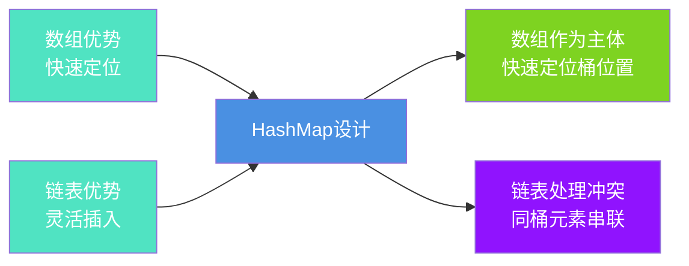
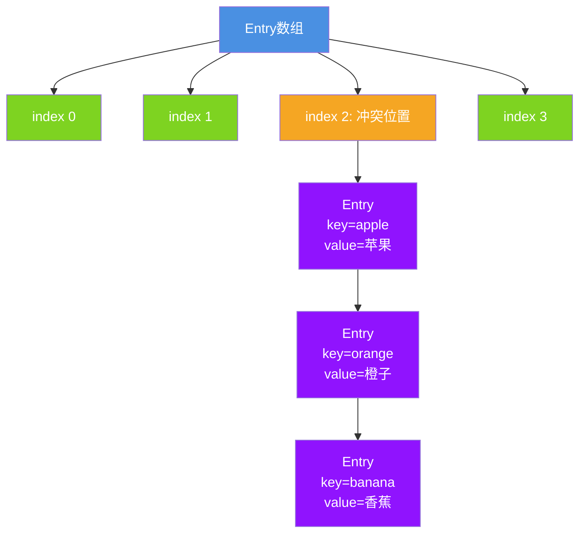
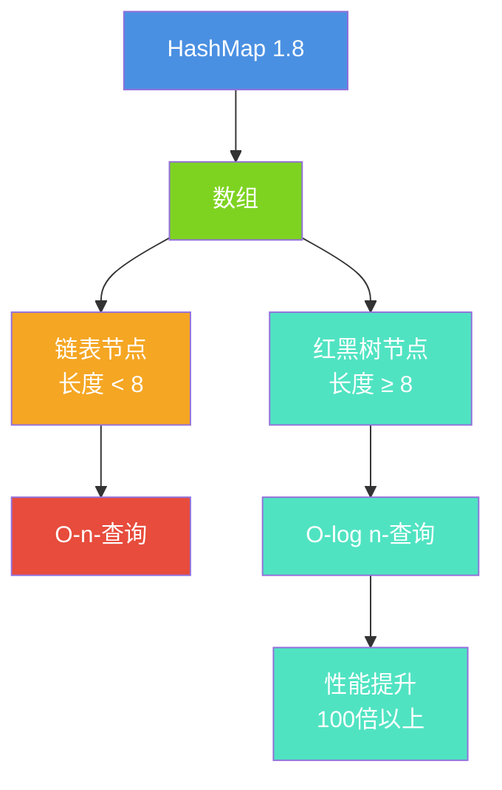
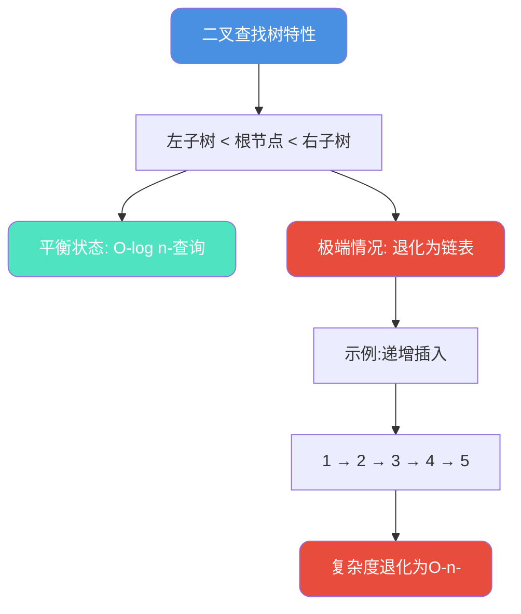
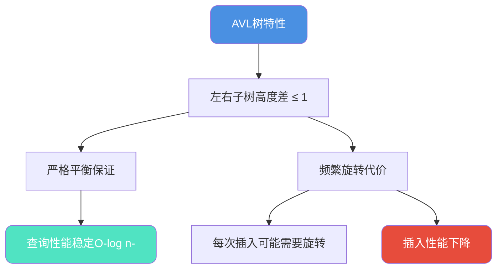
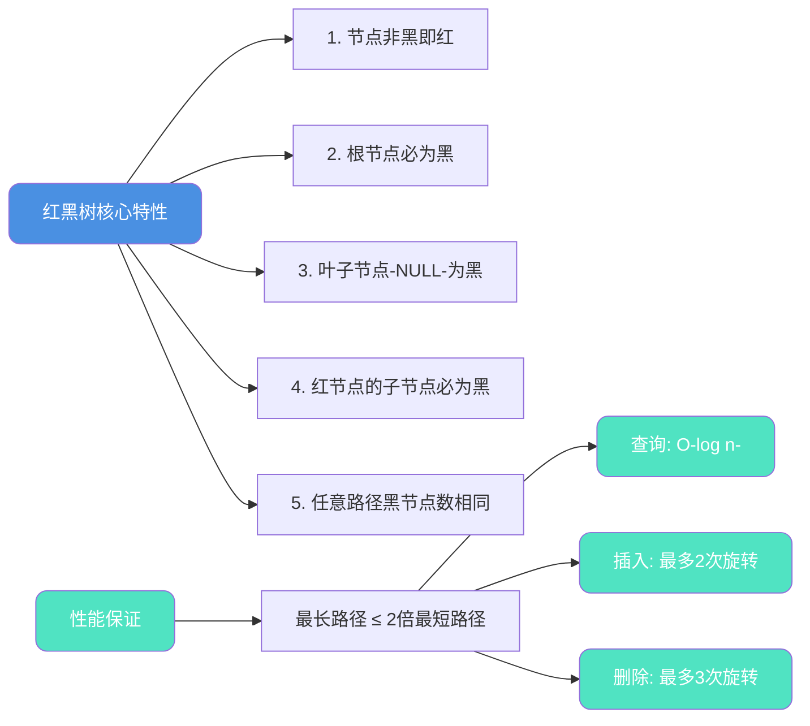
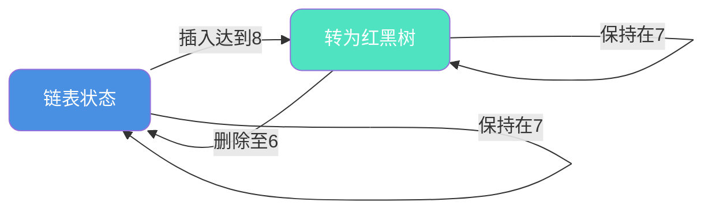
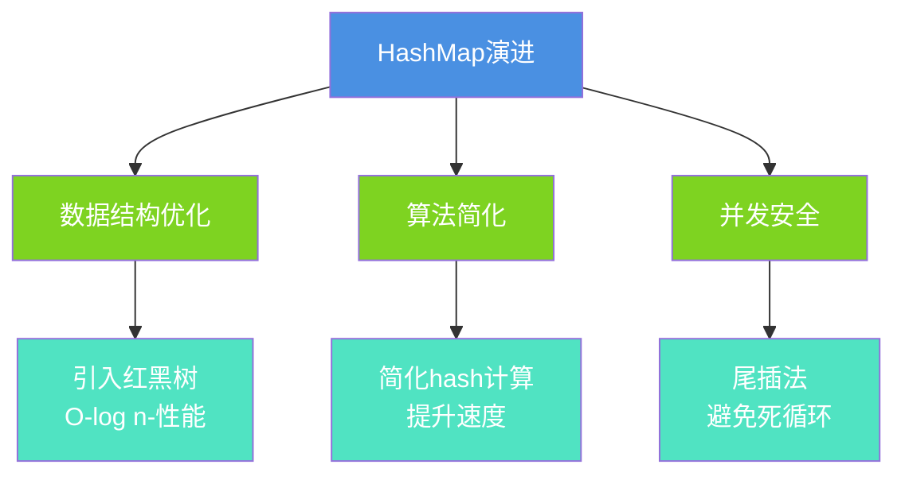

# HashMap核心原理与数据结构

## 引言

HashMap是Java中使用最广泛的集合类之一,深入理解其内部实现原理,对于编写高性能代码至关重要。本文将详细解析HashMap的核心原理、数据结构演进以及JDK版本间的重要变化。

## 基础数据结构分析

### 数组与链表的特性对比

在Java中,最基础的两种数据结构是数组和链表,它们各有优劣:

**数组的特性:**
- ✅ 优势: 通过索引可以O(1)时间直接访问元素
- ❌ 劣势: 插入和删除需要移动元素,时间复杂度O(n)

**链表的特性:**
- ✅ 优势: 插入和删除只需调整指针,时间复杂度O(1)
- ❌ 劣势: 查找需要遍历,时间复杂度O(n)

### HashMap的设计思想

HashMap巧妙地将数组和链表结合,发挥各自优势:



## JDK 1.7的实现方案

### 数组+链表结构

JDK 1.7采用经典的"拉链法"实现,结构相对简单:



### Entry节点结构

```java
// JDK 1.7的Entry节点
static class Entry<K,V> implements Map.Entry<K,V> {
    final K key;           // 键
    V value;              // 值
    Entry<K,V> next;      // 下一个节点
    int hash;             // hash值(可变)
    
    Entry(int h, K k, V v, Entry<K,V> n) {
        value = v;
        next = n;
        key = k;
        hash = h;
    }
}
```

### 存在的问题

1. **性能问题**: 链表过长时查询效率降低至O(n)
2. **并发问题**: 头插法在并发环境可能形成环形链表
3. **扩容开销**: 需要逐个节点重新计算hash

## JDK 1.8的重大革新

### 引入红黑树优化

JDK 1.8在链表基础上引入了红黑树,解决长链表性能问题:



### 树化阈值设计

```java
// HashMap中的常量定义
static final int TREEIFY_THRESHOLD = 8;      // 链表转树阈值
static final int UNTREEIFY_THRESHOLD = 6;    // 树退化为链表阈值
static final int MIN_TREEIFY_CAPACITY = 64;  // 最小树化容量

// 为什么是这些值?
// - 8: 根据泊松分布,链表长度达到8的概率极低
// - 6: 避免频繁树化和退化,保留缓冲区间
// - 64: 容量小时优先扩容,减少冲突
```

### Node节点升级

```java
// JDK 1.8的Node节点
static class Node<K,V> implements Map.Entry<K,V> {
    final int hash;        // hash值(不可变)
    final K key;          // 键(不可变)
    V value;              // 值
    Node<K,V> next;       // 下一个节点
    
    Node(int hash, K key, V value, Node<K,V> next) {
        this.hash = hash;
        this.key = key;
        this.value = value;
        this.next = next;
    }
}

// 红黑树节点
static final class TreeNode<K,V> extends LinkedHashMap.Entry<K,V> {
    TreeNode<K,V> parent;   // 父节点
    TreeNode<K,V> left;     // 左子节点
    TreeNode<K,V> right;    // 右子节点
    TreeNode<K,V> prev;     // 前驱(用于删除)
    boolean red;            // 颜色标记
}
```

## 红黑树转换机制深度剖析

### 为什么不继续使用链表

在JDK 8之前,HashMap通过拉链法解决哈希冲突,所有冲突的元素都串联在链表中。这种设计存在严重的性能隐患:

**链表的性能瓶颈**

当某个桶位发生大量哈希冲突时,链表会变得很长,查询效率急剧下降:

```java
// 模拟链表性能退化场景
public class ChainPerformanceIssue {
    public static void main(String[] args) {
        Map<MaliciousKey, String> cache = new HashMap<>();
        
        // 恶意构造大量冲突的key
        for (int i = 0; i < 10000; i++) {
            cache.put(new MaliciousKey("user-" + i), "data-" + i);
        }
        
        // 查询性能测试
        long start = System.nanoTime();
        cache.get(new MaliciousKey("user-9999"));  // 最坏情况:遍历整条链表
        long duration = System.nanoTime() - start;
        
        System.out.println("查询耗时: " + duration + "ns");
        // 在JDK 7中,这需要遍历10000个节点,时间复杂度O(n)
    }
    
    // 故意设计hashCode冲突的key
    static class MaliciousKey {
        private String value;
        
        MaliciousKey(String value) {
            this.value = value;
        }
        
        @Override
        public int hashCode() {
            return 42;  // 所有key返回相同hash,强制冲突
        }
        
        @Override
        public boolean equals(Object obj) {
            if (!(obj instanceof MaliciousKey)) return false;
            return this.value.equals(((MaliciousKey) obj).value);
        }
    }
}
```

**扰动函数的局限性**

JDK 1.7虽然通过复杂的扰动函数来分散hash值,但无法从根本上解决极端冲突场景:

```java
// JDK 1.7的扰动函数
final int hash(Object k) {
    int h = hashSeed;
    h ^= k.hashCode();
    h ^= (h >>> 20) ^ (h >>> 12);
    return h ^ (h >>> 7) ^ (h >>> 4);
    // 即使经过多次扰动,仍然可能遇到大量冲突
}
```

当遭遇哈希碰撞攻击或数据分布不均时,链表过长的问题不可避免,必须从数据结构层面优化。

### 为什么选择红黑树而非其他树

#### 候选方案对比

**方案1: 二叉查找树(BST)**

最直观的想法是用BST替换链表:



二叉查找树在极端情况下会退化为链表,无法保证稳定性能:

```java
// BST退化示例:订单ID递增场景
public class BSTDegradation {
    public static void main(String[] args) {
        TreeMap<Integer, Order> orderMap = new TreeMap<>();
        
        // 按顺序插入订单ID
        for (int i = 1; i <= 1000; i++) {
            orderMap.put(i, new Order("order-" + i));
        }
        
        // 如果是普通BST,树结构会变成:
        //     1
        //      \
        //       2
        //        \
        //         3
        //          \
        //          ...
        // 查询最后一个元素需要遍历整棵树
    }
    
    static class Order {
        String orderId;
        Order(String orderId) { this.orderId = orderId; }
    }
}
```

**方案2: AVL树(严格平衡二叉树)**

AVL树通过严格的平衡条件解决BST退化问题:



AVL树的问题在于对平衡的要求过于严格:

```java
// AVL树的旋转开销示例
public class AVLRotationCost {
    // 插入新节点后,可能触发多次旋转
    public void insert(int value) {
        root = insertNode(root, value);
    }
    
    private AVLNode insertNode(AVLNode node, int value) {
        // ... 标准插入逻辑 ...
        
        // 更新节点高度
        updateHeight(node);
        
        // 检查平衡因子,可能需要旋转
        int balance = getBalance(node);
        
        // 左左情况:右旋
        if (balance > 1 && value < node.left.value)
            return rightRotate(node);
        
        // 右右情况:左旋
        if (balance < -1 && value > node.right.value)
            return leftRotate(node);
        
        // 左右情况:先左旋后右旋
        if (balance > 1 && value > node.left.value) {
            node.left = leftRotate(node.left);
            return rightRotate(node);
        }
        
        // 右左情况:先右旋后左旋
        if (balance < -1 && value < node.right.value) {
            node.right = rightRotate(node.right);
            return leftRotate(node);
        }
        
        return node;
        // 频繁的插入删除会导致大量旋转操作
    }
}
```

**方案3: 红黑树(最佳平衡点)**

红黑树通过放松平衡条件,在查询和插入之间取得最佳平衡:



**综合对比表**

| 数据结构 | 查询复杂度 | 插入复杂度 | 旋转次数 | 适用场景 |
|---------|----------|----------|---------|--------|
| 链表 | O(n) | O(1) | 无需旋转 | 冲突少 |
| BST | O(n) 最坏 | O(log n) | 无需旋转 | 数据随机 |
| AVL树 | O(log n) | O(log n) | 插入≤2,删除≤2 | 查询密集 |
| 红黑树 | O(log n) | O(log n) | 插入≤2,删除≤3 | 读写均衡 |

红黑树是HashMap的最优选择,原因如下:

1. **稳定的查询性能**: 保证O(log n),解决链表退化问题
2. **高效的插入删除**: 旋转次数有限,不会像AVL那样频繁调整
3. **内存开销可控**: 只需额外存储颜色标记(1 bit)
4. **工业级验证**: Linux内核、Java TreeMap等广泛采用

### 链表转红黑树的时机选择

#### 为什么不在冲突时立即转换

HashMap没有在首次冲突就转换为红黑树,原因有二:

**1. 空间维度考量**

红黑树节点的内存占用是普通Node的2倍:

```java
// 普通链表节点
static class Node<K,V> {
    final int hash;      // 4字节
    final K key;         // 引用 8字节(64位系统)
    V value;             // 引用 8字节
    Node<K,V> next;      // 引用 8字节
    // 对象头 12字节 + 对齐填充
    // 总计: 约40字节
}

// 红黑树节点
static final class TreeNode<K,V> extends LinkedHashMap.Entry<K,V> {
    TreeNode<K,V> parent;   // 8字节
    TreeNode<K,V> left;     // 8字节
    TreeNode<K,V> right;    // 8字节
    TreeNode<K,V> prev;     // 8字节(双向链表)
    boolean red;            // 1字节 + 填充
    // 继承Node的字段
    // 总计: 约80字节
}
```

如果冲突少时就转换,会造成严重的内存浪费:

```java
// 示例:少量冲突时的空间浪费
public class TreeMemoryWaste {
    public static void main(String[] args) {
        Map<String, String> sessionMap = new HashMap<>();
        
        // 假设只有3个session ID冲突
        sessionMap.put("session-a", "user1");
        sessionMap.put("session-b", "user2");  // 冲突
        sessionMap.put("session-c", "user3");  // 冲突
        
        // 如果立即转红黑树:
        // - 链表: 3 * 40 = 120字节
        // - 红黑树: 3 * 80 = 240字节
        // 浪费了100%的空间,但性能提升微乎其微
    }
}
```

**2. 时间维度考量**

红黑树的插入需要旋转和变色操作,在元素较少时反而不如链表:

```java
// 性能对比:少量元素时链表更优
public class SmallSizePerformance {
    public static void main(String[] args) {
        // 场景:桶内只有5个元素
        
        // 链表插入: O(1) 头插或尾插
        // 直接修改指针即可
        
        // 红黑树插入: O(log n) + 旋转 + 变色
        // 需要:
        // 1. 找到插入位置: log(5) ≈ 2次比较
        // 2. 插入节点
        // 3. 检查红黑树性质
        // 4. 可能的旋转和变色
        
        // 当n较小时,链表的常数时间优势明显
    }
}
```

#### 为什么选择8作为阈值

HashMap源码中有详细的数学推导注释:

```java
/**
 * 因为TreeNode的大小约为普通Node的两倍,
 * 只有在桶包含足够多的节点时才使用树(参见TREEIFY_THRESHOLD)。
 * 
 * 在良好的hashCode分布下,节点出现在桶中的频率遵循泊松分布:
 * http://en.wikipedia.org/wiki/Poisson_distribution
 * 
 * 参数约为0.5,在默认扩容阈值0.75下,各长度出现的概率:
 *
 * 0:    0.60653066
 * 1:    0.30326533
 * 2:    0.07581633
 * 3:    0.01263606
 * 4:    0.00157952
 * 5:    0.00015795
 * 6:    0.00001316
 * 7:    0.00000094
 * 8:    0.00000006
 * more: less than 1 in ten million
 */
static final int TREEIFY_THRESHOLD = 8;
```

**泊松分布验证**

```java
public class PoissonDistributionDemo {
    public static void main(String[] args) {
        // 模拟100万次随机put操作
        int[] bucketSizes = new int[20];
        Map<Integer, String> testMap = new HashMap<>(16);
        Random random = new Random();
        
        for (int trial = 0; trial < 1_000_000; trial++) {
            testMap.clear();
            
            // 随机插入16个元素(接近0.75负载因子)
            for (int i = 0; i < 12; i++) {
                testMap.put(random.nextInt(10000), "value");
            }
            
            // 统计最长链表长度
            // ... 实际代码需通过反射获取内部数组 ...
        }
        
        // 输出结果会发现:
        // - 链表长度为8的概率: 0.00000006 (千万分之六)
        // - 这个概率极低,足以作为转换阈值
    }
}
```

**结论**: 8这个阈值是经过严密数学推导的,在理想hash分布下,链表长度达到8的概率只有**千万分之六**,既保证了性能,又避免了过早转换的开销。

#### 为什么退化阈值是6而非7

红黑树退化为链表的阈值设置为6,主要考虑:

**1. 避免频繁转换**

如果退化阈值设为7,会出现反复横跳:

```java
// 问题场景:临界状态频繁切换
public class ThresholdOscillation {
    public static void main(String[] args) {
        Map<String, String> cache = new HashMap<>();
        
        // 假设某个桶当前有8个元素(已转红黑树)
        // 如果退化阈值是7:
        
        cache.remove("key1");  // 7个元素 → 立即退化为链表
        cache.put("key9", "value9");  // 8个元素 → 立即转红黑树
        cache.remove("key2");  // 7个元素 → 又退化为链表
        cache.put("key10", "value10");  // 8个元素 → 又转红黑树
        
        // 频繁的结构转换导致严重的性能抖动
    }
}
```

设置缓冲区间[6, 8],避免了这种抖动:



**2. 性能收益递减**

根据泊松分布,节点数小于6时,红黑树的优势已经不明显:

| 节点数 | 链表查询 | 红黑树查询 | 性能提升 |
|-------|---------|-----------|--------|
| 6 | 平均3次 | log₂(6)≈2.58次 | 16% |
| 7 | 平均3.5次 | log₂(7)≈2.81次 | 20% |
| 8 | 平均4次 | log₂(8)=3次 | 25% |
| 16 | 平均8次 | log₂(16)=4次 | 50% |

当节点≤6时,性能提升不足以抵消红黑树的维护开销和内存占用。

### 双向链表的设计玄机

HashMap的红黑树节点不仅是树结构,还保留了双向链表:

```java
static final class TreeNode<K,V> extends LinkedHashMap.Entry<K,V> {
    TreeNode<K,V> parent;  // 树:父节点
    TreeNode<K,V> left;    // 树:左子节点
    TreeNode<K,V> right;   // 树:右子节点
    TreeNode<K,V> prev;    // 链表:前驱节点
    boolean red;           // 树:颜色标记
    // 继承的next字段      // 链表:后继节点
}
```

**为什么需要双向链表?**

**原因1: 快速退化为链表**

当红黑树节点减少到6个以下时,需要退化回链表:

```java
// 退化过程依赖双向链表
final Node<K,V> untreeify(HashMap<K,V> map) {
    Node<K,V> hd = null, tl = null;
    
    // 遍历TreeNode的链表结构(而非树结构)
    for (Node<K,V> q = this; q != null; q = q.next) {
        // 将TreeNode转换为普通Node
        Node<K,V> p = map.replacementNode(q, null);
        
        if (tl == null)
            hd = p;
        else
            tl.next = p;
        tl = p;
    }
    
    return hd;
    // 如果没有链表结构,需要中序遍历红黑树,效率低且复杂
}
```

如果没有链表,退化需要遍历树:

```java
// 假设没有链表,退化过程会很复杂
private Node<K,V> treeToList(TreeNode<K,V> root) {
    List<TreeNode<K,V>> inorder = new ArrayList<>();
    
    // 需要中序遍历树
    inorderTraversal(root, inorder);
    
    // 再将节点串成链表
    Node<K,V> head = null, tail = null;
    for (TreeNode<K,V> node : inorder) {
        Node<K,V> newNode = convertToNode(node);
        if (tail == null) {
            head = newNode;
        } else {
            tail.next = newNode;
        }
        tail = newNode;
    }
    
    return head;
    // 时间复杂度O(n),且代码复杂
}
```

**原因2: 高效删除节点**

删除红黑树中间节点时,需要维护链表连续性:

```java
// 删除TreeNode的场景
public void removeTreeNode(TreeNode<K,V> node) {
    // 1. 维护链表结构
    if (node.prev != null) {
        node.prev.next = node.next;
    }
    if (node.next != null) {
        node.next.prev = node.prev;  // 需要prev指针
    }
    
    // 2. 维护树结构
    // ... 红黑树删除逻辑 ...
}
```

如果只有单向链表(只有next),删除中间节点需要从头遍历:

```java
// 单向链表删除中间节点(效率低)
public void removeWithSingleLink(TreeNode<K,V> target) {
    TreeNode<K,V> prev = head;
    
    // 需要遍历找到target的前驱
    while (prev != null && prev.next != target) {
        prev = prev.next;
    }
    
    if (prev != null) {
        prev.next = target.next;
    }
    // 时间复杂度O(n)
}
```

双向链表使删除操作达到O(1)复杂度。

### 无比较能力元素的红黑树构建

HashMap的key不要求实现Comparable接口,但红黑树需要比较大小,如何解决?

**分级比较策略**

```java
// TreeNode中的比较逻辑
final int compareTo(TreeNode<K,V> other) {
    // 策略1: 如果实现了Comparable,直接比较
    if (this.key instanceof Comparable) {
        return ((Comparable)this.key).compareTo(other.key);
    }
    
    // 策略2: 比较类名
    String thisClassName = this.key.getClass().getName();
    String otherClassName = other.key.getClass().getName();
    int classCompare = thisClassName.compareTo(otherClassName);
    if (classCompare != 0) {
        return classCompare;
    }
    
    // 策略3: 使用系统identityHashCode
    return tieBreakOrder(this.key, other.key);
}

// 终极仲裁方法
static int tieBreakOrder(Object a, Object b) {
    int d;
    if (a == null || b == null ||
        (d = a.getClass().getName().compareTo(b.getClass().getName())) == 0) {
        // 使用对象的内存地址hash进行比较
        d = (System.identityHashCode(a) <= System.identityHashCode(b) ?
             -1 : 1);
    }
    return d;
}
```

**实战案例:非Comparable对象**

```java
public class NonComparableTreeDemo {
    public static void main(String[] args) {
        Map<Product, String> inventory = new HashMap<>();
        
        // Product没有实现Comparable
        for (int i = 0; i < 100; i++) {
            Product product = new Product("item-" + i, 99.9);
            inventory.put(product, "stock-" + i);
        }
        
        // 如果某个桶冲突达到8个:
        // HashMap会使用tieBreakOrder进行比较
        // 基于identityHashCode构建红黑树
    }
    
    static class Product {
        String name;
        double price;
        
        Product(String name, double price) {
            this.name = name;
            this.price = price;
        }
        
        // 故意不实现Comparable接口
        // HashMap仍然能够构建红黑树
    }
}
```

这种设计保证了HashMap的通用性,即使key不可比较,也能利用红黑树优化性能。

## 版本差异全面对比

| 特性维度 | JDK 1.7 | JDK 1.8 |
|---------|---------|---------|
| **核心结构** | 数组+链表 | 数组+链表+红黑树 |
| **节点类型** | Entry | Node/TreeNode |
| **插入方式** | 头插法 | 尾插法 |
| **hash计算** | 4次扰动 | 1次扰动 |
| **扩容策略** | 全量rehash | 高低位分离 |
| **并发安全** | 可能死循环 | 避免死循环 |
| **查询复杂度** | O(n) | O(log n) |

### 头插法改为尾插法

这是解决并发死循环的关键改进:

```java
// JDK 1.7: 头插法(有风险)
void transfer(Entry[] newTable) {
    // ...
    do {
        Entry<K,V> next = e.next;
        e.next = newTable[i];  // 新节点作为头部
        newTable[i] = e;
        e = next;
    } while (e != null);
}

// JDK 1.8: 尾插法(安全)
Node<K,V> loHead = null, loTail = null;
do {
    next = e.next;
    if ((e.hash & oldCap) == 0) {
        if (loTail == null)
            loHead = e;
        else
            loTail.next = e;  // 添加到尾部
        loTail = e;
    }
} while ((e = next) != null);
```

### hash算法简化

```java
// JDK 1.7: 复杂扰动
final int hash(Object k) {
    int h = hashSeed;
    h ^= k.hashCode();
    h ^= (h >>> 20) ^ (h >>> 12);
    return h ^ (h >>> 7) ^ (h >>> 4);
}

// JDK 1.8: 简化扰动
static final int hash(Object key) {
    int h;
    return (key == null) ? 0 : (h = key.hashCode()) ^ (h >>> 16);
}
```

**简化原因:**
1. 红黑树的引入降低了对hash质量的依赖
2. 减少位运算次数,提升性能
3. 现代hashCode实现已足够优秀

## 实际应用示例

### 商品分类系统

```java
// 示例:电商商品管理
public class ProductManager {
    // JDK 1.8自动选择合适的数据结构
    private Map<String, List<Product>> categoryMap = new HashMap<>();
    
    public void addProduct(String category, Product product) {
        categoryMap.computeIfAbsent(category, k -> new ArrayList<>())
                  .add(product);
        
        // 当某分类下商品很多时:
        // - 链表长度 &lt; 8: 保持链表
        // - 链表长度 ≥ 8 且容量 ≥ 64: 自动转红黑树
        // - 查询效率大幅提升
    }
    
    public List<Product> getProductsByCategory(String category) {
        return categoryMap.getOrDefault(category, Collections.emptyList());
    }
    
    static class Product {
        private String id;
        private String name;
        private double price;
        
        public Product(String id, String name, double price) {
            this.id = id;
            this.name = name;
            this.price = price;
        }
    }
}
```

### 性能对比测试

```java
// 示例:链表vs红黑树性能对比
public class PerformanceTest {
    
    public static void main(String[] args) {
        testLongChain();
    }
    
    static void testLongChain() {
        Map<BadHashKey, String> map = new HashMap<>();
        
        // 使用相同hash强制冲突
        int count = 1000;
        
        long start = System.currentTimeMillis();
        for (int i = 0; i < count; i++) {
            map.put(new BadHashKey(i), "value" + i);
        }
        long putTime = System.currentTimeMillis() - start;
        
        start = System.currentTimeMillis();
        for (int i = 0; i < count; i++) {
            map.get(new BadHashKey(i));
        }
        long getTime = System.currentTimeMillis() - start;
        
        System.out.println("插入耗时: " + putTime + "ms");
        System.out.println("查询耗时: " + getTime + "ms");
        System.out.println("在JDK 1.7中链表查询会很慢");
        System.out.println("在JDK 1.8中红黑树大幅提升性能");
    }
    
    // 故意设计相同hash的key
    static class BadHashKey {
        private int value;
        
        BadHashKey(int value) {
            this.value = value;
        }
        
        @Override
        public int hashCode() {
            return 1;  // 所有实例hash相同
        }
        
        @Override
        public boolean equals(Object obj) {
            if (!(obj instanceof BadHashKey)) return false;
            return this.value == ((BadHashKey) obj).value;
        }
    }
}
```

## 总结

HashMap的演进体现了Java对性能的不断追求:

### 核心改进



### 使用建议

1. **优先使用JDK 1.8+**: 性能和安全性都有提升
2. **理解内部机制**: 合理设置初始容量
3. **避免hash冲突**: 正确实现hashCode方法
4. **单线程场景**: HashMap性能最优
5. **多线程场景**: 使用ConcurrentHashMap

理解HashMap的核心原理,是Java开发者的必修课,也是高性能编程的基础。
