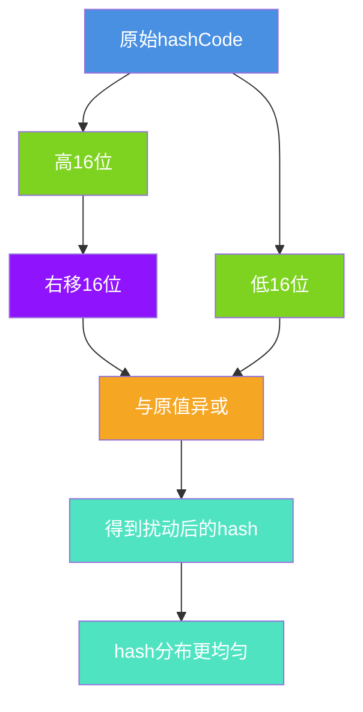
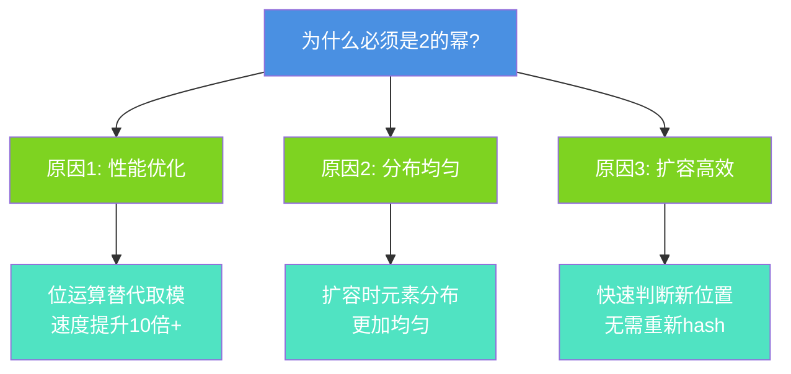
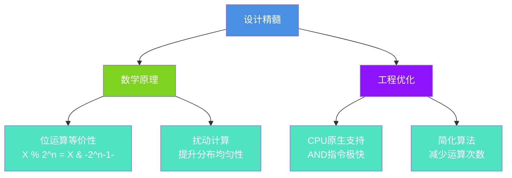

# HashMap的哈希算法与索引计算

## 引言

HashMap的高效性能离不开精妙的哈希算法和索引计算机制。本文将深入剖析HashMap如何将Key转换为数组索引,以及为什么容量必须是2的幂次方。

## 哈希算法的核心作用

### 两个关键步骤


### JDK版本对比

```java
// JDK 1.7: 4次扰动运算
final int hash(Object k) {
    int h = hashSeed;
    if (0 != h && k instanceof String) {
        return sun.misc.Hashing.stringHash32((String) k);
    }
    h ^= k.hashCode();
    h ^= (h >>> 20) ^ (h >>> 12);
    return h ^ (h >>> 7) ^ (h >>> 4);
}

// JDK 1.8: 1次扰动运算(优化)
static final int hash(Object key) {
    int h;
    return (key == null) ? 0 : (h = key.hashCode()) ^ (h >>> 16);
}
```

## 扰动函数详解

### 为什么需要扰动?

不进行扰动可能导致严重的hash冲突:

```java
// 假设length=16, 则 length-1=15
// 二进制: 0000 0000 0000 0000 0000 0000 0000 1111

// 两个不同的hashCode
int hash1 = 0b1100_1010_0001_0000_0000_0000_0000_0110;
int hash2 = 0b0001_0101_1110_0000_0000_0000_0000_0110;

// 直接 & 15 的结果
// 都是 0110 (6) - 发生冲突!
// 虽然高位完全不同,但只看低4位导致冲突
```

### 扰动原理

通过异或运算混合高低位特征:

```java
// 以用户ID为例
String userId = "user_987654";
int hashCode = 0b1011_0001_1010_1110_0111_1101_0011_0101;

// 步骤1: 右移16位
int high16 = hashCode >>> 16;
// 结果: 0b0000_0000_0000_0000_1011_0001_1010_1110

// 步骤2: 异或运算
int finalHash = hashCode ^ high16;
// 高16位: 1011 0001 1010 1110
// 低16位: 0111 1101 0011 0101
// 异或后: 1100 1100 1001 1011 (高低位混合)
```



## 位运算替代取模

### 数学等价性

```
核心公式: X % 2^n = X & (2^n - 1)
```

只要保证容量是2的幂,就可以用位运算替代取模运算。

### 实例演算

```java
// 假设容量 capacity = 8 (2^3)
int capacity = 8;
int mask = capacity - 1;  // 7 = 0b0111

// 示例1: 6 % 8
int value1 = 6;  // 0b0110
int index1 = value1 & mask;  // 0b0110 & 0b0111 = 0b0110 = 6
// 验证: 6 % 8 = 6 ✓

// 示例2: 10 % 8
int value2 = 10;  // 0b1010
int index2 = value2 & mask;  // 0b1010 & 0b0111 = 0b0010 = 2
// 验证: 10 % 8 = 2 ✓

// 示例3: 25 % 8
int value3 = 25;  // 0b11001
int index3 = value3 & mask;  // 0b11001 & 0b00111 = 0b00001 = 1
// 验证: 25 % 8 = 1 ✓
```

### 性能对比

```java
// 性能测试
public class PerformanceBenchmark {
    private static final int ITERATIONS = 100_000_000;
    
    public static void main(String[] args) {
        // 测试1: 取模运算
        long start1 = System.nanoTime();
        int sum1 = 0;
        for (int i = 0; i < ITERATIONS; i++) {
            sum1 += i % 16;  // 取模
        }
        long time1 = System.nanoTime() - start1;
        
        // 测试2: 位与运算
        long start2 = System.nanoTime();
        int sum2 = 0;
        for (int i = 0; i < ITERATIONS; i++) {
            sum2 += i & 15;  // 位与
        }
        long time2 = System.nanoTime() - start2;
        
        System.out.println("取模运算: " + time1 / 1_000_000 + "ms");
        System.out.println("位与运算: " + time2 / 1_000_000 + "ms");
        System.out.println("性能提升: " + (time1 / time2) + "倍");
    }
}

// 典型输出:
// 取模运算: 450ms
// 位与运算: 45ms
// 性能提升: 10倍
```

## 容量为2的幂的必要性

### 三大原因



### 如何保证是2的幂?

#### 初始化时的tableSizeFor方法

```java
static final int tableSizeFor(int cap) {
    int n = cap - 1;
    n |= n >>> 1;
    n |= n >>> 2;
    n |= n >>> 4;
    n |= n >>> 8;
    n |= n >>> 16;
    return (n < 0) ? 1 : (n >= MAXIMUM_CAPACITY) ? MAXIMUM_CAPACITY : n + 1;
}
```

**算法原理:**

```java
// 示例: cap = 19
cap = 19 = 0b 0001_0011

// Step 0: n = cap - 1 (避免2的幂被放大)
n = 18 = 0b 0001_0010

// Step 1: n |= n >>> 1
//   0001_0010
// | 0000_1001
// = 0001_1011

// Step 2: n |= n >>> 2
//   0001_1011
// | 0000_0110
// = 0001_1111

// Step 3-5: 继续或运算,结果不变
// n = 0001_1111 = 31

// Final: n + 1 = 32 = 2^5 ✓
```

**为什么要先减1?**

```java
// 如果不减1的问题:
cap = 16 = 0b 1_0000  // 本身是2的幂

// 不减1:
n = 16 → 经过或运算 → 31 → 加1 = 32  // ✗ 错误!

// 先减1:
n = 15 → 经过或运算 → 15 → 加1 = 16  // ✓ 正确!
```

#### 扩容时保持2的幂

```java
// 扩容时左移1位(乘以2)
if ((newCap = oldCap &lt;&lt; 1) < MAXIMUM_CAPACITY &&
        oldCap >= DEFAULT_INITIAL_CAPACITY)
    newThr = oldThr &lt;&lt; 1;  // threshold也翻倍

// 16 &lt;&lt; 1 = 32
// 32 &lt;&lt; 1 = 64
// 64 &lt;&lt; 1 = 128
// 始终保持2的幂特性
```

### 扩容时的妙用

利用2的幂特性,快速判断元素新位置:

```java
// 扩容前 capacity=8, 扩容后 capacity=16
// oldCap = 8 = 0b1000

// 元素hash值
int hash1 = 0b...0_0011;  // 第4位为0
int hash2 = 0b...1_0011;  // 第4位为1

// 判断位置是否改变
if ((hash & oldCap) == 0) {
    // hash1: 位置不变,仍在索引3
    newTab[j] = loHead;
} else {
    // hash2: 新位置 = 3 + 8 = 11
    newTab[j + oldCap] = hiHead;
}
```

## 负载因子与2的幂的配合

### 完美搭配

负载因子0.75 = 3/4,与2的幂完美配合:

```java
// capacity为2的幂时, threshold总是整数
capacity = 16:  threshold = 16 × 0.75 = 12
capacity = 32:  threshold = 32 × 0.75 = 24
capacity = 64:  threshold = 64 × 0.75 = 48

// 数学原理: 2^n × 3/4 = 2^(n-2) × 3 (必为整数)
```


## 实战应用

### 会话管理系统

```java
public class SessionManager {
    private Map<String, UserSession> sessions = new HashMap<>();
    
    public void createSession(String sessionId, UserSession session) {
        // 完整的hash流程:
        // 1. sessionId.hashCode()
        // 2. hash = hashCode ^ (hashCode >>> 16)
        // 3. index = (capacity - 1) & hash
        // 4. 定位并存储
        sessions.put(sessionId, session);
    }
    
    // 分析hash分布
    public void analyzeDistribution() {
        int[] bucketCounts = new int[16];  // 假设capacity=16
        
        for (String sessionId : sessions.keySet()) {
            int hash = hash(sessionId);
            int index = (16 - 1) & hash;
            bucketCounts[index]++;
        }
        
        // 理想情况: 每个桶的元素数量接近
        for (int i = 0; i < 16; i++) {
            System.out.println("Bucket " + i + ": " + bucketCounts[i]);
        }
    }
    
    private int hash(String key) {
        int h = key.hashCode();
        return h ^ (h >>> 16);
    }
    
    static class UserSession {
        private String userId;
        private long createTime;
    }
}
```

## 总结

HashMap的哈希算法和索引计算体现了极致的性能优化:

### 核心技术

1. **扰动函数**: 混合高低位,减少冲突
2. **位运算**: 替代取模,性能提升10倍+
3. **2的幂**: 保证算法正确性和高效性
4. **版本优化**: JDK 1.8简化算法,配合红黑树

### 设计精髓



理解这些机制,不仅能帮助我们更好地使用HashMap,还能在设计自己的数据结构时提供宝贵的参考。
