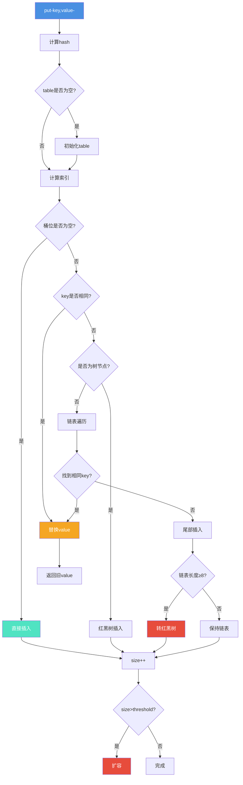
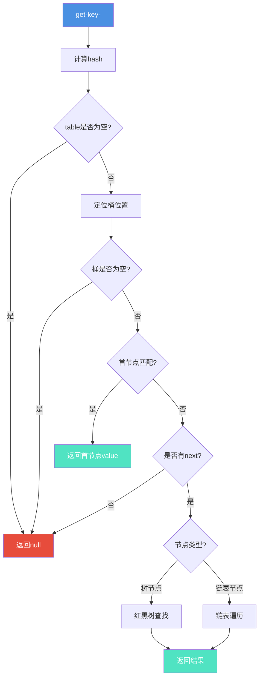
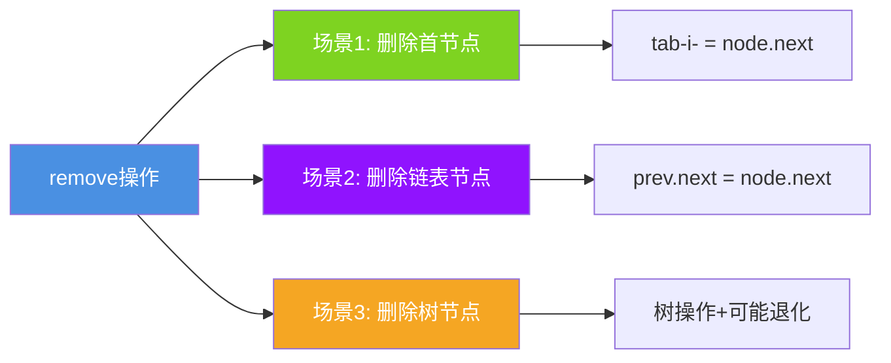
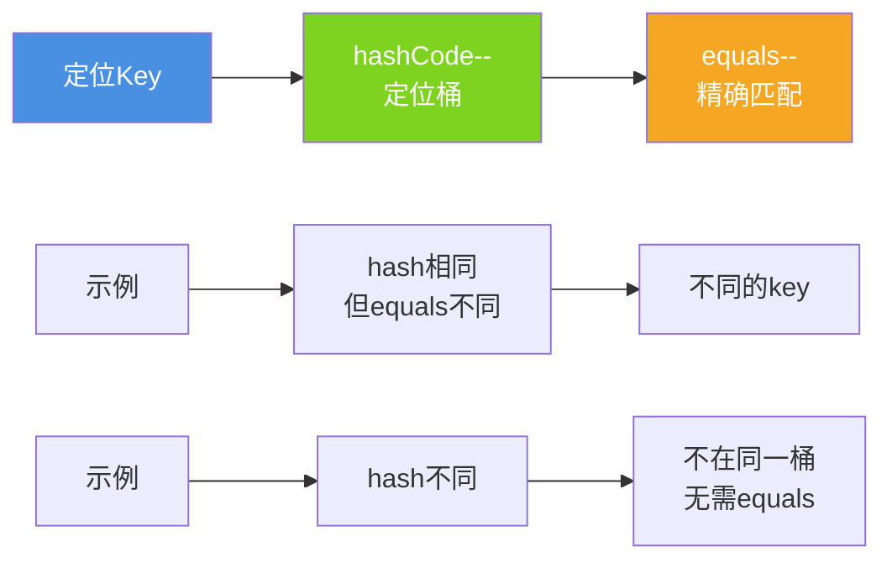

# HashMap的存取删除操作详解

## 引言

HashMap的put、get和remove操作是日常开发中最常用的方法。深入理解这些操作的内部实现,能够帮助我们写出更高效的代码,避免常见陷阱。

## put操作全流程

### 执行流程图



### 核心代码

```java
public V put(K key, V value) {
    return putVal(hash(key), key, value, false, true);
}

final V putVal(int hash, K key, V value, boolean onlyIfAbsent, boolean evict) {
    Node<K,V>[] tab;
    Node<K,V> p;
    int n, i;
    
    // 1. 延迟初始化
    if ((tab = table) == null || (n = tab.length) == 0) {
        n = (tab = resize()).length;
    }
    
    // 2. 桶位为空,直接插入
    if ((p = tab[i = (n - 1) & hash]) == null) {
        tab[i] = newNode(hash, key, value, null);
    }
    // 3. 处理冲突
    else {
        Node<K,V> e;
        K k;
        
        // 3.1 首节点匹配
        if (p.hash == hash && ((k = p.key) == key || (key != null && key.equals(k)))) {
            e = p;
        }
        // 3.2 红黑树插入
        else if (p instanceof TreeNode) {
            e = ((TreeNode<K,V>)p).putTreeVal(this, tab, hash, key, value);
        }
        // 3.3 链表插入
        else {
            for (int binCount = 0; ; ++binCount) {
                if ((e = p.next) == null) {
                    p.next = newNode(hash, key, value, null);
                    if (binCount >= TREEIFY_THRESHOLD - 1) {
                        treeifyBin(tab, hash);
                    }
                    break;
                }
                if (e.hash == hash && ((k = e.key) == key || (key != null && key.equals(k)))) {
                    break;
                }
                p = e;
            }
        }
        
        // 4. 替换旧值
        if (e != null) {
            V oldValue = e.value;
            if (!onlyIfAbsent || oldValue == null) {
                e.value = value;
            }
            return oldValue;
        }
    }
    
    // 5. 检查扩容
    if (++size > threshold) {
        resize();
    }
    
    return null;
}
```

### 订单系统示例

```java
public class OrderSystem {
    private Map<String, Order> orderMap = new HashMap<>();
    
    public void submitOrder(Order order) {
        // put流程完整演示
        String orderId = order.getOrderId();
        
        // 1. 计算orderId的hash
        // 2. 定位桶位置
        // 3. 如果桶为空,直接插入
        // 4. 如果有冲突,追加到链表或树
        // 5. 检查是否需要扩容
        orderMap.put(orderId, order);
    }
    
    public void updateOrder(String orderId, Order newOrder) {
        // key相同时,会替换旧value
        Order old = orderMap.put(orderId, newOrder);
        if (old != null) {
            System.out.println("更新订单: " + orderId);
        }
    }
    
    static class Order {
        private String orderId;
        private String userId;
        private double amount;
        
        public String getOrderId() {
            return orderId;
        }
    }
}
```

## get操作全流程

### 执行流程



### 核心代码

```java
public V get(Object key) {
    Node<K,V> e;
    return (e = getNode(hash(key), key)) == null ? null : e.value;
}

final Node<K,V> getNode(int hash, Object key) {
    Node<K,V>[] tab;
    Node<K,V> first, e;
    int n;
    K k;
    
    // 1. 检查table和桶
    if ((tab = table) != null && (n = tab.length) > 0 &&
        (first = tab[(n - 1) & hash]) != null) {
        
        // 2. 检查首节点
        if (first.hash == hash && 
            ((k = first.key) == key || (key != null && key.equals(k)))) {
            return first;
        }
        
        // 3. 处理链表或树
        if ((e = first.next) != null) {
            if (first instanceof TreeNode) {
                return ((TreeNode<K,V>)first).getTreeNode(hash, key);
            }
            do {
                if (e.hash == hash && 
                    ((k = e.key) == key || (key != null && key.equals(k)))) {
                    return e;
                }
            } while ((e = e.next) != null);
        }
    }
    
    return null;
}
```

## remove操作全流程

### 两种删除方式

```java
// 方式1: 只根据key删除
V remove(Object key)

// 方式2: key和value都要匹配
boolean remove(Object key, Object value)
```

### 删除场景



### 缓存淘汰示例

```java
public class LRUCache<K, V> {
    private final int capacity;
    private final Map<K, CacheEntry<V>> cache;
    
    static class CacheEntry<V> {
        V value;
        long accessTime;
        
        CacheEntry(V value) {
            this.value = value;
            this.accessTime = System.currentTimeMillis();
        }
    }
    
    public LRUCache(int capacity) {
        this.capacity = capacity;
        this.cache = new HashMap<>(capacity);
    }
    
    public V get(K key) {
        CacheEntry<V> entry = cache.get(key);
        if (entry != null) {
            entry.accessTime = System.currentTimeMillis();
            return entry.value;
        }
        return null;
    }
    
    public void put(K key, V value) {
        if (cache.size() >= capacity && !cache.containsKey(key)) {
            evictLRU();  // 淘汰最久未使用的
        }
        cache.put(key, new CacheEntry<>(value));
    }
    
    private void evictLRU() {
        K lruKey = null;
        long oldestTime = Long.MAX_VALUE;
        
        for (Map.Entry<K, CacheEntry<V>> entry : cache.entrySet()) {
            if (entry.getValue().accessTime < oldestTime) {
                oldestTime = entry.getValue().accessTime;
                lruKey = entry.getKey();
            }
        }
        
        if (lruKey != null) {
            cache.remove(lruKey);  // 执行remove
        }
    }
}
```

## Key定位机制

### hashCode和equals的配合



### 自定义Key示例

```java
public class CustomKeyDemo {
    
    static class UserKey {
        private Long userId;
        private String userType;
        
        public UserKey(Long userId, String userType) {
            this.userId = userId;
            this.userType = userType;
        }
        
        // 必须重写hashCode
        @Override
        public int hashCode() {
            return Objects.hash(userId, userType);
        }
        
        // 必须重写equals
        @Override
        public boolean equals(Object obj) {
            if (this == obj) return true;
            if (!(obj instanceof UserKey)) return false;
            UserKey other = (UserKey) obj;
            return Objects.equals(userId, other.userId) &&
                   Objects.equals(userType, other.userType);
        }
    }
    
    public void demo() {
        Map<UserKey, String> userMap = new HashMap<>();
        
        UserKey key1 = new UserKey(1L, "VIP");
        UserKey key2 = new UserKey(1L, "VIP");
        
        userMap.put(key1, "Alice");
        
        // 正确实现hashCode和equals后:
        // key1和key2的hashCode相同
        // equals返回true
        // 所以能正确获取value
        String value = userMap.get(key2);  // "Alice"
    }
}
```

## 性能优化建议

### 批量操作优化

```java
public class BatchOperationOptimization {
    
    // ✗ 不推荐: 逐个删除
    public void removeBad(Map<String, String> map, List<String> keys) {
        for (String key : keys) {
            map.remove(key);
        }
    }
    
    // ✓ 推荐: 使用removeIf
    public void removeGood(Map<String, String> map, List<String> keys) {
        map.keySet().removeIf(keys::contains);
    }
    
    // ✓ 推荐: 创建新Map(数据量大时)
    public Map<String, String> removeBetter(Map<String, String> map, 
                                            List<String> keys) {
        Map<String, String> newMap = new HashMap<>();
        for (Map.Entry<String, String> entry : map.entrySet()) {
            if (!keys.contains(entry.getKey())) {
                newMap.put(entry.getKey(), entry.getValue());
            }
        }
        return newMap;
    }
}
```

## 注意事项

### 并发修改异常

```java
// ✗ 错误: 遍历时直接remove
for (String key : map.keySet()) {
    if (condition) {
        map.remove(key);  // ConcurrentModificationException
    }
}

// ✓ 正确: 使用迭代器
Iterator<Map.Entry<String, String>> it = map.entrySet().iterator();
while (it.hasNext()) {
    if (condition) {
        it.remove();  // 正确
    }
}

// ✓ 正确: 使用removeIf
map.keySet().removeIf(key -> condition);
```

## 总结

HashMap的操作虽然简单,但内部实现考虑周全:

1. **put**: 延迟初始化、智能插入、自动扩容
2. **get**: 快速定位、多级查找
3. **remove**: 灵活删除、自动维护

理解这些细节,才能更好地使用HashMap。
