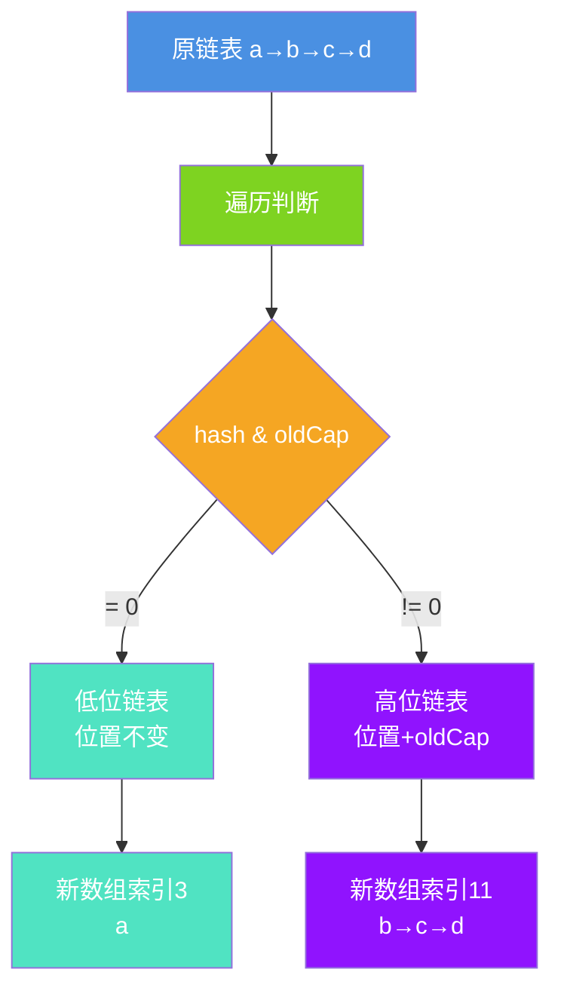
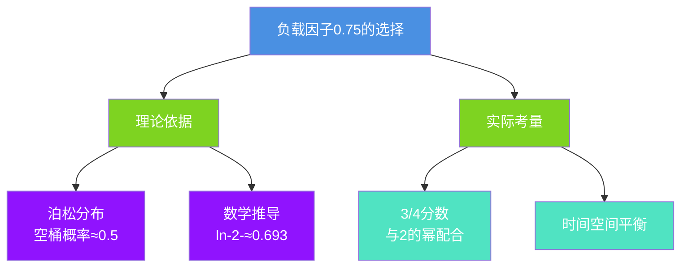
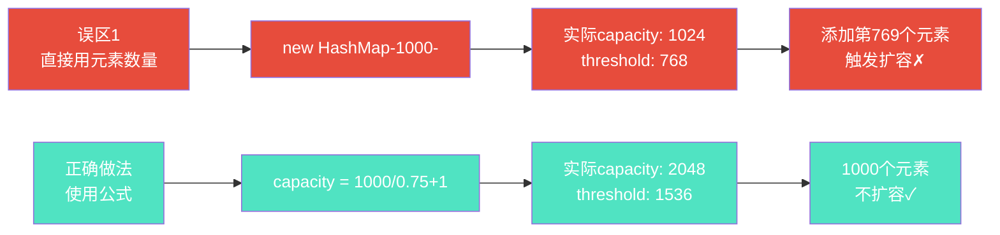
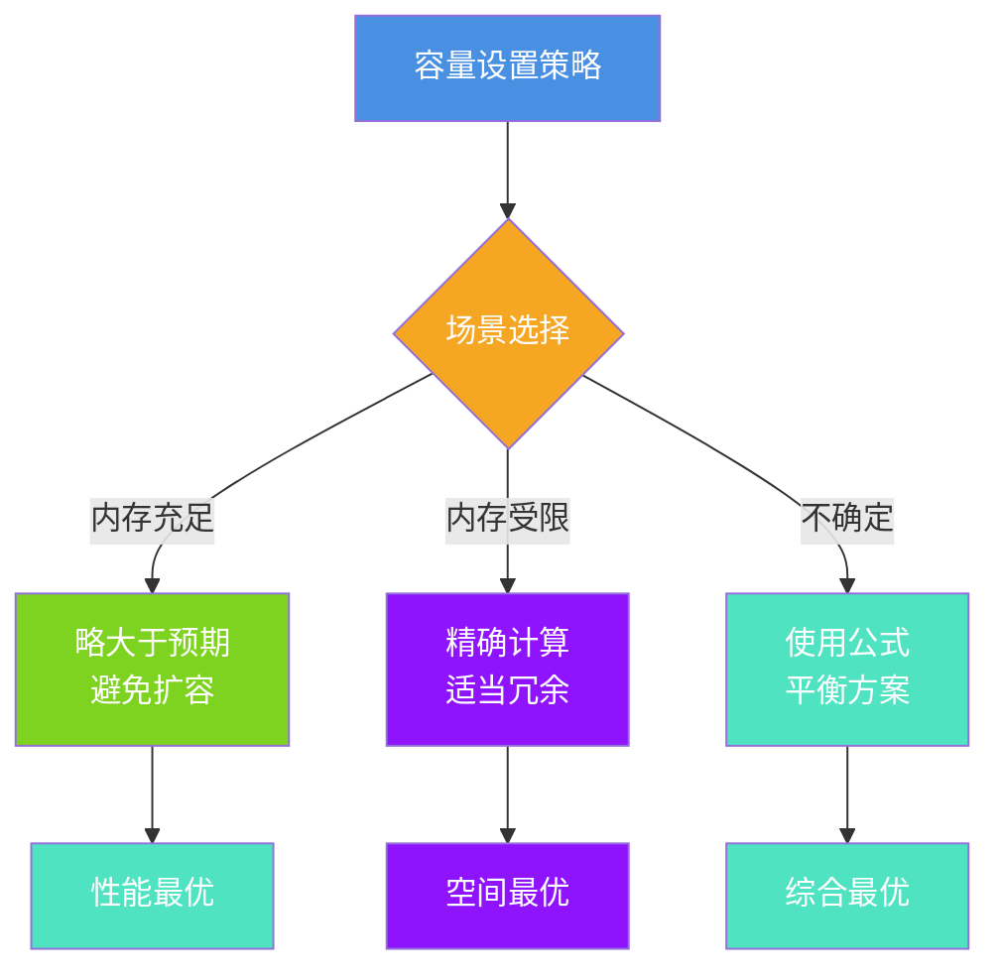

# HashMap的扩容与容量优化

## 引言

HashMap的扩容机制是其性能的关键因素之一。合理的容量设置可以避免频繁扩容,显著提升性能。本文将全面解析扩容机制、负载因子的选择,以及容量优化的最佳实践。

## 扩容机制深度剖析

### 为什么需要扩容?


### 扩容触发条件

```java
// 扩容条件
if (++size > threshold) {
    resize();
}

// 其中:
// threshold = capacity × loadFactor
// loadFactor 默认 0.75
```

### 三种扩容场景

#### 场景1: 单节点重映射

```java
// 桶中只有一个节点
if (e.next == null) {
    newTab[e.hash & (newCap - 1)] = e;
}
```

#### 场景2: 链表重新分配

这是HashMap扩容最精妙的设计:

```java
// 假设4个key, oldCap=8, newCap=16
hash(a) = 3;   hash(a) & 7 = 3;   hash(a) & 8 = 0
hash(b) = 11;  hash(b) & 7 = 3;   hash(b) & 8 = 8
hash(c) = 27;  hash(c) & 7 = 3;   hash(c) & 8 = 8
hash(d) = 59;  hash(d) & 7 = 3;   hash(d) & 8 = 8

// 旧数组: table[3] = a → b → c → d

// 扩容后:
// table[3] = a (hash & oldCap == 0, 位置不变)
// table[11] = b → c → d (hash & oldCap != 0, 位置改变)
```



**核心代码:**

```java
Node<K,V> loHead = null, loTail = null;  // 低位链表
Node<K,V> hiHead = null, hiTail = null;  // 高位链表

do {
    next = e.next;
    if ((e.hash & oldCap) == 0) {
        // 位置不变
        if (loTail == null)
            loHead = e;
        else
            loTail.next = e;
        loTail = e;
    }
    else {
        // 位置改变
        if (hiTail == null)
            hiHead = e;
        else
            hiTail.next = e;
        hiTail = e;
    }
} while ((e = next) != null);

// 放置到新数组
if (loTail != null) {
    loTail.next = null;
    newTab[j] = loHead;
}
if (hiTail != null) {
    hiTail.next = null;
    newTab[j + oldCap] = hiHead;
}
```

#### 场景3: 红黑树处理与退化

```java
// 红黑树也用同样方法分组
TreeNode<K,V> loHead = null, loTail = null;
TreeNode<K,V> hiHead = null, hiTail = null;
int lc = 0, hc = 0;

for (TreeNode<K,V> e = b, next; e != null; e = next) {
    next = (TreeNode<K,V>)e.next;
    e.next = null;
    
    if ((e.hash & bit) == 0) {
        // 低位
        if ((e.prev = loTail) == null)
            loHead = e;
        else
            loTail.next = e;
        loTail = e;
        ++lc;
    }
    else {
        // 高位
        if ((e.prev = hiTail) == null)
            hiHead = e;
        else
            hiTail.next = e;
        hiTail = e;
        ++hc;
    }
}

// 判断是否退化
if (lc <= UNTREEIFY_THRESHOLD) {
    tab[index] = loHead.untreeify(map);  // 退化为链表
}
else {
    tab[index] = loHead;
    if (hiHead != null)
        loHead.treeify(tab);  // 重新树化
}
```

### 扩容过程演示

```java
public class ResizeDemo {
    public static void main(String[] args) {
        Map<String, String> map = new HashMap<>(4);  // 容量4,阈值3
        
        System.out.println("=== 初始: capacity=4, threshold=3 ===");
        
        map.put("key1", "value1");  // size=1
        map.put("key2", "value2");  // size=2
        map.put("key3", "value3");  // size=3
        
        System.out.println("添加3个元素,未扩容");
        
        map.put("key4", "value4");  // size=4 > 3, 触发扩容!
        System.out.println("=== 第4个元素触发扩容 ===");
        System.out.println("capacity: 4 → 8");
        System.out.println("threshold: 3 → 6");
        
        map.put("key5", "value5");
        map.put("key6", "value6");
        
        map.put("key7", "value7");  // size=7 > 6, 再次扩容!
        System.out.println("=== 第7个元素触发扩容 ===");
        System.out.println("capacity: 8 → 16");
        System.out.println("threshold: 6 → 12");
    }
}
```

## 负载因子深度解析

### 为什么是0.75?



### 数学理论

根据二项式定理,某个桶为空的概率:

```
P(0) = (1 - 1/s)^n

当P(0) = 0.5时, n/s → ln(2) ≈ 0.693
```

0.693与0.75非常接近,且0.75 = 3/4能保证threshold总是整数。

### 不同负载因子的影响

```java
public class LoadFactorImpact {
    
    public static void main(String[] args) {
        testLoadFactor(0.5f);   // 空间浪费
        testLoadFactor(0.75f);  // 平衡
        testLoadFactor(1.0f);   // 性能差
    }
    
    static void testLoadFactor(float loadFactor) {
        int expectedSize = 1000;
        int capacity = (int)(expectedSize / loadFactor + 1);
        capacity = tableSizeFor(capacity);
        
        System.out.println("=== 负载因子: " + loadFactor + " ===");
        System.out.println("容量: " + capacity);
        System.out.println("阈值: " + (int)(capacity * loadFactor));
        System.out.println("空间利用率: " + 
                         String.format("%.1f%%", expectedSize * 100.0 / capacity));
        System.out.println();
    }
    
    static int tableSizeFor(int cap) {
        int n = cap - 1;
        n |= n >>> 1;
        n |= n >>> 2;
        n |= n >>> 4;
        n |= n >>> 8;
        n |= n >>> 16;
        return (n < 0) ? 1 : n + 1;
    }
}

// 输出:
// === 负载因子: 0.5 ===
// 容量: 2048
// 阈值: 1024
// 空间利用率: 48.8%  ← 浪费空间

// === 负载因子: 0.75 ===
// 容量: 2048
// 阈值: 1536
// 空间利用率: 48.8%  ← 平衡最优

// === 负载因子: 1.0 ===
// 容量: 1024
// 阈值: 1024
// 空间利用率: 97.7%  ← 冲突严重
```

## 容量优化最佳实践

### 容量计算公式

```java
// 推荐公式
int capacity = (int)(expectedSize / 0.75f + 1);

// 示例
int expectedSize = 1000;
int capacity = (int)(1000 / 0.75f + 1);  // 1334
// JDK会调整为2048(大于1334的最小2的幂)
// threshold = 2048 × 0.75 = 1536
// 可存储1536个元素不扩容
```

### 常见误区



### 使用Guava简化

```java
// 推荐: 使用Guava工具类
Map<String, String> map = Maps.newHashMapWithExpectedSize(1000);

// Guava内部实现
public static <K, V> HashMap<K, V> newHashMapWithExpectedSize(int expectedSize) {
    return new HashMap<>(capacity(expectedSize));
}

static int capacity(int expectedSize) {
    if (expectedSize < 3) {
        return expectedSize + 1;
    }
    if (expectedSize < 1073741824) {
        return (int)((float)expectedSize / 0.75F + 1.0F);
    }
    return Integer.MAX_VALUE;
}
```

### 实际应用场景

#### 场景1: 配置文件加载

```java
public class ConfigLoader {
    
    public Map<String, String> loadConfig(String configFile) {
        // 假设配置文件约50项
        int expectedSize = 50;
        
        // ✓ 推荐: 使用公式
        int capacity = (int)(expectedSize / 0.75f + 1);
        Map<String, String> config = new HashMap<>(capacity);
        
        // 或使用Guava
        // Map<String, String> config = Maps.newHashMapWithExpectedSize(50);
        
        // 加载配置...
        for (int i = 0; i < 50; i++) {
            config.put("config." + i, "value" + i);
        }
        
        return config;
    }
}
```

#### 场景2: 数据库查询结果

```java
public class UserService {
    
    public Map<Long, User> batchLoadUsers(List<Long> userIds) {
        int size = userIds.size();
        
        // 根据实际数量设置容量
        Map<Long, User> userMap = Maps.newHashMapWithExpectedSize(size);
        
        // 批量查询
        List<User> users = queryFromDB(userIds);
        
        // 填充Map
        for (User user : users) {
            userMap.put(user.getUserId(), user);
        }
        
        return userMap;
    }
    
    private List<User> queryFromDB(List<Long> userIds) {
        // 数据库查询...
        return new ArrayList<>();
    }
    
    static class User {
        private Long userId;
        private String username;
        
        public Long getUserId() {
            return userId;
        }
    }
}
```

#### 场景3: 数据聚合

```java
public class DataAggregator {
    
    public Map<String, List<Order>> groupByUser(List<Order> orders) {
        // 预估用户数量
        int estimatedUserCount = (int)(orders.size() * 0.3);
        
        Map<String, List<Order>> grouped = 
            Maps.newHashMapWithExpectedSize(estimatedUserCount);
        
        for (Order order : orders) {
            grouped.computeIfAbsent(order.getUserId(), k -> new ArrayList<>())
                  .add(order);
        }
        
        return grouped;
    }
    
    static class Order {
        private String orderId;
        private String userId;
        
        public String getUserId() {
            return userId;
        }
    }
}
```

## 性能对比

```java
public class PerformanceComparison {
    private static final int ELEMENT_COUNT = 100000;
    
    public static void main(String[] args) {
        System.out.println("=== 容量设置性能对比 ===\n");
        
        // 测试1: 默认容量(频繁扩容)
        long time1 = test(() -> new HashMap<>());
        System.out.println("默认容量: " + time1 + "ms");
        
        // 测试2: 直接使用元素数量(仍会扩容)
        long time2 = test(() -> new HashMap<>(ELEMENT_COUNT));
        System.out.println("使用元素数量: " + time2 + "ms");
        
        // 测试3: 使用公式(无扩容)
        int capacity = (int)(ELEMENT_COUNT / 0.75f + 1);
        long time3 = test(() -> new HashMap<>(capacity));
        System.out.println("使用公式: " + time3 + "ms");
        
        System.out.println("\n性能提升: " + 
                         String.format("%.1f%%", (time1 - time3) * 100.0 / time1));
    }
    
    static long test(Supplier<Map<Integer, String>> supplier) {
        long start = System.currentTimeMillis();
        Map<Integer, String> map = supplier.get();
        for (int i = 0; i < ELEMENT_COUNT; i++) {
            map.put(i, "value" + i);
        }
        return System.currentTimeMillis() - start;
    }
}

// 典型输出:
// === 容量设置性能对比 ===
// 默认容量: 85ms
// 使用元素数量: 72ms
// 使用公式: 45ms
// 性能提升: 47.1%
```

## 空间与性能权衡



## 总结

HashMap的扩容和容量优化是性能调优的关键:

### 核心要点

1. **扩容触发**: size > threshold (capacity × 0.75)
2. **扩容策略**: 容量翻倍,高低位分离
3. **负载因子**: 0.75平衡时间和空间
4. **容量公式**: expectedSize / 0.75 + 1

### 最佳实践

| 场景 | 建议 |
|------|------|
| 元素数量已知 | 使用公式或Guava |
| 元素数量未知 | 预估上限×1.5 |
| 内存充足 | 适当多分配 |
| 内存受限 | 精确计算 |
| 性能敏感 | 避免扩容 |

合理设置HashMap容量,是性能优化的重要手段!
