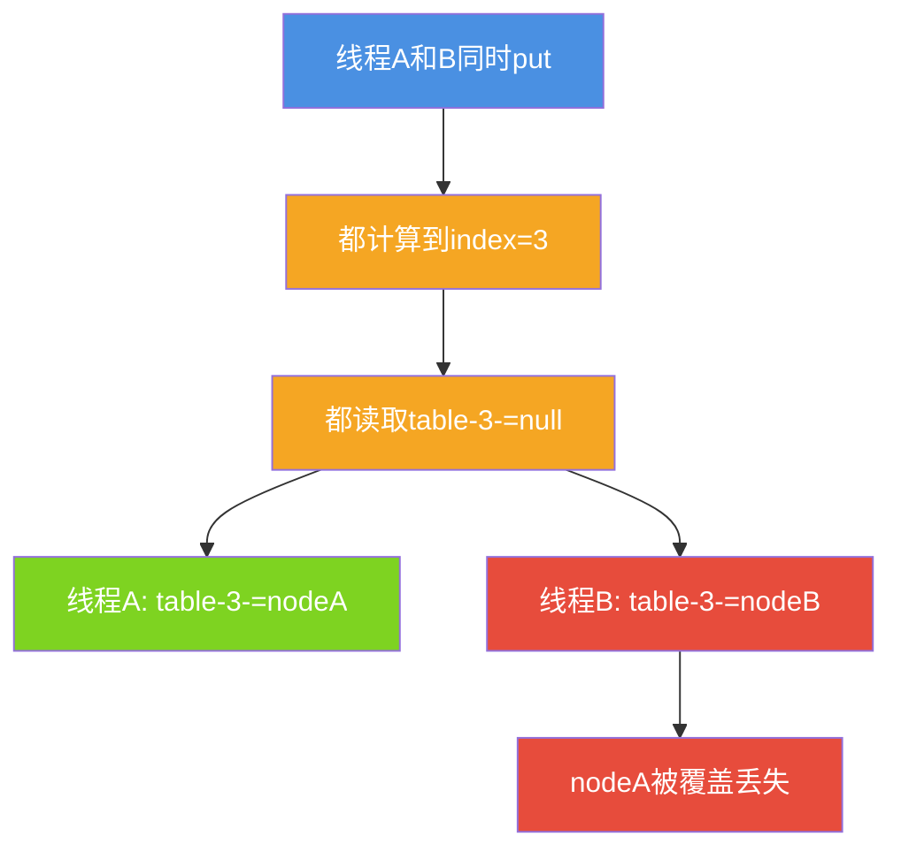
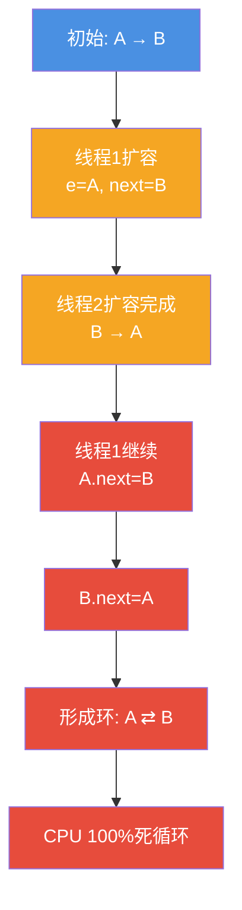
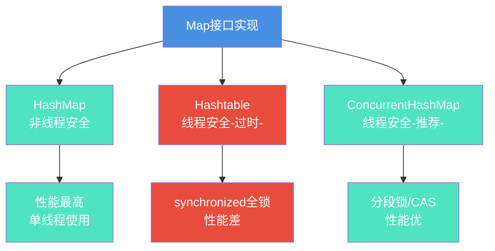
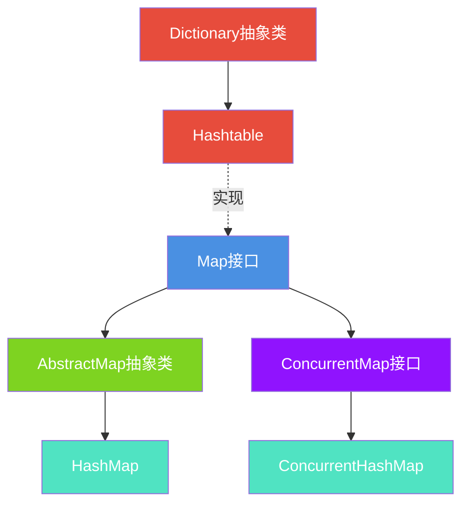
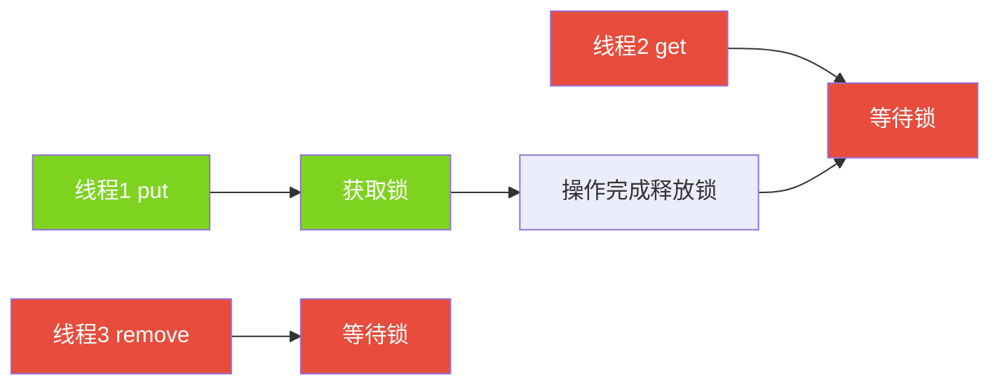
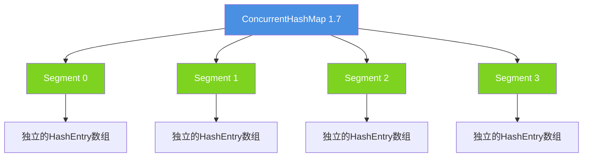
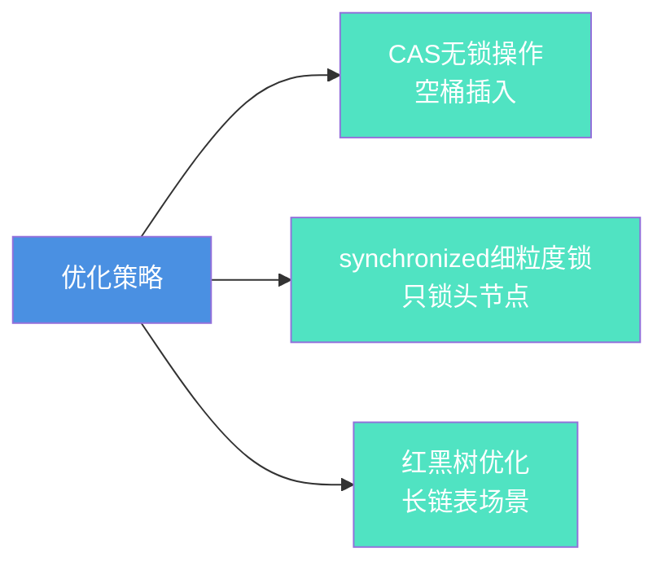
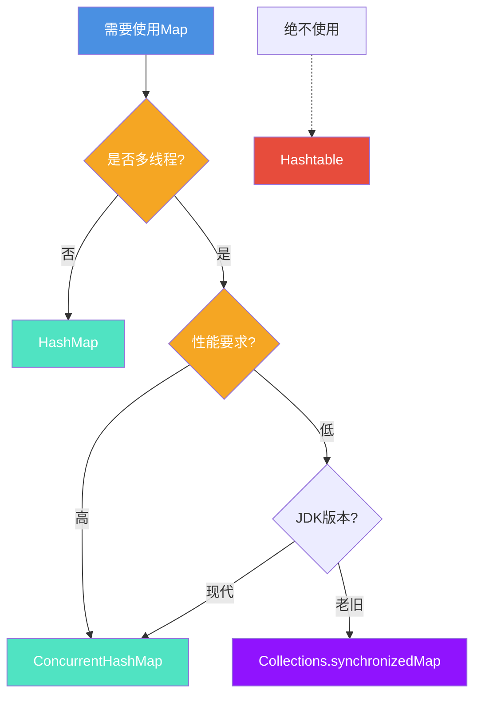
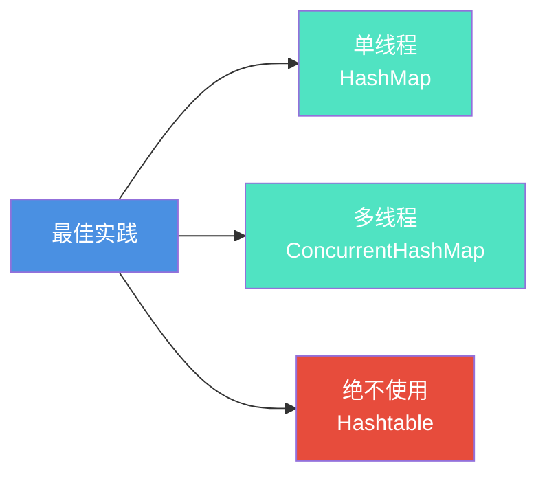

# HashMap线程安全问题与解决方案

## 引言

HashMap是非线程安全的,在多线程环境下使用会出现严重问题。本文将深入剖析HashMap的并发问题,对比Hashtable和ConcurrentHashMap,并给出实际应用建议。

## HashMap的并发问题

### 问题一: 数据覆盖

多线程同时put可能导致数据丢失。

```java
public class DataLossDemo {
    private static Map<String, String> map = new HashMap<>();
    
    public static void main(String[] args) throws InterruptedException {
        // 启动10个线程同时put
        Thread[] threads = new Thread[10];
        for (int i = 0; i < 10; i++) {
            final int index = i;
            threads[i] = new Thread(() -> {
                for (int j = 0; j < 1000; j++) {
                    map.put("key-" + index + "-" + j, "value");
                }
            });
            threads[i].start();
        }
        
        // 等待所有线程完成
        for (Thread t : threads) {
            t.join();
        }
        
        System.out.println("期望: 10000, 实际: " + map.size());
        // 输出: 实际值通常小于10000 (数据丢失)
    }
}
```

**原因分析:**



### 问题二: 死循环 (JDK 1.7)

JDK 1.7的头插法在并发扩容时可能形成环形链表。

```java
// JDK 1.7的transfer方法(简化版)
void transfer(Entry[] newTable) {
    Entry[] src = table;
    for (int j = 0; j < src.length; j++) {
        Entry<K,V> e = src[j];
        if (e != null) {
            src[j] = null;
            do {
                Entry<K,V> next = e.next;
                int i = indexFor(e.hash, newTable.length);
                e.next = newTable[i];  // 头插法
                newTable[i] = e;
                e = next;
            } while (e != null);
        }
    }
}
```

**形成环形链表的过程:**



**JDK 1.8的解决:**

```java
// JDK 1.8改为尾插法,避免死循环
Node<K,V> loHead = null, loTail = null;
do {
    next = e.next;
    if ((e.hash & oldCap) == 0) {
        if (loTail == null)
            loHead = e;
        else
            loTail.next = e;  // 尾插法
        loTail = e;
    }
} while ((e = next) != null);
```

### 问题三: Fast-fail机制

迭代过程中检测到并发修改会抛异常。

```java
public class FastFailDemo {
    public static void main(String[] args) {
        Map<String, String> map = new HashMap<>();
        map.put("key1", "value1");
        map.put("key2", "value2");
        
        // 迭代时修改
        for (String key : map.keySet()) {
            map.put("key3", "value3");  // ConcurrentModificationException
        }
    }
}
```

## 三种Map的全面对比

### HashMap vs Hashtable vs ConcurrentHashMap



### 详细对比表

| 特性 | HashMap | Hashtable | ConcurrentHashMap |
|------|---------|-----------|-------------------|
| **线程安全** | ✗ | ✓ | ✓ |
| **null key** | 允许1个 | 不允许 | 不允许 |
| **null value** | 允许多个 | 不允许 | 不允许 |
| **底层结构** | 数组+链表+红黑树 | 数组+链表 | 数组+链表+红黑树 |
| **初始容量** | 16 | 11 | 16 |
| **扩容方式** | 2倍 | 2倍+1 | 2倍 |
| **锁机制** | 无 | 全表锁 | 分段锁/CAS |
| **性能** | 高 | 低 | 中高 |
| **推荐度** | 单线程推荐 | 不推荐 | 多线程推荐 |

### 继承关系



## Hashtable详解

### 锁机制

```java
public class Hashtable<K,V> extends Dictionary<K,V> {
    
    // 所有方法都用synchronized
    public synchronized V get(Object key) {
        // ...
    }
    
    public synchronized V put(K key, V value) {
        // 不允许null
        if (value == null) {
            throw new NullPointerException();
        }
        // ...
    }
    
    public synchronized V remove(Object key) {
        // ...
    }
}
```

**性能问题:**



### 为什么不推荐?

1. **性能差**: 全表锁,任何操作都互斥
2. **设计过时**: JDK 1.0的产物
3. **有更好替代**: ConcurrentHashMap

## ConcurrentHashMap详解

### JDK 1.7: 分段锁

```java
// JDK 1.7的Segment数组
final Segment<K,V>[] segments;

static final class Segment<K,V> extends ReentrantLock {
    transient volatile HashEntry<K,V>[] table;
    
    V put(K key, int hash, V value) {
        lock();  // 只锁当前Segment
        try {
            // put操作
        } finally {
            unlock();
        }
    }
}
```



### JDK 1.8: CAS + synchronized

```java
public V put(K key, V value) {
    int hash = spread(key.hashCode());
    
    for (Node<K,V>[] tab = table;;) {
        Node<K,V> f;
        int n, i, fh;
        
        if (tab == null || (n = tab.length) == 0)
            tab = initTable();
        else if ((f = tabAt(tab, i = (n - 1) & hash)) == null) {
            // CAS插入
            if (casTabAt(tab, i, null, new Node<K,V>(hash, key, value, null)))
                break;
        }
        else {
            // synchronized锁定头节点
            synchronized (f) {
                // 链表或树的插入
            }
        }
    }
}
```

**优化点:**



## 性能测试

### 并发性能对比

```java
public class ConcurrentPerformanceTest {
    private static final int THREAD_COUNT = 10;
    private static final int OPERATIONS = 100000;
    
    public static void main(String[] args) throws Exception {
        System.out.println("=== HashMap (非线程安全) ===");
        testMap(new HashMap<>());
        
        System.out.println("\n=== Hashtable ===");
        testMap(new Hashtable<>());
        
        System.out.println("\n=== ConcurrentHashMap ===");
        testMap(new ConcurrentHashMap<>());
        
        System.out.println("\n=== Collections.synchronizedMap ===");
        testMap(Collections.synchronizedMap(new HashMap<>()));
    }
    
    static void testMap(Map<Integer, Integer> map) throws Exception {
        long start = System.currentTimeMillis();
        
        Thread[] threads = new Thread[THREAD_COUNT];
        for (int i = 0; i < THREAD_COUNT; i++) {
            final int threadId = i;
            threads[i] = new Thread(() -> {
                for (int j = 0; j < OPERATIONS; j++) {
                    int key = threadId * OPERATIONS + j;
                    map.put(key, key);
                    map.get(key);
                }
            });
            threads[i].start();
        }
        
        for (Thread t : threads) {
            t.join();
        }
        
        long time = System.currentTimeMillis() - start;
        System.out.println("耗时: " + time + "ms");
        System.out.println("实际大小: " + map.size());
    }
}

// 典型输出:
// === HashMap (非线程安全) ===
// 耗时: 450ms
// 实际大小: 985321 (数据丢失)

// === Hashtable ===
// 耗时: 2800ms
// 实际大小: 1000000

// === ConcurrentHashMap ===
// 耗时: 680ms
// 实际大小: 1000000

// === Collections.synchronizedMap ===
// 耗时: 2650ms
// 实际大小: 1000000
```

## 实际应用场景

### 场景1: 缓存系统

```java
public class CacheService {
    // 多线程访问,使用ConcurrentHashMap
    private ConcurrentMap<String, Object> cache = new ConcurrentHashMap<>();
    
    public Object get(String key) {
        return cache.computeIfAbsent(key, k -> {
            // 缓存未命中,从数据库加载
            return loadFromDB(k);
        });
    }
    
    public void put(String key, Object value) {
        cache.put(key, value);
    }
    
    public void invalidate(String key) {
        cache.remove(key);
    }
    
    private Object loadFromDB(String key) {
        // 模拟数据库查询
        return "data_" + key;
    }
}
```

### 场景2: 计数器

```java
public class ConcurrentCounter {
    private ConcurrentMap<String, AtomicLong> counters = new ConcurrentHashMap<>();
    
    public void increment(String key) {
        counters.computeIfAbsent(key, k -> new AtomicLong(0))
               .incrementAndGet();
    }
    
    public long get(String key) {
        AtomicLong counter = counters.get(key);
        return counter == null ? 0 : counter.get();
    }
    
    // 实际应用: 接口调用统计
    public void recordApiCall(String apiName) {
        increment("api:" + apiName);
    }
}
```

### 场景3: 会话管理

```java
public class SessionManager {
    private ConcurrentMap<String, Session> sessions = new ConcurrentHashMap<>();
    private static final long SESSION_TIMEOUT = 30 * 60 * 1000; // 30分钟
    
    public Session getSession(String sessionId) {
        Session session = sessions.get(sessionId);
        if (session != null && !session.isExpired()) {
            session.updateAccessTime();
            return session;
        }
        return null;
    }
    
    public void createSession(String sessionId, Session session) {
        sessions.put(sessionId, session);
    }
    
    public void removeSession(String sessionId) {
        sessions.remove(sessionId);
    }
    
    // 定期清理过期session
    public void cleanupExpiredSessions() {
        long now = System.currentTimeMillis();
        sessions.entrySet().removeIf(entry -> 
            now - entry.getValue().getLastAccessTime() > SESSION_TIMEOUT
        );
    }
    
    static class Session {
        private long lastAccessTime;
        
        public void updateAccessTime() {
            this.lastAccessTime = System.currentTimeMillis();
        }
        
        public long getLastAccessTime() {
            return lastAccessTime;
        }
        
        public boolean isExpired() {
            return System.currentTimeMillis() - lastAccessTime > SESSION_TIMEOUT;
        }
    }
}
```

## 选择建议

### 决策流程



### 使用建议表

| 场景 | 推荐选择 | 理由 |
|------|---------|------|
| 单线程 | HashMap | 性能最优 |
| 多线程读多写少 | ConcurrentHashMap | 读操作几乎无锁 |
| 多线程写多 | ConcurrentHashMap | 分段锁/CAS优化 |
| 需要null key/value | HashMap | 其他不支持 |
| 遗留系统 | 考虑升级到ConcurrentHashMap | 性能提升明显 |
| 新项目 | 永远不用Hashtable | 已被淘汰 |

## 常见误区

### 误区1: 认为Hashtable是最安全的

```java
// ✗ 错误认知
Hashtable<String, String> table = new Hashtable<>();

// 这样仍然不是原子操作!
if (!table.containsKey("key")) {
    table.put("key", "value");  // 可能被其他线程插入
}

// ✓ 正确做法
ConcurrentHashMap<String, String> map = new ConcurrentHashMap<>();
map.putIfAbsent("key", "value");  // 原子操作
```

### 误区2: 认为HashMap在单线程下会有问题

HashMap在单线程环境完全没问题,性能最优。

### 误区3: 过度使用ConcurrentHashMap

单线程环境使用ConcurrentHashMap是性能浪费。

## 总结

HashMap的线程安全问题及解决方案:

### 核心要点

1. **HashMap**: 非线程安全,单线程使用
2. **Hashtable**: 线程安全但性能差,不推荐
3. **ConcurrentHashMap**: 线程安全且高性能,多线程首选

### 最佳实践



选择正确的Map实现,是编写高质量并发代码的基础!
