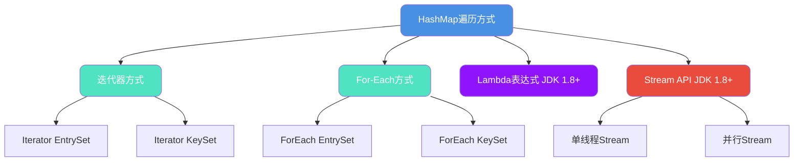
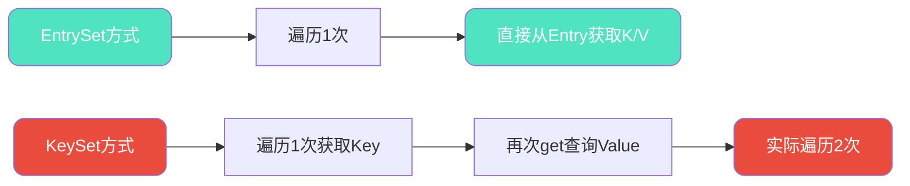
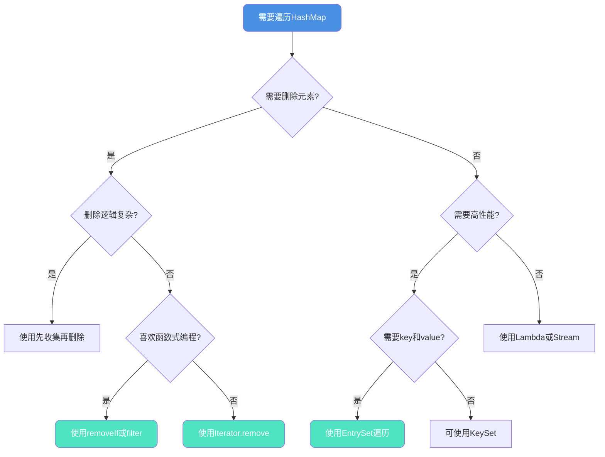

## HashMap遍历方式全解析

自JDK 1.8引入Stream API后,HashMap的遍历方式变得更加多样化。本文将深入解析HashMap的各种遍历方式,并从性能、原理和安全性等多个维度进行对比分析,帮助开发者选择最优方案。

### 遍历方式分类

HashMap的遍历方式可以分为4大类、7种具体实现:



## 七种遍历方式详解

### 方式一: 迭代器EntrySet遍历

EntrySet方式一次性获取键值对,无需额外查询:

```java
public class ProductInventory {
    public static void main(String[] args) {
        // 商品库存管理系统
        Map<String, Integer> inventory = new HashMap<>();
        inventory.put("iPhone-15", 120);
        inventory.put("MacBook-Pro", 85);
        inventory.put("AirPods-Pro", 200);
        inventory.put("iPad-Air", 150);
        inventory.put("Apple-Watch", 95);
        
        // 使用迭代器EntrySet遍历
        Iterator<Map.Entry<String, Integer>> iterator = inventory.entrySet().iterator();
        while (iterator.hasNext()) {
            Map.Entry<String, Integer> entry = iterator.next();
            System.out.println("商品: " + entry.getKey() + ", 库存: " + entry.getValue());
        }
    }
}
```

### 方式二: 迭代器KeySet遍历

KeySet方式需要通过key二次查询获取value:

```java
public class ProductInventory {
    public static void main(String[] args) {
        Map<String, Integer> inventory = new HashMap<>();
        inventory.put("iPhone-15", 120);
        inventory.put("MacBook-Pro", 85);
        inventory.put("AirPods-Pro", 200);
        inventory.put("iPad-Air", 150);
        inventory.put("Apple-Watch", 95);
        
        // 使用迭代器KeySet遍历
        Iterator<String> iterator = inventory.keySet().iterator();
        while (iterator.hasNext()) {
            String product = iterator.next();
            Integer stock = inventory.get(product);  // 需要二次查询
            System.out.println("商品: " + product + ", 库存: " + stock);
        }
    }
}
```

### 方式三: ForEach EntrySet遍历

增强for循环的EntrySet方式,代码简洁:

```java
public class ProductInventory {
    public static void main(String[] args) {
        Map<String, Integer> inventory = new HashMap<>();
        inventory.put("iPhone-15", 120);
        inventory.put("MacBook-Pro", 85);
        inventory.put("AirPods-Pro", 200);
        inventory.put("iPad-Air", 150);
        inventory.put("Apple-Watch", 95);
        
        // 增强for循环遍历EntrySet
        for (Map.Entry<String, Integer> entry : inventory.entrySet()) {
            System.out.println("商品: " + entry.getKey() + ", 库存: " + entry.getValue());
        }
    }
}
```

### 方式四: ForEach KeySet遍历

增强for循环的KeySet方式:

```java
public class ProductInventory {
    public static void main(String[] args) {
        Map<String, Integer> inventory = new HashMap<>();
        inventory.put("iPhone-15", 120);
        inventory.put("MacBook-Pro", 85);
        inventory.put("AirPods-Pro", 200);
        inventory.put("iPad-Air", 150);
        inventory.put("Apple-Watch", 95);
        
        // 增强for循环遍历KeySet
        for (String product : inventory.keySet()) {
            Integer stock = inventory.get(product);
            System.out.println("商品: " + product + ", 库存: " + stock);
        }
    }
}
```

### 方式五: Lambda表达式遍历

JDK 1.8引入的Lambda方式,代码最简洁:

```java
public class ProductInventory {
    public static void main(String[] args) {
        Map<String, Integer> inventory = new HashMap<>();
        inventory.put("iPhone-15", 120);
        inventory.put("MacBook-Pro", 85);
        inventory.put("AirPods-Pro", 200);
        inventory.put("iPad-Air", 150);
        inventory.put("Apple-Watch", 95);
        
        // Lambda表达式遍历
        inventory.forEach((product, stock) -> {
            System.out.println("商品: " + product + ", 库存: " + stock);
        });
    }
}
```

### 方式六: Stream API单线程遍历

Stream提供声明式编程风格:

```java
public class ProductInventory {
    public static void main(String[] args) {
        Map<String, Integer> inventory = new HashMap<>();
        inventory.put("iPhone-15", 120);
        inventory.put("MacBook-Pro", 85);
        inventory.put("AirPods-Pro", 200);
        inventory.put("iPad-Air", 150);
        inventory.put("Apple-Watch", 95);
        
        // Stream单线程遍历
        inventory.entrySet().stream().forEach(entry -> {
            System.out.println("商品: " + entry.getKey() + ", 库存: " + entry.getValue());
        });
    }
}
```

### 方式七: Stream API并行遍历

利用多核CPU并行处理,适合大数据量场景:

```java
public class ProductInventory {
    public static void main(String[] args) {
        Map<String, Integer> inventory = new HashMap<>();
        inventory.put("iPhone-15", 120);
        inventory.put("MacBook-Pro", 85);
        inventory.put("AirPods-Pro", 200);
        inventory.put("iPad-Air", 150);
        inventory.put("Apple-Watch", 95);
        
        // 并行Stream遍历(输出顺序不固定)
        inventory.entrySet().parallelStream().forEach(entry -> {
            System.out.println("商品: " + entry.getKey() + ", 库存: " + entry.getValue());
        });
    }
}
```

## 性能基准测试

### 测试环境搭建

使用JMH(Java Microbenchmark Harness)进行精确的性能测试:

```xml
<!-- pom.xml配置 -->
<dependency>
    <groupId>org.openjdk.jmh</groupId>
    <artifactId>jmh-core</artifactId>
    <version>1.23</version>
</dependency>
<dependency>
    <groupId>org.openjdk.jmh</groupId>
    <artifactId>jmh-generator-annprocess</artifactId>
    <version>1.23</version>
    <scope>provided</scope>
</dependency>
```

### 完整测试代码

```java
@BenchmarkMode(Mode.AverageTime)  // 测试平均执行时间
@OutputTimeUnit(TimeUnit.NANOSECONDS)
@Warmup(iterations = 2, time = 1, timeUnit = TimeUnit.SECONDS)  // 预热2轮
@Measurement(iterations = 5, time = 1, timeUnit = TimeUnit.SECONDS)  // 测试5轮
@Fork(1)  // fork 1个进程
@State(Scope.Thread)
public class HashMapTraversalBenchmark {
    
    static Map<Integer, String> productMap = new HashMap() {{
        for (int i = 0; i < 100; i++) {
            put(i, "product-" + i);
        }
    }};

    public static void main(String[] args) throws RunnerException {
        Options opt = new OptionsBuilder()
                .include(HashMapTraversalBenchmark.class.getSimpleName())
                .output("benchmark-results.log")
                .build();
        new Runner(opt).run();
    }

    @Benchmark
    public void iteratorEntrySet() {
        Iterator<Map.Entry<Integer, String>> iterator = productMap.entrySet().iterator();
        while (iterator.hasNext()) {
            Map.Entry<Integer, String> entry = iterator.next();
            Integer k = entry.getKey();
            String v = entry.getValue();
        }
    }

    @Benchmark
    public void forEachEntrySet() {
        for (Map.Entry<Integer, String> entry : productMap.entrySet()) {
            Integer k = entry.getKey();
            String v = entry.getValue();
        }
    }

    @Benchmark
    public void iteratorKeySet() {
        Iterator<Integer> iterator = productMap.keySet().iterator();
        while (iterator.hasNext()) {
            Integer k = iterator.next();
            String v = productMap.get(k);
        }
    }

    @Benchmark
    public void forEachKeySet() {
        for (Integer key : productMap.keySet()) {
            String v = productMap.get(key);
        }
    }

    @Benchmark
    public void lambdaForEach() {
        productMap.forEach((key, value) -> {
            Integer k = key;
            String v = value;
        });
    }

    @Benchmark
    public void streamApi() {
        productMap.entrySet().stream().forEach(entry -> {
            Integer k = entry.getKey();
            String v = entry.getValue();
        });
    }
}
```

### 性能测试结果

| 遍历方式 | 平均耗时(ns/op) | 性能排名 |
|---------|----------------|---------|
| iteratorEntrySet | 2847.3 ± 24.5 | 🥇 第1名 |
| forEachEntrySet | 2908.1 ± 31.2 | 🥈 第2名 |
| lambdaForEach | 3142.7 ± 28.9 | 🥉 第3名 |
| streamApi | 3789.5 ± 42.1 | 第4名 |
| iteratorKeySet | 5240.8 ± 51.3 | 第5名 |
| forEachKeySet | 5398.2 ± 48.7 | 第6名 |

**关键发现:**

1. **EntrySet性能优于KeySet约1.8倍** - KeySet需要二次查询
2. **Iterator和ForEach性能接近** - 编译后字节码相同
3. **Lambda性能略低于ForEach** - 额外的函数式接口开销
4. **Stream性能介于两者之间** - 包装流的创建有开销

## 字节码深度分析

### 编译后代码对比

通过`javac`编译后使用反编译工具查看:

```java
// Iterator EntrySet反编译结果
public static void iteratorEntrySet() {
    Iterator var0 = productMap.entrySet().iterator();
    while(var0.hasNext()) {
        Entry var1 = (Entry)var0.next();  // 一次获取键值对
        System.out.println(var1.getKey());
        System.out.println((String)var1.getValue());
    }
}

// ForEach EntrySet反编译结果
public static void forEachEntrySet() {
    Iterator var0 = productMap.entrySet().iterator();
    while(var0.hasNext()) {
        Entry var1 = (Entry)var0.next();  // 完全相同的字节码
        System.out.println(var1.getKey());
        System.out.println((String)var1.getValue());
    }
}
```

**结论**: Iterator和ForEach的EntrySet方式生成的字节码完全一致,因此性能相同。

### KeySet方式的性能瓶颈

```java
// Iterator KeySet反编译结果
public static void iteratorKeySet() {
    Iterator var0 = productMap.keySet().iterator();
    while(var0.hasNext()) {
        Integer var1 = (Integer)var0.next();
        System.out.println(var1);
        System.out.println((String)productMap.get(var1));  // 二次查询
    }
}
```

**性能差距原因分析:**



**EntrySet优势:**
- 遍历时直接创建Entry对象包含key和value
- 后续访问无需再次查询,直接从Entry获取

**KeySet劣势:**
- 第一次遍历获取key
- 第二次通过`map.get(key)`再次遍历查询value
- 相当于双倍遍历开销

## 遍历中的安全操作

### 不安全操作示例

#### 场景1: 迭代器中直接删除(❌ 异常)

```java
Iterator<Map.Entry<String, Integer>> iterator = inventory.entrySet().iterator();
while (iterator.hasNext()) {
    Map.Entry<String, Integer> entry = iterator.next();
    if (entry.getValue() < 100) {
        inventory.remove(entry.getKey());  // ❌ ConcurrentModificationException
    }
}
```

#### 场景2: ForEach中删除(❌ 异常)

```java
for (Map.Entry<String, Integer> entry : inventory.entrySet()) {
    if (entry.getValue() < 100) {
        inventory.remove(entry.getKey());  // ❌ ConcurrentModificationException
    }
}
```

#### 场景3: Lambda中删除(❌ 异常)

```java
inventory.forEach((product, stock) -> {
    if (stock < 100) {
        inventory.remove(product);  // ❌ ConcurrentModificationException
    }
});
```

#### 场景4: Stream中删除(❌ 异常)

```java
inventory.entrySet().stream().forEach(entry -> {
    if (entry.getValue() < 100) {
        inventory.remove(entry.getKey());  // ❌ ConcurrentModificationException
    }
});
```

### 安全操作方案

#### 方案1: 使用迭代器的remove方法(✅ 推荐)

```java
public void safeRemoveWithIterator() {
    Map<String, Integer> inventory = new HashMap<>();
    inventory.put("iPhone-15", 120);
    inventory.put("MacBook-Pro", 85);
    inventory.put("AirPods-Pro", 55);
    
    Iterator<Map.Entry<String, Integer>> iterator = inventory.entrySet().iterator();
    while (iterator.hasNext()) {
        Map.Entry<String, Integer> entry = iterator.next();
        if (entry.getValue() < 100) {
            System.out.println("删除低库存商品: " + entry.getKey());
            iterator.remove();  // ✅ 安全删除
        }
    }
    
    System.out.println("剩余商品: " + inventory);
}
```

**输出结果:**
```
删除低库存商品: MacBook-Pro
删除低库存商品: AirPods-Pro
剩余商品: {iPhone-15=120}
```

#### 方案2: Lambda的removeIf方法(✅ 推荐)

```java
public void safeRemoveWithLambda() {
    Map<String, Integer> inventory = new HashMap<>();
    inventory.put("iPhone-15", 120);
    inventory.put("MacBook-Pro", 85);
    inventory.put("AirPods-Pro", 55);
    
    // 先使用removeIf删除低库存商品
    inventory.keySet().removeIf(product -> inventory.get(product) < 100);
    
    // 再遍历剩余商品
    inventory.forEach((product, stock) -> {
        System.out.println("商品: " + product + ", 库存: " + stock);
    });
}
```

#### 方案3: Stream的filter过滤(✅ 推荐)

```java
public Map<String, Integer> safeFilterWithStream() {
    Map<String, Integer> inventory = new HashMap<>();
    inventory.put("iPhone-15", 120);
    inventory.put("MacBook-Pro", 85);
    inventory.put("AirPods-Pro", 55);
    
    // 过滤出库存>=100的商品
    Map<String, Integer> filteredInventory = inventory.entrySet().stream()
            .filter(entry -> entry.getValue() >= 100)
            .collect(Collectors.toMap(
                Map.Entry::getKey,
                Map.Entry::getValue
            ));
    
    return filteredInventory;
}
```

#### 方案4: 先收集再删除(✅ 适用复杂逻辑)

```java
public void collectThenRemove() {
    Map<String, Integer> inventory = new HashMap<>();
    inventory.put("iPhone-15", 120);
    inventory.put("MacBook-Pro", 85);
    inventory.put("AirPods-Pro", 55);
    
    // 先收集需要删除的key
    List<String> toRemove = new ArrayList<>();
    for (Map.Entry<String, Integer> entry : inventory.entrySet()) {
        if (entry.getValue() < 100) {
            toRemove.add(entry.getKey());
        }
    }
    
    // 再统一删除
    toRemove.forEach(inventory::remove);
    
    System.out.println("剩余商品: " + inventory);
}
```

### 安全性对比总结

| 操作方式 | 是否安全 | 推荐指数 | 适用场景 |
|---------|---------|---------|---------|
| Iterator.remove() | ✅ | ⭐⭐⭐⭐⭐ | 遍历时简单删除 |
| KeySet.removeIf() | ✅ | ⭐⭐⭐⭐⭐ | Lambda风格删除 |
| Stream.filter() | ✅ | ⭐⭐⭐⭐ | 需要返回新集合 |
| 先收集再删除 | ✅ | ⭐⭐⭐ | 复杂删除逻辑 |
| ForEach中map.remove() | ❌ | - | 禁止使用 |
| Lambda中map.remove() | ❌ | - | 禁止使用 |
| Stream中map.remove() | ❌ | - | 禁止使用 |

## 最佳实践建议

### 选择决策树



### 核心原则

1. **优先使用EntrySet而非KeySet** - 性能提升1.8倍
2. **删除操作必须使用安全方式** - 避免ConcurrentModificationException
3. **简单场景优先Lambda/Stream** - 代码简洁易读
4. **大数据量考虑并行Stream** - 充分利用多核CPU
5. **性能敏感场景使用Iterator** - 最小开销

### 实战代码示例

**场景: 电商促销活动-自动下架低库存商品**

```java
public class PromotionManager {
    private Map<String, ProductInfo> products;
    
    // 推荐方式1: Lambda removeIf
    public void removeOutOfStock() {
        products.keySet().removeIf(productId -> 
            products.get(productId).getStock() < 10
        );
    }
    
    // 推荐方式2: Stream filter
    public Map<String, ProductInfo> getAvailableProducts() {
        return products.entrySet().stream()
                .filter(entry -> entry.getValue().getStock() >= 10)
                .collect(Collectors.toMap(
                    Map.Entry::getKey,
                    Map.Entry::getValue
                ));
    }
    
    // 推荐方式3: Iterator remove
    public void removeWithLog() {
        Iterator<Map.Entry<String, ProductInfo>> iterator = 
            products.entrySet().iterator();
        
        while (iterator.hasNext()) {
            Map.Entry<String, ProductInfo> entry = iterator.next();
            if (entry.getValue().getStock() < 10) {
                System.out.println("下架商品: " + entry.getKey());
                iterator.remove();
            }
        }
    }
    
    static class ProductInfo {
        private int stock;
        public int getStock() { return stock; }
    }
}
```

通过合理选择遍历方式,可以在保证代码安全性的同时,获得最佳的执行性能。
