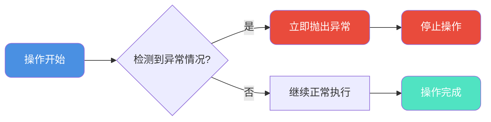
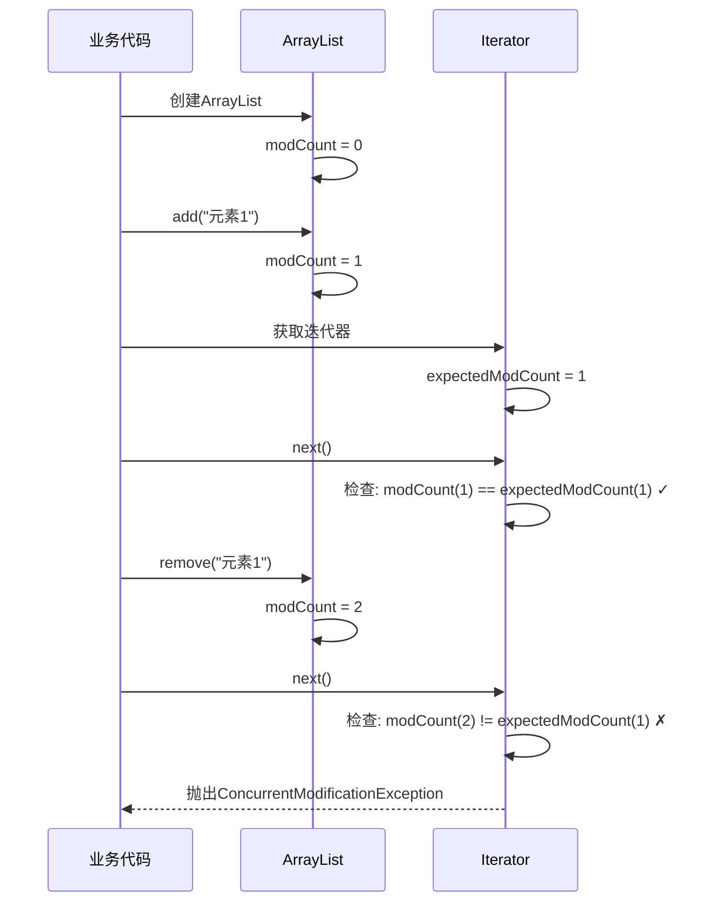
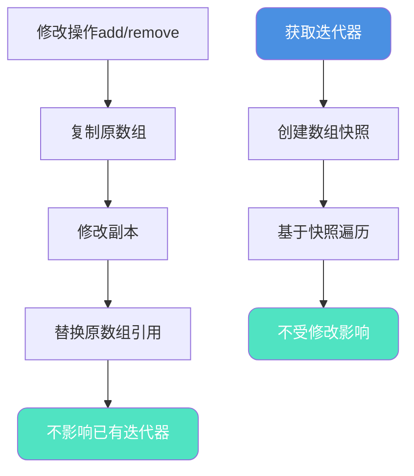
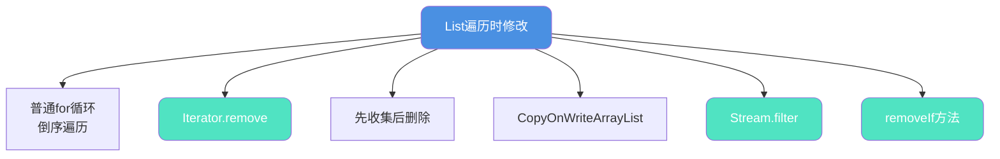
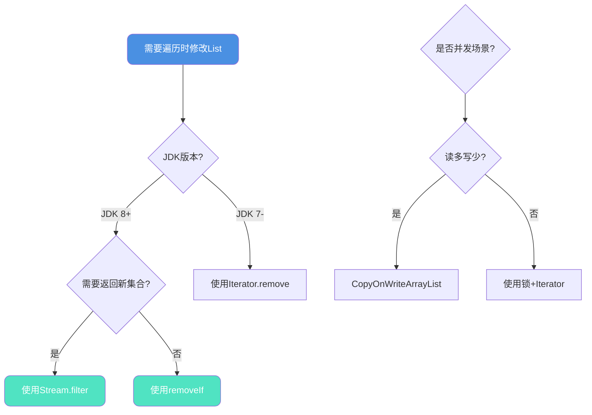

## fail-fast与fail-safe机制

在集合操作中,fail-fast和fail-safe是两种重要的错误处理机制,理解它们的原理对于编写健壮的并发代码至关重要。

### fail-fast快速失败机制

fail-fast(快速失败)是一种系统设计理念:一旦检测到可能导致失败的情况,立即报告错误并停止执行,而不是继续可能产生错误结果的操作。



### fail-fast简单示例

```java
public class FailFastExample {
    
    // 除法运算中的fail-fast
    public static double divide(double dividend, double divisor) {
        if (divisor == 0) {
            // fail-fast: 发现除数为0,立即抛出异常
            throw new IllegalArgumentException("除数不能为零");
        }
        return dividend / divisor;
    }
    
    // 参数验证中的fail-fast
    public static void processOrder(Order order) {
        if (order == null) {
            throw new IllegalArgumentException("订单不能为空");
        }
        if (order.getAmount() <= 0) {
            throw new IllegalArgumentException("订单金额必须大于0");
        }
        if (order.getProductCount() <= 0) {
            throw new IllegalArgumentException("商品数量必须大于0");
        }
        
        // 执行复杂的业务逻辑
        // ...
    }
}
```

## 集合中的fail-fast机制

### 并发修改检测

Java集合类(ArrayList、HashMap等)使用fail-fast机制防止并发修改:

```java
public class CollectionFailFast {
    public static void main(String[] args) {
        List<String> products = new ArrayList<>();
        products.add("笔记本电脑");
        products.add("机械键盘");
        products.add("显示器");
        products.add("鼠标");
        
        // ❌ 错误示范:遍历中删除
        try {
            for (String product : products) {
                if (product.equals("机械键盘")) {
                    products.remove(product);  // ConcurrentModificationException
                }
            }
        } catch (ConcurrentModificationException e) {
            System.out.println("触发fail-fast: " + e.getClass().getSimpleName());
        }
    }
}
```

### modCount修改计数器

集合类通过`modCount`和`expectedModCount`实现fail-fast:

```java
public class ArrayList<E> extends AbstractList<E> {
    // 集合实际被修改的次数
    protected transient int modCount = 0;
    
    public boolean add(E e) {
        ensureCapacityInternal(size + 1);
        elementData[size++] = e;
        modCount++;  // 修改时增加计数
        return true;
    }
    
    private class Itr implements Iterator<E> {
        // 迭代器期望的修改次数
        int expectedModCount = modCount;
        
        public E next() {
            checkForComodification();  // 检查并发修改
            // ...
        }
        
        final void checkForComodification() {
            if (modCount != expectedModCount)
                throw new ConcurrentModificationException();
        }
    }
}
```

### fail-fast触发流程



### 详细源码分析

```java
public class FailFastMechanism {
    public static void main(String[] args) {
        List<String> cart = new ArrayList<>();
        cart.add("iPhone 15");
        cart.add("AirPods Pro");
        cart.add("MacBook Pro");
        cart.add("iPad Air");
        
        // foreach实际上是Iterator的语法糖
        // 反编译后代码:
        Iterator<String> iterator = cart.iterator();
        while (iterator.hasNext()) {
            String item = iterator.next();
            if (item.equals("AirPods Pro")) {
                // 直接调用List的remove
                cart.remove(item);  // modCount++,但expectedModCount不变
            }
        }
        // 下次调用next()时检测到modCount != expectedModCount
        // 抛出ConcurrentModificationException
    }
}
```

**为什么会抛出异常?**

1. Iterator创建时:`expectedModCount = modCount = 4`
2. 调用`cart.remove()`:`modCount`变为5
3. Iterator的`expectedModCount`仍为4
4. 下次调用`next()`检测:`5 != 4`,抛出异常

## fail-safe安全失败机制

### Copy-On-Write思想

fail-safe集合采用"写时复制"策略,避免并发修改异常:

```java
public class CopyOnWriteArrayList<E> implements List<E> {
    private transient volatile Object[] array;
    
    public boolean add(E e) {
        synchronized (lock) {
            Object[] elements = getArray();
            int len = elements.length;
            // 复制原数组
            Object[] newElements = Arrays.copyOf(elements, len + 1);
            newElements[len] = e;
            setArray(newElements);  // 原子性替换
            return true;
        }
    }
    
    public Iterator<E> iterator() {
        // 返回当前数组快照的迭代器
        return new COWIterator<E>(getArray(), 0);
    }
}
```

### fail-safe工作流程



### fail-safe示例

```java
public class FailSafeExample {
    public static void main(String[] args) {
        // ✅ 使用fail-safe集合
        List<String> sessionIds = new CopyOnWriteArrayList<>();
        sessionIds.add("session-001");
        sessionIds.add("session-002");
        sessionIds.add("session-003");
        sessionIds.add("session-004");
        
        // 遍历中删除,不会抛异常
        for (String sessionId : sessionIds) {
            if (sessionId.equals("session-002")) {
                sessionIds.remove(sessionId);  // 安全删除
            }
            System.out.println("当前遍历: " + sessionId);
        }
        
        System.out.println("\n删除后集合内容:");
        sessionIds.forEach(System.out::println);
    }
}
```

**输出结果:**
```
当前遍历: session-001
当前遍历: session-002
当前遍历: session-003
当前遍历: session-004

删除后集合内容:
session-001
session-003
session-004
```

### 弱一致性特性

fail-safe的代价是弱一致性:

```java
public class WeakConsistency {
    public static void main(String[] args) {
        List<String> notifications = new CopyOnWriteArrayList<>();
        notifications.add("消息1");
        notifications.add("消息2");
        notifications.add("消息3");
        notifications.add("消息4");
        
        // 获取迭代器(此时得到快照)
        Iterator<String> iterator = notifications.iterator();
        
        // 在迭代过程中修改集合
        for (String msg : notifications) {
            if (msg.equals("消息2")) {
                notifications.remove(msg);
                notifications.add("新消息5");  // 迭代器看不到
            }
        }
        
        System.out.println("迭代器遍历(旧快照):");
        while (iterator.hasNext()) {
            System.out.println(iterator.next());
        }
        
        System.out.println("\n集合实际内容(新版本):");
        notifications.forEach(System.out::println);
    }
}
```

**输出结果:**
```
迭代器遍历(旧快照):
消息1
消息2
消息3
消息4

集合实际内容(新版本):
消息1
消息3
消息4
新消息5
```

### fail-fast vs fail-safe对比

| 特性 | fail-fast | fail-safe |
|-----|-----------|-----------|
| **代表类** | ArrayList, HashMap | CopyOnWriteArrayList, ConcurrentHashMap |
| **并发修改** | 抛出ConcurrentModificationException | 不抛异常 |
| **实现方式** | modCount检测 | 写时复制/快照 |
| **迭代内容** | 实时数据 | 快照数据 |
| **一致性** | 强一致性 | 弱一致性 |
| **性能** | 读快写快 | 读快写慢 |
| **内存开销** | 小 | 大(复制数组) |
| **适用场景** | 单线程/同步控制 | 读多写少的并发场景 |

## List遍历修改安全指南

### 六种安全修改方式



### 方式一: 普通for循环(需谨慎)

#### 正序遍历的陷阱

```java
public class ForLoopTrap {
    public static void main(String[] args) {
        List<Integer> scores = new ArrayList<>(Arrays.asList(85, 60, 92, 55, 78, 45, 88));
        
        // ❌ 错误示范:正序遍历删除
        System.out.println("删除前: " + scores);
        for (int i = 0; i < scores.size(); i++) {
            if (scores.get(i) < 60) {
                scores.remove(i);  // 删除后索引会变化
                // 问题:后续元素前移,导致跳过检查
            }
        }
        System.out.println("删除后: " + scores);  // 可能漏删
    }
}
```

**输出结果:**
```
删除前: [85, 60, 92, 55, 78, 45, 88]
删除后: [85, 60, 92, 78, 88]  // 45漏删了!
```

**问题分析:**
1. 删除索引3的55后,45从索引5移到索引4
2. 循环继续i=4,检查新的索引4(原来的78)
3. 跳过了45的检查

#### 正确方式:倒序遍历

```java
public class ReverseLoop {
    public static void main(String[] args) {
        List<Integer> scores = new ArrayList<>(Arrays.asList(85, 60, 92, 55, 78, 45, 88));
        
        // ✅ 正确示范:倒序遍历
        for (int i = scores.size() - 1; i >= 0; i--) {
            if (scores.get(i) < 60) {
                scores.remove(i);
            }
        }
        System.out.println("删除后: " + scores);
    }
}
```

**输出结果:**
```
删除后: [85, 60, 92, 78, 88]  // 正确删除所有不及格成绩
```

#### 另一种方式:调整索引

```java
// ✅ 正序遍历时调整索引
for (int i = 0; i < scores.size(); i++) {
    if (scores.get(i) < 60) {
        scores.remove(i);
        i--;  // 回退索引,重新检查当前位置
    }
}
```

### 方式二: Iterator.remove(推荐)

```java
public class IteratorRemove {
    public static void main(String[] args) {
        List<String> tasks = new ArrayList<>();
        tasks.add("Task-1: 已完成");
        tasks.add("Task-2: 进行中");
        tasks.add("Task-3: 已完成");
        tasks.add("Task-4: 待开始");
        tasks.add("Task-5: 已完成");
        
        // ✅ 使用Iterator删除
        Iterator<String> iterator = tasks.iterator();
        while (iterator.hasNext()) {
            String task = iterator.next();
            if (task.contains("已完成")) {
                System.out.println("删除: " + task);
                iterator.remove();  // 安全删除
            }
        }
        
        System.out.println("\n剩余任务:");
        tasks.forEach(System.out::println);
    }
}
```

**输出结果:**
```
删除: Task-1: 已完成
删除: Task-3: 已完成
删除: Task-5: 已完成

剩余任务:
Task-2: 进行中
Task-4: 待开始
```

**Iterator.remove()的优势:**
- 自动调整expectedModCount,不触发fail-fast
- 正确处理底层数据结构的调整
- 语义清晰,代码安全

### 方式三: 先收集后删除

```java
public class CollectThenRemove {
    public static void main(String[] args) {
        List<Order> orders = new ArrayList<>();
        orders.add(new Order("O001", "已取消"));
        orders.add(new Order("O002", "已完成"));
        orders.add(new Order("O003", "已取消"));
        orders.add(new Order("O004", "配送中"));
        
        // ✅ 先收集需要删除的元素
        List<Order> toRemove = new ArrayList<>();
        for (Order order : orders) {
            if (order.getStatus().equals("已取消")) {
                toRemove.add(order);
            }
        }
        
        // 再统一删除
        orders.removeAll(toRemove);
        
        System.out.println("剩余订单:");
        orders.forEach(o -> System.out.println(o.getOrderId() + ": " + o.getStatus()));
    }
    
    static class Order {
        private String orderId;
        private String status;
        
        public Order(String orderId, String status) {
            this.orderId = orderId;
            this.status = status;
        }
        
        public String getOrderId() { return orderId; }
        public String getStatus() { return status; }
    }
}
```

### 方式四: CopyOnWriteArrayList

```java
public class CopyOnWriteDemo {
    public static void main(String[] args) {
        // ✅ 使用fail-safe集合
        List<String> logs = new CopyOnWriteArrayList<>();
        logs.add("2024-01-10 10:00:00 INFO 系统启动");
        logs.add("2024-01-10 10:05:23 ERROR 连接超时");
        logs.add("2024-01-10 10:10:15 INFO 任务完成");
        logs.add("2024-01-10 10:15:42 ERROR 数据异常");
        
        // 遍历时删除ERROR日志
        for (String log : logs) {
            if (log.contains("ERROR")) {
                logs.remove(log);  // 安全删除
            }
        }
        
        System.out.println("过滤后的日志:");
        logs.forEach(System.out::println);
    }
}
```

**注意事项:**
- CopyOnWriteArrayList写操作开销大
- 适合读多写少场景
- 不适合频繁修改的大集合

### 方式五: Stream.filter(强烈推荐)

```java
public class StreamFilter {
    public static void main(String[] args) {
        List<Product> products = new ArrayList<>();
        products.add(new Product("P001", "笔记本", 5999, 5));
        products.add(new Product("P002", "鼠标", 99, 120));
        products.add(new Product("P003", "键盘", 299, 3));
        products.add(new Product("P004", "显示器", 1299, 80));
        
        // ✅ 使用Stream过滤
        List<Product> inStock = products.stream()
                .filter(p -> p.getStock() >= 10)  // 保留库存充足的
                .collect(Collectors.toList());
        
        System.out.println("库存充足的商品:");
        inStock.forEach(p -> 
            System.out.println(p.getName() + ": 库存" + p.getStock())
        );
    }
    
    static class Product {
        private String id;
        private String name;
        private double price;
        private int stock;
        
        public Product(String id, String name, double price, int stock) {
            this.id = id;
            this.name = name;
            this.price = price;
            this.stock = stock;
        }
        
        public String getName() { return name; }
        public int getStock() { return stock; }
    }
}
```

**Stream的优势:**
- 函数式编程,代码简洁
- 不修改原集合,返回新集合
- 支持链式操作,功能强大
- 天然线程安全(每次返回新Stream)

### 方式六: removeIf方法(推荐)

```java
public class RemoveIfDemo {
    public static void main(String[] args) {
        List<Employee> employees = new ArrayList<>();
        employees.add(new Employee("E001", "张三", 28));
        employees.add(new Employee("E002", "李四", 35));
        employees.add(new Employee("E003", "王五", 42));
        employees.add(new Employee("E004", "赵六", 55));
        
        // ✅ 使用removeIf删除
        employees.removeIf(emp -> emp.getAge() > 40);
        
        System.out.println("40岁以下员工:");
        employees.forEach(emp -> 
            System.out.println(emp.getName() + ": " + emp.getAge() + "岁")
        );
    }
    
    static class Employee {
        private String id;
        private String name;
        private int age;
        
        public Employee(String id, String name, int age) {
            this.id = id;
            this.name = name;
            this.age = age;
        }
        
        public String getName() { return name; }
        public int getAge() { return age; }
    }
}
```

**输出结果:**
```
40岁以下员工:
张三: 28岁
李四: 35岁
```

**removeIf的优势:**
- JDK 8+原生支持
- 语义清晰,一行代码搞定
- 性能优于手动迭代
- 内部正确处理并发修改

## 六种方式对比总结

| 方式 | 安全性 | 性能 | 代码简洁度 | 推荐指数 | 适用场景 |
|-----|-------|------|-----------|---------|---------|
| 倒序for循环 | ✅ | ⭐⭐⭐⭐ | ⭐⭐⭐ | ⭐⭐⭐ | 简单删除 |
| Iterator.remove() | ✅ | ⭐⭐⭐⭐ | ⭐⭐⭐⭐ | ⭐⭐⭐⭐ | 通用场景 |
| 先收集后删除 | ✅ | ⭐⭐⭐ | ⭐⭐ | ⭐⭐ | 复杂逻辑 |
| CopyOnWriteArrayList | ✅ | ⭐⭐ | ⭐⭐⭐⭐ | ⭐⭐⭐ | 读多写少 |
| Stream.filter | ✅ | ⭐⭐⭐⭐ | ⭐⭐⭐⭐⭐ | ⭐⭐⭐⭐⭐ | **首选方式** |
| removeIf | ✅ | ⭐⭐⭐⭐⭐ | ⭐⭐⭐⭐⭐ | ⭐⭐⭐⭐⭐ | **首选方式** |

## 最佳实践建议

### 选择流程图



### 核心原则

1. **优先使用removeIf/Stream** - 现代Java首选方案
2. **避免在foreach中直接删除** - 必触发ConcurrentModificationException
3. **Iterator.remove是经典方案** - 兼容性好,适用各版本
4. **并发场景考虑fail-safe集合** - CopyOnWriteArrayList等
5. **性能敏感场景避免复制** - 大集合慎用COW

### 实战代码模板

```java
public class SafeListModification {
    
    // 模板1: 删除满足条件的元素(推荐)
    public static <T> void removeMatching(List<T> list, Predicate<T> condition) {
        list.removeIf(condition);
    }
    
    // 模板2: 过滤生成新集合(推荐)
    public static <T> List<T> filterList(List<T> list, Predicate<T> condition) {
        return list.stream()
                .filter(condition)
                .collect(Collectors.toList());
    }
    
    // 模板3: Iterator方式(通用)
    public static <T> void removeWithIterator(List<T> list, Predicate<T> condition) {
        Iterator<T> iterator = list.iterator();
        while (iterator.hasNext()) {
            if (condition.test(iterator.next())) {
                iterator.remove();
            }
        }
    }
    
    // 使用示例
    public static void main(String[] args) {
        List<Integer> numbers = new ArrayList<>(Arrays.asList(1, 2, 3, 4, 5, 6, 7, 8, 9, 10));
        
        // 删除偶数
        removeMatching(numbers, n -> n % 2 == 0);
        System.out.println("删除偶数后: " + numbers);
        
        // 过滤奇数
        List<Integer> odds = filterList(numbers, n -> n % 2 != 0);
        System.out.println("奇数列表: " + odds);
    }
}
```

通过理解fail-fast和fail-safe机制,掌握安全的集合修改方式,可以避免常见的并发修改异常,编写出更加健壮的Java程序。

